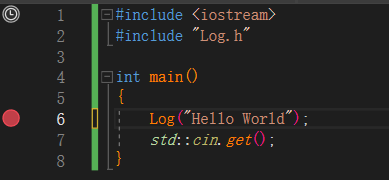
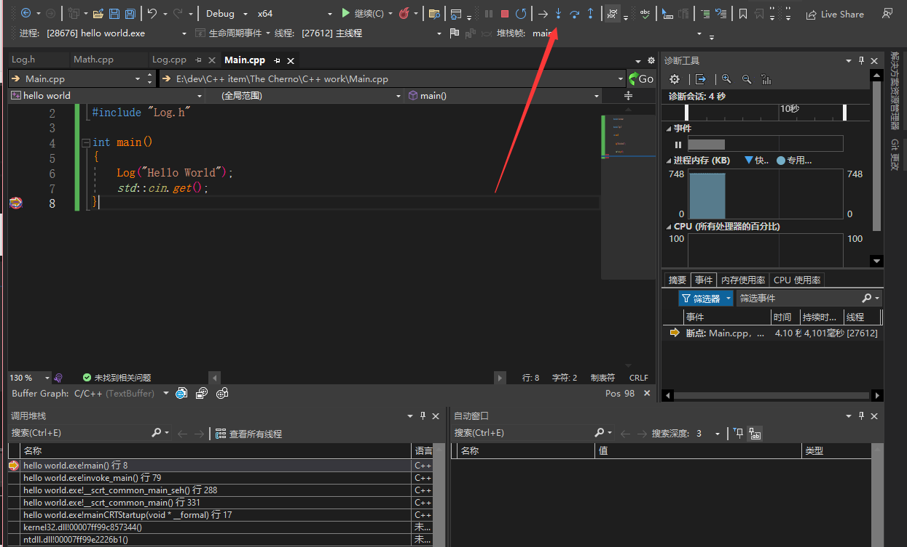
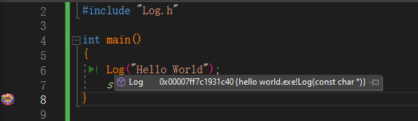
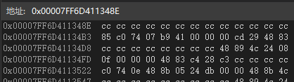
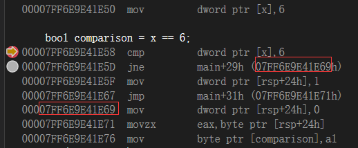
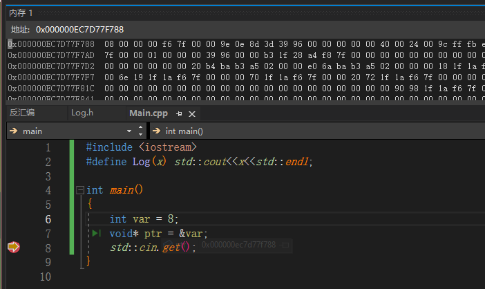
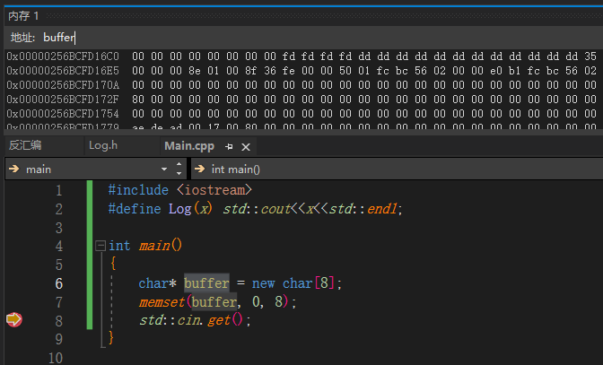
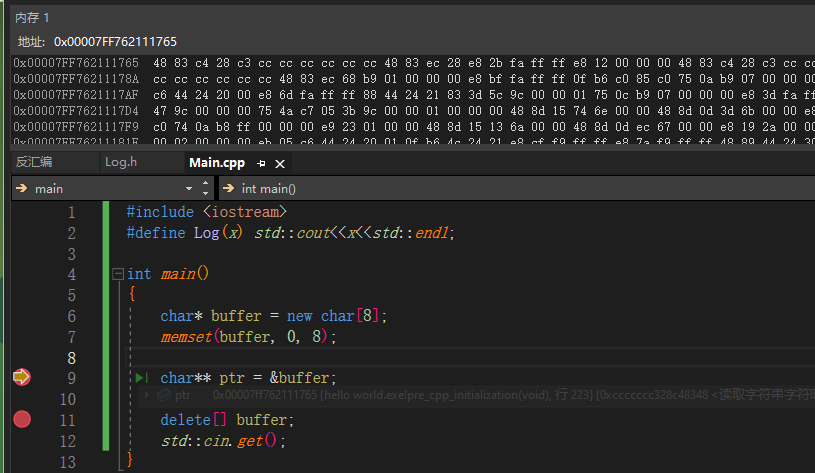

<font color=#4db8ff>Variables</font>的本质区别其实就是<font color=#4db8ff>内存</font>的差距


<font color=#4db8ff>Link：</font>https://www.youtube.com/watch?v=9RJTQmK0YPI&list=PLlrATfBNZ98dudnM48yfGUldqGD0S4FFb&index=10

#### 一、Memory

#### 1.1 int

内存大小本质也取决于编译器的选择

byte = 8 bit

```c++
char 1 byte
short 2 byte    
int 4 byte = long = float
long long = 8byte = double
```

#### 1.2 #pragma

以“ **#** ” 开头的任何内容都是预处理命令，下面预处理指令的含义是只包含一次，防止多次包含 <font color=#4db8ff>.h</font> 头文件，多次Copy 代码

```c++
#pragma once
```

但是更为实际的方式是如下

```c++
#ifndef _LOG_H
#define _LOG_H
#endif
```

其中 “ **ifndef** ” 的本意是 <font color=#4db8ff>” if no define the “</font>

#### 1.3 <>

```c++
#include <XXX>
```

用于包含整个文件夹，其中 “ **<>** ” 仅适用于编译器以及包含所有内容的引号

#### 二、Debug in VS

<font color=#4db8ff>link：</font>https://www.youtube.com/watch?v=0ebzPwixrJA&list=PLlrATfBNZ98dudnM48yfGUldqGD0S4FFb&index=11

#### 2.1 Break Point

```c++
#include <iostream>
#include "Log.h"

int main() 
{
	Log("Hello World");
	std::cin.get();
}
```



<font color=#4db8ff> F9 </font>断点



内存



查看内存位置

初始内存为，意思是未初始化内存值，CC为十进制的 <font color=#4db8ff>204</font>,，16位，刚好对其四个bit。下面是八个十六进制，刚好是四个字节的内存

```c++
CC CC CC CC 
```



<font color=#4db8ff>Ctrl + Alt + W</font> 打开“监视”窗口

<font color=#4db8ff>ctrl+ alt+ C</font>  调用堆栈


#### 三、Conditions 

#### 3.1 反汇编

可以查看反汇编代码

<font color=#4db8ff>jne：jump no equal</font>，不相等则跳转内存



其中 0 进入寄存器RSP，实际上是一个寄存器减去一定的偏移量

```c++
00007FF6E9E41E69  mov         dword ptr [rsp+24h],0 
```

if实际比较的是内存存的值

#### 四、Loop

while、do while、for

#### 五、Control Flow

continue 延续到下一个迭代

break 打断循环

return

#### 六、Pointer

指针存储内存位置 ，<font color=#4db8ff> &   </font>询问变量内存位置

<font color="RoyalBlue">假设 `manly` 是一个指针，则 `manly` 表示的是一个地址，<font color="red">`*manly` 表示存储在该地址处的值</font></font>，即 `*manly` 和常规变量等效。

```c++
#include <iostream>
#define Log(x) std::cout<<x<<std::endl;

int main() 
{
	int var = 8;
	void* ptr = &var;
	std::cin.get();
}
```

断点查看内存



```c++
int* ptr = &var;
	*ptr = 10;
std::cout<<var<<std::endl
```

取消指针，访问数值内存位置，修改数值。分配固定内存，可以在定义时申请

```c++
#include <iostream>
#define Log(x) std::cout<<x<<std::endl;

int main()
{
	char* buffer = new char[8];
	memset(buffer, 0, 8);
	delete[] buffer;
	std::cin.get();
}
```

断点查看内存位置，可以直接通过指针名查询




双指针，即指向指针的指针

```c++
	char* buffer = new char[8];
	memset(buffer, 0, 8);

	char** ptr = &buffer;
```



该内存指向指针的位置，即数值的位置

<font color=#4db8ff>Link： </font>https://www.youtube.com/watch?v=DTxHyVn0ODg&list=PLlrATfBNZ98dudnM48yfGUldqGD0S4FFb&index=16


#### 七、References

<font color=#4db8ff>Link： </font>https://www.youtube.com/watch?v=IzoFn3dfsPA&list=PLlrATfBNZ98dudnM48yfGUldqGD0S4FFb&index=17

其中<font color=#4db8ff> int& </font>是一个类型，他不是一个地址

```c++
#include <iostream>
#define Log(x) std::cout<<x<<std::endl;

int main()
{
	int a = 5;
	int& ref = a;
	std::cin.get();
}
```

引用实际上是一种别名，但是他保存的数据与指针相同，都是地址

按值传递，只会复制值，而不是抓取指针地址

```c++
#include <iostream>
#define Log(x) std::cout<<x<<std::endl;

void Increment(int value) {
	value++;
}

int main()
{
	int a = 5;
	Increment(a);
	Log(a);
	std::cin.get();
}
```

按指针传递，可以实际修改值

```c++
void Increment(int* value) {
	(*value)++;
}

int main()
{
	int a = 5;
	Increment(&a);
	Log(a);
	std::cin.get();
}
```

引用传递

```c++
void Increment(int& value) {
	value++;
}

int main()
{
	int a = 5;
	Increment(a);
	Log(a);
	std::cin.get();
}
```

引用的多次分配，后续为赋值，
