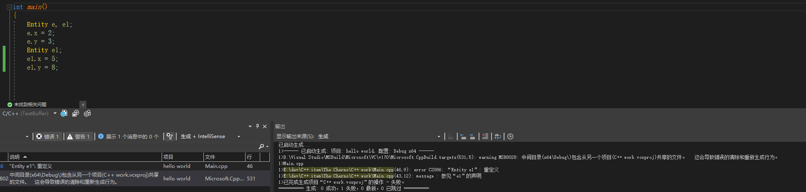
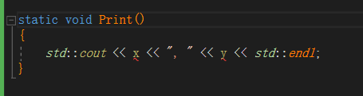
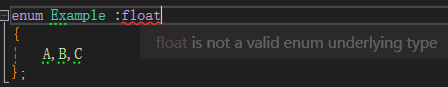
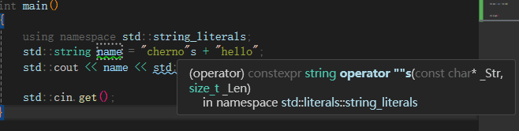
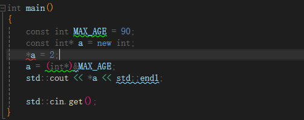
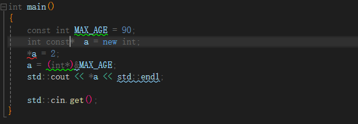
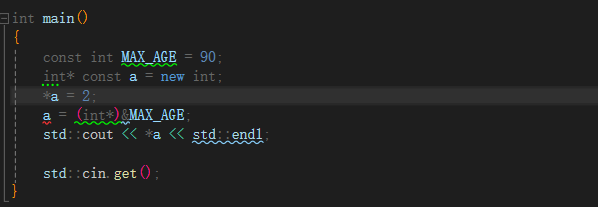
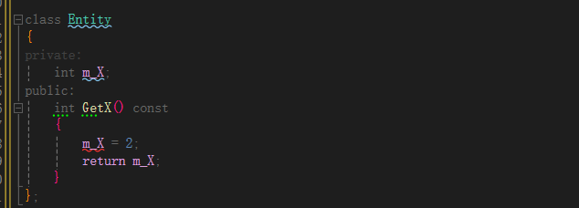

<font color=#4db8ff> Link：</font>https://www.youtube.com/watch?v=3dHBFBw13E0&list=PLlrATfBNZ98dudnM48yfGUldqGD0S4FFb&index=24

#### 一、Static 

##### 1.1 含义

Staic 有两种含义，内容取决于具体的<font color=#4db8ff> Context </font>

##### 1.2 类外静态

Static 的意思是<font color=#4db8ff> internal</font>内联含义，仅在内部使用

##### 1.3 类内静态

与类的所有实例共享内存，即拥有唯一一个<font color=#4db8ff>Static instance</font>，即单例模式或全局变量

##### 1.4 for example

Static.cpp 

仅存在于编译OBJ文件中，即程序集差异

```c++
static int s_Variable = 5;
```

此时Debug 结果为10 ，但是当我们取消 **Static** 中的 <font color=#4db8ff>static</font> 关键字后，编译会出现**link**错误，因为变量已经在不同的翻译单元中定义，不能有两个同名的全局变量

```c++
int s_Variable = 10;
int main()
{
	std::cout << s_Variable << std::endl;
	std::cin.get();
}
```

##### 1.5 extern internal

可以将<font color=#4db8ff> extern </font>变量将会查找外部数据，这被称为 <font color=#4db8ff>extern internal</font> 外部链接，

```c++
//
int s_Variable = 5;
//
extern int s_Variable = 10;
int main（）{}
```

此时如果将 **Static** 中的 <font color=#4db8ff>static</font> 关键字还原，则会出现查找错误

```c++
static int s_Variable = 5;
```

这很像在类中定义 **私有变量** 没有其他翻译单元会得到这个私有变量，<font color=#4db8ff> Linker </font>也不会在全局范围中找到它，因为已经有效地将变量设置为私有

##### 1.6 Staic Function

如果在两个Cpp之间设置一个为<font color=#4db8ff> Staic </font> ，一个不设置，当<font color=#4db8ff> Linker </font>填充内容的时候，将不会得到静态函数，因此不会得到编译错误

如果将静态变量头文件包含在其他文件中，则对文件可见

#### 二、Log Level

log level分为三层，<font color=#4db8ff> Warning、Error、Trace(Message) </font>


```c++
#include <iostream>
#define Log(x) std::cout<<x<<std::endl;

class Log {
public:
	const int LogLevelError = 0;
	const int LogLevelWarning = 1;
	const int LogLevelInfo = 2;
private:
	int m_LogLevel = LogLevelInfo;

public:
	void SetLevel(int Level)
	{
		m_LogLevel = Level;
	}
	void Error(const char* message)
	{
		if (m_LogLevel >= LogLevelError)
			std::cout << "[Error]: " << message << std::endl;
	}
	void Warn(const char* message)
	{
		if (m_LogLevel >= LogLevelWarning)
			std::cout << "[WARNING]: " << message << std::endl;
	}
	void Info(const char* message)
	{
		if (m_LogLevel >= LogLevelInfo)
			std::cout << "[INFO]: " << message << std::endl;
	}
};

int main()
{
	Log log;
	log.SetLevel(log.LogLevelWarning);
	log.Warn("Hello");

	log.SetLevel(log.LogLevelInfo);
	log.Info("Hello");
	std::cin.get();
}

```

#### 三、Static

<font color=#4db8ff>Link：</font>https://www.youtube.com/watch?v=V-BFlMrBtqQ&list=PLlrATfBNZ98dudnM48yfGUldqGD0S4FFb&index=22

##### 3.1 Class Struct

Class内静态意味着，Class所有实例中存在唯一实例

```c++
struct Entity
{
	static int x, y;
    void Print()
	{
		std::cout << x << ", " << y << std::endl;
	}
};

int main()
{
	Entity e;
	e.x = 2;
	e.y = 3;
	Entity e1;
    e1.x = 5;
	e1.y = 8;
}
```



此时会出现错误，因为我们必须在一些位置上定义这些静态变量

```c++
int Entity::x;
int Entity::y;
int main()
{}
```

他们被定义为链接，因为将X和Y设置为静态变量以后，所有的实体类的所有实例中X和Y只存在一个实例。意味着当我修改其中一个实例的时候，所有实例都会被修改，因为他们本质是相同的

<font color=#4db8ff> 指向相同内存的两个不同的实例，但是x y 是否事项共享，指向相同的x y </font>

因此，下列代码并无意义

```c++
e1.x = 5;
e1.y = 8;
```

可以引用他们，就像创建了两个变量，基本只存在于命名空间

```c++
Entity::x = 5;
Entity::y = 8;
```

跨类拥有变量时，很有用，如果将方法改为静态也可以调用

```c++
static  void Print()
{
    std::cout << x << ", " << y << std::endl;
}
...

Entity::Print();
Entity::Print();
```

如果x y 不是静态的，那么函数将会在这里中断，因为静态函数不能访问非静态变量

原因是：<font color=#4db8ff>静态方法没有类实例，因为在类中每个非静态函数，都会获取一个实例，当前的类作为函数，这也是类的幕后实际工作方式</font>

不存在类之类的东西，他们是带有隐藏参数的函数，但是静态方法无法获得隐藏参数



```c++
struct Entity
{
	int x, y;
		
	static  void Print()
	{
		std::cout << x << ", " << y << std::endl;
	}
};

static void Print(Entity e)
{
	std::cout << e.x << ", " << e.y << std::endl;
}


int main()
{
	Entity e;
	e.x = 2;
	e.y = 3;
	Entity e1;
	Entity::x = 5;
	Entity::y = 8;

	Entity::Print();
	Entity::Print();
}
```

但是这样修改就可以继续工作，本质是一个非类方法

如果去掉 “ Entity ” 则会出现错误，因为没有给予一个实体的引用，程序不知道，要访问实例的 x y 是那个

##### 3.2 Enums

<font color=#4db8ff>Link：</font>https://www.youtube.com/watch?v=x55jfOd5PEE&list=PLlrATfBNZ98dudnM48yfGUldqGD0S4FFb&index=23

指定枚举类型

```C++
enum Example :unsigned char
{
	A,B,C
};

int main()
{
}
```

无法分配为 <font color=#4db8ff> float</font > 因为要求其为整数



```cpp
#include <iostream>
#define Log(x) std::cout<<x<<std::endl;

class Log
{
public:
	enum Level
	{
		Error = 0, Warning, Info
	};

private:
	Level m_LogLevel = Info;

public:
	void SetLevel(Level Level)
	{
		m_LogLevel = Level;
	}
	void Error(const char* message)
	{
		if (m_LogLevel >= Error)
			std::cout << "[Error]: " << message << std::endl;
	}
	void Warn(const char* message)
	{
		if (m_LogLevel >= Warning)
			std::cout << "[WARNING]: " << message << std::endl;
	}
	void Info(const char* message)
	{
		if (m_LogLevel >= Info)
			std::cout << "[INFO]: " << message << std::endl;
	}
};

int main()
{
	Log log;
	std::cin.get();
}
```

此时会有同名函数错误

```c++
int main()
{
	Log log;
	log.Error("Error");
	log.Warn("Warn");
	log.Info("Info");
	std::cin.get();
}
```

#### 四、Construction

构造函数每次创建一个实例时都会调用这个函数

其中默认构造函数不执行任何操作，可以隐藏默认构造函数即将其设置为<font color=#4db8ff> private</font > 或者设置为 <font color=#4db8ff> Delete</font > 

```c++
public: ClassName() = Delete;
```

#### 五、Desstruction

析构函数

```c++
~ClassName(){}
```

#### 六、Inheritance

单一类型多种形态即继承

#### 七、Virtual Function

##### 7.1 虚函数

子类可以覆盖父类方法，函数需要利用关键字 " <font color=#4db8ff>Virtual</font> " 

```c++
Chirld* s = new Chirld();
Parent* p = s;
std::cout<<p ->Debug() <<std::endl;
```

此时调用的函数时父类函数，而非子类覆盖的函数

<font color=#4db8ff> Virtual </font> 减少了 <font color=#4db8ff>Dynamic dispatch （动态调度）</font>的东西，实现由V表实现，<font color=#4db8ff>V表</font>是包含所有虚函数映射的表，以便运行时可以正确映射到覆盖的函数上

如果想覆盖函数，必须将基本函数标记为虚函数，也利用关键字 <font color=#4db8ff>Override</font>，标记重写，但是它只是帮助提示作用

##### 7.2 纯虚函数

<font color=#4db8ff>Pure Virtual Function 纯虚函数</font>

即父类声明，强制子类定义的函数，即父类仅包含为实现的函数方法

C++通过使用纯虚函数（pure virtual function） 提供未实现的函数。纯虚函数声明的结尾处为=0。

```Cpp
virtual double Area() const = 0; // a pure virtual function
```

<font color="red">当类声明中包含<font color="blue">纯虚函数</font>时，则不能创建该类的对象</font>

这里的理念是，包含纯虚函数的类只用作基类。要成为真正的ABC（抽象基类），必须至少包含一个纯虚函数。原型中的=0使虚函数成为纯虚函数。

##### 7.3 Visibility

<font color=#4db8ff>Protected</font>，仅自身与子类可见

#### 八、Array

##### 8.1 Array Point

数组名称是其内存位置，本质也是一种<font color=#4db8ff>整数指针</font>

```c++
int example[5]; 
std::cout<<example<<tsd::endl;
```

数值偏移可以使用指针偏移，八个字节的偏移

```c++
example[5] = 5；
    *(ptr + 2) = 6;
```

##### 8.1 Array Life

两者生命周期不同，因为指针是堆栈中创建，当离开  <font color=#4db8ff>}</font> 就会被销毁，但是堆依然存在

```c++
int main()
{
	int example[5]; 
	int* another = new int[5];   
    delete[] another;
}
```

new分配内存它会一直存在，直到删除它

```c++
int* another = new int[5];   
delete[] another;
```

而<font color=#4db8ff>another</font>是存储着另一个内存的位置，另一个内存才会实际存储数组信息

```c++
int* another = new int[5];   
```

#### 九、String

<font color=#4db8ff>Link：</font>https://www.youtube.com/watch?v=ijIxcB9qjaU&list=PLlrATfBNZ98dudnM48yfGUldqGD0S4FFb&index=31

字符串的内存通常是固定的，如果需要全新的分配，则需要删除就的字符串

```c++
char* name = "Cherno";
```

其中字符串结尾是空终止字符在内存中的显示是 <font color=#4db8ff>"00"</font>

string可以接受一个子指针

```c++
#include <iostream>
#include <string>

int main()
{	
	std::string name = "cherno";
	std::cout << name << std::endl;

	std::cin.get();
}
```

提示只读，引用不会被复制，承诺不会被修改

```c++
void PrintString(const std::string& string)
{
	std::cout << string << std::endl;
}
```

<font color=#4db8ff>String 资料：</font>https://cplusplus.com/reference/string/string/

其中指针只读，而如果需要修改则需要改为数组

```c++
char* name  = "Kotono";
char name[]  = "Kotono";
```

字符串无法直接用<font color=#4db8ff> ' + '</font>连接，可以使用运算函数符

```c++
using namespace std::string_literals;
std::string name0 = "cherno"s + "hello";
```



#### 十、Const

<font color=#4db8ff>Link：</font>https://www.youtube.com/watch?v=4fJBrditnJU&list=PLlrATfBNZ98dudnM48yfGUldqGD0S4FFb&index=33

const 是一个常量，本质是设定变量不变，默认为只读、

##### 10.1 值不变

const  值  地址

此時会显示值不可更改，因为<font color=#4db8ff>const</font> 修饰的是 <font color=#4db8ff>int* </font>，即指针值。

```c++
const int* a = new int;
*a = 2;
```



相同写法有 类型 const 值 地址

在指针符号 <font color=#4db8ff> * </font>之前

```c++
int const* a = new int;
*a = 2;
```




##### 10.2 值 const  地址

```c++
int* const a = new int;
*a = 2;
a = (int*)&MAX_AGE;
```



此時会显示值不可更改，因为<font color=#4db8ff>const</font> 修饰的是 <font color=#4db8ff>a </font>，即指针地址，无法指向其他内容

##### 10.3 函数const

```c++
class Entity
{
private:
	int m_X;
public:
	int GetX() const
	{
		m_X = 2;
		return m_X;
	}
};
```



此时会变成只读方法

```c++
private:
	int* m_X;
public:
	const int* const GetX() const
	{
		return m_X;
	}
};
```

返回一个无法修改的指针，并且指针的内容只读

##### 10.4 mutable

<font color=#4db8ff>Link：</font>https://www.youtube.com/watch?v=bP9z3H3cVMY&list=PLlrATfBNZ98dudnM48yfGUldqGD0S4FFb&index=34

在const 中 <font color=#4db8ff>mutable </font>可变

```c++

class Entity
{
private:
	int* m_X;
	mutable  int var;
public:
	const int* const GetX() const
	{
		var = 2;
		return m_X;
	}
};
```

常见于计算静态类的函数调用次数
