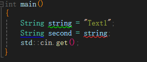
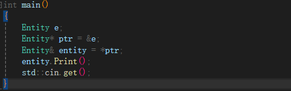
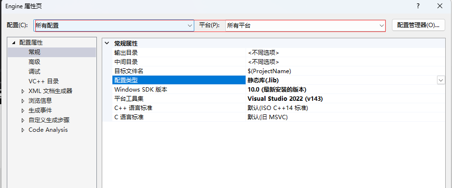
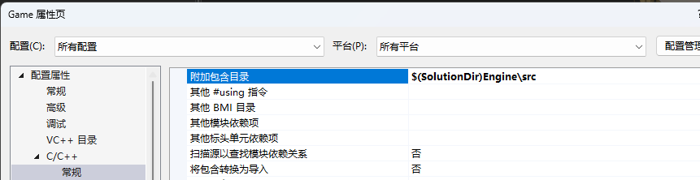
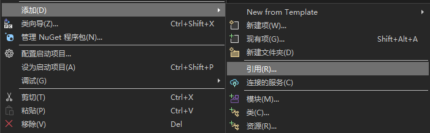
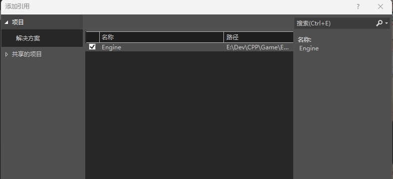

<font color=#4db8ff> Link：</font>https://www.youtube.com/watch?v=1nfuYMXjZsA&list=PLlrATfBNZ98dudnM48yfGUldqGD0S4FFb&index=35

#### 一、Initiate

##### 1.1 构造函数

构造赋值，因为会按照定义的顺序进行赋值，因此需要按<font color=#4db8ff>顺序初始化</font>

打破顺序会有依赖性问题出现

```c++
class Entity
{
private:
std::string m_Name;
int m_Socre;
public:
Entity(const std::string& name): m_Name(name)
{
m_Name = name;
}
};
```

构造函数二次创建

```c++
class Example
{
	public:
	Example(int x)
	{}
};
class Entity
{
private:
	std::string m_Name;
	//这里创建一个
	Example m_Example;
public:
	Entity()
	{
		//这里创建一个 此处会扔掉旧的实例
		m_Example = Example(1);
	}
};
```

优化利用赋值

```c++
Entity():m_Example(Example(1))
{
	//这里只会赋值
}

Entity():m_Example(1)
{
	//这里只会赋值
}
```

##### 1.2 Ternary Operators

<font color=#4db8ff>Link：</font>https://www.youtube.com/watch?v=ezqsL-st8qg&list=PLlrATfBNZ98dudnM48yfGUldqGD0S4FFb&index=36

##### 1.3 New

<font color=#4db8ff>Link：</font> https://www.youtube.com/watch?v=NUZdUSqsCs4&list=PLlrATfBNZ98dudnM48yfGUldqGD0S4FFb&index=39

<font color=#4db8ff>New</font> 本质是在堆上分配内存，并且在申请内存的同时调用构造函数

```c++
Entity* e = new Entity();
Entity* e = (Entity*)malloc(sizeof(Entity));

delete e;
```

两个代码本质区别在于，<font color=#4db8ff>New </font> 会调用类的构造函数，而<font color=#4db8ff>Malloc</font> 只是单纯的分配内存，随后返回指向该内存的指针

New 关键字内存不会被释放，不会被标记为空闲，也不会被放回到空闲列表。

堆分配的内存需要使用<font color=#4db8ff>Delete</font> 去释放，实际上它调用了C++ 的 <font color=#4db8ff>free()</font> 函数，释放了内存块

指定内存

```c++
int* b = new int[50];
Entity* e = new(b) Entity();
```

##### 1.4 Implicit and Explicit 

<font color=#4db8ff>Link：</font> https://www.youtube.com/watch?v=Rr1NX1lH3oE&list=PLlrATfBNZ98dudnM48yfGUldqGD0S4FFb&index=39

显示声明<font color=#4db8ff>Explicit </font> 禁止隐式转换即构造函数前添加显示关键字

##### 1.5 this

<font color=#4db8ff>this </font> 是一个指针

##### 1.6 Lifetime

堆栈分配离开作用域内存就被清除，但是如果是通过堆分配，则一直存在，除非应用程序结束

```c++
var stock = New var();		//堆分配
```

可以通过智能指针，在析构函数中释放堆分配

#### 二、Smart points

<font color=#4db8ff>Link </font>https://www.youtube.com/watch?v=UOB7-B2MfwA&list=PLlrATfBNZ98dudnM48yfGUldqGD0S4FFb&index=43

智能指针本质是一个原始指针的包装器

##### 2.1 unique_ptr

唯一指针

```c++
#include <mennoy>

{
    std::unique_ptr<Entity> entity(new Entity());
    
    entity->function();
}
```

当离开范围实体将会自动销毁，唯一指针不允许有二次指向

##### 2.2 shared_ptr

共享指针是通过引用计数，不使用<font color=#4db8ff>New</font> 构建，是因为存在异常，因为它需要被分配在called menory

当引用计数为0时才会被销毁

```c++
#include <mennoy>

{
    std::shared_ptr<Entity> shaderentity =  std::shared_ptr<Entity>();
    std::shared_ptr<Entity>( new Entity());
    entity->function();
}
```

##### 2.3 weak_ptr

弱指针，不参与引用计数

##### 2.4 Copy Constructors

<font color=#4db8ff>Link： </font>https://www.youtube.com/watch?v=BvR1Pgzzr38&list=PLlrATfBNZ98dudnM48yfGUldqGD0S4FFb&index=44

浅复制，调用两次析构函数会崩溃

```c++

class String
{
private:
	char* m_Buffer;
	unsigned int m_Size;
public:
	String(const char* string)
	{
		m_Size = strlen(string);
		m_Buffer = new char[m_Size + 1];
		memcpy(m_Buffer, string, m_Size);
		m_Buffer[m_Size] = 0;
	}
	~String()
	{
		delete[] m_Buffer;
	}
};
int main()
{
	String string = "Text1";
	String second = string;
	std::cin.get();
}
```

这里仅仅是复制了指针的指向，并没有实际复制数据

修改一个会同时修改两个，删除一个，会同时删除两个

复制构造函数

```c++
String(const String& other);
```

将新对象初始化为一个同类对象，按值将对象传递给函数，函数按值返对象，也有下面这种写法

```c++
String(const String& other)
{
	memcpy(this, &other, sizeof(String));
}
```

此时会提示禁止使用复制构造

```c++
String(const String& other) = delete
```



通常会这么使用复制构造函数

```c++
String(const String& other): m_Size(other.m_Size)
{
    m_Buffer = new char[m_Size + 1];
    memcpy(m_Buffer, other.m_Buffer, m_Size + 1);
}
```

当我们将类进行传递的时候也有调用复制构造函数，因此可以将函数改为引用

```c++
void function(const Class& class )
```

##### 2.5 Arrow Operator 

<font color=#4db8ff>Link：</font>https://www.youtube.com/watch?v=4p3grlSpWYA&list=PLlrATfBNZ98dudnM48yfGUldqGD0S4FFb&index=45



```c++
ptr->Print();
```

##### 2.6 std::vector

<font color=#4db8ff>Link：</font>https://www.youtube.com/watch?v=HcESuwmlHEY&list=PLlrATfBNZ98dudnM48yfGUldqGD0S4FFb&index=47

内存在不足的时候会复制当前数据到新的内存，随后每一个元素都会调用构造函数

提前开辟3个内存，但是函数是在主函数中构建，而不是在push函数之中构建

```c++
std::vector<Entity> vertices;
vertices.reserve(3);
vertices.push_back(Entity());
vertices.push_back(Entity());
vertices.push_back(Entity());
```

在推入中构建，此时不会调用构造函数，不再会有数据副本

```c++
std::vector<Entity> vertices;
vertices.reserve(3);
vertices.emplace_back(1);
vertices.emplace_back(2);
vertices.emplace_back(3);
```

#### 三、 Libraries

GLFW

<font color=#4db8ff>Link：</font>https://www.youtube.com/watch?v=or1dAmUO8k0&list=PLlrATfBNZ98dudnM48yfGUldqGD0S4FFb&index=49

Dynamic Libraries

<font color=#4db8ff>Link：</font>https://www.youtube.com/watch?v=pLy69V2F_8M&list=PLlrATfBNZ98dudnM48yfGUldqGD0S4FFb&index=50

设置CPP Link input  dll.lib文件

dll需要与Exe同一文件位置


##### 3.1 static library

<font color=#4db8ff>Link：</font>https://www.youtube.com/watch?v=Wt4dxDNmDA8&list=PLlrATfBNZ98dudnM48yfGUldqGD0S4FFb&index=51



链接



构建生成静态库





link到Exe ，将实时文件添加到exe里面
