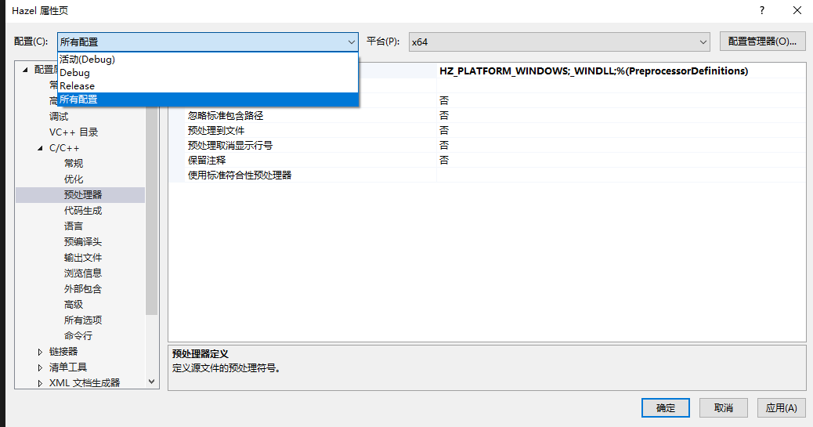

### 一、

#### 1、环境配置


```c++
$(SolutionDir)bin\$(Configuration)-$(Platform)\$(ProjectName)\
$(SolutionDir)bin-int\$(Configuration)-$(Platform)\$(ProjectName)\
```


同样的属性设置


```C++
$(SolutionDir)bin\$(Configuration)-$(Platform)\$(ProjectName)\
$(SolutionDir)bin-int\$(Configuration)-$(Platform)\$(ProjectName)\
```

#### 2、修改启动项


```c++
Project("{8BC9CEB8-8B4A-11D0-8D11-00A0C91BC942}") = "Hazel", "Hazel\Hazel.vcxproj", "{882E5969-ECF0-4865-8291-59BEF04DF796}"
EndProject
Project("{8BC9CEB8-8B4A-11D0-8D11-00A0C91BC942}") = "Sandbox", "Sandbox\Sandbox.vcxproj", "{51241668-8323-4FF2-B5CB-C1EF52015825}"
EndProject
    
//改为
Project("{8BC9CEB8-8B4A-11D0-8D11-00A0C91BC942}") = "Sandbox", "Sandbox\Sandbox.vcxproj", "{51241668-8323-4FF2-B5CB-C1EF52015825}"
EndProject
Project("{8BC9CEB8-8B4A-11D0-8D11-00A0C91BC942}") = "Hazel", "Hazel\Hazel.vcxproj", "{882E5969-ECF0-4865-8291-59BEF04DF796}"
EndProject
```

#### 3、引用项目


4、测试


.h

导出dll ，dll 会实际运行代码

```C++
#pragma  once

namespace Hazel {
	_declspec(dllexport) void Print();
}
```

.cpp

```C++
#include "Test.h"

#include <stdio.h>

namespace Hazel {
	void Print() {
		printf("Hello World !\n");
	}
}
```

Application.cpp

```C++
namespace Hazel {
    //import the dll funtion 
	_declspec(dllimport) void Print();
}

void mian() {
	Hazel::Print();
}
```

### 二、Entry Point

#### 1、loop application

Application.h

```C++
#pragma once
namespace Hazel {
class _declspec(dllexport)	 Application
{
public:
	Application();
	virtual ~Application();
​	void Run();
};
}
```

Application.cpp

```C++
#include "Application.h"

namespace Hazel {
Application::Application() {}
Application::~Application() {}
void Application::Run() {
	while (true)
	{}
}}
```

<font color="red">core.h</font>

如果dll 构建完成则定义，否则导入

```C++
#pragma once

#ifdef HZ_PLATFORM_WINDOWS
	#ifdef HZ_BUILD_DLL
			#define  HAZEL_API	__declspec(dllexport)
	#else
			#define  HAZEL_API	__declspec(dllimport)
	#endif // HZ_BUILD_DLL
#else
		#error Hazel only support windows!

#endif // HZ_PLATFORM_WINDOWS

```

#### 2、定义宏

```C++
	//Hazel
HZ_PLATFORM_WINDOWS;HZ_BUILD_DLL;_WINDLL;%(PreprocessorDefinitions) 
    
    //SandBox
HZ_PLATFORM_WINDOWS;_MBCS;%(PreprocessorDefinitions)
```



处理API

```C++
#pragma once
#include "Core.h"
namespace Hazel {
class HAZEL_API Application
{
public:
	Application();
	virtual ~Application();

	void Run();
};
}
```

#### 3、include<>


```C++
#pragma once

//For use by Hazel application

//#include "Hazel/Core.h"
#include "Hazel/Application.h"
```

属性处理

```
$(SolutionDir)Hazel\src;
```


#### 4、测试


	//Sandbox.cpp
	#include <Hazel.h>
	
	class Sandbox : public Hazel::Application
	{
	public:
		Sandbox() {
		
		}
	~Sandbox()
	{
	
	}
	};
	
	int main() {
		Sandbox* sandbox = new Sandbox();
		sandbox->Run();
		delete sandbox;
		return 0;
	}


5、主代码

创建返回函数指针的函数，永远创建应用程序

```c++
//---EntryPoint.h

#pragma once


#ifdef HZ_PLATFORM_WINDOWS

//funtion Pointer
extern Hazel::Application* Hazel::CreateApplication();

int main(int argc, char** argv) {
	auto app = Hazel::CreateApplication();
	app->Run();
	delete app;
	return 0;
}
#endif // HZ_PLATFORM_WINDOWS
```

```c++
//---Sandbox.cpp

#include <Hazel.h>

class Sandbox : public Hazel::Application
{
    public:
    Sandbox() {

    }
    ~Sandbox()
    {

    }

};

Hazel::Application* Hazel::CreateApplication() 
{
    return new Sandbox();
}
```

