# 17_FXAA

计算和存储像素luma，或回落到绿色。
		寻找并混合高对比度的像素。
		检测并平滑长边。
		结合FXAA和渲染比例。

<center></center>

 <center></center>

<center>An image with and without FXAA, zoomed in.</center>

#### 1、[FXAA Post-FX]()

<font color="red"> frame buffer</font>的有限分辨率给最终的图像带来了<font color="green"> aliasing artifacts</font>。这些通常被称为<font color="red"> jaggies or stairsteps锯齿或阶梯</font>，它们沿着与像素网格不一致的线条可见。此外，小于一个像素的特征要么出现，要么不出现，当它们处于运动状态时，会产生时间性的<font color="RoyalBlue">flickering artifacts闪烁伪影</font>。

在之前的教程中，我们增加了应用SSAA的能力，最多就是将渲染比例增加一倍，之后再进行降采样。这在一定程度上平滑了我们的锯齿，并将分辨率提高了一倍，以达到检测和平滑微小特征的目的。虽然加倍渲染比例可以提高视觉质量，但它也需要GPU处理四倍的片段，所以它非常昂贵，通常在实时使用时是不可行的。可以使用小于2的渲染比例，但就其本身而言，并不能提高质量。

提高分辨率的另一种方法是对原始图像进行后期特效处理，将所有的混叠伪影都平滑掉。已经开发了各种这样的算法，这些算法被称为缩写，总是以AA结尾，如<font color="RoyalBlue">FXAA、MLAA、SMAA和TAA</font>。在本教程中，我们将实现FXAA，这是最简单和最快的方法。

第一个<font color="green">post-FX </font>抗锯齿解决方案是<font color="red">morphological anti-aliasing - 形态学抗锯齿</font>，缩写为MLAA。它通过分析图像来检测视觉特征的边缘，然后有选择地模糊这些边缘。FXAA是一种受MLAA启发的更简单的方法。它代表了快速近似抗锯齿。它是由NVIDIA的Timothy Lottes开发的。与MLAA相比，它以质量换取速度。虽然对FXAA的一个普遍抱怨是它的模糊程度太高，但这取决于使用的是哪种变体以及如何调整。我们将创建最新的版本--FXAA 3.11--特别是高质量的变体，它还可以调查长边缘。

#### 1.1、[Enabling FXAA](https://catlikecoding.com/unity/tutorials/custom-srp/fxaa/#1.1)

虽然FXAA是一个后置特效，但它会像渲染比例一样全面影响图像质量，所以我们会把它的配置添加到<font color="RoyalBlue">CameraBufferSettings</font>中。最初我们只需要一个切换按钮来启用它，但我们以后还会为它增加一些配置选项。所以我们将所有的FXAA设置归入一个新的<font color="RoyalBlue">CameraBufferSettings</font>.<font color="red">FXAA</font>结构。

```c#
using System;
using UnityEngine;

[Serializable]
public struct CameraBufferSettings {

	…
	
	[Serializable]
	public struct FXAA {

		public bool enabled;
	}

	public FXAA fxaa;
}
```

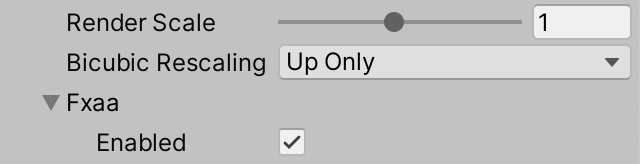

<center>FXAA enabled for the RP.</center>

就像我们对渲染比例所做的那样，我们将通过在<font color="green">CameraSettings</font>中添加一个切换按钮来控制是否允许使用FXAA，从而使其成为可能。默认情况下，它应该是不允许的。这可以确保FXAA不被应用于<font color="RoyalBlue">scene window, material previews, or reflection probes. - 场景窗口、材质预览或反射探测器。</font>

```c#
public bool allowFXAA = false;
```

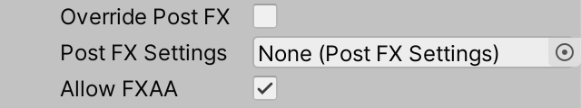

<center>FXAA enabled for the camera.</center>

由于<font color="green">FXAA</font>是一种<font color="green">post FX</font>，所以由<font color="red">PostFXStack</font>负责应用它。这意味着<font color="green">FXAA</font>只有在使用<font color="green">post FX</font>的情况下才能工作。另外，FXAA的配置必须传递给堆栈，所以在<font color="red">PostFXStack.Setup</font>中添加一个参数，并将其复制到一个字段中。

```c#
	CameraBufferSettings.FXAA fxaa;

	…

	public void Setup (
		…
		CameraBufferSettings.BicubicRescalingMode bicubicRescaling,
		CameraBufferSettings.FXAA fxaa
	) {
		this.fxaa = fxaa;
		…
	}
```

在<font color="red">CameraRenderer</font>.<font color="green">Render</font>中把<font color="RoyalBlue">FXAA</font>配置传递给它，在把相机的切换应用到全局切换之后。

```c#
	bufferSettings.fxaa.enabled &= cameraSettings.allowFXAA;
		postFXStack.Setup(
			context, camera, bufferSize, postFXSettings, useHDR, colorLUTResolution,
			cameraSettings.finalBlendMode, bufferSettings.bicubicRescaling,
			bufferSettings.fxaa
		);
```

注意，我们可以直接修改<font color="green"> buffer settings struct 缓冲区设置结构字段</font>，因为它包含<font color="RoyalBlue"> RP settings struct</font>的副本，而不是对原始结构的引用。

#### 1.2、[FXAA Pass](https://catlikecoding.com/unity/tutorials/custom-srp/fxaa/#1.2)

我们需要一个<font color="green">Pass</font>来应用FXAA，所以把它添加到<font color="green">PostFXStack</font>着色器中，同时在<font color="green">PostFXStack</font><font color="red">.Pass</font>枚举中添加一个相应的条目。这个通道是<font color="green">Final Rescale</font>的副本，重命名为FXAA，并将其片段功能设置为<font color="red">FXAAPassFragment</font>。除此之外，我们会把FXAA着色器的代码放在一个单独的文件中，并且只把它包含在pass<font color="green">FXAAPass HLSL</font>本身中。

```glsl
	Pass {
			Name "FXAA"

			Blend [_FinalSrcBlend] [_FinalDstBlend]
			
			HLSLPROGRAM
				#pragma target 3.5
				#pragma vertex DefaultPassVertex
				#pragma fragment FXAAPassFragment
				#include "FXAAPass.hlsl"
			ENDHLSL
		}
```

创建新的<font color="red">FXAAPass.hlsl</font>文件，最初只包含<font color="RoyalBlue">FXAAPAssFragment</font>函数，该函数返回源像素，无需修改。

```glsl
#ifndef CUSTOM_FXAA_PASS_INCLUDED
#define CUSTOM_FXAA_PASS_INCLUDED

float4 FXAAPassFragment (Varyings input) : SV_TARGET {
	return GetSource(input.screenUV);
}

#endif
```

我们必须在<font color="RoyalBlue">color grading - 调色</font>后应用<font color="red">FXAA</font>，这与<font color="red">final rescale </font>必须在调色后进行的原因相同。

由于我们现在有多种情况，<font color="green">Final pass</font>不再是真正的final，所以我们把它改名为<font color="red">Apply Color Grading</font>，因为这是它的实际作用。在<font color="RoyalBlue"> shader and the `**Pass**` enum</font>中都这样做。将其片段函数重命名为<font color="green">ApplyColorGradingPassFragment</font>。

我们也把<font color="green">PostFXStack.DoColorGradingAndToneMapping</font>方法改名为<font color="red">DoFinal</font>，因为它现在所做的不仅仅是<font color="RoyalBlue">color grading and tone mapping. - 调色和色调映射</font>。

当<font color="red">FXAA</font>被启用时，我们首先要进行<font color="green"> color grading</font>，然后在此基础上应用FXAA。所以我们必须将调色的结果存储在一个临时的渲染纹理中。在<font color="green">PostFXStack</font>中为它添加一个着色器属性标识。

```c#
	colorGradingResultId = Shader.PropertyToID("_ColorGradingResult"),
		finalResultId = Shader.PropertyToID("_FinalResult"),
```

在<font color="green">DoFinal</font>中，在我们进入最后的绘图阶段之前，检查FXAA是否被启用。如果<font color="green">FXAA</font>被启用，立即执行调色，并将结果存储在一个新的临时LDR纹理中。

```c#
	buffer.SetGlobalVector(colorGradingLUTParametersId,
			new Vector4(1f / lutWidth, 1f / lutHeight, lutHeight - 1f)
		);

		if (fxaa.enabled) {
			buffer.GetTemporaryRT(
				colorGradingResultId, bufferSize.x, bufferSize.y, 0,
				FilterMode.Bilinear, RenderTextureFormat.Default
			);
			Draw(sourceId, colorGradingResultId, Pass.ApplyColorGrading);
		}

		if (bufferSize.x == camera.pixelWidth) {
			DrawFinal(sourceId, Pass.ApplyColorGrading);
		}
```

就像我们为调整渲染比例所做的那样，我们必须确保调色的最终混合模式被设置为一零。由于现在这可能发生在两个地方，让我们简单地在开始绘制之前总是重置它。

```c#
		buffer.SetGlobalFloat(finalSrcBlendId, 1f);
		buffer.SetGlobalFloat(finalDstBlendId, 0f);
		if (fxaa.enabled) {
			…
		}

		if (bufferSize.x == camera.pixelWidth) {
			DrawFinal(sourceId, Pass.ApplyColorGrading);
		}
		else {
			buffer.GetTemporaryRT(
				finalResultId, bufferSize.x, bufferSize.y, 0,
				FilterMode.Bilinear, RenderTextureFormat.Default
			);
			//buffer.SetGlobalFloat(finalSrcBlendId, 1f);
			//buffer.SetGlobalFloat(finalDstBlendId, 0f);
			…
		}
```

接下来，如果缓冲区没有被缩放，我们又要检查FXAA是否被启用。如果是的话，最后的绘制是<font color="red"> FXAA pass and the color grading - 调色</font>结果，之后调色结果必须被释放。否则，调色是最后一个环节，和以前一样。

```c#
if (bufferSize.x == camera.pixelWidth) {
			if (fxaa.enabled) {
				DrawFinal(colorGradingResultId, Pass.FXAA);
				buffer.ReleaseTemporaryRT(colorGradingResultId);
			}
			else {
				DrawFinal(sourceId, Pass.ApplyColorGrading);
			}
		}
```

在调整渲染比例的情况下，我们仍然需要首先渲染到一个中间的最终结果纹理。如果启用了FXAA，我们就用<font color="red"> FXAA pass and the color grading - 调色</font>结果进行常规绘制，然后再释放调色结果。否则，我们就用常规的绘制方式对原始资源进行调色。

```c#
	else {
			buffer.GetTemporaryRT(
				finalResultId, bufferSize.x, bufferSize.y, 0,
				FilterMode.Bilinear, RenderTextureFormat.Default
			);

			if (fxaa.enabled) {
				Draw(colorGradingResultId, finalResultId, Pass.FXAA);
				buffer.ReleaseTemporaryRT(colorGradingResultId);
			}
			else {
				Draw(sourceId, finalResultId, Pass.ApplyColorGrading);
			}

			…
		}
```

在这一点上，我们的RP仍然产生与之前相同的结果，但当FXAA被启用时，帧调试器会发现<font color="green"> FXAA pass.</font>有一个额外的绘制步骤。

#### 1.3、[Luma](https://catlikecoding.com/unity/tutorials/custom-srp/fxaa/#1.3)

FXAA的作用是有选择地降低图像的对比度，使视觉上明显的锯齿和孤立的像素变得平滑。对比度是通过比较像素的感知强度来确定的。由于目标是减少我们感知到的伪影，FXAA只关注<font color="RoyalBlue">perceived brightness - 感知到的亮度</font>，也就是伽玛调整的亮度，也就是<font color="RoyalBlue">Luma</font>。像素的确切颜色并不重要，重要的是它们的<font color="red">luma</font>值。因此，FXAA分析的是<font color="red">灰阶图像</font>。这意味着不同颜色之间的硬过渡不会被平滑，因为它们的luma是相似的。只有视觉上明显的过渡会受到强烈影响。

为<font color="green">FXAAPass</font>添加一个<font color="red">GetLuma</font>函数，返回一些UV坐标的<font color="green">luma</font>值。最初让它返回源的线性亮度。然后让FXAA通道返回这个值。注意，FXAA是在<font color="red">color grading and tone mapping - 调色和色调</font>映射后的LDR数据上工作的，所以这代表了最终图像的luma。

```glsl
float GetLuma (float2 uv) {
	return Luminance(GetSource(uv);
}

float4 FXAAPassFragment (Varyings input) : SV_TARGET {
	return GetLuma(input.screenUV);
}
```

<center> </center>

<center>Original color and linear luminance.</center>

因为我们对<font color="RoyalBlue">深色的变化比浅色的变化</font>更敏感，所以我们必须对亮度进行伽玛调整，以得到一个合适的卢马值。<font color="RoyalBlue">伽玛值为2</font>是足够准确的，我们通过对线性亮度的平方根进行计算得到。

```glsl
float GetLuma (float2 uv) {
	return sqrt(Luminance(GetSource(uv)));
}
```


<center>Gamma 2.0 luma.</center>

#### [1.4、Green for Luma](https://catlikecoding.com/unity/tutorials/custom-srp/fxaa/#1.4)

<font color="red">FXAA通过检测对比度和边缘</font>来工作，这需要对每个片段进行<font color="RoyalBlue">多次采样</font>。为每个样本计算luma会使其成本过高。因为我们在视觉上对绿色最敏感，所以计算<font color="green">luma</font>的一个常见替代方法是直接使用绿色通道来代替。这降低了质量，但避免了点乘和平方根操作。

```c#
float GetLuma (float2 uv) {
	return GetSource(uv).g;
}
```


<center>Green as luma.</center>

#### 1.5、[Storing Luma in the Alpha Channel](https://catlikecoding.com/unity/tutorials/custom-srp/fxaa/#1.5)

计算<font color="green">luma</font>产生的结果比只依靠绿色通道要好得多，但我们不想在每次对信号源采样时都计算它。

一个解决方案是在我们应用<font color="red">color grading - 调色</font>的时候计算一次。我们必须在某个地方存储<font color="green">luma</font>，为此我们可以使用调色结果纹理的<font color="red">alpha</font>通道。然而，如果以后需要存储在alpha通道中的透明度，例如在分层相机时，这是不可能的。

由于alpha通道通常未被使用，我们将在<font color="green">PostFXStack</font>中添加另一个通道，既应用调色，又计算luma，同时还保留原始通道。

```glsl
	Pass {
			Name "Apply Color Grading With Luma"

			HLSLPROGRAM
				#pragma target 3.5
				#pragma vertex DefaultPassVertex
				#pragma fragment ApplyColorGradingWithLumaPassFragment
			ENDHLSL
		}
```

新的片段函数是<font color="green">ApplyColorGradingPassFragment</font>的一个副本，它也计算<font color="green">luma</font>并将其存储在<font color="red">alpha</font>通道中。

```c#
float4 ApplyColorGradingWithLumaPassFragment (Varyings input) : SV_TARGET {
	float4 color = GetSource(input.screenUV);
	color.rgb = ApplyColorGradingLUT(color.rgb);
	color.a = sqrt(Luminance(color.rgb));
	return color;
}
```

我们现在需要两个版本的FXAA通道，一个用于alpha通道包含luma时，另一个用于<font color="green">luma</font>不可用时。我们将保留当前的<font color="green">FXAA pass</font>，并添加另一个<font color="red">FXAA With Luma通道</font>，以便在有<font color="green">luma</font>时使用。在这种情况下，我们将定义<font color="red">FXAA_ALPHA_CONTAINS_LUMA</font>而不是为它创建一个单独的片段函数。

这样做是因为我们将<font color="green">FXAA Pass</font>包含在通证块本身中，所以我们在包含文件之前添加定义。

```glsl
	Pass {
			Name "FXAA With Luma"

			Blend [_FinalSrcBlend] [_FinalDstBlend]
			
			HLSLPROGRAM
				#pragma target 3.5
				#pragma vertex DefaultPassVertex
				#pragma fragment FXAAPassFragment
				#define FXAA_ALPHA_CONTAINS_LUMA
				#include "FXAAPass.hlsl"
			ENDHLSL
		}
```

现在我们可以使用条件编译来使<font color="green">GetLuma</font>返回适当的颜色通道：当<font color="green">luma</font>存储在其中时为<font color="red">alpha</font>，否则为绿色。

```glsl
float GetLuma (float2 uv) {
	#if defined(FXAA_ALPHA_CONTAINS_LUMA)
		return GetSource(uv).a;
	#else
		return GetSource(uv).g;
	#endif
}
```

#### 1.6、[Keeping Alpha](https://catlikecoding.com/unity/tutorials/custom-srp/fxaa/#1.6)

我们更喜欢计算luma，所以这将是默认的。只有在<font color="green">alpha</font>通道的数据必须保持不变的情况下，我们才会切换到绿色，不管是什么原因。这取决于渲染后的图像的用途，所以必须对每个摄像机进行配置。为此，在<font color="red">CameraSettings</font>中添加一个保持alpha的切换选项，该选项默认为禁用。

```c#
	public bool keepAlpha = false;
```

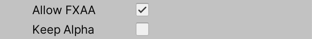

<center>Toggle for keeping alpha.</center>

在<font color="RoyalBlue">CameraRenderer.Render</font>中设置后期特效堆栈时，将这个切换传递给它。它与HDR切换有关，因为这两个设置都是处理纹理数据的性质，所以把它放在HDR切换参数之前。

```c#
postFXStack.Setup(
			context, camera, bufferSize, postFXSettings, cameraSettings.keepAlpha, useHDR,
			colorLUTResolution, cameraSettings.finalBlendMode,
			bufferSettings.bicubicRescaling, bufferSettings.fxaa
		);
```

然后在<font color="green">PostFXStack</font>中跟踪切换情况。

```c#
bool keepAlpha, useHDR;

	…

	public void Setup (
		ScriptableRenderContext context, Camera camera, Vector2Int bufferSize,
		PostFXSettings settings, bool keepAlpha, bool useHDR, int colorLUTResolution,
		…
	) {
		…
		this.keepAlpha = keepAlpha;
		this.useHDR = useHDR;
		…
	}
```

现在<font color="green">DoFinal</font>在启用FXAA时必须使用适当的通道。如果我们必须保留alpha，那么我们就坚持使用当前的通道，否则我们可以切换到包括<font color="red">alpha</font>通道中的luma的调色和FXAA通道。

```c#
	if (fxaa.enabled) {
			…
			Draw(
				sourceId, colorGradingResultId,
				keepAlpha ? Pass.ApplyColorGrading : Pass.ApplyColorGradingWithLuma
			);
		}

		if (bufferSize.x == camera.pixelWidth) {
			if (fxaa.enabled) {
				DrawFinal(
					colorGradingResultId, keepAlpha ? Pass.FXAA : Pass.FXAAWithLuma
				);
				buffer.ReleaseTemporaryRT(colorGradingResultId);
			}
			…
		}
		else {
			…

			if (fxaa.enabled) {
				Draw(
					colorGradingResultId, finalResultId,
					keepAlpha ? Pass.FXAA : Pass.FXAAWithLuma
				);
				buffer.ReleaseTemporaryRT(colorGradingResultId);
			}
			…
		}
```

你可以通过切换摄像机的<font color="red">Keep Alpha</font>设置来检查这是否有效。当必须保留阿尔法时，我们的RP就会被迫退回到依靠绿色而不是卢玛，这将产生一个<font color="green">更暗的灰度图像</font>。目前，<font color="green">保持阿尔法的唯一原因是当多个摄像机堆叠在一起的时候，具有透明度。</font>

### 2、[Subpixel Blending](https://catlikecoding.com/unity/tutorials/custom-srp/fxaa/#2)

FXAA的工作原理是对具有高对比度的相邻像素进行混合。因此，这不是一个直接的图像的<font color="green">均匀模糊</font>。

首先，要计算<font color="green">源像素周围的局部对比度--从最低到最高的luma范围</font>。

第二，如果有足够的对比度，就必须根据对比度来选择混合系数。第三，必须对本地对比度梯度进行调查以确定混合方向。最后，在原始像素和适当的邻居之间进行混合。

#### 2.1、[Luma Neighborhood](https://catlikecoding.com/unity/tutorials/custom-srp/fxaa/#2.1)

<font color="RoyalBlue">The local contrast</font>是通过对源像素附近的像素的<font color="green">luma</font>进行采样而得到的。为了使这一工作变得简单，给<font color="green">GetLuma</font>添加了两个可选的偏移参数，因此它可以沿U和V维度以像素为单位进行偏移。

```glsl
float GetLuma (float2 uv, float uOffset = 0.0, float vOffset = 0.0) {
	uv += float2(uOffset, vOffset) * GetSourceTexelSize().xy;
	…
}
```

除了源像素，我们还必须对其直接相邻的邻居进行采样，我们将用罗盘方向来识别。因此，我们最终有五个luma值：中间的源像素加上北、东、南和西。

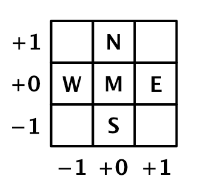

<center>Neighborhood samples.</center>

定义一个<font color="green">LumaNeighborhood</font>结构来跟踪所有这些，并添加一个<font color="red">GetLumaNeighborhood</font>函数来返回该邻域。在片段传递中调用它，最初仍然只返回中间的luma值。

```glsl
struct LumaNeighborhood {
	float m, n, e, s, w;
};

LumaNeighborhood GetLumaNeighborhood (float2 uv) {
	LumaNeighborhood luma;
	luma.m = GetLuma(uv);
	luma.n = GetLuma(uv, 0.0, 1.0);
	luma.e = GetLuma(uv, 1.0, 0.0);
	luma.s = GetLuma(uv, 0.0, -1.0);
	luma.w = GetLuma(uv, -1.0, 0.0);
	return luma;
}

float4 FXAAPassFragment (Varyings input) : SV_TARGET {
	LumaNeighborhood luma = GetLumaNeighborhood(input.screenUV);
	return luma.m;
}
```

为了确定该邻域的luma范围，我们需要知道它的最高和最低luma值是什么。计算它们，并将它们存储在邻域结构中。

```glsl
struct LumaNeighborhood {
	float m, n, e, s, w;
	float highest, lowest;
};

LumaNeighborhood GetLumaNeighborhood (float2 uv) {
	…

	luma.highest = max(max(max(max(luma.m, luma.n), luma.e), luma.s), luma.w);
	luma.lowest = min(min(min(min(luma.m, luma.n), luma.e), luma.s), luma.w);
	return luma;
}
```

你可以通过使用这些值和其他值来观察片段函数的结果，但我没有展示为此需要的临时代码修改。

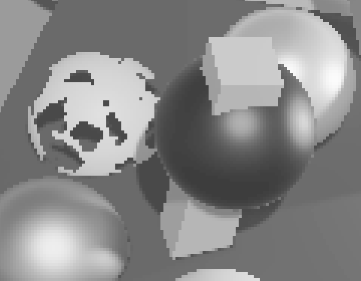

<center> </center>

<center>Middle, highest, and lowest luma in neighborhood; zoomed in.</center>

现在还要把<font color="green">luma</font>的范围加到附近，也就是最高<font color="green">luma</font>减去最低<font color="green">luma</font>。

```glsl
struct LumaNeighborhood {
	float m, n, e, s, w;
	float highest, lowest, range;
};

LumaNeighborhood GetLumaNeighborhood (float2 uv) {
	…

	luma.highest = max(max(max(max(luma.m, luma.n), luma.e), luma.s), luma.w);
	luma.lowest = min(min(min(min(luma.m, luma.n), luma.e), luma.s), luma.w);
	luma.range = luma.highest - luma.lowest;
	return luma;
}
```

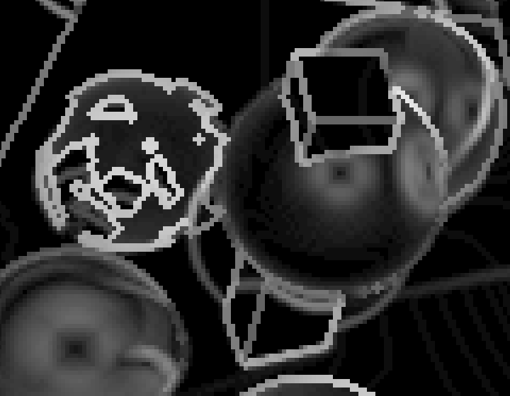

<center>Luma range in neighborhood.</center>

请注意，Luma范围在视觉上显示了图像中的边缘为线条。这些线条有两个像素宽，因为每个边缘的两边都有一个像素。<font color="red">边缘的卢马对比度越高，它看起来就越亮</font>。

#### 2.2、Fixed Threshold

我们不需要混合每一个像素，只需要混合那些邻域具有足够高对比度的像素。最简单的方法是通过引入一个<font color="red">contrast threshold - 对比度阈值</font>来实现这一区分。如果附近的luma范围没有达到这个阈值，那么这个像素就不需要混合了。我们将此命名为<font color="RoyalBlue">固定阈值</font>，因为还有一个<font color="RoyalBlue">相对阈值。</font>

在<font color="green">CameraBufferSettings</font>.<font color="red">FXAA</font>结构中添加一个滑块来配置固定阈值。原来的FXAA算法也有这个阈值，代码文档如下。

```c#
// Trims the algorithm from processing darks.
//   0.0833 - upper limit (default, the start of visible unfiltered edges)
//   0.0625 - high quality (faster)
//   0.0312 - visible limit (slower)
```

虽然文档中提到它修剪黑暗区域，但它是根据对比度来修剪的，所以不管是明亮还是黑暗。我们将使用FXAA原始文档所指出的相同范围。

```c#
	public struct FXAA {

		public bool enabled;

		[Range(0.0312f, 0.0833f)]
		public float fixedThreshold;
	}
```

让我们也使用与原版相同的默认值，我们在<font color="green">CustomRenderPipelineAsset</font>中设置。

```c#
	CameraBufferSettings cameraBuffer = new CameraBufferSettings {
		allowHDR = true,
		renderScale = 1f,
		fxaa = new CameraBufferSettings.FXAA {
			fixedThreshold = 0.0833f
		}
	};
```

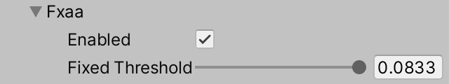

<center>Fixed threshold slider.</center>

接下来，在<font color="red">PostFXStack</font>中添加一个<font color="green">_FXAAConfig</font>着色器属性标识。

```c#
	int fxaaConfigId = Shader.PropertyToID("_FXAAConfig");
```

我们将把<font color="green">FXAA</font>的配置作为一个矢量发送到GPU，如果启用了<font color="red">FXAA</font>那么在它的第一个分量中就有<font color="red"> fixed threshold 固定的阈值</font>。请在<font color="green">DoFinal</font>中这样做。

```c#
	if (fxaa.enabled) {
			buffer.SetGlobalVector(fxaaConfigId, new Vector4(fxaa.fixedThreshold, 0f));
			buffer.GetTemporaryRT(
				colorGradingResultId, bufferSize.x, bufferSize.y, 0,
				FilterMode.Bilinear, RenderTextureFormat.Default
			);
			…
		}
```

在<font color="green">FXAAPass</font>中加入<font color="red">_FXAAConfig</font>向量，同时加入<font color="green">CanSkipFXAA</font>函数，该函数接收<font color="red">LumaNeighborhood</font>并返回其范围是否小于固定阈值。然后在<font color="green">FXAAPassFragment</font>中返回0，如果我们可以跳过FXAA。

```glsl
float4 _FXAAConfig;

…

bool CanSkipFXAA (LumaNeighborhood luma) {
	return luma.range < _FXAAConfig.x;
}

float4 FXAAPassFragment (Varyings input) : SV_TARGET {
	LumaNeighborhood luma = GetLumaNeighborhood(input.screenUV);

	if (CanSkipFXAA(luma)) {
		return 0.0;
	}
	
	return luma.range;
}
```

 

<center>Fixed threshold set to minimum and maximum.</center>

被FXAA跳过的像素现在是<font color="red">纯黑色</font>。低对比度区域现在被视觉上消除了。剩下多少取决于阈值。

#### 2.3、[Relative Threshold](https://catlikecoding.com/unity/tutorials/custom-srp/fxaa/#2.3)

FXAA也有第二个阈值，它是相对于每个邻域的<font color="RoyalBlue">最亮的luma</font>而言的。<font color="red">邻居越亮，对比度就越高</font>，这一点很重要。原始的FXAA代码对其数值有如下说明。

```
// The minimum amount of local contrast required to apply algorithm.
//   0.333 - too little (faster)
//   0.250 - low quality
//   0.166 - default
//   0.125 - high quality 
//   0.063 - overkill (slower)
```

在<font color="green">CameraBufferSettings</font>.FXAA中也为这个相对阈值添加一个滑块。

```c#
		[Range(0.063f, 0.333f)]
		public float relativeThreshold;
```

再次使用与<font color="green">CustomRenderPipelineAsset</font>中的原始默认值相同。

```c#
		fxaa = new CameraBufferSettings.FXAA {
			fixedThreshold = 0.0833f,
			relativeThreshold = 0.166f
		}
```

然后把它放在<font color="green">PostFXStack.DoFinal</font>中的FXAA配置向量的第二部分。

```c#
		buffer.SetGlobalVector(fxaaConfigId, new Vector4(
				fxaa.fixedThreshold, fxaa.relativeThreshold
			));
```

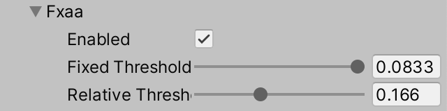

<center>Two threshold sliders.</center>

为了应用相对的而不是固定的阈值，改变<font color="green">FXAAPass</font>中的<font color="red">CanSkipFXAA</font>，使其检查<font color="green">luma</font>范围是否小于由最高<font color="green">luma</font>缩放的第二个阈值。

```c#
bool CanSkipFXAA (LumaNeighborhood luma) {
	return luma.range < _FXAAConfig.y * luma.highest;
}
```

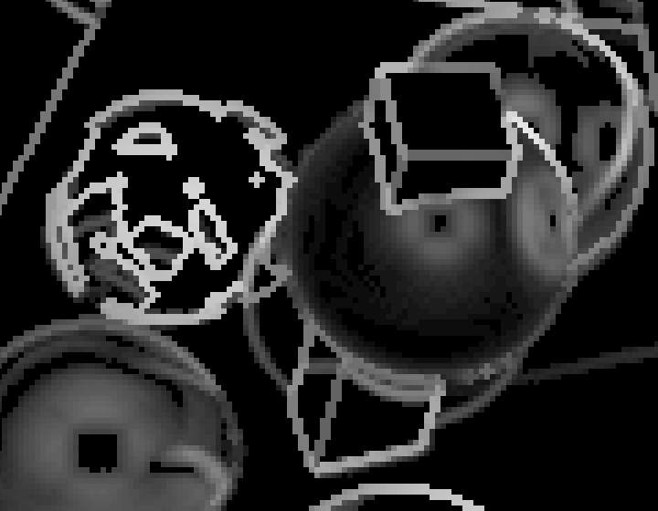 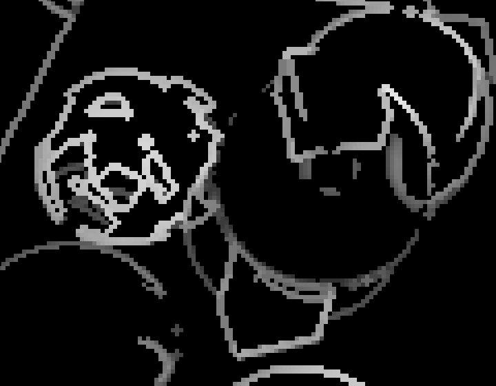

<center>Relative threshold set to minimum and maximum.</center>

应用这两个阈值时，要与最大的一个进行比较。

```glsl
bool CanSkipFXAA (LumaNeighborhood luma) {
	return luma.range < max(_FXAAConfig.x, _FXAAConfig.y * luma.highest);
}
```

 

<center>Both thresholds set to minimum and maximum.</center>

从现在开始，我总是使用最低的阈值，以便使大多数像素受到影响。

#### 2.4、[Blend Factor](https://catlikecoding.com/unity/tutorials/custom-srp/fxaa/#2.4)

<font color="green">提高边缘视觉质量的唯一正确方法是提高图像的分辨率。</font>

然而，FXAA只有原始的图像数据可以使用。它能做的最好的事情就是对丢失的子像素数据进行<font color="red">猜测</font>。

它通过将中间的像素与它的一个<font color="RoyalBlue">相邻的像素</font>混合来实现这一目的。在最极端的情况下，这将是两个像素的简单平均，但确切的<font color="green"> blend factor</font>是一个<font color="RoyalBlue">filter</font>的结果，它取决于像素的对比度和其邻居的平均值。我们将以步骤的形式将其可视化。

首先，创建一个<font color="green">GetSubpixelBlendFactor</font>函数，返回附近四个邻居的平均值。使用这个函数作为<font color="red">FXAAPassFragment</font>的结果。

```
float GetSubpixelBlendFactor (LumaNeighborhood luma) {
	float filter = luma.n + luma.e + luma.s + luma.w;
	filter *= 1.0 / 4;
	return filter;
}

float4 FXAAPassFragment (Varyings input) : SV_TARGET {
	…
	
	return GetSubpixelBlendFactor(luma);
}
```

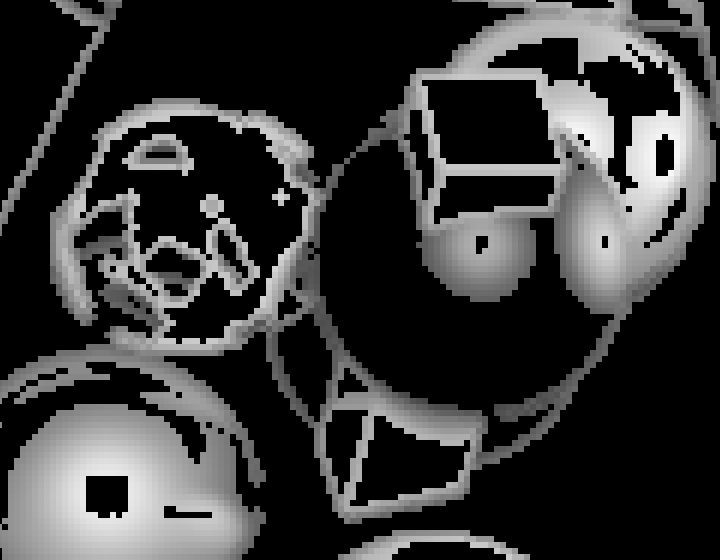

<center>Low-pass filter.</center>

其结果是对那些没有被跳过的像素周围的<font color="green">luma</font>施加一个<font color="RoyalBlue"> low-pass filter  - 低通滤波器</font>。下一步是把它变成一个<font color="red"> high-pass filter,</font>，通过取<font color="green">邻居的平均值和中间的绝对差值。</font>

```glsl
	filter = abs(filter - luma.m);
	return filter;
```


<center>High-pass filter.</center>

之后，我们通过将其除以<font color="green">luma</font>范围来<font color="RoyalBlue">归一化滤波器</font>。

```glsl
filter = filter / luma.range;
	return filter;
```


<center>Normalized filter.</center>

在这一点上，结果太强了，不能作为混合因素使用。FXAA通过对其应用<font color="RoyalBlue">squared `smoothstep` function </font>来修改该滤波器。


<center>Linear and squared smoothstep.</center>

```glsl
	filter = smoothstep(0, 1, filter);
	return filter * filter;
```


<center>Smoothed filter.</center>

滤波器的质量可以通过将对角线邻居也纳入其中而得到改善，因此将它们的<font color="green">luma</font>值添加到邻居中。

```c#
struct LumaNeighborhood {
	float m, n, e, s, w, ne, se, sw, nw;
	float highest, lowest, range;
};

LumaNeighborhood GetLumaNeighborhood (float2 uv) {
	LumaNeighborhood luma;
	luma.m = GetLuma(uv);
	luma.n = GetLuma(uv, 0.0, 1.0);
	luma.e = GetLuma(uv, 1.0, 0.0);
	luma.s = GetLuma(uv, 0.0, -1.0);
	luma.w = GetLuma(uv, -1.0, 0.0);
	luma.ne = GetLuma(uv, 1.0, 1.0);
	luma.se = GetLuma(uv, 1.0, -1.0);
	luma.sw = GetLuma(uv, -1.0, -1.0);
	luma.nw = GetLuma(uv, -1.0, 1.0);

	…
}
```

因为对角线上的邻居在空间上离中间更远，他们应该比直接邻居更重要。我们将直接邻居的权重增加一倍，从而将这一因素纳入我们的平均值。这就像一个3×3的帐篷过滤器，没有中间部分。


<center>Neighbor weights.</center>

我们现在还必须对<font color="green">归一化滤波器</font>进行饱和处理，因为我们存储的<font color="RoyalBlue">最高值没有考虑到对角线样本</font>，因此在除法之后，我们仍然可能有一个超过1的值。

```c#
float GetSubpixelBlendFactor (LumaNeighborhood luma) {
	float filter = 2.0 * (luma.n + luma.e + luma.s + luma.w);
	filter += luma.ne + luma.nw + luma.se + luma.sw;
	filter *= 1.0 / 12.0;
	filter = saturate(filter / luma.range);
	filter = smoothstep(0, 1, filter);
	return filter * filter;
}
```

<center>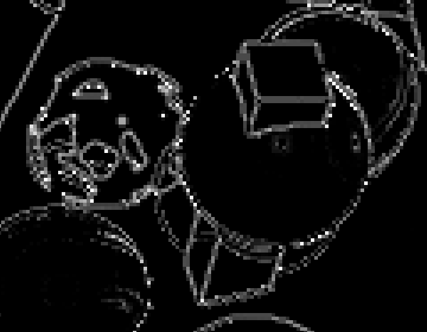 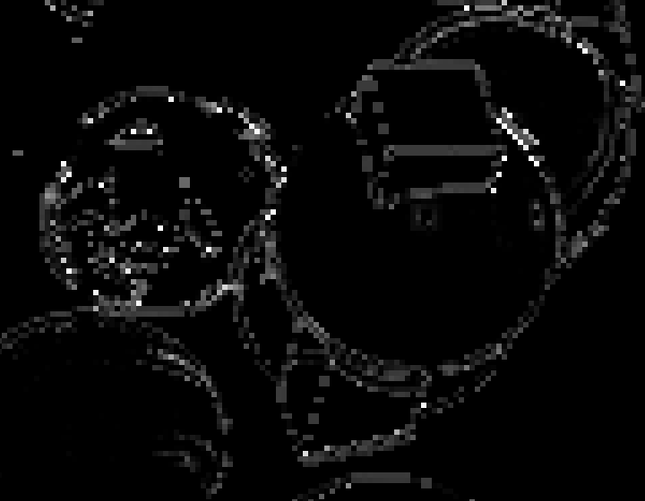</center>

<center>Expanded filter and absolute difference between both filters.</center>

#### 2.5、[Blend Direction](https://catlikecoding.com/unity/tutorials/custom-srp/fxaa/#2.5)

<font color="red">在确定了混合系数后，下一步就是决定混合哪两个像素。</font>

FXAA将中间的像素与它的直接邻居之一进行混合，所以可以是北边、东边、南边或西边的邻居。选择这四个像素中的哪一个，取决于<font color="green">contrast gradient.  - 对比梯度</font>的方向。

在最简单的情况下，中间像素接触的是两个对比度区域之间的水平或垂直边缘。在水平边缘的情况下，它应该是北边或南边的邻居，这取决于中间是在边缘下面还是上面。

否则，它应该是东边或西边的邻居，这取决于中间是在边缘的左边还是右边。

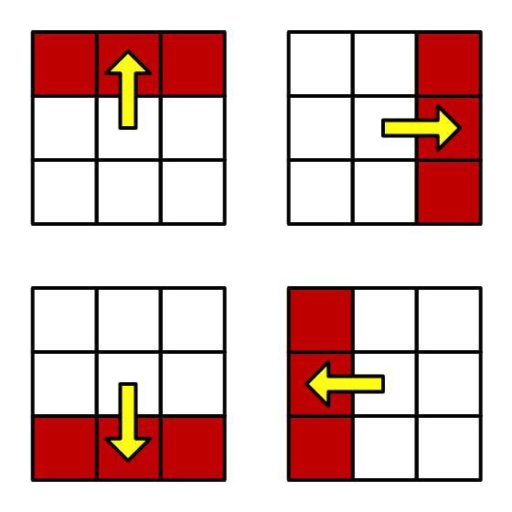

<center>Four possible blend directions.</center>

边缘往往不是完全水平或垂直的，但我们通过比较附近的<font color="RoyalBlue">horizontal and vertical</font>对比，挑选出最佳的近似值。

如果有一个水平的边缘，那么就会有强烈的垂直对比，要么在中间以上，要么在中间以下。

我们通过增加南北，减去中间的两倍，然后取其绝对值来衡量。同样的逻辑适用于垂直边缘，但用东和西代替。如果水平线的结果大于垂直线，那么我们就宣布它是一条水平线。

创建一个函数来表明这一点，给定一个邻居。

```c#
bool IsHorizontalEdge (LumaNeighborhood luma) {
	float horizontal = abs(luma.n + luma.s - 2.0 * luma.m);
	float vertical = abs(luma.e + luma.w - 2.0 * luma.m);
	return horizontal >= vertical;
}
```

我们可以通过将对角线邻居也包括在内来提高我们的边缘方向检测的质量。对于水平边缘，我们对向东一步的三个像素和向西一步的三个像素进行同样的计算，将结果相加。同样，这些额外的值离中间更远，所以我们把它们的相对重要性减半，把中间对比度的权重增加一倍。同样的道理也适用于垂直边缘的对比，但有南北偏移。

```glsl
bool IsHorizontalEdge (LumaNeighborhood luma) {
	float horizontal =
		2.0 * abs(luma.n + luma.s - 2.0 * luma.m) +
		abs(luma.ne + luma.se - 2.0 * luma.e) +
		abs(luma.nw + luma.sw - 2.0 * luma.w);
	float vertical =
		2.0 * abs(luma.e + luma.w - 2.0 * luma.m) +
		abs(luma.ne + luma.nw - 2.0 * luma.n) +
		abs(luma.se + luma.sw - 2.0 * luma.s);
	return horizontal >= vertical;
}
```

现在引入一个<font color="green">FXAAEdge</font>结构来包含检测到的边缘的信息。在这一点上，只有它是否是水平的。创建一个<font color="red">GetFXAAEdge</font>方法来返回该信息，给定一个邻居。

```c#
struct FXAAEdge {
	bool isHorizontal;
};

FXAAEdge GetFXAAEdge (LumaNeighborhood luma) {
	FXAAEdge edge;
	edge.isHorizontal = IsHorizontalEdge(luma);
	return edge;
}
```

在<font color="green">FXAAPassFragment</font>中获取<font color="green">edge data</font>，然后用它来可视化边缘的方向，例如把水平的变成红色，垂直的变成白色。在这一点上，我们并不关心混合因子的问题。

```c#
float4 FXAAPassFragment (Varyings input) : SV_TARGET {
	LumaNeighborhood luma = GetLumaNeighborhood(input.screenUV);

	if (CanSkipFXAA(luma)) {
		return 0.0;
	}

	FXAAEdge edge = GetFXAAEdge(luma);
	
	return edge.isHorizontal ? float4(1.0, 0.0, 0.0, 0.0) : 1.0;
}
```


<center>Horizontal edges are red, vertical edges are white.</center>

<font color="green">知道了边缘的方向，我们就可以知道我们要在哪个维度上进行混合。</font>

如果它是水平的，那么我们就垂直穿过边缘进行混合，否则它是垂直的，我们就水平穿过边缘进行混合。

在UV空间中，它离下一个像素有多远取决于像素的大小，而像素的大小又取决于混合方向。所以让我们把像素的大小步骤添加到<font color="green">FXAAEdge</font>，并在<font color="red">GetFXAAEdge</font>中初始化它。

```c#
struct FXAAEdge {
	bool isHorizontal;
	float pixelStep;
};

FXAAEdge GetFXAAEdge (LumaNeighborhood luma) {
	FXAAEdge edge;
	edge.isHorizontal = IsHorizontalEdge(luma);
	if (edge.isHorizontal) {
		edge.pixelStep = GetSourceTexelSize().y;
	}
	else {
		edge.pixelStep = GetSourceTexelSize().x;
	}
	
	return edge;
}
```

接下来，我们必须确定我们应该在正方向还是负方向混合。我们通过在适当的方向上比较中间两侧的对比度--luma梯度来做到这一点。

<font color="green">如果我们有一个水平的边缘，那么北边就是正的邻居，南边就是负的。</font>

<font color="green">如果我们有一个垂直的边缘，那么东边是正的邻居，西边是负的。</font>

如果正的梯度小于负的梯度，那么中间就在边缘的右边，我们必须在负的方向上混合，我们通过否定这个步骤来做到这一点。

```c#
	float lumaP, lumaN;
	if (edge.isHorizontal) {
		edge.pixelStep = GetSourceTexelSize().y;
		lumaP = luma.n;
		lumaN = luma.s;
	}
	else {
		edge.pixelStep = GetSourceTexelSize().x;
		lumaP = luma.e;
		lumaN = luma.w;
	}
	float gradientP = abs(lumaP - luma.m);
	float gradientN = abs(lumaN - luma.m);

	if (gradientP < gradientN) {
		edge.pixelStep = -edge.pixelStep;
	}
```

现在，我们可以直观地看到混合方向，例如，将正边变成红色，负边变成白色。

```c#
	return edge.pixelStep > 0.0 ? float4(1.0, 0.0, 0.0, 0.0) : 1.0;
```

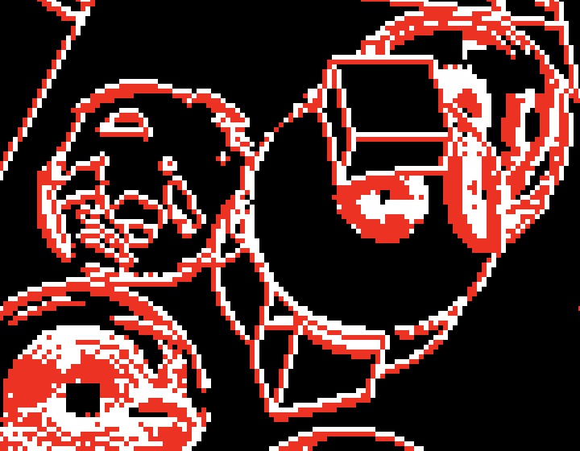

<center>Positive edges (left and bottom sides) are red, negative edges are white.</center>

#### 2.6、[Final Blend](https://catlikecoding.com/unity/tutorials/custom-srp/fxaa/#2.6)

在这一点上，我们既可以得到混合系数，也可以知道在哪个方向上进行混合。

最终的结果是通过使用混合因子在中间像素和它的邻居之间沿适当的方向进行线性插值而得到的。我们可以通过简单地对图像进行取样，其<font color="green">offset </font>等于由<font color="red"> pixel step scaled by the blend factor</font>步长。另外，如果我们跳过了这个像素，就必须返回原始像素。

```c#
float4 FXAAPassFragment (Varyings input) : SV_TARGET {
	LumaNeighborhood luma = GetLumaNeighborhood(input.screenUV);
	
	if (CanSkipFXAA(luma)) {
		return GetSource(input.screenUV);
	}

	FXAAEdge edge = GetFXAAEdge(luma);

	float blendFactor = GetSubpixelBlendFactor(luma);
	float2 blendUV = input.screenUV;
	if (edge.isHorizontal) {
		blendUV.y += blendFactor * edge.pixelStep;
	}
	else {
		blendUV.x += blendFactor * edge.pixelStep;
	}
	return GetSource(blendUV);
}
```

<center>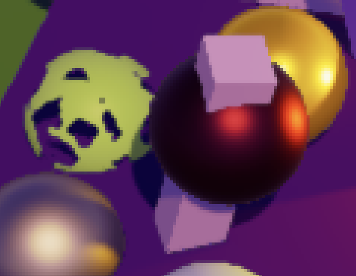 </center>

<center>With and without blending.</center>

#### 2.7、[Blend Strength](https://catlikecoding.com/unity/tutorials/custom-srp/fxaa/#2.7)

FXAA不仅影响明显的高对比度边缘，它混合任何有足够高对比度的东西，包括孤立的像素。虽然这有助于减轻<font color="green">fireflies </font>的影响，但它也积极地模糊了小细节，这通常是对<font color="green">FXAA</font>的最大抱怨。

<center> </center>

<center>Circuitry materials with small details, with and without subpixel blending.</center>

<center>有和没有子像素的混合</center>

<font color="green">FXAA</font>可以通过简单地缩小其混合系数来控制<font color="green">subpixel blending - 子像素混合</font>的强度。这里是它的原始文档。

```c#
// Choose the amount of sub-pixel aliasing removal.
// This can effect sharpness.
//   1.00 - upper limit (softer)
//   0.75 - default amount of filtering
//   0.50 - lower limit (sharper, less sub-pixel aliasing removal)
//   0.25 - almost off
//   0.00 - completely off
```

我们通过在<font color="green">CameraSettings.FXAA</font>中添加一个0-1的<font color="green">subpixel blending - 子像素混合</font>的滑块，使其也可以配置。

```c#
	[Range(0f, 1f)]
		public float subpixelBlending;
```

在<font color="green">CustomRenderPipelineAsset</font>中，给予它与原始的75%强度默认值相同。

```c#
	fxaa = new CameraBufferSettings.FXAA {
			fixedThreshold = 0.0833f,
			relativeThreshold = 0.166f,
			subpixelBlending = 0.75f
		}
```

然后把它添加到<font color="green">PostFXStack.DoFinal</font>的<font color="green">FXAA</font>配置向量中。

```c#
		buffer.SetGlobalVector(fxaaConfigId, new Vector4(
				fxaa.fixedThreshold, fxaa.relativeThreshold, fxaa.subpixelBlending
			));
```

并将其应用于GeSubpixelBlendFactor结尾的混合因子。

```c#
float GetSubpixelBlendFactor (LumaNeighborhood luma) {
	…
	return filter * filter * _FXAAConfig.z;
}
```

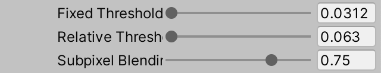


<center>Subpixel blending reduced to 75%.</center>

### 3、[Blending Along Edges](https://catlikecoding.com/unity/tutorials/custom-srp/fxaa/#3)

因为像素混合系数是在3×3块内确定的，它只能平滑该规模的特征。但边缘可能比这更长。一个像素可以在一个有角度的边缘楼梯的某个长阶上结束。

虽然局部的边缘是水平或垂直的，但真正的边缘往往是在另一个角度。如果我们知道这个真正的边缘，那么我们就可以更好地匹配相邻像素的混合系数，使边缘在整个长度上变得平滑。

<center> </center>

<center>Pincushion geometry with and without subpixel blending at full strength.</center>

<center>在全强度下，有和没有子像素混合的枕形几何。</center>

相比之下，在渲染比例2的时候，我们可以得到更好的边缘，因为更高的分辨率可以使楼梯在整个长度上更加平滑。我们也可以在<font color="green">提高渲染比例</font>的基础上应用FXAA，以获得更平滑的结果，但目前这对边缘质量没有什么影响。

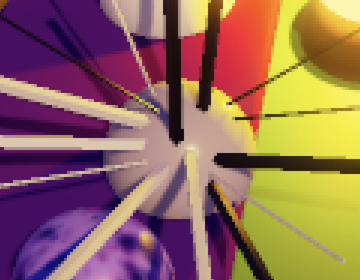

<center>Render scale 2 without FXAA.</center>

#### 3.1、[Edge Luma](https://catlikecoding.com/unity/tutorials/custom-srp/fxaa/#3.1)

为了弄清我们所处理的是哪种边缘，我们必须跟踪更多的信息。我们知道，3×3块的中间像素在边缘的一侧，而其他像素中至少有一个在另一侧。为了进一步确定边缘，我们需要知道它的<font color="green">luma</font>梯度。我们已经在<font color="red">GetFXAAEdge</font>中弄清楚了这一点。我们现在需要跟踪这个梯度和边缘另一侧的<font color="green">luma</font>，所以把它们添加到边缘数据中。

```c#
struct FXAAEdge {
	bool isHorizontal;
	float pixelStep;
	float lumaGradient, otherLuma;
};

FXAAEdge GetFXAAEdge (LumaNeighborhood luma) {
	…

	if (gradientP < gradientN) {
		edge.pixelStep = -edge.pixelStep;
		edge.lumaGradient = gradientN;
		edge.otherLuma = lumaN;
	}
	else {
		edge.lumaGradient = gradientP;
		edge.otherLuma = lumaP;
	}
	
	return edge;
}
```

引入一个<font color="green">GetEdgeBlendFactor</font>函数，为边缘返回一个单独的混合系数。它需要<font color="red">luma邻域</font>、<font color="green">edge data, and pixel UV coordinates </font>来做到这一点，所以要为这些添加参数。我们将从返回边缘的<font color="green">luma梯度</font>开始。调整<font color="green">FXAAPassFragment</font>，让它只可视化新的<font color="red">edge blend factor </font>。

```c#
float GetEdgeBlendFactor (LumaNeighborhood luma, FXAAEdge edge, float2 uv) {
	return edge.lumaGradient;
}

float4 FXAAPassFragment (Varyings input) : SV_TARGET {
	LumaNeighborhood luma = GetLumaNeighborhood(input.screenUV);
	
	if (CanSkipFXAA(luma)) {
		return 0.0;
	}

	FXAAEdge edge = GetFXAAEdge(luma);

	float blendFactor = GetEdgeBlendFactor (luma, edge, input.screenUV);
	return blendFactor;
	float2 blendUV = input.screenUV;
	…
}
```

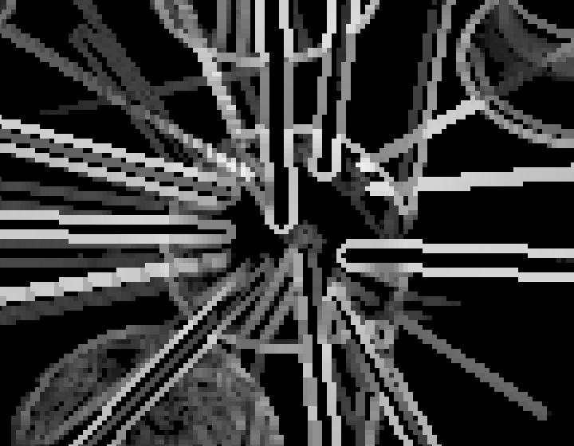

<center>Edge gradients.</center>

#### 3.2、[Tracing the Edge](https://catlikecoding.com/unity/tutorials/custom-srp/fxaa/#3.2)

我们必须弄清楚像素沿水平或垂直边缘段的相对位置。做到这一点的唯一方法是沿着边缘在两个方向上行走，直到我们找到端点。这可以通过沿边缘取样像素对并检查它们是否仍然类似于我们最初检测到的边缘来完成。

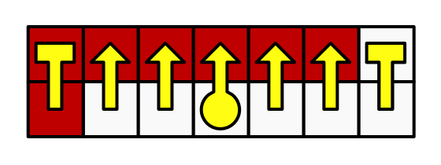

<center>Searching for the end points.</center>

但我们不需要每一步都对两个像素进行采样。我们可以在它们之间做一个单<font color="red">single sample</font>，这样就可以得到它们的平均亮度。这就足以确定一个边缘的终点。


<center>Search (yellow) and neighborhood (black) samples.</center>

为了执行这个搜索，我们在<font color="green">GetEdgeBlendFactor</font>中要做的第一件事是确定在边缘上取样的UV坐标。我们必须将原始的UV坐标向边缘偏移<font color="red">半个像素步长</font>。

```c#
float GetEdgeBlendFactor (LumaNeighborhood luma, FXAAEdge edge, float2 uv) {
	float2 edgeUV = uv;
	if (edge.isHorizontal) {
		edgeUV.y += 0.5 * edge.pixelStep;
	}
	else {
		edgeUV.x += 0.5 * edge.pixelStep;
	}

	return edge.lumaGradient;
}
```

之后，沿着边缘的单一步骤的UV偏移取决于其方向。它要么是水平的，要么是垂直的。

```c#
	float2 edgeUV = uv;
	float2 uvStep = 0.0;
	if (edge.isHorizontal) {
		edgeUV.y += 0.5 * edge.pixelStep;
		uvStep.x = GetSourceTexelSize().x;
	}
	else {
		edgeUV.x += 0.5 * edge.pixelStep;
		uvStep.y = GetSourceTexelSize().y;
	}
```

我们要做的是确定采样的<font color="green">luma</font>值和最初检测到的边缘上的<font color="green">luma</font>平均值之间的对比。

如果这个对比度变得太大，那么我们就离开了边缘。FXAA使用边缘的1/4<font color="green">Luma</font>梯度作为这个检查的阈值。因此，我们必须跟踪这个阈值和最初的边缘<font color="green">Luma</font>平均值。

```c#
float edgeLuma = 0.5 * (luma.m + edge.otherLuma);
	float gradientThreshold = 0.25 * edge.lumaGradient;
	
	return edge.lumaGradient;
						
```

我们先在正方向上走一步。

 确定正向偏移的UV坐标，计算该偏移和原始边缘之间的<font color="red">luma梯度</font>，并检查它是否等于或超过阈值。这就告诉我们，我们是否处于正方向的边缘的末端。如果我们直接将这个检查可视化，那么我们将只看到那些直接挨着边缘端点的像素。

```c#
	float edgeLuma = 0.5 * (luma.m + edge.otherLuma);
	float gradientThreshold = 0.25 * edge.lumaGradient;
			
	float2 uvP = edgeUV + uvStep;
	float lumaGradientP = abs(GetLuma(uvP) - edgeLuma);
	bool atEndP = lumaGradientP >= gradientThreshold;
	
	return atEndP;
```

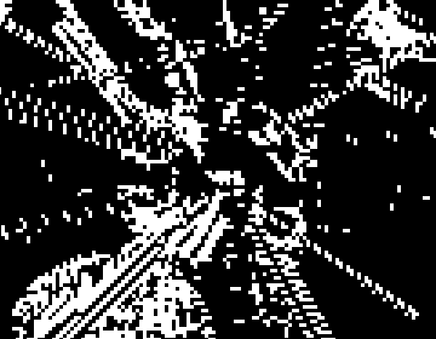

<center>One step to the end in the positive direction.</center>

<center>在确定的方向上，一步步走向终点。</center>

<font color="red">为了走完整条边</font>，我们必须在这一步之后用一个循环来重复这个过程，只要我们还没有到终点。我们还必须在某个点上终止这个过程，所以它不能永远持续下去，比如说最多经过100步，所以循环应该允许再走99步。

```c#
	float2 uvP = edgeUV + uvStep;
	float lumaGradientP = abs(GetLuma(uvP) - edgeLuma);
	bool atEndP = lumaGradientP >= gradientThreshold;

	for (int i = 0; i < 99 && !atEndP; i++) {
		uvP += uvStep;
		lumaGradientP = abs(GetLuma(uvP) - edgeLuma);
		atEndP = lumaGradientP >= gradientThreshold;
	}
```


<center>Up to 100 steps in the positive direction.</center>

一旦我们完成了搜索，我们就可以通过从最终的偏移分量中减去适当的原始UV坐标分量来找到UV空间中到<font color="green">positive end 确定的终点</font>的距离。然后我们可以将这个距离可视化，将其放大以使其更容易看到。

```c#
	float distanceToEndP;
	if (edge.isHorizontal) {
		distanceToEndP = uvP.x - uv.x;
	}
	else {
		distanceToEndP = uvP.y - uv.y;
	}

	return 10.0 * distanceToEndP;
```


<center>Distance to positive end in UV space, ×10.</center>

#### 3.3、[Negative Direction](https://catlikecoding.com/unity/tutorials/custom-srp/fxaa/#3.3)

我们也要在负方向上做同样的事情，所以要复制相关的代码并适当调整。

```c#
float2 uvP = edgeUV + uvStep;
	float lumaGradientP = abs(GetLuma(uvP) - edgeLuma);
	bool atEndP = lumaGradientP >= gradientThreshold;

	for (int i = 0; i < 99 && !atEndP; i++) {
		uvP += uvStep;
		lumaGradientP = abs(GetLuma(uvP) - edgeLuma);
		atEndP = lumaGradientP >= gradientThreshold;
	}

	float2 uvN = edgeUV - uvStep;
	float lumaGradientN = abs(GetLuma(uvN) - edgeLuma);
	bool atEndN = lumaGradientN >= gradientThreshold;

	for (int i = 0; i < 99 && !atEndN; i++) {
		uvN -= uvStep;
		lumaGradientN = abs(GetLuma(uvN) - edgeLuma);
		atEndN = lumaGradientN >= gradientThreshold;
	}
```

然后确定到负端的距离，其作用与正端相同，但被否定。

```c#
	float distanceToEndP, distanceToEndN;
	if (edge.isHorizontal) {
		distanceToEndP = uvP.x - uv.x;
		distanceToEndN = uv.x - uvN.x;
	}
	else {
		distanceToEndP = uvP.y - uv.y;
		distanceToEndN = uv.y - uvN.y;
	}
```

我们现在可以找到到边缘最近的一端的距离，并将其可视化。

```c#
	float distanceToNearestEnd;
	if (distanceToEndP <= distanceToEndN) {
		distanceToNearestEnd = distanceToEndP;
	}
	else {
		distanceToNearestEnd = distanceToEndN;
	}
	
	return 10.0 * distanceToNearestEnd;
```

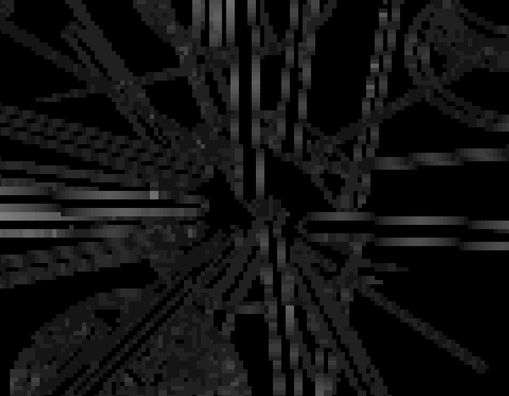

<center>Distance to nearest end.</center>

<center>到最近的一端的距离。</center>

请注意，发现的距离在大多数情况下似乎是有意义的，但并非总是如此。因为FXAA是一个近似值，它有时会错误地猜测或错过一个边缘的末端。

#### 3.4、[Blending on a Single Side]()

在这一点上，我们知道离边缘最近的端点的距离，我们可以用它来确定混合系数。但我们只在边缘向包含中间像素的区域倾斜的方向上做这个工作。这确保我们只混合边缘一侧的像素。

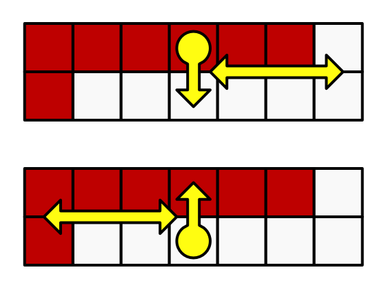

<center>Choosing which side to blend.</center>

为了确定方向，我们需要知道我们在搜索时得到的最后一个梯度的方向。为了实现这一点，我们将改变我们的代码，以跟踪<font color="green">luma deltas</font>而不是绝对梯度。

```c#
	float2 uvP = edgeUV + uvStep;
	float lumaDeltaP = GetLuma(uvP) - edgeLuma;
	bool atEndP = abs(lumaDeltaP) >= gradientThreshold;

	for (int i = 0; i < 99 && !atEndP; i++) {
		uvP += uvStep;
		lumaDeltaP = GetLuma(uvP) - edgeLuma;
		atEndP = abs(lumaDeltaP) >= gradientThreshold;
	}

	float2 uvN = edgeUV - uvStep;
	float lumaDeltaN = GetLuma(uvN) - edgeLuma;
	bool atEndN = abs(lumaDeltaN) >= gradientThreshold;

	for (int i = 0; i < 99 && !atEndN; i++) {
		uvN -= uvStep;
		lumaDeltaN = GetLuma(uvN) - edgeLuma;
		atEndN = abs(lumaDeltaN) >= gradientThreshold;
	}
```

现在我们可以确定最终delta的<font color="green">sign </font>。我们可以通过检查它是否大于或等于零来做到这一点。

```c#
	float distanceToNearestEnd;
	bool deltaSign;
	if (distanceToEndP <= distanceToEndN) {
		distanceToNearestEnd = distanceToEndP;
		deltaSign = lumaDeltaP >= 0;
	}
	else {
		distanceToNearestEnd = distanceToEndN;
		deltaSign = lumaDeltaN >= 0;
	}
```

如果最后的<font color="green">sign </font>与原始边缘的符号一致，那么我们就远离了边缘，应该跳过混合，返回0。

```c#
	if (deltaSign == (luma.m - edgeLuma >= 0)) {
		return 0.0;
	}
	else {
		return 10.0 * distanceToNearestEnd;
	}
```


<center>Distances for single side only.</center>

#### 3.5、[Final Blend Factor](https://catlikecoding.com/unity/tutorials/custom-srp/fxaa/#3.5)

如果我们在边缘的正确一侧，那么我们混合的系数是0.5减去沿边缘最近的端点的相对距离。这意味着我们离端点越近，混合得越多，而在边缘的中间则完全不混合。

```c#
	if (deltaSign == (luma.m - edgeLuma >= 0)) {
		return 0.0;
	}
	else {
		return 0.5 - distanceToNearestEnd / (distanceToEndP + distanceToEndN);
	}
```


<center>Edge blend factors.</center>

现在调整<font color="green">FXAAPassFragment</font>，这样我们可以看到边缘混合的结果。

```c#
	if (CanSkipFXAA(luma)) {
		return GetSource(input.screenUV);
	}

	FXAAEdge edge = GetFXAAEdge(luma);

	float blendFactor = GetEdgeBlendFactor (luma, edge, input.screenUV);
	//return blendFactor;
	float2 blendUV = input.screenUV;
```

<center> </center>

<center>Only edge blending and only subpixel blending at full strength.</center>

为了同时应用边缘和<font color="green">subpixel blending - 子像素混合</font>，我们使用两者的最大混合系数。

```c#
	float blendFactor = max(
		GetSubpixelBlendFactor(luma), GetEdgeBlendFactor (luma, edge, input.screenUV)
	);
```


<center>Edge blending together with subpixel blending at 0.75.</center>

#### 3.6、[Limited Edge Search](https://catlikecoding.com/unity/tutorials/custom-srp/fxaa/#3.6)

如果边缘几乎是水平的或垂直的，搜索边缘的末端可能需要很长的时间。在任何一个方向上多达100个样本都太多了，无法保证可接受的性能。所以我们必须更早地终止搜索，但这将使FXAA无法检测到更长的边缘。

为了清楚地说明这一点，将<font color="green">GetEdgeBlendFactor</font>中的搜索减少到在任何方向上最多四个像素，所以在三步之后终止循环。

```c#
	for (int i = 0; i < 3 && !atEndP; i++) { … }

	…
	
	for (int i = 0; i < 3 && !atEndN; i++) { … }
```

<center> 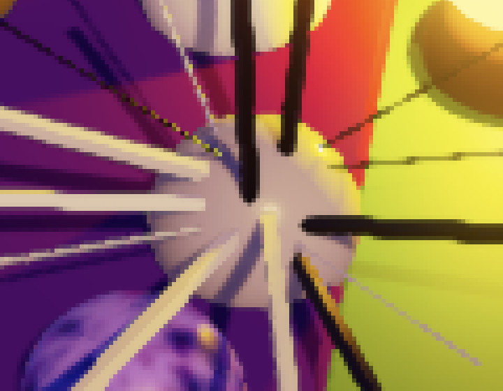</center>

<center>Up to 100 steps and only up to four steps.</center>

其结果是，所有远于4个像素的端点都被当作是4个像素的距离，这就降低了<font color="green">FXAA</font>的质量。

如果循环在找到一个边缘之前就终止了，那么我们就低估了距离，因为端点至少在一步之外。因此，如果我们没有找到真正的距离，我们可以通过增加一个步骤来猜测真正的距离，从而在一定程度上改善结果。如果我们在四步之后没有找到它，那么我们就猜测真正的距离是五步。

```c#
	for (int i = 0; i < 3 && !atEndP; i++) { … }
	if (!atEndP) {
		uvP += uvStep;
	}

	…
	
	for (int i = 0; i < 3 && !atEndN; i++) { … }
	if (!atEndN) {
		uvN -= uvStep;
	}
```


<center>Up to four steps with extra guess.</center>

#### 3.7、[Edge Quality](https://catlikecoding.com/unity/tutorials/custom-srp/fxaa/#3.7)

我们允许边缘搜索走多远限制了结果的质量和所需时间。

因此，这是一个<font color="red">质量和性能之间的权衡</font> ，这意味着没有一个单一的最佳选择。为了使我们的方法可配置，我们将为额外的边缘步骤的数量引入定义语句，为额外步骤的偏移列表，以及当我们必须停止搜索时使用的最后一个边缘步骤猜测的偏移。

用这些来创建一个静态的常量数组来表示边缘步骤的大小，然后在<font color="green">GetEdgeBlendFactor</font>中全部使用它。

```c#
#define EXTRA_EDGE_STEPS 3
#define EDGE_STEP_SIZES 1.0, 1.0, 1.0
#define LAST_EDGE_STEP_GUESS 1.0

static const float edgeStepSizes[EXTRA_EDGE_STEPS] = { EDGE_STEP_SIZES };

float GetEdgeBlendFactor (LumaNeighborhood luma, FXAAEdge edge, float2 uv) {
	…
	
	for (int i = 0; i < EXTRA_EDGE_STEPS && !atEndP; i++) {
		uvP += uvStep * edgeStepSizes[i];
		lumaDeltaP = GetLuma(uvP) - edgeLuma;
		atEndP = abs(lumaDeltaP) >= gradientThreshold;
	}
	if (!atEndP) {
		uvP += uvStep * LAST_EDGE_STEP_GUESS;
	}

	…

	for (int i = 0; i < EXTRA_EDGE_STEPS && !atEndN; i++) {
		uvN -= uvStep * edgeStepSizes[i];
		lumaDeltaN = GetLuma(uvN) - edgeLuma;
		atEndN = abs(lumaDeltaN) >= gradientThreshold;
	}
	if (!atEndN) {
		uvN -= uvStep * LAST_EDGE_STEP_GUESS;
	}
	
	…
}
```

我们明确地为步长创建一个数组，以便我们可以改变它们。

例如，原始的FXAA算法包含多个质量预设，它们的步数和大小都不同。<font color="RoyalBlue">Quality preset 22 - 质量预设22</font>是一个快速的低质量预设，有三个额外的步骤。

第一个额外步骤--在单个像素的初始偏移之后--有一个1.5的偏移。

这个额外的半像素偏移意味着我们最终会沿着边缘对四个像素的正方形进行<font color="red">平均采样</font>，而不是单对。

之后的两个步骤的大小为2，每个步骤再次对四个像素的正方形而不是一对像素进行采样。

因此，它只用四个样本就覆盖了多达七个像素的距离。如果它未能检测到终点，它就会猜测它至少在八步之外。

```c#
#define EXTRA_EDGE_STEPS 3
#define EDGE_STEP_SIZES 1.5, 2.0, 2.0
#define LAST_EDGE_STEP_GUESS 8.0
```


<center>Low quality.</center>

使用这些设置，我们得到了低质量的结果，但与我们将额外的步长固定为1相比，它们能够更好地处理长的边缘。这是由较大的步长所造成的，它产生的结果不太准确。

让我们使用当前配置的低质量FXAA，只有在定义了<font color="green">FXAA_QUALITY_LOW</font>的情况下才使用它，而目前没有。

否则，我们将使用对应于质量预设26的设置。它使用与预设22相同的方法，但有8个额外的样本，除了最后一个样本外，所有样本的步长都是2，它的步长是4，所以它跳过了一个步骤，看得更远。

```c#
#if defined(FXAA_QUALITY_LOW)
	#define EXTRA_EDGE_STEPS 3
	#define EDGE_STEP_SIZES 1.5, 2.0, 2.0
	#define LAST_EDGE_STEP_GUESS 8.0
#else
	#define EXTRA_EDGE_STEPS 8
	#define EDGE_STEP_SIZES 1.5, 2.0, 2.0, 2.0, 2.0, 2.0, 2.0, 4.0
	#define LAST_EDGE_STEP_GUESS 8.0
#endif
```


<center>Medium quality.</center>

让我们把这个配置用于中等质量--当<font color="green">FXAA_QUALITY_MEDIUM</font>被定义时，并添加一个与预设39匹配的最终默认配置。

这是一个高质量的配置，它有10个额外的步骤，并且只在额外的4对采样后切换到方形块采样，同样，最后一步是跳过的，猜测为8。

```c#
#if defined(FXAA_QUALITY_LOW)
	#define EXTRA_EDGE_STEPS 3
	#define EDGE_STEP_SIZES 1.5, 2.0, 2.0
	#define LAST_EDGE_STEP_GUESS 8.0
#elif defined(FXAA_QUALITY_MEDIUM)
	#define EXTRA_EDGE_STEPS 8
	#define EDGE_STEP_SIZES 1.5, 2.0, 2.0, 2.0, 2.0, 2.0, 2.0, 4.0
	#define LAST_EDGE_STEP_GUESS 8.0
#else
	#define EXTRA_EDGE_STEPS 10
	#define EDGE_STEP_SIZES 1.0, 1.0, 1.0, 1.0, 1.5, 2.0, 2.0, 2.0, 2.0, 4.0
	#define LAST_EDGE_STEP_GUESS 8.0
#endif
```


<center>High quality.</center>

为了允许选择质量等级，在<font color="green">PostFXStack</font>着色器的两个FXAA通道中添加一个多编译指令。我们只需要低质量和中等质量版本的关键字，高质量版本则使用默认的无关键字。

```c#
				#pragma fragment FXAAPassFragment
				#pragma multi_compile _ FXAA_QUALITY_MEDIUM FXAA_QUALITY_LOW
```

在CameraBufferSettings.FXAA中添加相应的质量配置选项。

```c#
		public enum Quality { Low, Medium, High }

		public Quality quality;
```

然后在PostFXStack中启用或禁用适当的关键字。在一个新的ConfigureFXAA方法中做到这一点，同时将设置配置向量的代码移到那里。然后在DoFinal中的适当时刻调用它。

```c#
	const string
		fxaaQualityLowKeyword = "FXAA_QUALITY_LOW",
		fxaaQualityMediumKeyword = "FXAA_QUALITY_MEDIUM";
	
	…
	
	void ConfigureFXAA () {
		if (fxaa.quality == CameraBufferSettings.FXAA.Quality.Low) {
			buffer.EnableShaderKeyword(fxaaQualityLowKeyword);
			buffer.DisableShaderKeyword(fxaaQualityMediumKeyword);
		}
		else if (fxaa.quality == CameraBufferSettings.FXAA.Quality.Medium) {
			buffer.DisableShaderKeyword(fxaaQualityLowKeyword);
			buffer.EnableShaderKeyword(fxaaQualityMediumKeyword);
		}
		else {
			buffer.DisableShaderKeyword(fxaaQualityLowKeyword);
			buffer.DisableShaderKeyword(fxaaQualityMediumKeyword);
		}
		buffer.SetGlobalVector(fxaaConfigId, new Vector4(
			fxaa.fixedThreshold, fxaa.relativeThreshold, fxaa.subpixelBlending
		));
	}

	void DoFinal (int sourceId) {
		…
		if (fxaa.enabled) {
			ConfigureFXAA();
			buffer.GetTemporaryRT(
				colorGradingResultId, bufferSize.x, bufferSize.y, 0,
				FilterMode.Bilinear, RenderTextureFormat.Default
			);
			Draw(
				sourceId, colorGradingResultId,
				keepAlpha ? Pass.ApplyColorGrading : Pass.ApplyColorGradingWithLuma
			);
		}

		…
	}
```

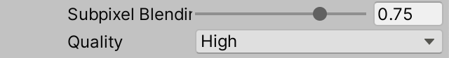

<center>FXAA set to high quality.</center>

这些质量预设只是例子，你可以根据自己的喜好进行配置。也可以将FXAA与加倍的渲染比例结合起来，以获得更好的效果。请记住，<font color="green">FXAA是在调整后的渲染比例下运行的，所以这是很昂贵的</font>。

<center>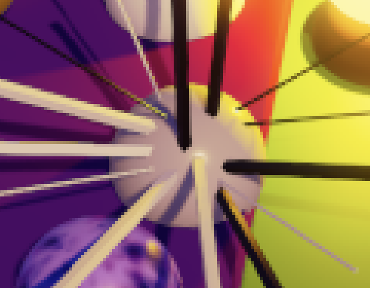 </center>

<center>Render scale 2 with and without high-quality FXAA.</center>

你不需要走所有的路。例如，你可以把FXAA和渲染比例4/3结合起来。这将使像素数量增加1.78而不是4。这是<font color="green">Timothy Lottes</font>在他为<font color="red">SIGGRAPH2011</font>所做的关于实时抗锯齿的过滤方法的演讲中提出的。

<center> 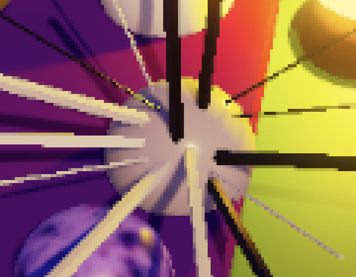</center>

<center>Bilinear render scale 1.333333 with and without high-quality FXAA.</center>

这可以通过使用双立方体重新缩放来进一步平滑。

<center>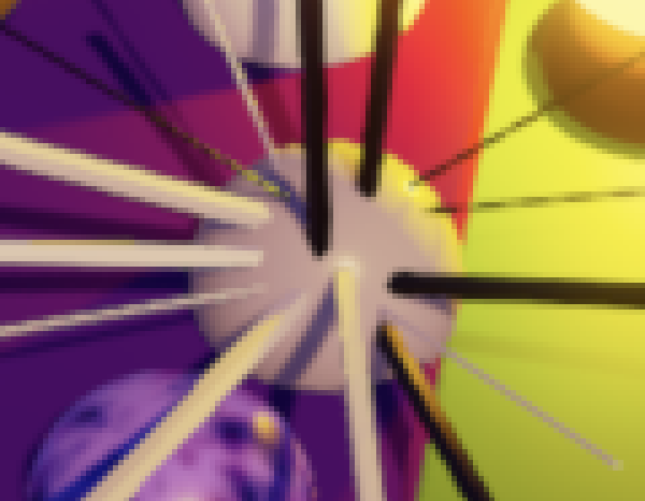 </center>

<center>Bicubic render scale 1.333333 with and without high-quality FXAA.</center>

也可以使用FXAA来改善降低渲染比例的结果。

<center>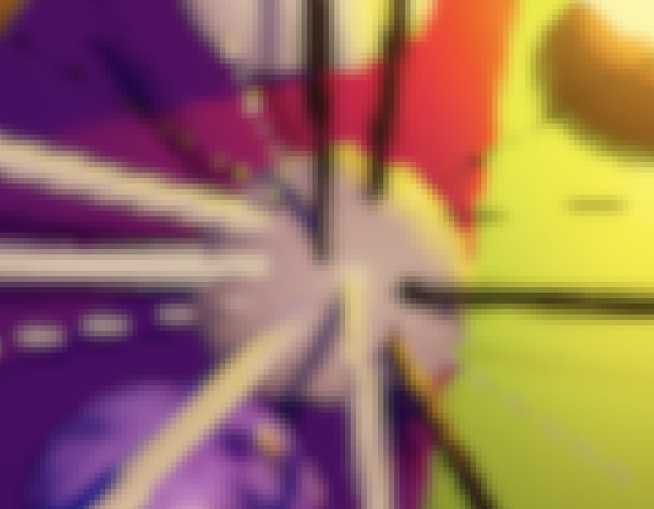 </center>

<center>Bicubic render scale 0.5 with and without high-quality FXAA.</center>

#### 3.8、[Unrolling Loops](https://catlikecoding.com/unity/tutorials/custom-srp/fxaa/#3.8)

因为我们的循环有一个保证的最大迭代量，所以有可能解开它们，这意味着我们用一连串的条件代码块代替它们。我们不需要明确地这样做，我们可以让着色器通过在循环之前放置<font color="green">UNITY_UNROLL</font>来做这件事。

这将为它们添加<font color="green">unroll</font>属性。

```c#
	UNITY_UNROLL
	for (int i = 0; i < EXTRA_EDGE_STEPS && !atEndP; i++) { … }
	…

	UNITY_UNROLL
	for (int i = 0; i < EXTRA_EDGE_STEPS && !atEndN; i++) { … }
```

事实证明，这能持续改善性能，但预计不会超过1 FPS的增益。虽然这不算什么，但它是免费的。

原始的FXAA算法也结合了两个循环，在两个方向上同步搜索。

每次迭代，只有尚未完成的方向前进，并再次采样。这在某些情况下可能会更快，但在我的案例中，两个独立的循环的表现比一个单一的循环略好。像往常一样，如果你想获得绝对的最佳性能，请在每个项目、每个目标平台上自己测试。

想知道下一个教程何时发布？请关注我的Patreon页面!