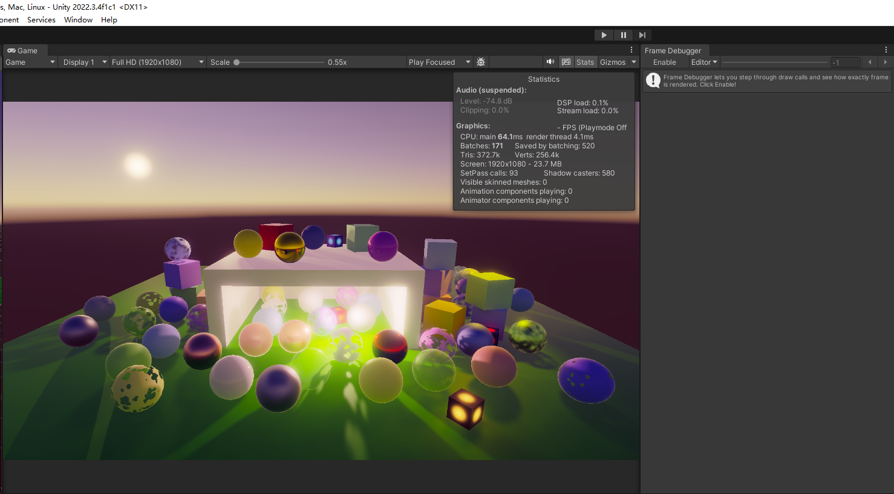

# Custom SRP 1.0.0

从 Unity 2019 升级到 2022 年。使项目现代化。引入一些修复。

<font color=#4db8ff>Link：</font>https://catlikecoding.com/unity/custom-srp/1-0-0/


<center>FXAA 是该系列教程所涵盖的最后一项功能。</center>

### [1、Unity Version Upgrade](https://catlikecoding.com/unity/custom-srp/1-0-0/#1)

在开始这个项目之前，我已经将整个教程系列升级到了 Unity 2022.3.5f1。我在教程系列中提到了升级过程中的改动。然后，我对项目进行了一些现代化处理。这些改动在 1.0.0 版本的更新日志中有所介绍，下面也会加以说明。

#### [1.1 Baked Inner Cone Angle and Falloff](https://catlikecoding.com/unity/custom-srp/1-0-0/#1.1)

正如第一次发布点光源和聚光灯教程时提到的那样，在<font color="red"> CustomRenderPipeline.lightsDelegate</font> 中无法指定聚光灯的内光角度和衰减<font color=#4db8ff> inner light angle and falloff</font>，但在未来的 Unity 版本中应该可以做到这一点。现在已经是未来了，因此添加了这一功能。

Path：<font color=#FFCE70>CustomRenderPipeline.Editor</font>

```C#
case LightType.Spot:
var spotLight = new SpotLight();
LightmapperUtils.Extract(light, ref spotLight);
spotLight.innerConeAngle = light.innerSpotAngle * Mathf.Deg2Rad;
spotLight.angularFalloff =
    AngularFalloffType.AnalyticAndInnerAngle;
lightData.Init(ref spotLight);
break;
```

#### 1.2 Camera List

Unity 开发人员意识到，每帧分配一个数组传递给<font color="red"> RenderPipeline.Render</font> 并不是一个好主意，因此他们添加了使用列表的功能。不过，使用数组的旧 <font color=#66ff66>Render </font>方法仍作为抽象方法存在，因此我们必须在 <font color=#4db8ff>CustomRenderPipeline.Render</font> 中保留一个虚拟实现。

```C#
	protected override void Render (ScriptableRenderContext context, Camera[] cameras) {}

	protected override void Render (
		ScriptableRenderContext context, List<Camera> cameras
	) {
		for (int i = 0; i < cameras.Count; i++) {
			renderer.Render(
				context, cameras[i], cameraBufferSettings,
				useDynamicBatching, useGPUInstancing, useLightsPerObject,
				shadowSettings, postFXSettings, colorLUTResolution
			);
		}
	}
```

#### 1.3 Explicit Batch Culling Projection Type

Unity 2022 要求我们在 "<font color=#66ff66>Shadow</font>"中创建 "阴影绘制设置"（<font color="red">ShadowDrawingSettings</font>）时，明确告诉我们需要哪种批量剔除投影类型。我们需要为所有三种灯光类型执行此操作

<font color=#66ff66>定向光</font>使用正投影模式

<font color=#66ff66>点光源和聚光灯</font>使用透视模式。

```C#
var shadowSettings =
    new ShadowDrawingSettings(
    cullingResults, light.visibleLightIndex,
    BatchCullingProjectionType.Orthographic
) {
    useRenderingLayerMaskTest = true
};
```

在 Unity 2023 中，该参数已被标记为过时，因此今后不再需要。不过，为了避免编译警告，我们还是将其包含在内。

#### 1.4 Scene Lighting Settings

制作该系列时还没有独立的灯光设置资产，但现在它们已经存在，并已包含在项目中。我还关闭了 "<font color="red">*Baked Light*</font> "场景的自动烘焙功能，这样就可以立即检查贴图。每个场景都连同其所有资产一起移到了自己的文件夹中，常用材质也放在了场景文件夹中。

#### 1.5 Avoiding Domain and Scene Reloading

在进入游戏模式时，我禁用了域和场景重载<font color=#66ff66>disabled domain and scene reloading</font>。这是在编辑器中启动播放模式的最快方法。这不需要修改任何代码，但支持该模式非常重要，始终开启该模式可确保其正常工作。

#### 1.6 Code Style Change

在最近的教程中，我改变了 C# 代码风格，使其更符合现代 C# 的编码习惯，这也在很大程度上符合 Unity 的现代风格。我还在适当的地方引入了<font color="red"> `**readonly**`</font>只读修饰符的用法，并在不降低清晰度的情况下引入了<font color=#66ff66> shorthand constructor notation</font>速记构造函数符号。本教程中展示的代码片段不包含这些更改。

### [2、Fixes](https://catlikecoding.com/unity/custom-srp/1-0-0/#2)

为了让教程能在 Unity 2022 中正确运行或完全正常运行，需要修复一些问题。其中有些问题是<font color=#66ff66> tile-based</font>的 GPU 特有的，当时这还不是大问题，而且我还没有硬件可以测试。

#### 2.1 Missing Shader Matrices

<font color=#4db8ff>Unity 2022's Core Library shader</font>包含文件假定存在更多矩阵。在<font color=#FFCE70> Common.hlsl </font>中，我们需要添加三个额外的宏定义，用于反转视图矩阵，以及用于 TAA 的前一帧的两个矩阵。

```glsl
#define UNITY_MATRIX_M unity_ObjectToWorld
#define UNITY_MATRIX_I_M unity_WorldToObject
#define UNITY_MATRIX_V unity_MatrixV
#define UNITY_MATRIX_I_V unity_MatrixInvV
#define UNITY_MATRIX_VP unity_MatrixVP
#define UNITY_PREV_MATRIX_M unity_prev_MatrixM
#define UNITY_PREV_MATRIX_I_M unity_prev_MatrixIM
#define UNITY_MATRIX_P glstate_matrix_projection
```

And we need to add the accompanying matrices in <font color="red">UnityInput.hlsl.</font>

```
float4x4 unity_MatrixVP;
float4x4 unity_MatrixV;
float4x4 unity_MatrixInvV;
float4x4 unity_prev_MatrixM;
float4x4 unity_prev_MatrixIM;
float4x4 glstate_matrix_projection;
						
```

#### 2.2 Tangent-Space Vector Normalization

Unity 曾经会在重新缩放后解压缩法线矢量时对其进行归一化处理，但现在不再这样做了。

为了保证着色器正常工作，我们必须自己在 <font color=#66ff66>Common.hlsl </font>中进行处理。这并不是最好的方法，但却能确保以最少的改动使一切工作正常。将来，我们可以为法向量改用更好的方法。



<center>到这一步，Bug基本消失了</center>

#### 2.3 Clear Color Before Skybox

事实证明，在某些情况下，渲染天空盒时如果不清除颜色，帧缓冲区中残留的 <font color="red">NaN  or Inf</font>会产生伪影。为了避免这种情况，除非在<font color=#FFCE70> CameraRenderer.Setup </font>中明确说明不清除颜色，否则我们将始终清除颜色。

```C#
buffer.ClearRenderTarget(
			flags <= CameraClearFlags.Depth,
			flags <= CameraClearFlags.Color,
			flags == CameraClearFlags.Color ?
				camera.backgroundColor.linear : Color.clear
		);
```

#### 2.4 Load Buffers for Reduced Viewports

由于<font color="red"> tile-based GPU </font> 是按<font color=#66ff66>tile</font>进行渲染的，因此当渲染到覆盖范围小于整个帧缓冲区的视口时，情况会变得很奇怪。

除非视口与<font color=#66ff66>tile</font>完全匹配，否则 <font color=#4db8ff>GPU 最终会在视口之外进行部分渲染</font>。

GPU 会屏蔽这种情况，但这需要帧缓冲区数据可用。因此，在使用缩小的视口进行渲染时，我们将始终在 <font color=#FFCE70>CameraRenderer 和 PostFXStack 的 DrawFinal </font>方法中使用加载操作。我们可以说得更具体一些，但这样会变得相当复杂和脆弱，所以我们还是把事情简单化吧。

```C#
	static Rect fullViewRect = new Rect(0f, 0f, 1f, 1f);
	
		…
		buffer.SetRenderTarget(
			BuiltinRenderTextureType.CameraTarget,
			finalBlendMode.destination == BlendMode.Zero && camera.rect == fullViewRect ?
				RenderBufferLoadAction.DontCare : RenderBufferLoadAction.Load,
			RenderBufferStoreAction.Store
		);
```

#### 2.5 Copy Depth Twice for Gizmos

当场景摄像机渲染到<font color=#4db8ff> intermediate buffers </font>时，我们必须将<font color=#66ff66>深度复制到摄像机目标</font>，以便正确渲染<font color="red">gizmos </font>。

为了在任何情况下都能做到这一点，<font color="red">CameraRenderer </font>必须执行两次复制操作，既要复制前<font color=#4db8ff> post-FX gizmos</font>，又要复制后<font color=#4db8ff>post-FX gizmos</font>。请注意，我无法找到特效前<font color="red">gizmos </font>示例，也不知道它们存在的理由，因此我将在未来把它们合并到一个单一的特效后步骤中。

```C#
partial void DrawGizmosAfterFX () {
		if (Handles.ShouldRenderGizmos()) {
			if (postFXStack.IsActive)
			{
				Draw(depthAttachmentId, BuiltinRenderTextureType.CameraTarget, true);
				ExecuteBuffer();
			}
			context.DrawGizmos(camera, GizmoSubset.PostImageEffects);
		}
	}
```

#### 2.6 Removal of Duplicate FXAA Iterator

最后一项修正是删除了 <font color=#66ff66>FXAAPass.hlsl</font> 中 <font color="red">GetEdgeBlendFactor </font>中重复的迭代变量声明。虽然这并不重要，但会产生着色器编译器警告。

```glsl
	int i;
	UNITY_UNROLL
	for (i = 0; i < EXTRA_EDGE_STEPS && !atEndP; i++) {
		…
	}
	if (!atEndP) {
		uvP += uvStep * LAST_EDGE_STEP_GUESS;
	}

	…

	UNITY_UNROLL
	for (i = 0; i < EXTRA_EDGE_STEPS && !atEndN; i++) {
		…
	}
	if (!atEndN) {
		uvN -= uvStep * LAST_EDGE_STEP_GUESS;
	}
```