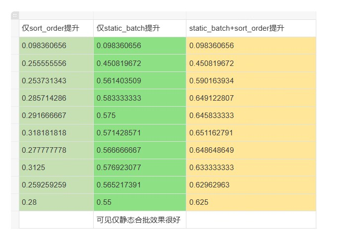
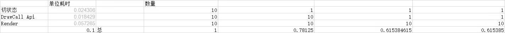

屏幕像素越多，一DrawCall 中读贴图导致的耗时将远比 drawcall api本身高

这时候就可以考虑prepass增加drawcall减少读贴图，反而减少耗时，10次优化单9次都是砍drawcall立竿见影

 vulkan 主流后，砍DrawCall 这一招就废

在低分辨率上采样，原神的 SSR ，透明物体渲染，景深 是这样的

是与其多一倍的drawcall减少一半的带宽，是否划算

就是drawcall api 的耗时多还是读贴图的延迟多

按津液来看，我目前项目都是drawcall api 比读贴图高

这边全都是1~2张贴图的shader，很cheap的

而且画面上像素少

读取贴图耗时主要看cache命中

如果像素占比小的那种容易cache miss

像素占比小，纹理坐标变化率大的，本身也是取mip呀。

7(T60_)UVK(R)@A32$K.png)

实际上特效叠加渲染耗时最多还是着色本身，例如读贴图，占比57%

而DrawCall本身Api只占18%，切状态（切材质 shader 更新参数 更新贴图）比DrawCall高，要24%

大头实际还是overdraw

特效如果会做贴图其实能省很多

怎么远处降分辨率呀，同一个RenderTarget，srp 起码还有render layer