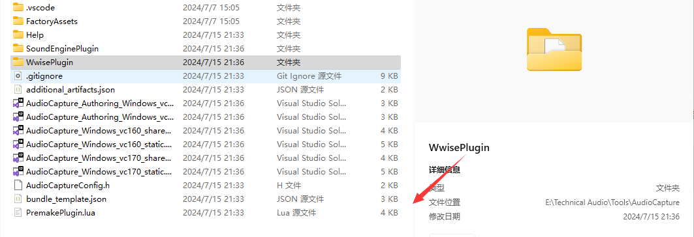

<font color=#4db8ff>Link：</font>https://www.audiokinetic.com/zh/library/edge/?source=SDK&id=effectplugin.html

#### 一、插件环境

开发工具：wp.py

```c++
python "%WWISEROOT%/Scripts/Build/Plugins/wp.py" --help
```


##### 1.1 创建实例工程

<font color=#4db8ff>Link：</font>https://www.audiokinetic.com/zh/library/edge/?source=SDK&id=effectplugin_tools_newplugin.html

依赖项：

```c++
pip install markdown
pip install jinja2
```

示例会话：

```c++
python "%WWISEROOT%/Scripts/Build/Plugins/wp.py" new
plug-in type {source, sink, object_processor, mixer, effect}: effect
Do you need to do out-of-place processing?(no)
project name: MyNewFX
display name: (MyNewFX) My New FX
author: Audio Kinetic
description: A brand new effect plug-in
About to create project with:
{'author': 'Audio Kinetic',
 'description': 'A brand new effect plug-in.',
 'display_name': 'My New FX',
 'name': 'MyNewFX',
 'out_of_place': False,
 'type': 'effect'}
Is this OK?(yes)
Generating project structure for MyNewFX
```

其中%WWISEROOT%是当前Wwise的安装位置

可以在对应的文件夹中使用当前命令行则会在当前文件夹中创建

这样会创建一个以插件的当前工作目录命名的目录。该目录包含所要创建的插件类型的框架。

```c++
MyNewFX/
├── FactoryAssets
│   └── Manifest.xml
├── Help
├── MyNewFXConfig.h
├── PremakePlugin.lua
├── SoundEnginePlugin
│   ├── MyNewFXFX.cpp
│   ├── MyNewFXFX.h
│   ├── MyNewFXFXFactory.h
│   ├── MyNewFXFXParams.cpp
│   ├── MyNewFXFXParams.h
│   └── MyNewFXFXShared.cpp
├── WwisePlugin
│   ├── MyNewFX.def
│   ├── MyNewFX.xml
│   ├── MyNewFXPlugin.cpp
│   ├── MyNewFXPlugin.h
│   └── Win32
│       ├── MyNewFXPluginGUI.cpp
│       └── MyNewFXPluginGUI.h
│   └── res
│       └── Md
│           └── en
│               └── Placeholder.md
├── additional_artifacts.json  
└── bundle_template.json
```

```c++
python "%WWISEROOT%/Scripts/Build/Plugins/wp.py" new [--sink | --mixer | --object_processor | --source | --effect] [--out-of-place] [-a AUTHOR] [-d DESCRIPTION] [-t DISPLAY_NAME] [-n NAME] [--no-prompt]
```

##### 1.2 Premake配置工程

<font color=#4db8ff>Link：</font>https://www.audiokinetic.com/zh/library/edge/?source=SDK&id=effectplugin_tools_premakeconfig.html

`premake` 命令会生成供 `build` 命令用来构建插件的解决方案,此配置文件存放在插件的根目录下，名为 **PremakePlugin.lua**


```c++
cd MyNewFX
python "%WWISEROOT%/Scripts/Build/Plugins/wp.py" premake Authoring
```




##### 1.3 构建工程

<font color=#4db8ff>Link：</font>https://www.audiokinetic.com/zh/library/edge/?source=SDK&id=effectplugin_tools_building.html

`build` 命令将使用之前生成的解决方案，来编译插件并将二进制文件复制到 Wwise 安装目录

visual 2019

```c++
python "%WWISEROOT%/Scripts/Build/Plugins/wp.py" build -c Release -x x64 -t vc160 Authoring
```

visual 2022

```c++
python "%WWISEROOT%/Scripts/Build/Plugins/wp.py" build -c Release -x x64 -t vc170 Authoring
```


错误：

```c++
"PluginMFCWindows": 不是 "AK::Wwise::Plugin" 的成员
```

 Visual Studio 2022 安装，然后在“单个组件”下选择“用于最新 v143 构建工具（x86 和 x64）的 C++ MFC”和“用于最新 v143 构建工具（x86 和 x64）的 C++ ATL”。


重启Wwise


#### 二、Factory Asset

<font color=#4db8ff>Link：</font>https://www.audiokinetic.com/zh/library/edge/?source=SDK&id=effectplugin_tools_factoryassets.html

##### 2.1 Asset


从项目中的复制到工程文件

```c++
ItemName\Effects
```

```c++
AudioKinetic\Wwise2024.1.0.8570\Authoring\Data\Factory Layouts\Effects
```

可以自己創建effect文件夹

##### 2.2 Resource Files

<font color=#4db8ff>Link：</font>https://www.audiokinetic.com/zh/library/edge/?source=SDK&id=effectplugin_tools_resource_file.html

自定义图形界面的资源打开插件界面


利用visual 打开Sln 随后创建一个资源文件


随后添加


保存之后利用命令行

第一个命令在项目中包含 `Resource.rc` 文件

```c++
python "%WWISEROOT%/Scripts/Build/Plugins/wp.py" premake Authoring
```

第二个命令基于资源文件创建一个 `resource.h` 文件

```c++
python "%WWISEROOT%/Scripts/Build/Plugins/wp.py" build -c Release -x x64 -t vc170 Authoring
```

需要关闭所有程序

##### 2.3 GUIwindow

在WwisePlugin\Win32的打开 <font color=#4db8ff>PluginNamePluginGUI.h</font>

然后覆盖脚本

```c++
#pragma once
 
#include "../MyPlugin.h"
 
#include "../resource.h"
 
class MyPluginGUI final
    : public AK::Wwise::Plugin::PluginMFCWindows<>
    , public AK::Wwise::Plugin::GUIWindows
{
public:
    MyPluginGUI();
 
    HINSTANCE GetResourceHandle() const override;
 
    bool GetDialog(
        AK::Wwise::Plugin::eDialog in_eDialog,
        UINT& out_uiDialogID,
        AK::Wwise::Plugin::PopulateTableItem*& out_pTable
    ) const override;
 
    bool WindowProc(
        AK::Wwise::Plugin::eDialog in_eDialog,
        HWND in_hWnd,
        uint32_t in_message,
        WPARAM in_wParam,
        LPARAM in_lParam,
        LRESULT& out_lResult
    ) override;
 
private:
    HWND m_hwndPropView = nullptr;
};
```

Cpp中添加下列脚本

```c++
HINSTANCE MyPluAudioPlugPluginGUIginGUI::GetResourceHandle() const
{
    AFX_MANAGE_STATE( AfxGetStaticModuleState() );
    return AfxGetStaticModuleState()->m_hCurrentResourceHandle;
}
 
bool AudioPlugPluginGUI::GetDialog( AK::Wwise::Plugin::eDialog in_eDialog, UINT & out_uiDialogID, AK::Wwise::Plugin::PopulateTableItem *& out_pTable ) const
{
    AKASSERT( in_eDialog == AK::Wwise::Plugin::SettingsDialog );
 
    out_uiDialogID = IDD_DIALOG1;
    out_pTable = nullptr;
 
    return true;
}
 
bool AudioPlugPluginGUI::WindowProc( AK::Wwise::Plugin::eDialog in_eDialog, HWND in_hWnd, uint32_t in_message, WPARAM in_wParam, LPARAM in_lParam, LRESULT & out_lResult )
{
    switch ( in_message )
    {
    case WM_INITDIALOG:
        m_hwndPropView = in_hWnd;
        break;
    case WM_DESTROY:
        m_hwndPropView = NULL;
        break;
    }
    out_lResult = 0;
    return false;
}
```


#### 三、构建插件属性文档 

<font color=#4db8ff>Link：</font>https://www.audiokinetic.com/zh/library/edge/?source=SDK&id=effectplugin_tools_property_help.html

属性帮助文档源文件必须存放在 

```c++
`<PluginProject>/WwisePlugin/res/Md/<language>/PropertyName.md
```

 wp.py 为插件构建 Wwise Property Help 文件：

```c++
python "%WWISEROOT%/Scripts/Build/Plugins/wp.py" build Documentation
```


测试

#### 四、代码接口

<font color=#4db8ff>Link：</font>https://www.audiokinetic.com/zh/library/edge/?source=SDK&id=wwiseplugin_backend.html

##### 4.1 sound Bank

```c++
#include <AK/Wwise/Plugin.h>
 
class BackendSourcePlugin
:   public AK::Wwise::Plugin::AudioPlugin
,   public AK::Wwise::Plugin::Source
{
public:
    // AK::Wwise::Plugin::AudioPlugin
    bool GetBankParameters(
        const GUID& in_guidPlatform,
        AK::Wwise::Plugin::DataWriter& in_dataWriter
    ) const override;
 
    // AK::Wwise::Plugin::Source
    bool GetSourceDuration(
        double& out_dblMinDuration,
        double& out_dblMaxDuration
    ) const override;
};
 
AK_ADD_PLUGIN_CLASS_TO_CONTAINER(
    MyPlugin,               // Add to container "MyPlugin"
    BackendSourcePlugin,    // Class to add to the container
    SoundEngineSourcePlugin // Sound engine plug-in to which this plug-in corresponds
);
```

将其当前设置存储到声音包中。 可以通过实现<font color=#4db8ff>AK::Wwise::Plugin::AudioPlugin::GetBankParameters() </font>方法来做到。获取每个属性的当前值，然后使用适当方法将值写入，<font color=#4db8ff>AK::Wwise::Plugin::DataWriter</font>对象作为接收的参数。这些操作按照参数结构中各成员的定义顺序执行

```c++
bool MySourcePlugin::GetBankParameters(
    const GUID& in_guidPlatform,
    AK::Wwise::Plugin::DataWriter& in_dataWriter) const
{
    bool result = true;
    result &= in_dataWriter.WriteReal32(m_propertySet->GetReal32(in_guidPlatform, "Frequency"));
    result &= in_dataWriter.WriteReal32(m_propertySet->GetReal32(in_guidPlatform, "Gain"));
    result &= in_dataWriter.WriteReal32(m_propertySet->GetReal32(in_guidPlatform, "Duration"));
    return result;
}
```

##### 4.2 Front end

<font color=#4db8ff>Link：</font>https://www.audiokinetic.com/zh/library/edge/?source=SDK&id=wwiseplugin_frontend.html

工具集的方法，以便实现图形用户界面。 您需要创建通过前端类（如 <font color=#4db8ff>AK::Wwise::Plugin::GUIWindows</font>）获取的类。

```c++
#include <AK/Wwise/Plugin.h>
 
class FrontendSourcePlugin
:   public AK::Wwise::Plugin::GUIWindows
{
public:
    FrontendSourcePlugin();
 
    // AK::Wwise::Plugin::GUIWindows
    HINSTANCE GetResourceHandle() const override;
 
    bool GetDialog(
        AK::Wwise::Plugin::eDialog in_eDialog,
        UINT& out_uiDialogID,
        AK::Wwise::Plugin::PopulateTableItem*& out_pTable
    ) const override;
 
    bool WindowProc(
        AK::Wwise::Plugin::eDialog in_eDialog,
        HWND in_hWnd,
        uint32_t in_message,
        WPARAM in_wParam,
        LPARAM in_lParam,
        LRESULT& out_lResult
    ) override;
 
    bool Help(HWND in_hWnd, eDialog in_eDialog) const override;
};
 
AK_ADD_PLUGIN_CLASS_TO_CONTAINER(
    MyPlugin,               // Add to container "MyPlugin"
    FrontendSourcePlugin,   // Class to add to the container
    SoundEngineSourcePlugin // Sound engine plug-in to which this plug-in corresponds
);
```

##### 4.3 control Link

```c++
constexpr auto propertyKey = u8"MyProperty";
 
AK_WWISE_PLUGIN_GUI_WINDOWS_BEGIN_POPULATE_TABLE(PropertyTable)
    AK_WWISE_PLUGIN_GUI_WINDOWS_POP_ITEM(IDC_MYPROPERTY_EDIT, propertyKey)
AK_WWISE_PLUGIN_GUI_WINDOWS_END_POPULATE_TABLE()
```

将控件 <font color=#4db8ff>IDC_MYPROPERTY_EDIT</font>（来自与 .rc 文件配套的 resource.h 文件）映射到了属性 MyProperty。该 ID 必须与插件 XML 定义中的属性对应。

#### 五、XML

<font color=#4db8ff>Link：</font>https://www.audiokinetic.com/zh/library/edge/?source=SDK&id=plugin_xml.html
