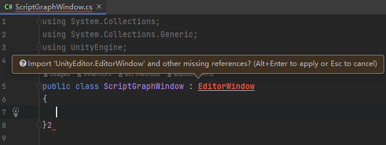
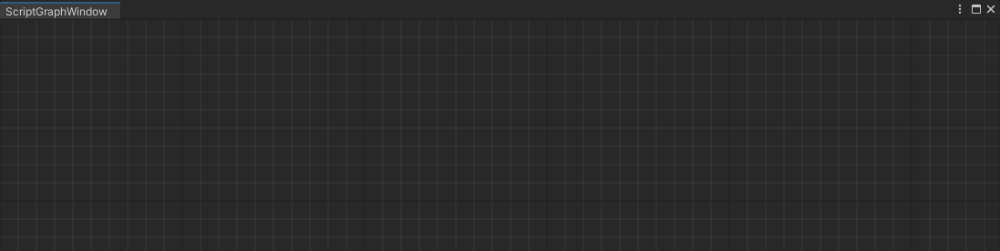

## Graph View

### 一、Window

#### 1.1  Editor Window

创建一个脚本命名为<font color=#66ff66>ScriptGraphWindow</font>，同时让他继承与<font color=#FFCE70>EditorWindow</font>

<font color=#4db8ff>Link：https://docs.unity3d.com/ScriptReference/EditorWindow.html</font>

```c++
using System.Collections;
using System.Collections.Generic;
using UnityEngine;

public class ScriptGraphWindow : EditorWindow
{
   
}
```

此时会有<font color="DarkOrchid ">Bug</font>提示，提示我们需要添加的命名空间，可以手动添加一下



添加命名空间<font color=#66ff66>using UnityEditor</font>，随后Bug就会消失

```c++
using System.Collections.Generic;
using UnityEditor;
using UnityEngine;
```

首先我们创建一个窗口，随后让利用<font color="red">Show</font>他显示出来

<font color=#4db8ff>link：</font>[EditorWindow](https://docs.unity3d.com/ScriptReference/EditorWindow.html).GetWindow

```c++
public class ScriptGraphWindow : EditorWindow
{
    [MenuItem("Tool/ScriptGraph")]
    public static void Open()
    {
        ScriptGraphWindow window = GetWindow<ScriptGraphWindow>();
        window.Show();
    }
}
```

#### 1.2 Graph View

首先需要绘制这个窗口，因此我们需要让他继承<font color=#FFCE70>GraphView</font>。

学过web的都知道，我们只是创建了整个界面，但是我们还需要给他填充东西，因此我们创建一个界面，并且让他大小保持与父窗口一样大，可以使用<font color=#66ff66>StretchToParentSize（）</font>做到，以及利用<font color=bc8df9>base()</font>接受<font color="red">GraphView</font>的基础参数内容

<font color=#4db8ff>link:</font> https://docs.unity3d.com/ScriptReference/Experimental.GraphView.GraphView.html

```c++
using UnityEngine.UIElements;
using UnityEditor.Experimental.GraphView;

public class ScriptGraphView : GraphView
{
    public ScriptGraphView() : base()
    {
        
    }
}
```

随后在<font color=#bc8df9>ScriptGraphWindow</font>中调用它，并且将它加入<font color=#bc8df9>ScriptGraphWindow</font>中，作为其中一个组件，可以利用<font color=#c78fd0>rootVisualElement</font>做到

```c++
 private void OnEnable()
    {
        var scriptGraph = new ScriptGraphView();
        this.rootVisualElement.Add(scriptGraph);
    }
```

随后在主窗口打开


### 二、Background

现在编辑器空空的，所以给他添加背景色熟悉<font color=#FFCE70>html</font>的会知道，<font color=#FFCE70>html</font>通过<font color=#FFCE70>Css</font>调节背景色、局内排版，同样的Unity也有一个<font color=#66ff66>uss</font>

让我们编写它

#### 2.1 uss

```css
GridBackground {
    --grid-background-color: #282828;
    --line-color: rgba(193,196,192,0.1);
    --tick-line-color: rgba(193,196,192,0.1);
    --spacing: 20
}
```

<font color=#FFCE70>css</font>通过name链接，而<font color=#66ff66>uss</font>通过其他方法<font color=#FFCE70>styleSheets</font>去打到类似于<font color=#FFCE70>Css</font>的效果。首先我们需要加载<font color=#bc8df9>css</font>，可以使用<font color=#4db8ff>Resources.Load（）</font>函数。函数读取路径为：<font color=#FD00FF> (Assets/Resources/...)</font>

<font color=#4db8ff>link：</font>https://docs.unity3d.com/ScriptReference/UIElements.StyleSheet.html

<details>
    <summary><center><font color="red">what is Style</font></center>
    </summary>
    <pre>
    Style sheets are applied to visual elements in order to control the layout and visual appearance of the user interface.
    The StyleSheet class holds the imported data of USS files in your project. Once loaded, a style sheet can be attached to a VisualElement object to affect the element itself and its descendants.
<font color=#66ff66>Style</font>应用于视觉元素，以控制用户界面的布局和视觉外观。
<font color=#66ff66>Style Class</font>保存项目中 USS 文件的导入数据。加载<font color=#66ff66>Style</font>后，可将其附加到 VisualElement 对象，以影响元素本身及其后代。
</pre>
</details>

但是<font color=#FD00FF>uss</font>的路径这样设置并不好，为了文件的整洁，我们在Asset文件下创建几个文件夹使得读取路径为：<font color=#FFCE70>Asset/Resources/GraphView/Uss/GraphViewBackGround</font>

```c++
public class ScriptGraphView : GraphView
{
    public ScriptGraphView() : base()
    {
        // 省略

        //读取 uss文件并将其添加到样式中
        this.styleSheets.Add(Resources.Load<StyleSheet>("GraphView/Uss/GraphViewBackGround"));
        // 在图层最底层添加背景
        this.Insert(0, new GridBackground());
    }
}
```


<center>Script Graph Window</center>

但是我们看不到我们所设置的背景，这是因为我们并没有给予<font color=#66ff66>ScriptGraphView</font>大小，因此可以添加代码，调节到与父窗口大小一致

```C#
public ScriptGraphView() : base()
{
    //大小与父窗口大小一致
    this.StretchToParentSize();
    ...
```

现在我们可以看到背景出现了



<center>Script Graph Window and Background</center>

#### 2.2 Manipulator 

但是我们的鼠标在里面没有任何作用，因此我们仍然需要添加代码，给予<font color=#66ff66>Node</font>一些<font color="red">Manipulator </font><font color=#4db8ff>操控器</font>，可以利用代码添加与 <font color=#66ff66>VisualElement</font>关联的操纵器。而操控器的类型我们可以通过<font color="red">Unity文档</font>获取

<font color=#4db8ff>link：</font>https://docs.unity3d.com/ScriptReference/30_search.html?q=Manipulator+

```c++
VisualElementExtensions.AddManipulator
```

首先是放大/缩小、选择范围、拖动移动选定的元素、 拖动移动绘图区域。

```c++
//大小与父窗口大小一致
this.StretchToParentSize();
//放大/缩小。
SetupZoom(ContentZoomer.DefaultMinScale, ContentZoomer.DefaultMaxScale);
// 拖动移动绘图区域。
this.AddManipulator(new ContentDragger());
// 拖动移动选定的元素
this.AddManipulator(new SelectionDragger());
//  拖动选择范围
this.AddManipulator(new RectangleSelector());
```


<center>Window get some Manipulator </center>

###  三、 Create Node