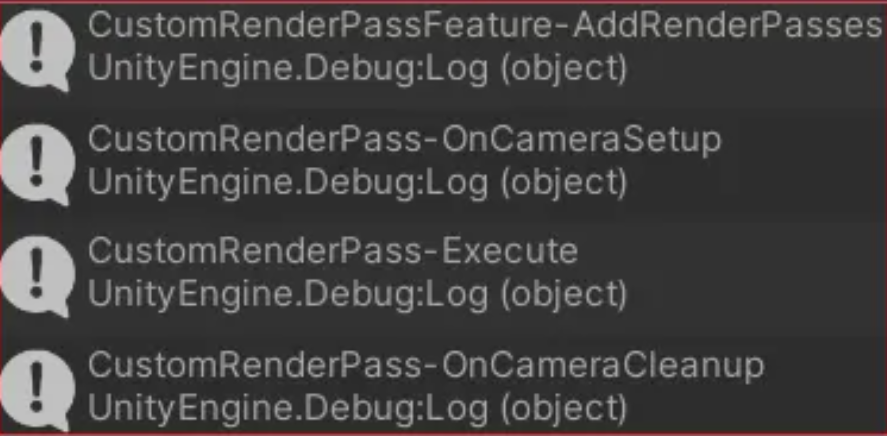

#### 一、Renderer Feature 

```cs
using UnityEngine;
using UnityEngine.Rendering;
using UnityEngine.Rendering.Universal;

public class CustomRenderPassFeature : ScriptableRendererFeature { // 自定义的Feature
    class CustomRenderPass : ScriptableRenderPass { // 自定义的Pass
        public override void OnCameraSetup(CommandBuffer cmd, ref RenderingData renderingData) { // 渲染Pass前回调, 此处可以申请内存
            Debug.Log("CustomRenderPass-OnCameraSetup");
        }

        public override void Execute(ScriptableRenderContext context, ref RenderingData renderingData) { // 渲染执行逻辑
            Debug.Log("CustomRenderPass-Execute");
        }

        public override void OnCameraCleanup(CommandBuffer cmd) { // 渲染Pass后回调, 此处可以清除内存操作
            Debug.Log("CustomRenderPass-OnCameraCleanup");
        }
    }

    CustomRenderPass m_ScriptablePass; // 自定义的Pass

    public override void Create() { // 创建自定义的Pass
        Debug.Log("CustomRenderPassFeature-Create");
        m_ScriptablePass = new CustomRenderPass();
        m_ScriptablePass.renderPassEvent = RenderPassEvent.AfterRenderingOpaques; // 渲染事件注入的时机
    }

    public override void AddRenderPasses(ScriptableRenderer renderer, ref RenderingData renderingData) { // 将Pass添加到渲染队列中
        Debug.Log("CustomRenderPassFeature-AddRenderPasses");
        renderer.EnqueuePass(m_ScriptablePass);
    }
}
```




Render Feature 的执行时序是：Create→AddRenderPasses→OnCameraSetup→Execute→OnCameraCleanup；

Create 方法只在程序启动时执行几次，后面就不执行了；

AddRenderPasses、OnCameraSetup、Execute、OnCameraCleanup 方法每帧都会执行一次。

#### 1.1 URP 14 after

```c++
using UnityEngine.Rendering.Universal;
using UnityEngine;

public class FullscreenFeature : ScriptableRendererFeature {
    public Settings settings = new Settings(); // 设置
    FullscreenPass blitPass; // 后处理的Pass

    public override void Create() { // 创建后处理Pass(自动回调)
        blitPass = new FullscreenPass(name);
    }

    public override void AddRenderPasses(ScriptableRenderer renderer, ref RenderingData renderingData) { // 添加渲染Pass(自动回调)
        if (settings.blitMaterial == null) {
            return;
        }
        blitPass.renderPassEvent = settings.renderPassEvent;
        blitPass.settings = settings;
        renderer.EnqueuePass(blitPass);
    }

    [System.Serializable]
    public class Settings { // 配置项
        public RenderPassEvent renderPassEvent = RenderPassEvent.AfterRenderingOpaques;
        public Material blitMaterial = null;
    }
}
```


```c++
using UnityEngine.Rendering.Universal;
using UnityEngine.Rendering;
using UnityEngine;

internal class FullscreenPass : ScriptableRenderPass {
    public FullscreenFeature.Settings settings; // 配置项
    private string profilerTag; // 分析器标签, 在Frame Debugger中可以看到该标签
    private RenderTargetIdentifier source; // 源缓存标识
    private RenderTargetIdentifier destination; // 目标缓存标识
    private int destinationId; // 目标缓存id
    private FilterMode filterMode; // 纹理采样滤波模式, 取值有: Point、Bilinear、Trilinear

    public FullscreenPass(string tag) {
        profilerTag = tag;
        destinationId = Shader.PropertyToID("_TempRT");
    }

    public override void OnCameraSetup(CommandBuffer cmd, ref RenderingData renderingData) { // 渲染前回调
        RenderTextureDescriptor blitTargetDescriptor = renderingData.cameraData.cameraTargetDescriptor;
        blitTargetDescriptor.depthBufferBits = 0;
        ScriptableRenderer renderer = renderingData.cameraData.renderer;
        source = renderer.cameraColorTarget;
        cmd.GetTemporaryRT(destinationId, blitTargetDescriptor, filterMode);
        destination = new RenderTargetIdentifier(destinationId);
    }

    public override void Execute(ScriptableRenderContext context, ref RenderingData renderingData) { // 执行渲染
        CommandBuffer cmd = CommandBufferPool.Get(profilerTag);
        Blit(cmd, source, destination, settings.blitMaterial);
        Blit(cmd, destination, source);
        context.ExecuteCommandBuffer(cmd);
        CommandBufferPool.Release(cmd);
    }

    public override void FrameCleanup(CommandBuffer cmd) { // 渲染后回调
        if (destinationId != -1) {
            cmd.ReleaseTemporaryRT(destinationId);
        }
    }
}
```

#### 1.2 动态获取 Feature

在 MonoBehaviour 中获取 Renderer Feature，可以通过以下代码片段获取

```c++
private FullscreenFeature GetFeature(string name) { // 获取feature
    UniversalRendererData rendererData = Resources.Load<UniversalRendererData>("Full Universal Renderer Data");
    if (rendererData != null && !string.IsNullOrEmpty(name)) {
        List<FullscreenFeature> features = rendererData.rendererFeatures.OfType<FullscreenFeature>().ToList();
        foreach (FullscreenFeature feature in features) {
            if (name.Equals(feature.name)) {
                return feature;
            }
        }
    }
    return null;
}
```

通过以下工具类获取 Renderer Feature。URPFeatureUtils.cs

```c++
using UnityEngine.Rendering.Universal;
using UnityEngine.Rendering;
using System.Reflection;

public class URPFeatureUtils {
    private static URPFeatureUtils instance; // 单例
    private UniversalRendererData rendererData; // 渲染数据, 存储了feature列表

    private URPFeatureUtils() {
        rendererData = GetRendererData();
    }

    public static T GetFeature<T>(string name) where T : ScriptableRendererFeature { // 获取feature
        if (instance == null) {
            instance = new URPFeatureUtils();
        }
        if (instance.rendererData != null) {
            return GetFeature<T>(instance.rendererData, name);
        }
        return null;
    }

    private static T GetFeature<T>(UniversalRendererData rendererData, string name) where T : ScriptableRendererFeature { // 获取feature
        if (rendererData != null && !string.IsNullOrEmpty(name)) {
            foreach (ScriptableRendererFeature feature in rendererData.rendererFeatures) {
                if (feature is T && name.Equals(feature.name)) {
                    return (feature as T);
                }
            }
        }
        return null;
    }

    private UniversalRendererData GetRendererData() { // 通过反射获取渲染数据, 也可以通过Resources.Load加载, 但是需要将UniversalRendererData文件放在Resources目录下
        UniversalRenderPipelineAsset urpAsset = GraphicsSettings.renderPipelineAsset as UniversalRenderPipelineAsset;
        FieldInfo propertyInfo = urpAsset.GetType().GetField("m_RendererDataList", BindingFlags.Instance | BindingFlags.NonPublic);
        ScriptableRendererData[] rendererDatas = (ScriptableRendererData[])propertyInfo.GetValue(urpAsset);
        if (rendererDatas != null && rendererDatas.Length > 0 && (rendererDatas[0] is UniversalRendererData)) {
            return rendererDatas[0] as UniversalRendererData;
        }
        return null;
    }
}
```

说明：之所以要使用反射，因为 UniversalRenderPipelineAsset 中的 m_RendererDataList 属性不是 public 的，并且没有给外界提供获取 m_RendererDataList 的接口。


链接：https://www.jianshu.com/p/5b03e596ddee
