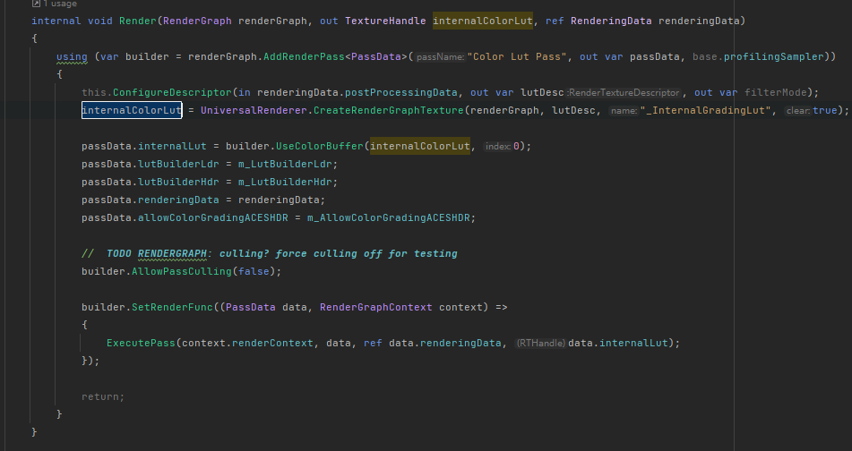

```C#
templaId = RTHandles.Alloc(templa, name: "_BloomMipUp");
desterId = RTHandles.Alloc(dester, name: "_BloomMipDown");

RenderingUtils.ReAllocateIfNeeded(ref templaId, desc, FilterMode.Bilinear, TextureWrapMode.Clamp, name: "BloomPrefilter");
RenderingUtils.ReAllocateIfNeeded(ref desterId, desc, FilterMode.Bilinear, TextureWrapMode.Clamp, name: "BloomDest");

      
        templaId.Release();
        desterId.Release();

//RenderTargetIdentifier 
//RenderTargetHandle.Identifier   source 
RTHandles.Alloc(source)
```

