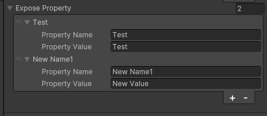

<font color=#4db8ff>Link：https://www.youtube.com/watch?v=7KHGH0fPL84</font>

在项目中 以这个为架构，接入Odin

 

### 一、Start

#### 1.1 Dialogue

首先创建三个脚本<font color=#FFCE70>DialogueGraph、DialogueGraphView、DialogueNode</font>，分别继承<font color=#bc8df9>EditorWindow、GraphView、Node</font>

<font color=#FFCE70>DialogueNode</font>需要存储数据，因此需要公布一些数据

<font color=#4db8ff>每个节点传递 的唯一ID</font>

<font color=#4db8ff>对话内容</font>

<font color=#4db8ff>入口Bool值</font>

```c#
using System;
using UnityEditor.Experimental.GraphView;

public class DialogueNode : Node
{
    public string GUID;
    public String DialogueText;
    public bool Entrybool = false;
}
```

<font color=#FFCE70>DialogueGraphView</font>，需要一个构造函数去添加鼠标相关控制器

内容拖动器、选择拖动器、矩阵选择器

```C#
using UnityEditor.Experimental.GraphView;
using UnityEngine.UIElements;

public class DialogueGraphView : GraphView
{
    public DialogueGraphView()
    {
         //  放大/缩小。
        SetupZoom(ContentZoomer.DefaultMinScale, ContentZoomer.DefaultMaxScale);
        
        this.AddManipulator(new ContentDragger());
        this.AddManipulator(new SelectionDragger());
        this.AddManipulator(new RectangleSelector());
    }
}
```

<font color=#FFCE70>DialogueGraph</font>利用一个静态方法打开<font color=#bc8df9>GraphView</font>，并且添加一个菜单栏属性。<font color=#4db8ff>以便在编辑器中静态调用它</font>

```C#
using UnityEditor;
using UnityEngine;

public class DialogueGraph : EditorWindow
{
   [MenuItem("Tool/18-Dialogue")]
   public static void OpenDialogueGraphWindow()
   {
      var Window = GetWindow<DialogueGraph>();
      Window.titleContent = new GUIContent("Dialogue Graph");
   }
} 
```

可以看到编辑器，但是看不到编辑器窗口


#### 1.2 OnDisable

添加启用和禁用方法（<font color=#66ff66>OnEnable 和 OnDisable</font>），并且添加一个私有变量<font color=#FFCE70>GraphView</font>，如同启用方法一样，在里面获得一个新实例。

```C#
using UnityEditor;
using UnityEngine;

public class DialogueGraph : EditorWindow
{
   private DialogueGraphView _graphView;
   [MenuItem("Tool/18-Dialogue")]
   public static void OpenDialogueGraphWindow()
   {
      var Window = GetWindow<DialogueGraph>();
      Window.titleContent = new GUIContent("Dialogue Graph");
   }

   private void OnEnable()
   {
      _graphView = new DialogueGraphView()
      {
         name = "Dialogue Graph"
      };
   }
   private void OnDisable()
   {}
}
```

将整个<font color=#bc8df9>Graph View</font>填满<font color=#bc8df9>Editor Window</font>，随后利用<font color=#4db8ff>Root</font>加入<font color=#bc8df9>Editor Window</font>

```C#
private void OnEnable()
{
_graphView = new DialogueGraphView()
{
 name = "Dialogue Graph"
};

_graphView.StretchToParentSize();
rootVisualElement.Add(_graphView);
}
```

在禁用窗口的时候将其删除，但是此时的数据并没有保存 

```C#
private void OnDisable()
{
  rootVisualElement.Remove(_graphView);
}
```


#### 1.3 Node

添加一个节点，首先创建一个生成条目的方法节点，创建一个<font color=#bc8df9>DialogueNode</font>节点实例，随后传递一系列参数。利用<font color=#FFCE70>C#</font> Gooood类，生成一个新的<font color=#4db8ff>GUID</font>

```c#
public class DialogueGraphView : GraphView
{
    public DialogueGraphView()
    {
        this.AddManipulator(new ContentDragger());
        this.AddManipulator(new SelectionDragger());
        this.AddManipulator(new RectangleSelector());

        GenerateEntryPointNode();
    }

    private void GenerateEntryPointNode()
    {
        var node = new DialogueNode()
        {
                title = "start",
                GUID = Guid.NewGuid().ToString(),
                DialogueText = "ENTRYPOINT",
                // EntryPoint = true
        };
    }
}
```

设置节点出现的位置，并且将其加入<font color=#4db8ff>Graph View</font>

```c#
public DialogueGraphView()
    {
        this.AddManipulator(new ContentDragger());
        this.AddManipulator(new SelectionDragger());
        this.AddManipulator(new RectangleSelector());

        //添加到Graph View 基类
        AddElement(GenerateEntryPointNode());
    }

    private DialogueNode GenerateEntryPointNode()
    {
        var node = new DialogueNode()
        {
                title = "start",
                GUID = Guid.NewGuid().ToString(),
                DialogueText = "ENTRYPOINT",
                // EntryPoint = true
        };
        node.SetPosition(new Rect(100,200,100,150));
        return node;
    }
```

#### 1.4 port

增加一个生成<font color=#FFCE70>Port</font>的方法，参数为<font color=#4db8ff>Node，Direction，Capacity</font>。将这些信息填入<font color=#4db8ff>Node</font>中

```c#
private Port GenerateEntryPort(DialogueNode node, Direction portDirection, Port.Capacity capacity = Port.Capacity.Single)
{
    //不是在端口之间传递数据，并非是VFX shader，这里仅仅是检查是否有链接
    return node.InstantiatePort(Orientation.Horizontal, portDirection, capacity, typeof(float));
}

```

随后在生成<font color=#4db8ff>Node</font>的方法中调用它

```c#
var generatedPort = GeneratePort(node, Direction.Output);
generatedPort.portName = "Neat";
node.outputContainer.Add(generatedPort);
node.SetPosition(new Rect(100,200,100,150));
```


但是此时节点的状态并不正确，添加一段更新节点的代码

```c#
node.outputContainer.Add(generatedPort);
//Refresh node Status
node.RefreshExpandedState();
node.RefreshPorts();

node.SetPosition(new Rect(100,200,100,150));
```


#### 1.5 ToolBar

整理函数，随后增加一个创建工具栏的节点，并且利用<font color=#66ff66>button</font>去触发节点的生成

```c#
//DialogueGraph
private void OnEnable()
{
    //Tool Graph Virw
    GenerateToolbar();
    ConstructGraphView();
}
private void GenerateToolbar()
{
    var toolbar = new Toolbar();
    var nodeCreateButton = new Button(() =>{
        _graphView.CreateDialogueNode();
    });
}
private void ConstructGraphView()
{
    _graphView = new DialogueGraphView()
    {name = "Dialogue Graph"};
    //Graph View填满窗口 
    _graphView.StretchToParentSize();
    rootVisualElement.Add(_graphView);
}
```


我们增加一个创建<font color=#bc8df9>CreateDialogueNode</font>的方法，创建一些信息给节点，并且在最后刷新节点信息

```c#
//没有加入Graph view
    public DialogueNode CreateDialogueNode(String nodeName)
    {
        var dialogueNode = new DialogueNode()
        {
            title = nodeName,  
            DialogueText = nodeName,
            GUID = Guid.NewGuid().ToString()
        };
        //Port the input and output
        var inputPort =  GeneratePort(dialogueNode, Direction.Input,Port.Capacity.Multi);
        inputPort.portName = "Input";
        dialogueNode.outputContainer.Add(inputPort);
        
        
        var outputPort = GeneratePort(dialogueNode, Direction.Output,Port.Capacity.Multi);
        outputPort.portName = "Output";
        dialogueNode.outputContainer.Add(outputPort);
       
        dialogueNode.RefreshExpandedState();
        dialogueNode.RefreshPorts();
        dialogueNode.SetPosition(new Rect(Vector2.zero, defaultNodeSize));

        return dialogueNode;
    }
```

但是该<font color=#4db8ff>Node</font>并不会出现在<font color=#4db8ff>Graph View</font>上，因为，我们并将它没有加入<font color=#bc8df9>Graph View</font>，我们可以利用<font color=#66ff66>AddElement</font>去添加，设计一个新的函数创建<font color=#4db8ff>Node</font>的同时将其添加到<font color=#FFCE70>Graph View</font>

```c#
//Dialogue Graph View
//添加节点到Graph view ，同时创建node
public void CreateNode(String nodeName)
{
    AddElement(CreateDialogueNode(nodeName));
}
```

并且该函数由<font color=#bc8df9>Dialogue Graph</font>中的函数<font color=#66ff66>GenerateToolbar</font>调用

```c#
private void GenerateToolbar()
{
    var toolbar = new Toolbar();
    var nodeCreateButton = new Button(() =>
    {
        _graphView.CreateNode("Dialogue Node");
    });
    nodeCreateButton.text = "Create Node";

    toolbar.Add(nodeCreateButton);
    rootVisualElement.Add(toolbar);
}
```

#### 1.6 Node Link

但是现在的节点之间并没有办法链接，因为他们之间的数据传递、判断没有一个规范，因此我们可以利用函数

<font color=#66ff66>GetCompatiblePorts</font>，对其覆盖，应用我们自己的连接规则

不能自己连接自己

```c#
//节点连接兼容问题，获取与给定端口兼容的所有端口
public override List<Port> GetCompatiblePorts(Port startPort, NodeAdapter nodeAdapter)
{
    //兼容端口
    var compatiblePorts = new List<Port>();

    ports.ForEach((port =>
    {
        if (startPort !=port && startPort.node != port.node)
        {
            compatiblePorts.Add(port);
        }
    }));
    return compatiblePorts;
}
```

#### 1.7 Output Branch

利用<font color=#66ff66>Button</font>来添加分支的数量，利用<font color="red">Lambda</font>表达式去调用一个新的函数方法

```c#
//Port the input and output
    var inputPort =  GeneratePort(dialogueNode, Direction.Input,Port.Capacity.Multi);
    inputPort.portName = "Input";
    dialogueNode.outputContainer.Add(inputPort);

    var button = new Button(() => {  AddchoicePort(dialogueNode); });


    dialogueNode.RefreshExpandedState();
    dialogueNode.RefreshPorts();
```

如同之前一样，生成一个<font color=#66ff66>Port</font>，我们想要更改每个<font color=#66ff66>Port </font>的名称，可以利用<font color=#4db8ff>Query</font>去搜索查找，该<font color=#bc8df9>Node</font>的<font color=#FFCE70>Container</font>中的<font color=#66ff66>Port</font>，随后将<font color=#66ff66>Port</font>的名字指定为输出<font color=#66ff66>Port</font>的技术


```c#
 private void AddchoicePort(DialogueNode dialogueNode)
    {
        
        var GeneratedPort = GeneratePort(dialogueNode, Direction.Output);
        //搜索端口名称指定为选择端口计数
        var outputPortCount = dialogueNode.outputContainer.Query("connector").ToList().Count;
        GeneratedPort.portName = $"choice {outputPortCount}";

        dialogueNode.outputContainer.Add(GeneratedPort);
        dialogueNode.RefreshPorts();
        dialogueNode.RefreshExpandedState();
    }
```

<font color=#66ff66>Query  </font><font color=#4db8ff>Link：</font>https://docs.unity3d.com/Manual/UIE-UQuery.html

随后将其添加到<font color=#4db8ff>Node</font>的<font color=#bc8df9>titleContainer</font>中

```c#
//输出port的数量
    var button = new Button(() => {  AddchoicePort(dialogueNode); });
    button.text = "New Choice";
    dialogueNode.titleContainer.Add(button); 
```


#### 1.8 USS

添加背景格式

```c#
//  读取 uss 文件并将其添加到样式中
this.styleSheets.Add(Resources.Load<StyleSheet>("20-GraphView/Uss/GraphViewBackGround"));
//  在图层最底层添加背景
this.Insert(0, new GridBackground());
```

### 二、Save&Load

#### 2.1 Call Back

在菜单栏目添加与文件<font color=#66ff66>Save 和 Load</font>相关的UI，添加一段文本作为文件名来执行<font color=#bc8df9>Graph View </font>，添加一个新的文本作为默认的<font color=#4db8ff>描述 & Name</font>

```c#
private string _fileName = "New Narrative"; 

private void GenerateToolbar()
{
    var toolbar = new Toolbar();

    var fileNameTextField = new TextField("File Name");
    //设置为新的描述
    fileNameTextField.SetValueWithoutNotify(_fileName);
 ...
}
```

随后将文本标记为<font color="red">Dirty</font>（脏标记），以此去修改该文件，当文本发生改变的时候，会调用内部函数重新绘制，否则文本字段不会使用新的值。随后添加一个回调函数，以此去改变<font color=#4db8ff>File Name</font>

其中<font color=#bc8df9>Variable</font>来自于<font color=#66ff66>Editor</font>中获取，可以将其添加到回调函数中

```c#
private string _fileName = "New Narrative"; 

private void GenerateToolbar()
{
var toolbar = new Toolbar();

var fileNameTextField = new TextField("File Name");
//设置为新的描述
fileNameTextField.SetValueWithoutNotify(_fileName);
//设置为Dirty 脏标记
fileNameTextField.MarkDirtyRepaint(); 
fileNameTextField.RegisterValueChangedCallback(evt =>_fileName = evt.newValue);
toolbar.Add(fileNameTextField);

toolbar.Add(new Button( ()=>SaveData()){text = "Save Data"});
toolbar.Add(new Button( ()=>LoadData()){text = "Load Data"}); 

...
}
```


#### 2.2 NodeData

创建新的文件夹<font color=#4db8ff>Runtime</font>用于存放<font color=#66ff66>序列化的C# Class</font>，作为没有数据的对话框，会传递一些属性，并且保存单个节点的数据

保存节点的<font color=#bc8df9>GUID、Text、Position</font>，最后将这个类序列化

```c#
using System;
using System.Numerics;
[Serializable]
public class DialogueNodeData
{
    public String GUID;
    public string DialogueText;
    public Vector2 Position;
}
```

#### 2.3 LinkData

保存链接之间的数据，需要保存<font color=#4db8ff>Base Node、Target Node 、Port</font>，并且序列化

```c#
using System;
[Serializable]
public class NodeLinkData
{
    public string BaseNodeGuid;
    public string PortName;
    public string TargetNodeGuid;
}
```

#### 2.4 Container

创建一个容器脚本，继承<font color=#bc8df9>ScriptableObject</font>，方便实例出<font color=#4db8ff>Asset文件</font>，里面会存储所有的节点<font color=#4db8ff>Node</font>以及对象的<font color=#66ff66>Link</font>

需要创建两个容器去进行存储，并且这个类需要序列化

```c#
using System;
using System.Collections.Generic;
using UnityEngine;

[Serializable]
public class DialogueContainer : ScriptableObject
{
   public List<NodeLinkData> Nodelinks = new List<NodeLinkData>();
   public List<DialogueNodeData> DialogueNodeData = new List<DialogueNodeData>();
}

```

#### 2.5 Utility

<font color=#4db8ff>特殊文件夹 Link：</font>https://docs.unity3d.com/cn/current/Manual/SpecialFolders.html

 我们可以利用静态的方法，返回<font color=#66ff66>Graph State Utility</font>的实例，并且我们需要先获取保存的<font color=#66ff66>Graph view</font>

```c#
using System.Collections;
using System.Collections.Generic;
using UnityEngine;

public class GraphSaveUtility : MonoBehaviour
{
   private DialogueGraphView _targetGraphView;
   
   public static GraphSaveUtility GetInstance(DialogueGraphView targetGraphView)
   {
      return new GraphSaveUtility
      {
         _targetGraphView = targetGraphView
      };
   }
    public void SaveGraph(string fileName)
   {}
   public void LoadGraph(string fileName)
   {}
}
```

将<font color=#66ff66>Save & Load</font>方法链接到<font color=#4db8ff>Button</font>上，并且判断文件名是否为空

```c#
private void RequestDataOperation(bool save)
{
    //检查文件名是否为空
    if (string.IsNullOrEmpty(_fileName))
    {
        EditorUtility.DisplayDialog("Invalid file Name!", " Please Enter a valid file name","OK");
        return;
    }
}
```

传递<font color=#bc8df9>Graph View</font>到<font color=#bc8df9>GraphSaveUtility</font>进行序列化存储数据，随后判断我们是否存储数据

```c#
private void RequestDataOperation(bool save)
{
    //检查文件名是否为空
    if (string.IsNullOrEmpty(_fileName))
    {
        EditorUtility.DisplayDialog("Invalid file Name!", " Please Enter a valid file name","OK");
        return;
    }
    
    //GraphSaveUtility
    var SaveUtility = GraphSaveUtility.GetInstance(_graphView);
    if (save)
    {
        SaveUtility.SaveGraph(_fileName);
    }
    else
    {
        SaveUtility.LoadGraph(_fileName);
    }
}
```

#### 2.6 Save

<font color=#4db8ff>Edge</font>的信息可以存储为<font color=#bc8df9>float List</font>

<font color=#4db8ff>Node</font>信息可以投射为<font color=#bc8df9>Dialogue Node</font>

```c#
using UnityEditor.Experimental.GraphView;
public class GraphSaveUtility : MonoBehaviour
{
//Graph view 中的所有View 和 Node
//TODO:Edge to List 
// private List<Edge> Edges => _targetGraphView.edges.ToList();
private List<Edge> Edges => _targetGraphView.edges.ToList().Cast<Edge>().ToList();
private List<DialogueNode> Nodes => _targetGraphView.nodes.ToList().Cast<DialogueNode>().ToList();
...
}
```

<font color=#4db8ff>UQueryState .ToList</font>：将所有满足选择规则的元素添加到列表中。

<font color=#4db8ff>Link：</font>https://docs.unity3d.com/ScriptReference/UIElements.UQueryState_1.ToList.html

<font color=#4db8ff>Enumerable.Cast<TResult>(IEnumerable) Method：</font>[将IEnumerable](https://learn.microsoft.com/en-us/dotnet/api/system.collections.ienumerable?view=net-7.0)的元素转换为指定类型。

<font color=#4db8ff>Link：</font>https://learn.microsoft.com/en-us/dotnet/api/system.linq.enumerable.cast?view=net-7.0


随后将内容都序列化为数据，存储到新的<font color=#4db8ff>Dialogue Container</font>中

获取连接的部分，以便了解每个阶段应该有一个输出<font color=#bc8df9>Port</font>，只保存输出<font color=#bc8df9>Output Choice Ports</font>，这意味着只要将<font color=#bc8df9>Output Choice Ports</font> 连接到<font color=#bc8df9>Input Choice Ports</font>我们可以将其视为有效连接的<font color=#bc8df9>Port</font>

```c#
public void SaveGraph(string fileName)
{
  if (!Edges.Any()) return;  //no edges( no connections ) then return

  //创建一个新的对话容器
  var dialogueContainer = ScriptableObject.CreateInstance<DialogueContainer>();
  //过滤一个序列
  var connectedPorts = Edges.Where(x => x.input.node != null).ToArray();
}
```

<font color=#4db8ff>Enumerable.Where Method：</font>to filter a sequence

<font color=#4db8ff>Link：</font>https://learn.microsoft.com/en-us/dotnet/api/system.linq.enumerable.where?view=net-7.0

随后利用一个循环，将连接的<font color=#bc8df9>Input Choice Ports</font>、<font color=#bc8df9>Output Choice Ports</font> 将他们转化为<font color=#66ff66>Dialogue node</font>，随后将相关数据保存到<font color=#bc8df9>ScriptableObject 容器里</font>

这里先将<font color=#FFCE70>Port Link</font>信息保存，需要保存两个<font color=#4db8ff>Node</font>，以及输出<font color=#66ff66>Port Name</font>

```c#
//过滤一个序列
  var connectedPorts = Edges.Where(x => x.input.node != null).ToArray();

  //Edge Link Data
  for (int i = 0; i < connectedPorts.Length; i++)
  {
     var outputNode = connectedPorts[i].output.node as DialogueNode;
     var inputNode = connectedPorts[i].input.node as DialogueNode;

     //保存标识符
     dialogueContainer.Nodelinks.Add(new NodeLinkData
     {
        BaseNodeGuid = outputNode.GUID,
        PortName = connectedPorts[i].output.portName,
        TargetNodeGuid = inputNode.GUID
     });
  }
```

<font color=#FFCE70>Node</font>同理

```c#
//Node Data Nodes Data
  foreach (var dialogueNode in Nodes.Where(node=>!node.Entrybool))
  {
     //传递到容器中
     dialogueContainer.DialogueNodeData.Add(new DialogueNodeData
     {
        Guid = dialogueNode.GUID,
        DialogueText = dialogueNode.DialogueText,
        Position = dialogueNode.GetPosition().position
     });
  }
```

随后将<font color=#bc8df9>ScriptableObject</font>保存到资源里，利用<font color=#4db8ff>AssetDatabase</font>

```c#
if (!AssetDatabase.IsValidFolder("Assets/Resources"))
     AssetDatabase.CreateFolder("Assets", "Resources");

AssetDatabase.CreateAsset(dialogueContainer,$"Assets/Resources/{fileName}.asset");
AssetDatabase.SaveAssets();      
```

<font color=#bc8df9>AssetDatabase：</font>https://docs.unity3d.com/ScriptReference/30_search.html?q=AssetDatabase


#### 2.7 Load

先缓存容器，随后从资源文件夹中加载文件，反序列化文件，将数据读取出来

```c#
public void LoadGraph(string fileName)
{
  _ContainerCache = Resources.Load<DialogueContainer>(fileName);

  if (_ContainerCache == null)
  {
     EditorUtility.DisplayDialog("File Not Found", "Target Dialogue Graph File does not exists!", "OK");
     return;
  }
}
```

每次<font color=#66ff66>Load</font>数据，我们需要先清空<font color=#bc8df9>Graph View</font>，随后创建<font color=#FFCE70>Node</font>，再将它们<font color=#4db8ff>LInk</font>

所以我们创建三个函数方法

```c#
//清除、生成、连接 
ClearGraph();
CreateNodes();
ConnectNodes();
```

当我们打开<font color=#bc8df9>Graph View</font>时，我们会立刻获得<font color=#66ff66>Entry Point</font>，所以<font color=#66ff66>Container</font>中的第一个<font color=#4db8ff>Node</font>的连接始终是<font color=#66ff66>Entry Point</font>。因此可以沿着<font color=#66ff66>Entry Point</font>分配

因为我们链接的第一件事就是<font color=#66ff66>Entry Point</font>，我们可以得到<font color=#4db8ff>Node</font>建立的每个输出链接。

我们只保存<font color=#bc8df9>Output Port</font>，这样我们就可以验证，<font color=#bc8df9>Port</font>是否连接到另一个<font color=#FFCE70>Node Output</font>

检查是否存在有效连接，然后迭代所有的连接，然后在<font color=#bc8df9>Graph View</font>将他们都删除

```c#
private void ClearGraph()
{
  //set Entry points guid back from the save . Discard existing guid.
  Nodes.Find(x => x.Entrybool).GUID = _ContainerCache.Nodelinks[0].BaseNodeGuid;

  foreach (var node in Nodes)
  {
     if(node.Entrybool) return;

     //Remove edges that connected to this node;
     Edges.Where(x => x.input.node == node).ToList().
        ForEach(edge => _targetGraphView.RemoveElement(edge));

     //then remove the node
     _targetGraphView.RemoveElement(node);
  }
}
```

利用循环再次迭代，遍历缓存在<font color=#bc8df9>SOBJ</font>的数据，利用<font color=#bc8df9>Graph View</font>中创建节点的方法，传递文本内容作为参数去创建<font color=#FFCE70>Node</font>

随后赋予<font color=#66ff66>Guid</font>，再添加到<font color=#bc8df9>Graph View</font>

```c#
private void CreateNodes()
{
  foreach (var nodeData in _ContainerCache.DialogueNodeData)
  {
     var tempNode = _targetGraphView.CreateDialogueNode(nodeData.DialogueText);
     tempNode.GUID = nodeData.Guid;
     _targetGraphView.AddElement(tempNode);
  }
}
```

我们遍历已经缓冲的<font color=#bc8df9>Container</font>，利用<font color=#66ff66>Guid</font>进行判断是否匹配，将他们加入容器中。<font color=#4db8ff>Port</font>的选择会有问题

```c#
//port
var nodePorts = _ContainerCache.Nodelinks.Where(x => x.BaseNodeGuid == nodeData.Guid).ToList();
nodePorts.ForEach(x =>_targetGraphView.AddchoicePort(tempNode,x.PortName));
```

我们可以给<font color=#66ff66>Graph View</font>中的<font color=#4db8ff>AddchoicePort</font>方法中添加判断，增加一个<font color="red">String</font>参数，我们利用这个参数来显示给定的<font color=#FFCE70>Port</font>的名称。但是是要判断它是否为空

```c#
public void AddchoicePort(DialogueNode dialogueNode, string overriddenPortName = "")
{
    //port 
    var GeneratedPort = GeneratePort(dialogueNode, Direction.Output);

    //搜索端口名称指定为选择端口计数
    var outputPortCount = dialogueNode.outputContainer.Query("connector").ToList().Count;
    // GeneratedPort.portName = $"choice {outputPortCount}";

    var choicePortName = string.IsNullOrEmpty(overriddenPortName)
        ?$"choice {outputPortCount + 1}"
        :overriddenPortName;

    GeneratedPort.portName = choicePortName;
    
    dialogueNode.outputContainer.Add(GeneratedPort);
    dialogueNode.RefreshPorts();
    dialogueNode.RefreshExpandedState();
}
```

添加文本框，利用<font color=#66ff66>CallBack</font>函数，当<font color=#bc8df9>Graph View</font>和<font color=#4db8ff>Node</font>修改文本内容的时候，<font color=#66ff66>CallBack</font>函数将会更改<font color=#FFCE70>Port</font>函数

```c#
//添加文本
var textField = new TextField
{
    name = string.Empty,
    value = choicePortName
};
textField.RegisterValueChangedCallback(evt => GeneratedPort.portName = evt.newValue);
//空隙
GeneratedPort.contentContainer.Add(new Label(" "));
GeneratedPort.contentContainer.Add(textField);

GeneratedPort.portName = choicePortName;
```

添加一个<font color=#4db8ff>Button</font>从<font color=#FFCE70>Editor</font>中删除<font color=#4db8ff>Port</font>的按钮

```c#
var deleteButton = new Button(() => RemovePort(dialogueNode, GeneratedPort));
GeneratedPort.Add(deleteButton);
```

#### 2.8 Delete 

我们<font color="red">删除元素</font>需要先查询是否存在，因此我们可以先缓存<font color=#4db8ff>UI Element</font>，使用到一个名为<font color=#66ff66>Q</font>的通用函数。参数是<font color=#FFCE70>Type 和 Name </font>

```c#
//port 
var generatedPort = GeneratePort(dialogueNode, Direction.Output);
//
var oldLabel = generatedPort.contentContainer.Q<Label>("type");
```

查找名为<font color=#4db8ff> Type </font>的标签，并且收集这<font color=#66ff66>UI Element</font>，随后从<font color=#4db8ff>content Container</font>中删除该元素

<font color=#4db8ff>Link：</font>https://docs.unity3d.com/ScriptReference/30_search.html?q=UIElements.UQueryExtensions.Q

我们已经有了删除<font color=#FFCE70>Port</font>的函数，但是没有具体的操作

我们首先可以判断<font color=#4db8ff>Edge</font>的<font color=#66ff66>Port Name</font>是否与传入的<font color=#66ff66>Port Name</font>相等，并且<font color=#66ff66>Node</font>也相等

```c#
private void RemovePort(DialogueNode dialogueNode,Port generatedPort)
{
    var targetEdge = edges.ToList().Where(x => x.output.portName == generatedPort.portName
                                               && x.output.node == generatedPort.node);
}
```

我们在删除<font color=#FFCE70>Port</font>之前，先断开<font color=#4db8ff>Edge</font>，随后删除<font color=#4db8ff>Port</font>，随后是<font color=#66ff66>Node</font>

```c#
if(!targetEdge.Any()) return;
//序列中的第一个元素
var edge = targetEdge.First();
edge.input.Disconnect(edge);
RemoveElement(targetEdge.First());

dialogueNode.outputContainer.Remove(generatedPort);
dialogueNode.RefreshPorts();
dialogueNode.RefreshExpandedState();
```

<font color=#4db8ff>Link：</font>https://learn.microsoft.com/en-us/dotnet/api/system.linq.enumerable.first?view=net-7.0

#### 2.9 Load Data


加载的时候会发现，<font color=#66ff66>Node</font>的位置，会跑到其他地方，并且没有连接，我们可以修复<font color=#4db8ff>CreateNodes</font>方法去进行修改，让他加载循环的时候，当发现<font color=#4db8ff>Node</font>存在时是跳过本次循环，而不是停止循环

```c#
private void ClearGraph()
{
  //set Entry points guid back from the save . Discard existing guid.
  Nodes.Find(x => x.EntryPoint).GUID = _ContainerCache.Nodelinks[0].BaseNodeGuid;

  foreach (var node in Nodes)
  {
     //if(node.EntryPoint) return;
     if(node.EntryPoint) continue;

     //Remove edges that connected to this node;
     Edges.Where(x => x.input.node == node).ToList().
        ForEach(edge => _targetGraphView.RemoveElement(edge));

     //then remove the node
     _targetGraphView.RemoveElement(node);
  }
}
```

#### 2.10 ConnectNodes

我们可以从缓存保存的文件中获取所有的节点连接，诉后匹配<font color=#4db8ff>Node</font>和输出<font color=#4db8ff>Node</font>之间的连接，随后遍历所有连接，收集有关的连接在一起的<font color=#4db8ff>Node</font>数据，识别他们，随后让链接的<font color=#4db8ff>Node</font>获取到当前的<font color=#4db8ff>Node</font>之后

```c#
  private void ConnectNodes()
   {
      for (int i = 0; i < Nodes.Count; i++)
      {
         var connections = _ContainerCache.Nodelinks.Where(x => x.BaseNodeGuid == Nodes[i].GUID)
            .ToList();

         for (int j = 0; j < connections.Count; j++)
         {
            var targetNodeGuid = connections[j].TargetNodeGuid;
            var targetNode = Nodes.First(x => x.GUID == targetNodeGuid);
         }
      }
   }
```

随后利用函数，将<font color=#FFCE70>Port</font>链接在一起，通过<font color=#66ff66>OutputContainer</font>去访问两个<font color=#FFCE70>Port</font>来连接在一起，以匹配虚幻的<font color=#66ff66>curtain Node</font>的<font color=#bc8df9>Output Port</font>

随后将<font color=#bc8df9>Output Port</font>从外部节点传递出去，作为第二个参数，连接成功之后，读取文件中他们的位置以及大小

```c#
//连接端口
LinkNodes(Nodes[i].outputContainer[j].Q<Port>(), (Port)targetNode.inputContainer[0]);
//Position
targetNode.SetPosition(new Rect(
_ContainerCache.DialogueNodeData.First(x =>x.Guid == targetNodeGuid).Position,
_targetGraphView.defaultNodeSize));
```

编辑链接方法<font color=#bc8df9>LinkNodes</font>

先将输出，输入节点缓存，随后创建<font color=#66ff66>Edge</font>，创建链接，添加到<font color=#bc8df9>Graph View</font>

```c#
//节点连接
private void LinkNodes(Port output, Port input)
{
  var tempEdge = new Edge
  {
     output = output,
     input = input
  };

  tempEdge?.input.Connect(tempEdge);
  tempEdge?.output.Connect(tempEdge);

  _targetGraphView.Add(tempEdge);
}
```

<font color=#bc8df9>Edge：</font>https://docs.unity3d.com/ScriptReference/Experimental.GraphView.Edge.html


#### 2.11 Dialogue Text

对于对话内容，我们做法与<font color=#FFCE70>Port</font>类似，随后传递对话值

```c#
//文本框
var textField = new TextField(string.Empty);
textField.RegisterValueChangedCallback(evt =>
{
    dialogueNode.DialogueText = evt.newValue;
    dialogueNode.title = evt.newValue;
});

textField.SetValueWithoutNotify(dialogueNode.title);
dialogueNode.mainContainer.Add(textField);
```

<font color=#4db8ff>set：</font>https://docs.unity3d.com/ScriptReference/30_search.html?q=UIElements.TextField.SetValueWithoutNotify

#### 2.12 USS

```c#
Dialogue #title {
    background-color: rgb(0, 128, 0);
}
```

C#

```c#
var dialogueNode = new DialogueNode()
{
    title = nodeName,  
    DialogueText = nodeName,
    GUID = Guid.NewGuid().ToString()
};
dialogueNode.styleSheets.Add(Resources.Load<StyleSheet>("Node"));
```


#### 2.13 Entry UnDelete

```c#
private DialogueNode GenerateEntryPointNode()
{
    var node = new DialogueNode()
    {
            title = "start",
            GUID = Guid.NewGuid().ToString(),
            DialogueText = "ENTRYPOINT",
            EntryPoint = true
    };

    var generatedPort = GeneratePort(node, Direction.Output);
    generatedPort.portName = "Next";
    node.outputContainer.Add(generatedPort);

    //入口不可删除,不可移动
    node.capabilities &= ~Capabilities.Movable;
    node.capabilities &= ~Capabilities.Deletable;

    //Refresh node Status
    node.RefreshExpandedState();
    node.RefreshPorts();

    node.SetPosition(new Rect(100,200,100,150));

    return node;
}
```

<font color=#4db8ff>Capabilities ：</font>https://docs.unity3d.com/ScriptReference/30_search.html?q=Experimental.GraphView.Capabilities

#### 2.14 mini-Map

mini-map 嵌套自<font color=#bc8df9>Graph view API</font>

```c#
//DialogueGraph
private void OnEnable()
{
    //Tool Graph Virw
    ConstructGraphView();
    GenerateToolbar();

    GenerateMiniMap();
}

private void GenerateMiniMap()
{
    var minimap = new MiniMap
    {
        anchored = true,
    };

    minimap.SetPosition(new Rect(10,30,200,140));
    _graphView.Add(minimap);
}
```

<font color=#4db8ff>Link：</font>https://docs.unity3d.com/ScriptReference/30_search.html?q=Experimental.GraphView.MiniMap.ctor


### 三、Search Window

#### 3.1 Entry

创建搜索树脚本，并且继承两个类<font color=#bc8df9>ScriptableObject,ISearchWindowProvider</font>，实现他们的基础函数方法

```c#
using System.Collections.Generic;
using UnityEditor.Experimental.GraphView;
using UnityEngine;

public class NodeSearchWindow : ScriptableObject,ISearchWindowProvider
{
    public List<SearchTreeEntry> CreateSearchTree(SearchWindowContext context)
    {
        throw new System.NotImplementedException();
    }

    public bool OnSelectEntry(SearchTreeEntry SearchTreeEntry, SearchWindowContext context)
    {
        throw new System.NotImplementedException();
    }
}
```

在<font color=#bc8df9>Graph View</font>中加入对于搜索树条目的调用，在<font color=#4db8ff>DialogueGraphView</font>的构造函数中使用他

```c#
//添加到Graph View 基类
AddElement(GenerateEntryPointNode());
AddSearchWindow();
```

利用回调函数初始化搜索树条目，参数为当前鼠标的位置，以及搜索树条目

```c#
public void AddSearchWindow()
{
    _searchWindow = ScriptableObject.CreateInstance<NodeSearchWindow>();
    nodeCreationRequest = context => SearchWindow.Open(
        new SearchWindowContext(context.screenMousePosition),_searchWindow);
}
```

<font color=#4db8ff>GraphView.nodeCreationRequest _：</font>https://docs.unity3d.com/ScriptReference/Experimental.GraphView.GraphView-nodeCreationRequest.html

#### 3.2 User Data

在搜索树树函数中对每个类的对象进行分类，以此来获取不同的分组以及层级，利用反射结构去筛选<font color=#66ff66>Node</font>

```c#
public List<SearchTreeEntry> CreateSearchTree(SearchWindowContext context)
{
    var tree = new List<SearchTreeEntry>
    {
        new SearchTreeGroupEntry(new GUIContent("Create Elements"), 0),
        new SearchTreeGroupEntry(new GUIContent("Dialogue"), 1),

        //反射结构
        new SearchTreeEntry(new GUIContent("Dialogue Node"))
        {
            //注入数据
            // userData = typeof(DialogueNode),level = 2
            userData = new DialogueNode(),level = 2
        },


        new SearchTreeGroupEntry(new GUIContent("Branch Node"), 1)
    };
    return tree;
}
```

#### 3.3 OnSelectEntry

需要筛选<font color=#4db8ff>Node</font>，使用<font color=#66ff66>UserData</font>来检查，其中<font color=#66ff66>UserData</font>在创建<font color=#bc8df9>SearchTreeGroupEntry</font>时注入，随后在<font color=#66ff66>OnSelectEntry</font>函数中被检查，以此去获得不同的节点

```c#
public bool OnSelectEntry(SearchTreeEntry SearchTreeEntry, SearchWindowContext context)
{
    switch (SearchTreeEntry.userData)
    {
        case DialogueNode dialogueNode:
            Debug.Log("DIALOGUE NODE CREATED!!!");
            return true;
        default:
            return false;
    }
}
```

由于<font color=#4db8ff>Node</font>需要添加到<font color=#bc8df9>Graph View</font>中，因此需要过去相关的数据，可以添加一个<font color=#66ff66>Init</font>函数

```c#
private DialogueGraphView _graphView;
private EditorWindow _windowindow;

public void Initialize(DialogueGraphView graphView, EditorWindow window)
{
    this._graphView = graphView;
    this._windowindow = window;
}
```

由<font color=#bc8df9>Graph View</font>的构造函数中传递<font color=#bc8df9>editorWindow</font>，随后在<font color=#66ff66>AddSearchWindow</font>中调用

```c#
public DialogueGraphView(EditorWindow editorWindow)
{
	...
    AddSearchWindow(editorWindow);
}
...
public void AddSearchWindow(EditorWindow editorWindow)
{
    _searchWindow = ScriptableObject.CreateInstance<NodeSearchWindow>();
    _searchWindow.Initialize(this, editorWindow);

    nodeCreationRequest = context => SearchWindow.Open(
        new SearchWindowContext(context.screenMousePosition),_searchWindow);
}
```

#### 3.4 Position

随后在<font color=#66ff66>OnSelectEntry</font>中将<font color=#4db8ff>Node</font>添加到<font color=#bc8df9>Graph view</font>。但是这个时候<font color=#4db8ff>Node</font>不是生成在鼠标所在的位置，因此需要修改函数<font color=#66ff66>CreateNode</font>

首先需要获得<font color=#bc8df9>Graph view</font>空间下的鼠标位置，因此需要一些空间换算

```c#
public bool OnSelectEntry(SearchTreeEntry SearchTreeEntry, SearchWindowContext context)
{
    //位置换算
    var worldMousePosition = _windowindow.rootVisualElement.ChangeCoordinatesTo(
        _windowindow.rootVisualElement.parent,
        context.screenMousePosition - _windowindow.position.position);
    var localMousePosition = _graphView.contentViewContainer.WorldToLocal(worldMousePosition);

    switch (SearchTreeEntry.userData)
    {
        case DialogueNode dialogueNode:
            _graphView.CreateNode("Dialogue Node",localMousePosition);
            return true;
        default:
            return false;
    }
}
```

所有的<font color=#4db8ff>Node</font>的创建方法都得随着更改，<font color=#FFCE70>CreateNode</font>

```c#
//添加节点到Graph view ，同时创建node
public void CreateNode(String nodeName, Vector2 positon)
{
    AddElement(CreateDialogueNode(nodeName, positon));
}
```

<font color=#66ff66>CreateDialogueNode</font>函数也一样

```c#
public DialogueNode CreateDialogueNode(String nodeName, Vector2 positon)
{
    var dialogueNode = new DialogueNode()
    {
        title = nodeName,  
        DialogueText = nodeName,
        GUID = Guid.NewGuid().ToString()
    };

    ...

    //刷新节点
    dialogueNode.RefreshExpandedState();
    dialogueNode.RefreshPorts();
    dialogueNode.SetPosition(new Rect(positon, defaultNodeSize));
    return dialogueNode;
}
```

随后调整固定<font color=#4db8ff>Node</font>的生成方式

```c#
private void CreateNodes() 
{
    foreach (var nodeData in _ContainerCache.DialogueNodeData)
    {
        //创建节点
        var tempNode = _targetGraphView.CreateDialogueNode(nodeData.DialogueText,UnityEngine.Vector2.zero);
      ...
    }
}
```

####  3.5 Texture2D

可以为搜索树条目中增加<font color=#FFCE70>Icon</font>


可以自己创建一张测试

```c#
//NodeSearchWindow
private DialogueGraphView _graphView;
private EditorWindow _windowindow;
private Texture2D _indentatioinIcon;

public void Initialize(DialogueGraphView graphView, EditorWindow window)
{
    this._graphView = graphView;
    this._windowindow = window;

    //Indentation hack for search window as a transparent icon
    _indentatioinIcon = new Texture2D(1, 1);
    _indentatioinIcon.SetPixel(0,0,new Color(0,0,0,0),0);
    //copy to GPU use
    _indentatioinIcon.Apply();
}
```

<font color=#4db8ff>Tex Link：</font>https://docs.unity3d.com/ScriptReference/Texture2D.Apply.html

在筛选<font color=#66ff66>Type（）</font>时候应用<font color=#FFCE70>Icon</font>

```c#
//反射结构
new SearchTreeEntry(new GUIContent("Dialogue Node",_indentatioinIcon))
{
    //注入数据
    // userData = typeof(DialogueNode),level = 2
    userData = new DialogueNode(),level = 2
},
```


#### 3.6 Tool Bar

在<font color=#FFCE70>DialogueGraph</font>的<font color=#66ff66>OnEnable</font>方法中添加一个函数去创建<font color=#bc8df9>Blackboard</font>

```c#
private void OnEnable()
{
    //Tool Graph Virw
    ConstructGraphView();
    GenerateToolbar();
    GenerateMiniMap();
    GenerateBlackBoard();
}
```

<font color=#4db8ff>Blackboard Link：</font>https://docs.unity3d.com/ScriptReference/30_search.html?q=Experimental.GraphView.Blackboard.ctor


```c#
private void GenerateBlackBoard()
{
    var blackBorad = new Blackboard(_graphView);
    blackBorad.Add(new BlackboardSection
                   {
                       title = "Exposed Properties"
                   });
    blackBorad.addItemRequested = _blackBorad =>
    {
        // _graphView.AddPropertyToBlackBoard();
    };
    blackBorad.SetPosition(new Rect(10,30,200,300));
    _graphView.Add(blackBorad);
}
```

#### 3.7 Add Property

需要将参数从<font color=#bc8df9>Graph View</font>中添加到<font color=#66ff66>Blackboard</font>中，需要创建一个新的<font color=#4db8ff>class</font>进行管理

```C#
[System.Serializable]
public class ExposeProperty
{
    public string PropertyName = "New Name";
    public string PropertyValue = "New Value";
}
```

随后在<font color=#bc8df9>Dialogue Graph</font>中管理，并且使用<font color=#4db8ff>List</font>管理

```c#
public readonly Vector2 defaultNodeSize = new Vector2(250,200);
public List<ExposeProperty> ExposeProperties = new List<ExposeProperty>();
private NodeSearchWindow _searchWindow;
...

public void AddPropertyToBlackBoard(ExposeProperty exposeProperty)
{
    var property = new ExposeProperty();
    property.PropertyName = exposeProperty.PropertyName;
    property.PropertyValue = exposeProperty.PropertyValue;
    ExposeProperties.Add(property);

    var container = new VisualElement();
    var blackboard = new BlackboardField
    {
        text = property.PropertyName,
        typeText = "string property"
    };

    container.Add(blackboard);
    Blackboard.Add(container);
}
```

函数在<font color=#bc8df9>Dialogue Graph</font>的<font color=#66ff66>GenerateBlackBoard</font>中调用

```c#
private void GenerateBlackBoard()
{
    var blackBorad = new Blackboard(_graphView);
    blackBorad.Add(new BlackboardSection
                   {
                       title = "Exposed Properties"
                   });
    blackBorad.addItemRequested = _blackBorad =>
    {
        _graphView.AddPropertyToBlackBoard(new ExposeProperty());
    };
    blackBorad.SetPosition(new Rect(10,30,200,300));


    _graphView.Add(blackBorad);
    _graphView.Blackboard = blackBorad;
}
```

但是<font color=#FFCE70>Property</font>也有一些属性，可以给它添加容器，去承载属性

```c#
container.Add(blackboard);

//Value
var propertyValueTextField = new TextField("Value")
{
    value = property.PropertyValue,
};
propertyValueTextField.RegisterValueChangedCallback(evt =>
                                                    {
                                                        var changingPropertyIndex = ExposeProperties.FindIndex
                                                            (x => x.PropertyName == property.PropertyName);
                                                        ExposeProperties[changingPropertyIndex].PropertyValue = evt.newValue;
                                                    });

//parent children
var blackBoarValueRow = new BlackboardRow(blackboard, propertyValueTextField);
container.Add(blackBoarValueRow);
```

<font color=#4db8ff>BlackboardRow Link：</font>https://docs.unity3d.com/ScriptReference/30_search.html?q=Experimental.GraphView.BlackboardRow.ctor


#### 3.8 Property Name 

需要将一系列参数缓存，

```C#
public void AddPropertyToBlackBoard(ExposeProperty exposeProperty)
{
    var localPropertyName = exposeProperty.PropertyName;
    var localPropertyValue = exposeProperty.PropertyValue;

    while (ExposeProperties.Any(x => x.PropertyName == localPropertyName))
        localPropertyName = $"{localPropertyName}1";  //USERname(1) ||USERname(1)(1) ETC...
    
    
    var property = new ExposeProperty();
    property.PropertyName = localPropertyName;
    property.PropertyValue = localPropertyValue;
    ExposeProperties.Add(property);

    var container = new VisualElement();
    var blackboard = new BlackboardField
    {
        text = localPropertyName,
        typeText = "string property"
    };
    
    container.Add(blackboard);

    //Value
    var propertyValueTextField = new TextField("Value")
    {
        value = localPropertyValue,
    };
    propertyValueTextField.RegisterValueChangedCallback(evt =>
    {
        var changingPropertyIndex = ExposeProperties.FindIndex
            (x => x.PropertyName == property.PropertyName);
        ExposeProperties[changingPropertyIndex].PropertyValue = evt.newValue;
    });
    
    //parent children
    var blackBoarValueRow = new BlackboardRow(blackboard, propertyValueTextField);
    container.Add(blackBoarValueRow);
    
    Blackboard.Add(container);
}
```

随后利用回调函数进行保存

```C#
private void GenerateBlackBoard()
{
    var blackBorad = new Blackboard(_graphView);
    blackBorad.Add(new BlackboardSection
    {
        title = "Exposed Properties"
    });
    //Add 
    blackBorad.addItemRequested = _blackBorad =>
    {
        _graphView.AddPropertyToBlackBoard(new ExposeProperty());
    };
    blackBorad.SetPosition(new Rect(10,30,200,300));
    //Blackboard, VisualElement, string
    blackBorad.editTextRequested = (blackboard, element, arg3) =>
    {
        var oldPropertyName = ((BlackboardField)element).text;
    };
```

其中<font color=#66ff66>element</font>的text在<font color=#4db8ff>AddPropertyToBlackBoard</font>中等于缓存的<font color=#FFCE70>Property Name</font>

```c#
var blackboard = new BlackboardField
{
    text = localPropertyName,
    typeText = "string property"
};
```

<font color=#4db8ff>editTextRequested：</font>https://docs.unity3d.com/ScriptReference/Experimental.GraphView.Blackboard-editTextRequested.html

在回调函数中检查<font color="red"> new Name</font>是否有和其他参数重复

```c#
blackBorad.SetPosition(new Rect(10,30,200,300));
//Blackboard, VisualElement, string
blackBorad.editTextRequested = (blackboard, element, NewValue) =>
{
    var oldPropertyName = ((BlackboardField)element).text;
    if (_graphView.ExposeProperties.Any(x => x.PropertyName == NewValue))
    {
        EditorUtility.DisplayDialog("Error", "This property name already exists, please chose another one!",
                                    "ok");
        return;
    }
};
```

但是这样会改变不了变量名，可以通过<font color=#66ff66>Index</font>去修改变量

```c#
blackBorad.editTextRequested = (blackboard, element, NewValue) =>
{
    var oldPropertyName = ((BlackboardField)element).text;
    if (_graphView.ExposeProperties.Any(x => x.PropertyName == NewValue))
    {
        EditorUtility.DisplayDialog("Error", "This property name already exists, please chose another one!",
                                    "ok");
        return;
    }

    var propertyIndex = _graphView.ExposeProperties.FindIndex(x => x.PropertyName == oldPropertyName);
    _graphView.ExposeProperties[propertyIndex].PropertyName = NewValue;
    ((BlackboardField)element).text = NewValue;
};
```

#### 3.9 Save Property

首先需要判断是否保存了<font color=#4db8ff>Node</font>

```c#
public void SaveGraph(string fileName)
{
    //创建一个新的对话容器
    var dialogueContainer = ScriptableObject.CreateInstance<DialogueContainer>();

    if (!SaveNodes(dialogueContainer)) return;
    SaveExposeProperties(dialogueContainer);

    if (!AssetDatabase.IsValidFolder("Assets/Resources"))
        AssetDatabase.CreateFolder("Assets", "Resources");

    AssetDatabase.CreateAsset(dialogueContainer,$"Assets/Resources/{fileName}.asset");
    AssetDatabase.SaveAssets();      

}

private bool SaveNodes(DialogueContainer dialogueContainer)
{
    if (!Edges.Any()) return false;  //no edges( no connections ) then return

    //过滤一个序列
    var connectedPorts = Edges.Where(x => x.input.node != null).ToArray();

    //Edge Link Data
    for (int i = 0; i < connectedPorts.Length; i++)
    {
        var outputNode = connectedPorts[i].output.node as DialogueNode;
        var inputNode = connectedPorts[i].input.node as DialogueNode;

        //保存标识符
        dialogueContainer.Nodelinks.Add(new NodeLinkData
                                        {
                                            BaseNodeGuid = outputNode.GUID,
                                            PortName = connectedPorts[i].output.portName,
                                            TargetNodeGuid = inputNode.GUID
                                        });
    }

    //Node Data Nodes Data
    foreach (var dialogueNode in Nodes.Where(node=>!node.EntryPoint))
    {
        //传递到容器中
        dialogueContainer.DialogueNodeData.Add(new DialogueNodeData
                                               {
                                                   Guid = dialogueNode.GUID,
                                                   DialogueText = dialogueNode.DialogueText,
                                                   Position = dialogueNode.GetPosition().position
                                               });
    }

    return true;
}
```

当<font color=#4db8ff>Node</font>保存完成之后，我们保存<font color=#FFCE70>Properties</font>，首先需要在容器中添加<font color=#FFCE70>Properties</font>的容器

```c#
using System;
using System.Collections.Generic;
using UnityEngine;

[Serializable]
public class DialogueContainer : ScriptableObject
{
    public List<NodeLinkData> Nodelinks = new List<NodeLinkData>();
    public List<DialogueNodeData> DialogueNodeData = new List<DialogueNodeData>();
    public List<ExposeProperty> ExposeProperty = new List<ExposeProperty>();
}
```

随后将它保存

```c#
private void SaveExposeProperties(DialogueContainer dialogueContainer)
{
    dialogueContainer.ExposeProperty.AddRange(_targetGraphView.ExposeProperties);
}
```

#### 3.10 Load Property

如同其他<font color=#FFCE70>Data</font>一样，在<font color=#66ff66>LoadGraph</font>函数中加载参数

```c#
//清除、生成、连接 
ClearGraph();
CreateNodes();
ConnectNodes();
CreateExposeProperties();
```

需要先清除数据，随后再加载

```c#
private void CreateExposeProperties()
{
    //Clear existing Properties on hot-reload
    _targetGraphView.ClearBlackBoardAndExposeProperty();
    //add properties form data

    foreach (var exposeProperty in _ContainerCache.ExposeProperty)
    {
        _targetGraphView.AddPropertyToBlackBoard(exposeProperty);
    }
}
```

清除函数<font color=#66ff66>ClearBlackBoardAndExposeProperty</font>，需要清除参数容器，以及<font color=#4db8ff>BlackBoard</font>

```c#
public void ClearBlackBoardAndExposeProperty()
{
    ExposeProperties.Clear();
    Blackboard.Clear();
}
```


