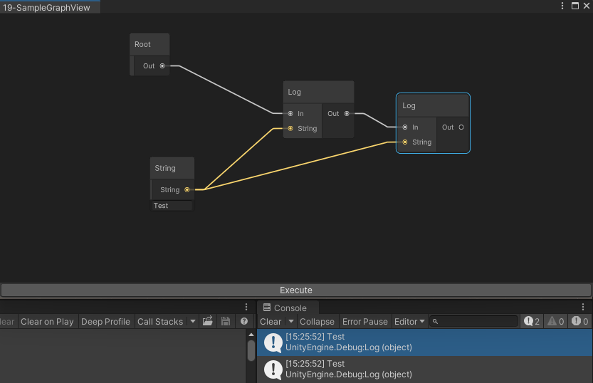

<font color=#4db8ff>Link：</font>https://qiita.com/ma_sh/items/7627a6151e849f5a0ede

### GraphViewとは

Unity 目前正在过渡到新的编辑器 <font color=#bc8df9> UI--UIElements</font>（RMGUI）。UIElements 本身已正式发布，2019 版本中删除了实验版。

<font color="red">GraphView</font> 是允许创建节点编辑器的功能，是 <font color=#66ff66>UIElements </font>的一部分，但尽管目前在 ShaderGraph 和 VFXGraph 等官方 Unity 工具中使用，它仍被视为实验性功能，尚未准备好使用。该功能被视为实验功能，尚未准备就绪，无法使用。

不过，作为一名编辑器扩展爱好者，这是我不能不抑制的一项功能，因此，这是一次尝试，目的是在 2019 年年底之前充分了解 GraphView，并在其正式发布时能够立即使用。

因此，到正式发布时，API 和其他规范可能会有很大变化。希望您能将此作为阅读材料。

### 一、GraphViewの要素

GraphViewは大きく4つの要素から成っています。

- GraphView
- Node
- Port
- Edge

还有其他可选元素，例如<font color=#66ff66>Blackboard</font>、由于我们将采用最简单的 GraphView 实现，因此暂时跳过这些元素。有关上述元素的详细解释将在我们实际实现这些元素的后续章节中给出。

#### 1.1 実際にGraphViewを実装する

首先，创建编辑器窗口（<font color=#66ff66>EditorWindow</font>），这是我们熟悉的编辑器扩展。脚本<font color=#FFCE70>SampleGraphEditorWindow</font>

```C#
using UnityEditor;

public class SampleGraphEditorWindow : EditorWindow
{
    [MenuItem("Window/Open SampleGraphView")]
    public static void Open()
    {
        GetWindow<SampleGraphEditorWindow>("SampleGraphView");
    }
}
```

现在从菜单窗口中选择 "Open SampleGraphView"（打开 SampleGraphView）来显示窗口。


#### 1.2 GraphViewを作成

接下来，我们将快速创建一个 <font color=#bc8df9>GraphView</font>。它是上图中节点和边缘的父节点。一旦最小化，我们将创建一个不显示任何内容的 <font color=#bc8df9>GraphView</font>

```C#
//SampleGraphView
using UnityEditor.Experimental.GraphView;
public class SampleGraphView : GraphView
{
}
```

同时，在这里为<font color=#bc8df9>EditorWindow</font>添加一个<font color=#66ff66>GraphView</font>。

```C#
//SampleGraphEditorWindow.cs    
void OnEnable()
{
    rootVisualElement.Add(new SampleGraphView());
}
```

尚未显示任何内容，但一旦显示就可以了。

#### 1.3 Nodeを作成

<font color=#66ff66>GraphView</font> 通常被称为节点编辑器、<font color=#bc8df9>Node</font>，顾名思义，是节点编辑器中最重要的部分。
一旦创建了基本节点，在实际使用时，很可能会创建具有各种<font color="red">继承进程的节点</font>。

我们还将创建一个至少没有实现的 Node。

```C#
//SampleNode.cs
using UnityEditor.Experimental.GraphView;

public class SampleNode : Node
{
}
```

将此添加到 <font color=#bc8df9>GraphView </font>中。只需在构造函数中添加一次即可。

```C#
//SampleGraphView.cs
public SampleGraphView() : base()
{
    AddElement(new SampleNode());
}
```

那么，让我们检查一下编辑器窗口。


然后就什么都不显示了...在这种情况下<font color=#bc8df9>UIElements </font>调试器就派上用场了。


どうやらNode自体は作成されているのですが、GraphViewのHeightが0になっているようです。
きちんと表示されるようにHeightを設定してあげます。

节点本身似乎已经创建，但 <font color=#bc8df9>GraphView </font>的高度却设置为 0。请设置高度，以便正确显示。

```C#
//SampleGraphEditorWindow.CS
void OnEnable()
{
    var graphView = new SampleGraphView()
    {
        style = { flexGrow = 1 }
    };
    rootVisualElement.Add(graphView);
}
```


现在，<font color=#bc8df9>GraphView </font>可以拉伸和收缩，以适应编辑器窗口的高度，并完整显示，隐藏的节点现在可见。

#### 1.4 NodeにPortをつける

<font color=#66ff66>Node</font>与其他<font color=#66ff66>Node</font>相连。在本例中，边缘是从<font color=#bc8df9>OutputPort</font>连接到<font color=#bc8df9>InputPort</font>的。
首先，为节点附加输入端口和输出端口。此外，我们还将简要准备节点的外观。

```C#
//SampleNode.cs
public SampleNode()
{
    title = "Sample";

    var inputPort = Port.Create<Edge>(Orientation.Horizontal, Direction.Input, Port.Capacity.Single, typeof(Port));
    inputContainer.Add(inputPort);

    var outputPort = Port.Create<Edge>(Orientation.Horizontal, Direction.Output, Port.Capacity.Single, typeof(Port));
    outputContainer.Add(outputPort);
}
```


目前，<font color=#66ff66>Port </font>和 <font color=#66ff66>Edge </font>使用的是基础材料，但它突然变成了类似节点的东西。

#### 1.5 Nodeを動かせるようにする

在这种情况下，我觉得节点不动有点奇怪，所以在这里让它动一下。在 <font color=#bc8df9>GraphView </font>中，您可以为节点添加<font color="red">Manipulator</font>操纵器，使其移动。操纵器有多种类型，但现在我们只讨论可以拖动节点移动的操纵器。

<font color=#66ff66>UnityEngine.UIElements </font>可以利用<font color=#FFCE70>using</font>来使用

```C#
//SampleGraphView.cs
using UnityEngine.UIElements;
```

SelectionDraggerをAddManipulatorすると，当 <font color=#66ff66>SelectionDragger </font>为 <font color="red">AddManipulator </font>参数时。

```C#
public SampleGraphView() : base()
{
    AddElement(new SampleNode());
    this.AddManipulator(new SelectionDragger());
}
```

拖动即可移动。

#### 1.6 Nodeを複数作れるようにする

目前，<font color=#bc8df9>GraphView </font>构造函数应该会创建一个、这可以通过右键菜单添加。

```C#
//SampleGraphView.cs
public SampleGraphView() : base()
{
    this.AddManipulator(new SelectionDragger());

    nodeCreationRequest += context =>
    {
        AddElement(new SampleNode());
    };
}
```


现在，您可以创建多个 <font color=#bc8df9>SampleNodes</font>。现在，您想连接这些节点，但它们似乎无法正常连接。

#### 1.7 Node同士を繋げる

<font color=#FFCE70>Node</font>不能连接到任何<font color=#FFCE70>Node</font>或任何端口。它需要从<font color=#66ff66>InputPort</font>连接到正确的<font color=#66ff66>OutputPort</font>。因此，覆盖 <font color=#bc8df9> GetCompatiblePorts </font>可返回正确的端口。

```C#
//SampleGraphView.cs
public override List<Port> GetCompatiblePorts(Port startAnchor, NodeAdapter nodeAdapter)
{
    return ports.ToList();
}
```

在这种情况下，我暂时尝试连接所有<font color=#66ff66>Port</font>、事实上，有必要从 <font color="red">startAnchor </font>中的端口做出正确的决定。


要看清<font color="red">Edge</font>颜色和背景颜色非常困难，但现在节点是相互连接的。至此，我想我已经将 <font color=#66ff66>GraphView </font>用户界面本身的设计达到了一个合理的水平。我想过就此结束，但我觉得要真正创建一个工具，元素还是不够多、我将继续学习创建工具的章节。

### 二、GraphViewを用いてツールを作成する

尽管我称其为工具，但我认为创建一个实用工具太长了，所以我将定义最低要求。

- 可以放大和缩小
- 更改背景颜色
- 可以创建多种类型的节点
- 当按下执行按钮时，将处理连接到根节点的节点。

除此之外，我们还会创建一个函数节点，不过这次我们只会输入一个日志输出节点，并且我们 只会
向日志输出节点输入字符串。

#### 2.1ズームインズームアウトを行う

如果您使用节点编辑器，您会希望将此作为一个习惯来实现。事实上，只需在 <font color=#66ff66>GraphView </font>中调用 <font color=#bc8df9>SetupZoom </font>即可放大或缩小。

```C#
//SampleGraphView.cs
public SampleGraphView() : base()
{
    SetupZoom(ContentZoomer.DefaultMinScale, ContentZoomer.DefaultMaxScale);
    this.AddManipulator(new SelectionDragger());
    nodeCreationRequest += context =>
    {
        AddElement(new SampleNode());
    };
}
```

#### 2.2 背景色を変更する

这个也很简单，只需在 <font color=#bc8df9>GraphView </font>中添加一个名为 <font color=#66ff66>GridBackground </font>的 <font color=#4db8ff>VisualElement</font>，就可以暂时获得黑色背景。

```C#
//SampleGraphView.cs
public SampleGraphView() : base()
{
    SetupZoom(ContentZoomer.DefaultMinScale, ContentZoomer.DefaultMaxScale);
    Insert(0, new GridBackground());
    this.AddManipulator(new SelectionDragger());
    nodeCreationRequest += context =>
    {
        AddElement(new SampleNode());
    };
}
```

此外，<font color=#4db8ff>VisualElement </font>是 <font color="red">UIElements </font>的基本元素，它们被组合起来创建用户界面。

如果你稍微接触过 <font color=#66ff66>UIElements</font>，你可能会认为可以直接使用 <font color=#4db8ff>Add(VisualElement 元素)</font>、
如果这样做，<font color=#66ff66>GridBackground</font> 将出现在 <font color="red">GraphView </font>中元素的前面，因此请使用 <font color=#66ff66>Insert </font>将其插入后面。

#### 2.3 ノードを実装する

现在，我们将创建一个<font color=#FFCE70>Node</font>。我们将创建的<font color=#FFCE70>Node</font>是

根<font color=#FFCE70>Node</font>

日志输出<font color=#FFCE70>Node</font>

字符串输出<font color=#FFCE70>Node</font>
一旦 <font color=#66ff66>SampleNode </font>成为一个抽象类，我们将从它继承节点。

```C#
//SampleNode.cs
using UnityEditor.Experimental.GraphView;
public abstract class SampleNode : Node
{}
```

现在，首先创建一个<font color=#bc8df9>LogNode</font>日志输出节点。

```c#
//ProcessNode.cs
using UnityEditor.Experimental.GraphView;
public class ProcessNode : SampleNode
{
    public ProcessNode()
    {
        var inputPort = Port.Create<Edge>(Orientation.Horizontal, Direction.Input, Port.Capacity.Single, typeof(Port));
        inputPort.portName = "In";
        inputContainer.Add(inputPort);

        var outputPort = Port.Create<Edge>(Orientation.Horizontal, Direction.Output, Port.Capacity.Single, typeof(Port));
        outputPort.portName = "Out";
        outputContainer.Add(outputPort);
    }
}
```

一旦<font color=#bc8df9>进程节点</font>（ProcessNode）结束，就会创建<font color=#bc8df9>日志节点</font>（LogNode）。

```c#
//LogNode.cs
using UnityEditor.Experimental.GraphView;
public class LogNode : ProcessNode
{
    public LogNode() : base()
    {
        title = "Log";

        var inputPort = Port.Create<Edge>(Orientation.Horizontal, Direction.Input, Port.Capacity.Single, typeof(string));
        inputContainer.Add(inputPort);
    }
}
```

接下来，创建一个<font color=#bc8df9>StringNode</font>字符串输出节点。这是因为我们可以假设要在不同的地方使用相同的值、
将容量设为多重。

```C#
//StringNode.cs
using UnityEngine.UIElements;
using UnityEditor.Experimental.GraphView;

public class StringNode : SampleNode
{
    private TextField textField;
    public string Text { get { return textField.value; } }

    public StringNode() : base()
    {
        title = "String";

        var outputPort = Port.Create<Edge>(Orientation.Horizontal, Direction.Output, Port.Capacity.Multi, typeof(string));
        outputContainer.Add(outputPort);

        textField = new TextField();
        mainContainer.Add(textField);
    }
}
```

最后，创建<font color=#bc8df9>RootNode</font>根节点。根节点不应消失，因此要从 <font color=#66ff66>CAPABILITIES </font>中减去 <font color="red">Deletable</font>。

<font color=#4db8ff>Capabilities Link：</font>https://docs.unity3d.com/ScriptReference/Experimental.GraphView.Capabilities.html

操纵器用于轻松确定 GraphElement 上有效操作的能力。

```C#
//RootNode.cs
using UnityEditor.Experimental.GraphView;
public class RootNode : SampleNode
{
    public RootNode() : base()
    {
        title = "Root";

        capabilities -= Capabilities.Deletable;

        var outputPort = Port.Create<Edge>(Orientation.Horizontal, Direction.Output, Port.Capacity.Single, typeof(Port));
        outputPort.portName = "Out";
        outputContainer.Add(outputPort);
    }
}
```

在这里，生成 <font color=#66ff66>GraphView </font>时应放置一个 <font color=#bc8df9>RootNode</font>。

```C#
//SampleGraphView.cs
public RootNode root;

public SampleGraphView() : base()
{
    SetupZoom(ContentZoomer.DefaultMinScale, ContentZoomer.DefaultMaxScale);

    Insert(0, new GridBackground());

    root = new RootNode();
    AddElement(root);

    this.AddManipulator(new SelectionDragger());
    nodeCreationRequest += context =>
    {
        AddElement(new SampleNode());
    };
}
```

然后就可以在编辑器中创建这些已创建的节点。

#### 2.4 任意のノードを選択し、作成する

<font color=#bc8df9>SearchWindow </font>可轻松创建可选择节点的用户界面。需要一个类实现 <font color="red">ISearchWindowProvider </font>的 <font color=#66ff66>ScriptableObject</font>。

```C#
//SampleSearchWindowProvider.cs
using System;
using System.Collections.Generic;
using UnityEngine;
using UnityEditor.Experimental.GraphView;

public class SampleSearchWindowProvider : ScriptableObject, ISearchWindowProvider
{
    private SampleGraphView graphView;
    public void Initialize(SampleGraphView graphView)
    {
        this.graphView = graphView;
    }

    List<SearchTreeEntry> ISearchWindowProvider.CreateSearchTree(SearchWindowContext context)
    {
        var entries = new List<SearchTreeEntry>();
        entries.Add(new SearchTreeGroupEntry(new GUIContent("Create Node")));

        foreach (var assembly in AppDomain.CurrentDomain.GetAssemblies())
        {
            foreach (var type in assembly.GetTypes())
            {
                if (type.IsClass && !type.IsAbstract && (type.IsSubclassOf(typeof(SampleNode)))
                    && type != typeof(RootNode))
                {
                    entries.Add(new SearchTreeEntry(new GUIContent(type.Name)) { level = 1, userData = type });
                }
            }
        }

        return entries;
    }

    bool ISearchWindowProvider.OnSelectEntry(SearchTreeEntry searchTreeEntry, SearchWindowContext context)
    {
        var type = searchTreeEntry.userData as System.Type;
        var node = Activator.CreateInstance(type) as SampleNode;
        graphView.AddElement(node);
        return true;
    }
}
```

<font color=#66ff66>CreateSearchTree</font> 返回一个继承自 <font color=#bc8df9>SearchTreeEntry</font> 中 <font color=#FFCE70>SampleNode  Class</font>的类、<font color=#bc8df9>OnSelectEntry </font>执行与所选项相对应的处理。这一次，<font color=#FFCE70>Node </font>在这里创建。

此外，将右键单击创建 <font color=#FFCE70>Node </font>改为调用 <font color=#bc8df9>SearchWindow</font>。


<font color=#4db8ff>CompilationPipeline.GetAssemblies Link：</font>https://docs.unity3d.com/ScriptReference/Compilation.CompilationPipeline.GetAssemblies.html

<font color=#bc8df9>Declaration：</font>按 <font color=#66ff66>AssembliesType </font>筛选获取 Unity 编译的所有脚本程序集。

<font color=#4db8ff>ISearchWindowProvider.CreateSearchTree Link：</font>https://docs.unity3d.com/ScriptReference/Experimental.GraphView.ISearchWindowProvider.CreateSearchTree.html

<font color=#66ff66>Return：</font>List<<font color=#bc8df9>SearchTreeEntry</font>> 返回搜索窗口中显示的 SearchTreeEntry 对象列表。

<font color=#bc8df9>Declaration：</font>搜索窗口首次打开和重新加载时都会调用该方法。重新加载会在进入播放模式或脚本域重新加载时发生。在重新加载过程中，返回的对象列表不会被修改。因此，在每次调用缓存列表时重复使用列表是安全的。

<font color=#4db8ff>SearchTreeEntry Link：</font>https://docs.unity3d.com/ScriptReference/Experimental.GraphView.SearchTreeEntry.html

```C#
//SampleGraphView.cs
public SampleGraphView() : base()
{
    SetupZoom(ContentZoomer.DefaultMinScale, ContentZoomer.DefaultMaxScale);

    Insert(0, new GridBackground());

    root = new RootNode();
    AddElement(root);

    this.AddManipulator(new SelectionDragger());

    var searchWindowProvider = new SampleSearchWindowProvider();
    searchWindowProvider.Initialize(this);

    nodeCreationRequest += context =>
    {
        SearchWindow.Open(new SearchWindowContext(context.screenMousePosition), searchWindowProvider);
    };
}
```

现在您可以选择任何要创建的节点。

#### 2.5 正しいポート同士のみが繋がるようにする

在用户界面实现部分，所有节点目前都是连接的，因此我们将对其进行修复。

```C#
//SampleGraphView.cs
public override List<Port> GetCompatiblePorts(Port startAnchor, NodeAdapter nodeAdapter)
{
    var compatiblePorts = new List<Port>();
    foreach (var port in ports.ToList())
    {
        if (startAnchor.node == port.node ||
            startAnchor.direction == port.direction ||
            startAnchor.portType != port.portType)
        {
            continue;
        }

        compatiblePorts.Add(port);
    }
    return compatiblePorts;
}
```

<font color=#4db8ff>GraphView.GetCompatiblePorts Link：</font>https://docs.unity3d.com/ScriptReference/Experimental.GraphView.GraphView.GetCompatiblePorts.html

<font color=#4db8ff>Port Link：</font>https://docs.unity3d.com/ScriptReference/Experimental.GraphView.Port.html

不要连接到同一节点

输入到输入和输出到输出不连接。

如果端口中设置的类型不匹配，则不会连接。

#### 2.6 実際にノードを用いて処理を行う

在实际处理过程中，有必要按顺序获取与<font color=#4db8ff>Root Node</font>相连的<font color=#FFCE70>Node</font>并进行处理。似乎没有获取与<font color=#FFCE70>Node</font>相连的其他<font color=#FFCE70>Node</font>的功能，因此可能需要在生成<font color=#66ff66>Port</font>时缓存它们。

另外，由于我们希望在<font color=#FFCE70>Node</font>侧编写处理程序，因此我们将为 <font color="red">ProcessNode </font>提供一个处理方法。

保存两个<font color=#FFCE70>Port</font>，并且提供一个抽象函数

```C#
//ocessNode.cs
using UnityEditor.Experimental.GraphView;
public abstract class ProcessNode : SampleNode
{
    public Port InputPort;
    public Port OutputPort;

    public ProcessNode()
    {
        InputPort = Port.Create<Edge>(Orientation.Horizontal, Direction.Input, Port.Capacity.Single, typeof(Port));
        InputPort.portName = "In";
        inputContainer.Add(InputPort);

        OutputPort = Port.Create<Edge>(Orientation.Horizontal, Direction.Output, Port.Capacity.Single, typeof(Port));
        OutputPort.portName = "Out";
        outputContainer.Add(OutputPort);
    }

    public abstract void Execute();
}
```

同样保存<font color=#FFCE70>Port</font>，同时继承抽象方法

```C#
//LogNode.cs
using System.Linq;
using UnityEngine;
using UnityEditor.Experimental.GraphView;

public class LogNode : ProcessNode
{
    private Port inputString;

    public LogNode() : base()
    {
        title = "Log";

        inputString = Port.Create<Edge>(Orientation.Horizontal, Direction.Input, Port.Capacity.Single, typeof(string));
        inputContainer.Add(inputString);
    }

    public override void Execute()
    {
        var edge = inputString.connections.FirstOrDefault();
        var node = edge.output.node as StringNode;

        if (node == null) return;

        Debug.Log(node.Text);
    }
}
```

<font color=#4db8ff>Root Node</font>也同样如此<font color=#FFCE70>Port</font>

```C#
//RootNode.cs
using UnityEditor.Experimental.GraphView;

public class RootNode : SampleNode
{
    public Port OutputPort;

    public RootNode() : base()
    {
        title = "Root";

        capabilities -= Capabilities.Deletable;

        OutputPort = Port.Create<Edge>(Orientation.Horizontal, Direction.Output, Port.Capacity.Single, typeof(Port));
        OutputPort.portName = "Out";
        outputContainer.Add(OutputPort);
    }
}
```

现在，将从<font color=#4db8ff>Root Node</font>开始依次获取和处理<font color=#FFCE70>Node</font>。

```C#
//SampleGraphView
using System.Linq

    //-------------------------------------

    public void Execute()
{
    var rootEdge = root.OutputPort.connections.FirstOrDefault();
    if (rootEdge == null) return;

    var currentNode = rootEdge.input.node as ProcessNode;

    while (true)
    {
        currentNode.Execute();

        var edge = currentNode.OutputPort.connections.FirstOrDefault();
        if (edge == null) break;

        currentNode = edge.input.node as ProcessNode;
    }
}
```

適當的方式去調用

```C#
//SampleGraphEditorWindow.cs
void OnEnable()
{
    var graphView = new SampleGraphView()
    {
        style = { flexGrow = 1 }
    };
    rootVisualElement.Add(graphView);

    rootVisualElement.Add(new Button(graphView.Execute) { text = "Execute" });
}
```

最后，甚至还执行了流程。

