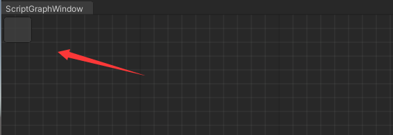
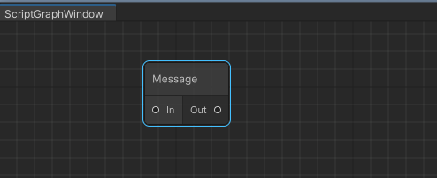
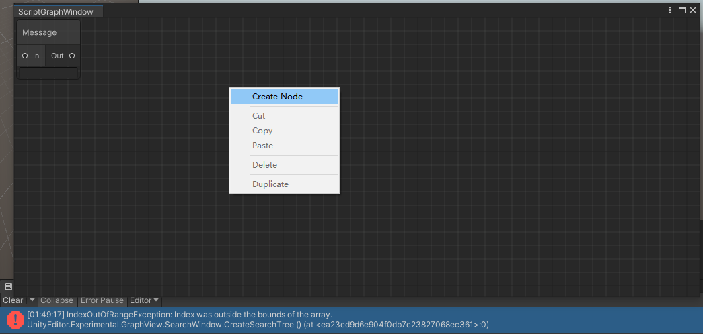
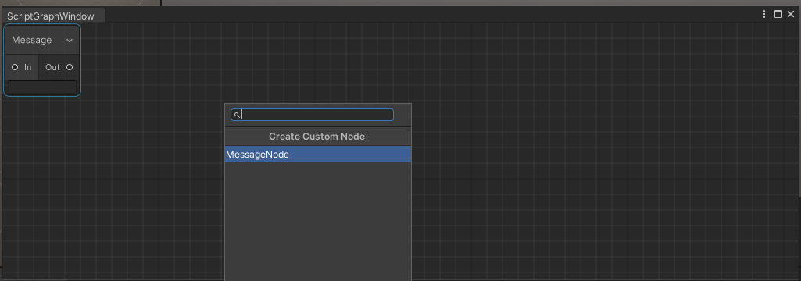
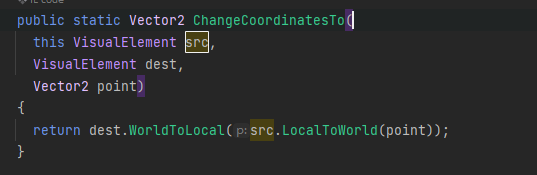
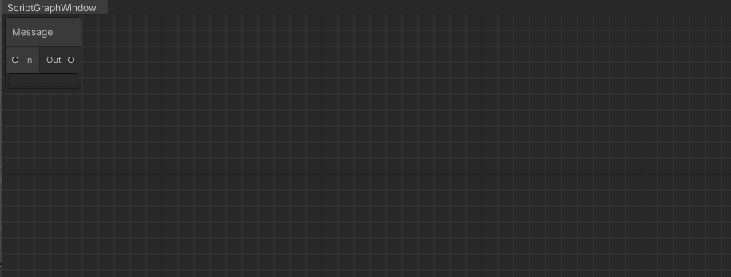
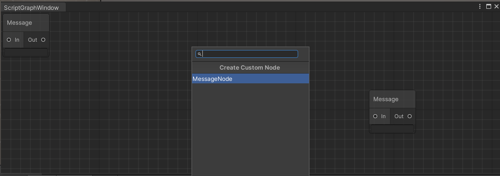

<font color=#4db8ff>link：</font>https://qiita.com/dwl/items/dd14f5f2a187084d317b

## Graph View

### 一、Window

#### 1.1  Editor Window

创建一个脚本命名为<font color=#66ff66>ScriptGraphWindow</font>，同时让他继承与<font color=#FFCE70>EditorWindow</font>

<font color=#4db8ff>Link：https://docs.unity3d.com/ScriptReference/EditorWindow.html</font>

```c++
using System.Collections;
using System.Collections.Generic;
using UnityEngine;

public class ScriptGraphWindow : EditorWindow
{
   
}
```

此时会有<font color="DarkOrchid ">Bug</font>提示，提示我们需要添加的命名空间，可以手动添加一下


添加命名空间<font color=#66ff66>using UnityEditor</font>，随后Bug就会消失

```c++
using System.Collections.Generic;
using UnityEditor;
using UnityEngine;
```

首先我们创建一个窗口，随后让利用<font color="red">Show</font>他显示出来

<font color=#4db8ff>link：</font>[EditorWindow](https://docs.unity3d.com/ScriptReference/EditorWindow.html).GetWindow

```c++
public class ScriptGraphWindow : EditorWindow
{
    [MenuItem("Tool/ScriptGraph")]
    public static void Open()
    {
        ScriptGraphWindow window = GetWindow<ScriptGraphWindow>();
        window.Show();
    }
}
```

#### 1.2 Graph View

首先需要绘制这个窗口，因此我们需要让他继承<font color=#FFCE70>GraphView</font>。

学过web的都知道，我们只是创建了整个界面，但是我们还需要给他填充东西，因此我们创建一个界面，并且让他大小保持与父窗口一样大，可以使用<font color=#66ff66>StretchToParentSize（）</font>做到，以及利用<font color=bc8df9>base()</font>接受<font color="red">GraphView</font>的基础参数内容

<font color=#4db8ff>link:</font> https://docs.unity3d.com/ScriptReference/Experimental.GraphView.GraphView.html

```c++
using UnityEngine.UIElements;
using UnityEditor.Experimental.GraphView;

public class ScriptGraphView : GraphView
{
    public ScriptGraphView() : base()
    {
        
    }
}
```

随后在<font color=#bc8df9>ScriptGraphWindow</font>中调用它，并且将它加入<font color=#bc8df9>ScriptGraphWindow</font>中，作为其中一个组件，可以利用<font color=#c78fd0>rootVisualElement</font>做到

```c++
 private void OnEnable()
    {
        var scriptGraph = new ScriptGraphView();
        this.rootVisualElement.Add(scriptGraph);
    }
```

随后在主窗口打开


### 二、Background

现在编辑器空空的，所以给他添加背景色熟悉<font color=#FFCE70>html</font>的会知道，<font color=#FFCE70>html</font>通过<font color=#FFCE70>Css</font>调节背景色、局内排版，同样的Unity也有一个<font color=#66ff66>uss</font>

让我们编写它

#### 2.1 uss

```css
GridBackground {
    --grid-background-color: #282828;
    --line-color: rgba(193,196,192,0.1);
    --tick-line-color: rgba(193,196,192,0.1);
    --spacing: 20
}
```

<font color=#FFCE70>css</font>通过name链接，而<font color=#66ff66>uss</font>通过其他方法<font color=#FFCE70>styleSheets</font>去打到类似于<font color=#FFCE70>Css</font>的效果。首先我们需要加载<font color=#bc8df9>css</font>，可以使用<font color=#4db8ff>Resources.Load（）</font>函数。函数读取路径为：<font color=#FD00FF> (Assets/Resources/...)</font>

<font color=#4db8ff>link：</font>https://docs.unity3d.com/ScriptReference/UIElements.StyleSheet.html

<details>
    <summary><center><font color="red">what is Style</font></center>
    </summary>
    <pre>
    Style sheets are applied to visual elements in order to control the layout and visual appearance of the user interface.
    The StyleSheet class holds the imported data of USS files in your project. Once loaded, a style sheet can be attached to a VisualElement object to affect the element itself and its descendants.
<font color=#66ff66>Style</font>应用于视觉元素，以控制用户界面的布局和视觉外观。
<font color=#66ff66>Style Class</font>保存项目中 USS 文件的导入数据。加载<font color=#66ff66>Style</font>后，可将其附加到 VisualElement 对象，以影响元素本身及其后代。
</pre>
</details>

但是<font color=#FD00FF>uss</font>的路径这样设置并不好，为了文件的整洁，我们在Asset文件下创建几个文件夹使得读取路径为：<font color=#FFCE70>Asset/Resources/GraphView/Uss/GraphViewBackGround</font>

```c++
public class ScriptGraphView : GraphView
{
    public ScriptGraphView() : base()
    {
        // 省略

        //读取 uss文件并将其添加到样式中
        this.styleSheets.Add(Resources.Load<StyleSheet>("GraphView/Uss/GraphViewBackGround"));
        // 在图层最底层添加背景
        this.Insert(0, new GridBackground());
    }
}
```


<center>Script Graph Window</center>

但是我们看不到我们所设置的背景，这是因为我们并没有给予<font color=#66ff66>ScriptGraphView</font>大小，因此可以添加代码，调节到与父窗口大小一致

```C#
public ScriptGraphView() : base()
{
    //大小与父窗口大小一致
    this.StretchToParentSize();
    ...
```

现在我们可以看到背景出现了


<center>Script Graph Window and Background</center>

#### 2.2 Manipulator 

但是我们的鼠标在里面没有任何作用，因此我们仍然需要添加代码，给予<font color=#66ff66>Node</font>一些<font color="red">Manipulator </font><font color=#4db8ff>操控器</font>，可以利用代码添加与 <font color=#66ff66>VisualElement</font>关联的操纵器。而操控器的类型我们可以通过<font color="red">Unity文档</font>获取

<font color=#4db8ff>link：</font>https://docs.unity3d.com/ScriptReference/30_search.html?q=Manipulator+

```c++
VisualElementExtensions.AddManipulator
```

首先是放大/缩小、选择范围、拖动移动选定的元素、 拖动移动绘图区域。

```c++
//大小与父窗口大小一致
this.StretchToParentSize();
//放大/缩小。
SetupZoom(ContentZoomer.DefaultMinScale, ContentZoomer.DefaultMaxScale);
// 拖动移动绘图区域。
this.AddManipulator(new ContentDragger());
// 拖动移动选定的元素
this.AddManipulator(new SelectionDragger());
//  拖动选择范围
this.AddManipulator(new RectangleSelector());
```


<center>Window get some Manipulator </center>

###  三、 Create Node

#### 3.1 Port 端口

这一步是创建要放置在已创建的 GraphView 上的节点。这也是我们目的，首先创建一个节点类，它继承与<font color=#4db8ff>Node Class</font>，命名为<font color=#4db8ff>MessageNode</font>

```C#
using UnityEngine;
using UnityEngine.UIElements;
using UnityEditor.Experimental.GraphView;

public class MessageNode : Node
{}
```

将它加入<font color=#FFCE70>Render Graph</font>中

```c++
//节点加入
this.Add(new MessageNode());
```



<center>有节点的Render Graph</center>

#### 3.2 input output

数据需要输入输出，所以我们创建两个<font color=#FFCE70>Port</font>，作为输入入口和输出入口，为了在调用该类的时候就自动初始化生成，因此我们可以利用<font color="red">构造函数</font>

```c++
public class MessageNode : Node
{
    public MessageNode()
    {
        var inputPort = Port;
        var outputOort = Port;
    }
}
```

可以利用它的<font color=#66ff66>Create</font>方法进行设置，需要三个参数分别是，<font color=#bc8df9>定位，类型，容量，数据类型</font>，我们分别是<font color=#66ff66>水平，输入输出，多和少，数据类型为<font color="red">Port</font></font>

```C#
var inputPort = Port.Create<Edge>(Orientation.Horizontal, Direction.Input, Port.Capacity.Multi, typeof(Port));


var outputOort = Port.Create<Edge>(Orientation.Horizontal, Direction.Output, Port.Capacity.Single, typeof(Port));
}
```

<font color=#4db8ff>Port ：</font>https://docs.unity3d.com/ScriptReference/Experimental.GraphView.Port.html

我们需要给每个端口命名，分别将他们加入<font color=#FFCE70>Node</font>的不同的端口容器中

<font color=#4db8ff>Node link：</font>https://docs.unity3d.com/ScriptReference/Experimental.GraphView.Node.html

```c#
var inputPort = Port.Create<Edge>(Orientation.Horizontal, Direction.Input, Port.Capacity.Multi, typeof(Port));
inputPort.portName = "In";
inputContainer.Add(inputPort);

var outputOort = Port.Create<Edge>(Orientation.Horizontal, Direction.Output, Port.Capacity.Single, typeof(Port));
outputOort.portName = "Out";
outputContainer.Add(outputOort);
```



<center>In and out  of Port</center>

我们暂时不知道添加什么，我们可以在<font color="red">Container</font>容器里标记一些文本，首先创建一个文本字段，并且允许多行输入。

<font color=#4db8ff>TextField link：</font>https://docs.unity3d.com/ScriptReference/UIElements.TextField.html

```c++
public class MessageNode : Node
{
    private TextField textField;
    public MessageNode()
    {
        ...
        textField = new TextField();
        textField.multiline = true;
    }
}
```

#### 3.3  IME（Input method）

随后是IME 输入法支持，可以生成生成输入设备上没有的字符。最后将它加入主容器中，利用的是<font color=#bc8df9>textField</font>的回调函数以及<font color="red">lambda</font>表达式

```c#
using UnityEngine;
using UnityEngine.UIElements;
using UnityEditor.Experimental.GraphView;

public class MessageNode : Node
{
    private TextField textField;

    public MessageNode()
    {
        // 给节点加标题。
        this.title = "Message";

        // 创建端口（见下文）
        var inputPort = Port.Create<Edge>(Orientation.Horizontal, Direction.Input, Port.Capacity.Multi, typeof(Port));
        inputPort.portName = "In";
        inputContainer.Add(inputPort);

        var outputOort = Port.Create<Edge>(Orientation.Horizontal, Direction.Output, Port.Capacity.Single, typeof(Port));
        outputOort.portName = "Out";
        outputContainer.Add(outputOort);

        // 在节点的主要部分添加输入字段
        textField = new TextField();
        // 在节点的主要部分添加输入字段
        textField.multiline = true;
        //支持日文输入
        textField.RegisterCallback<FocusInEvent>(evt => { Input.imeCompositionMode = IMECompositionMode.On; });
        textField.RegisterCallback<FocusOutEvent>(evt => { Input.imeCompositionMode = IMECompositionMode.Auto; });

        this.mainContainer.Add(textField);
    }
}
```

### 四、Editor Node

首选，要创建一个右键单击 ShaderGraph 时出现的东西。这将在 ScriptGraphView 一侧生成和设置

让我们创建一个新的Code 名字为<font color=#bc8df9>ScriptGraphSearchWindowProvider</font>

#### 4.1 Search Tree

搜索树条目，可以继承<font color=#bc8df9>ISearchWindowProvider</font>。搜索窗口在 GraphView 中显示搜索树条目。

他有两个基本方法，接口需要实现两个基本函数方法需要实现

```c#
public interface ISearchWindowProvider
{
    //生成数据以填充搜索窗口，搜索窗口首次打开和重新加载时都会调用该方法
    List<SearchTreeEntry>CreateSearchTree(SearchWindowContext context{}
    //在搜索树列表中选择一个条目
    bool OnSelectEntry(SearchTreeEntry SearchTreeEntry, SearchWindowContext context){}
}
```

<font color=#bc8df9>CreateSearchTree</font>：创建一个搜索树，随后设置以及自定义节点

```c#
public List<SearchTreeEntry> CreateSearchTree(SearchWindowContext context)
{
    var entries = new List<SearchTreeEntry>();
    return entries;
}
```

要将他加入<font color=#bc8df9>GraphView</font>中，首先是创建一个搜索树脚本实例，随后，初始化它，将它加入

通过初始化函数<font color=#66ff66>Init</font>，我们可以一路持有<font color=#bc8df9>ScriptGraphView</font>和<font color=#bc8df9>ScriptGraphWindow</font>

```c#
var searchWindowProvider = ScriptableObject.CreateInstance<ScriptGraphSearchWindowProvider>();
//传递
searchWindowProvider.Init(this, window);
this.nodeCreationRequest += context =>
{
    SearchWindow.Open(new SearchWindowContext(context.screenMousePosition), searchWindowProvider);
};
```

选择鼠标右键，点击Create Node，Unity会弹出错误。



<center>Bug提示Index索引不到array</center>

我们创建一个搜索树组条目，命名为<font color=#FFCE70>Create Custom Node</font>

```c#
entries.Add(new SearchTreeGroupEntry(new GUIContent("Create Custom Node")));
```


#### 4.2 Node Level

但是现在没有一个可以创建<font color=#bc8df9>Node</font>，可以使用函数<font color=#66ff66>SearchTreeEntry</font>，有四个参数<font color=#66ff66>条目文本Icon，搜索树级别，指定对象用于搜索树条目</font>

<font color=#4db8ff>Link：</font>https://docs.unity3d.com/ScriptReference/Experimental.GraphView.SearchTreeEntry.html

```C#
public List<SearchTreeEntry> CreateSearchTree(SearchWindowContext context)
{
    var entries = new List<SearchTreeEntry>();

    //节点名字
    entries.Add(new SearchTreeGroupEntry(new GUIContent("Create Custom Node")));
    entries.Add(new SearchTreeEntry(new GUIContent(nameof(MessageNode)))
                {
                    level = 1, userData = typeof(MessageNode)
                });

    return entries;
}

public bool OnSelectEntry(SearchTreeEntry SearchTreeEntry, SearchWindowContext context)
{
    return true;
}
```



<center>Message Node Level</center>

#### 4.3 Node Create

我们创建了层级，但是看不见实际的节点，所以我们设想一下创建一个节点需要怎样的数据

>   （1）节点数据
>
>   （2） 创建节点实例，数据填充到实例
>
>   （3）节点在鼠标位置创建
>
>   （4）添加到Graph View 建立链接

```c#
//节点数据
var type = SearchTreeEntry.userData as Type;
//填充到实例
var node = Activator.CreateInstance(type) as Node;
```

我们可以使用<font color=#FFCE70>Activator</font>将数据类型实例转化为<font color="red">Node</font>

<font color=#66ff66>type instantiation</font>将使用 <font color="red">Activator</font>来完成。

<font color=#4db8ff>Activator：</font>https://docs.unity3d.com/ScriptReference/Unity.Properties.InstantiationKind.Activator.html


<center>Create Node</center>

#### 4.4 Node Position

现在节点创建的位置比较随机，有点难找，我们让节点创建在鼠标位置，我们可以通过获取我们节点窗口，随后判断鼠标的位置。

我们首先需要将搜索树空间<font color=#bc8df9>SearchWindowContext</font>的点，转到<font color=#bc8df9>ScriptGraphWindow</font>空间，随后转到<font color=#66ff66>ScriptGraphView</font>空间

可以利用<font color=#66ff66>ChangeCoordinatesTo</font>，将空间转换，查看函数的源码我们可以发现，他的三个参数，但是第一个参数已经被赋值，我们只需要关于后面两个参数。



<font color=#4db8ff>ChangeCoordinatesTo Link：</font>https://docs.unity3d.com/ScriptReference/UIElements.VisualElementExtensions.ChangeCoordinatesTo.html

目标空间是：<font color=#66ff66>ScriptGraphWindow</font>，我们可以通过<font color="red">VisualElement.parent</font>，这个实际上是返回的是本身的一个<font color=#66ff66>子级</font>。


<font color=#4db8ff>VisualElement Link：</font>https://docs.unity3d.com/ScriptReference/UIElements.VisualElement.html

我们首先获得当前鼠标的位置，可以利用<font color=#66ff66>screenMousePosition</font>方法的参数<font color=#bc8df9>context</font>，其中它包含一个组件<font color=#4db8ff>screenMousePosition</font>，可以获得当前鼠标的位置。

```c#
//节点数据
var type = SearchTreeEntry.userData as Type;
//数据填充到实例
var node = Activator.CreateInstance(type) as Node;

// 创建节点的位置与鼠标坐标一致。 
var worldMousePosition = _window.rootVisualElement.ChangeCoordinatesTo(_window.rootVisualElement.parent,context.screenMousePosition);
```

但是创建了以后，我们并不能在<font color=#bc8df9>ScriptGraphSearchWindow</font>中找到该节点



<center>失去节点</center>

如果使用<font color=#bc8df9>ScriptGraphWindow</font>的鼠标位置

```c#
// 创建节点的位置与鼠标坐标一致。 
var worldMousePosition = _window.rootVisualElement.ChangeCoordinatesTo(_window.rootVisualElement.parent, _window.position.position);
```

也依然找不到节点


我们可以将两个位置作差，就可以获得相对鼠标较近的位置，<font color=#4db8ff>由鼠标位置减去窗口位置，算出来鼠标相对窗口的偏移值</font> ，做坐标修正。其中窗口位置是（0,0）


获取在屏幕像素坐标下相对于窗口的实际位置，并且将点转移到<font color=#bc8df9>ScriptGraphView</font>空间

```c#
// 创建节点的位置与鼠标坐标一致。 
var worldMousePosition = _window.rootVisualElement.ChangeCoordinatesTo(_window.rootVisualElement.parent,context.screenMousePosition - _window.position.position);
var localMousePosition = _graphView.contentViewContainer.WorldToLocal(worldMousePosition);
```

随后设置该节点的<font color=#4db8ff>Position，Size</font>

```c++
node.SetPosition(new Rect(localMousePosition, new Vector2(100, 100)));
```



<center>Node</center>

### 五、Base  Class

每次添加Node都要通过以下代码，很麻烦。我们可以创建一个基类，去节省操作

```c#
entries.Add(new SearchTreeEntry(new GUIContent(nameof(MessageNode))) { level = 1, userData = typeof(MessageNode)});
```

#### 5.1 Inherit Node

```c#
using System.Collections;
using System.Collections.Generic;
using UnityEditor.Experimental.GraphView;
using UnityEngine;

public class ScriptGraphNode : Node {}
```

修改<font color=#66ff66>MessageNode </font>中的代码，让它继承<font color=#4db8ff>ScriptGraphNode</font>

```c++
public class MessageNode : ScriptGraphNode
{
    // 省略
}
```

#### 5.2 AppDomain

AppDomain在同一个进程内划分出多个"域",一个进程可以运行多个应用,提高了资源的复用性,数据通信

CLR在启动的时候会创建<font color=#4db8ff>系统域(System Domain)、共享域(Shared Domain)和默认域(Default Domain)</font>、<font color=#FFCE70>系统域与共享域</font>对于用户是不可见的

<font color=#66ff66>默认域</font>也可以说是当前域,它承载了当前应用程序的各类信息(堆栈),所以,我们的一切操作都是在这个默认域上进行."插件式"开发很大程度上就是依靠AppDomain来进行.

<font color=#4db8ff>AppDomain Link：</font>https://learn.microsoft.com/en-us/dotnet/api/system.appdomain?view=net-7.0

<font color=#FFCE70>ScriptGraphSearchWindowProvider</font>

```c#
public List<SearchTreeEntry> CreateSearchTree(SearchWindowContext context)
{
    var entries = new List<SearchTreeEntry>();
    entries.Add(new SearchTreeGroupEntry(new GUIContent("Create Node")));

    foreach (var assembly in AppDomain.CurrentDomain.GetAssemblies())
    {
        foreach (var type in assembly.GetTypes())
        {
            if (type.IsClass == false) continue;

            if (type.IsAbstract) continue;

            if (type.IsSubclassOf(typeof(ScriptGraphNode)) == false) continue;

            entries.Add(new SearchTreeEntry(new GUIContent(type.Name)) { level = 1, userData = type });
        }
    }

    return entries;
}
```

继承自 <font color=#66ff66>ScriptGraphNode</font> 的节点现在会自动出现在 "创建节点 "菜单中。

### 六、Node Link

将输入输出端口与节点连接。<font color=#bc8df9>GraphView </font>中有一些函数可用于设定端口连接的条件。覆盖这些函数以描述条件。

#### 6.1 CompatiblePorts

我们可以通过函数<font color=#66ff66>GetCompatiblePorts</font>获取，并且给定<font color=#FFCE70>Prot</font>兼容的所有<font color=#FFCE70>Prot</font>

并且可以通过<font color="red">ports</font>获得当前<font color=#bc8df9>Graph</font>中所有<font color=#FFCE70>Prot</font>

<font color=#4db8ff>GetCompatiblePorts Link：</font>https://docs.unity3d.com/ScriptReference/Experimental.GraphView.GraphView.GetCompatiblePorts.html

<font color=#4db8ff>Ports LInk：</font>https://docs.unity3d.com/ScriptReference/Experimental.GraphView.GraphView-ports.html

```c#
public override List<Port> GetCompatiblePorts(Port startPort, NodeAdapter nodeAdapter)
{
    var compatiblePorts = new List<Port>();
    foreach (var port in ports.ToList())
    {
         // 不能连接同一节点
        if (startPort.node == port.node) continue;
         // 不能连接输入 - 输入、输出 - 输出
        if (startPort.direction == port.direction) continue;
        // 不能连接不同的端口类型
        if (startPort.portType != port.portType) continue;
        compatiblePorts.Add(port);
    }
    return compatiblePorts;
}
```

当节点数量增加时它似乎变得很重要，<font color=#66ff66>GraphView</font>的基本功能到这里就结束了。由于Namaji节点的可扩展性很高，所以每个人都要准备好自己的<font color="red">Save and Load</font>等功能。
