<font color=#4db8ff>Video Link：https://www.youtube.com/watch?v=yBM112uokM8&list=PL0yxB6cCkoWK38XT4stSztcLueJ_kTx5f&index=2</font>

<font color=#4db8ff>Git Link：</font>https://github.com/Wafflus/unity-dialogue-system


### 二、Based

#### 2.1 Custom IManipulator

```C#
private IManipulator CreateNodeContextualMenu()
{
    ContextualMenuManipulator contextlMenuManipulartor = new ContextualMenuManipulator();
    return contextlMenuManipulartor;
}
```

<font color=#4db8ff>Link：</font>https://docs.unity3.com/ScriptReference/UIElements.ContextualMenuManipulator.html

参数为<font color=#FFCE70>Action</font>，利用<font color=#4db8ff>回调函数调用</font>，这是我们右键时将要填充的<font color="red">菜单</font>

```c#
menuEvet => menuEvet.menu.AppendAction();
```

其中<font color=#66ff66>AppendAction</font>接收两个参数，一个是<font color=#4db8ff>标题</font>、另一个是执行时的<font color=#4db8ff>操作</font>

操作为添加节点，位置为注册事件中的当前鼠标位置

```c#
private IManipulator CreateNodeContextualMenu()
{
    ContextualMenuManipulator contextlMenuManipulartor = new ContextualMenuManipulator
        (
        menuEvet => menuEvet.menu.AppendAction("Add Node", 
        actionEvent => AddElement(CreateNode(actionEvent.eventInfo.localMousePosition)))
    );
    return contextlMenuManipulartor;
}
```

<font color=#4db8ff>DropdownMenuEventInfo Link：https://docs.unity3d.com/ScriptReference/UIElements.DropdownMenuEventInfo.html</font>

这一部分可以取代旧代码中的在<font color=#FD00FF>SearchWindow</font>的位置设置

```c#
 //位置换算
            var worldMousePosition = graphWindow.rootVisualElement.ChangeCoordinatesTo(graphWindow.rootVisualElement.parent, context.screenMousePosition - graphWindow.position.position);
            var localMousePosition = graphView.contentViewContainer.WorldToLocal(worldMousePosition);
            node.SetPosition(new Rect(localMousePosition, new Vector2(100, 100)));
```

#### 2.2 Node

<font color=#4db8ff>Node</font>上使用继承机制

<font color=#4db8ff>Git Link：</font>https://github.com/onlyyz/Custom/commit/1102ab42ee76de91daa88ef6c4e484afee95d4c3

我们可以利用<font color=#66ff66>Type</font>，自动识别不同类型的<font color=#4db8ff>Node</font>，它根据给定的<font color=#FFCE70>Name</font>返回类型<font color=#bc8df9>type</font>，我们通过在传递一个前面待优<font color="red">（$）</font>符号的字符串，<font color=#bc8df9>C#</font>将变量放在括号<font color=#4db8ff> { } </font>中来将变量传递给字符串

其中字符串需要输入<font color="red">Class</font>的整个路径

这里通过传递<font color=#4db8ff>SingleChoice</font>枚举量，我们将得到<font color=#66ff66>DS.Elements.DSSingleChoiceNode</font>

```c#
Type nodeType = Type.GetType();
Type nodeType = Type.GetType($"{dialogueType}");
Type nodeType = Type.GetType($"DS.Elements.DS{dialogueType}Node");
```

<font color=#4db8ff>String：</font>https://learn.microsoft.com/en-us/dotnet/csharp/tutorials/string-interpolation

现在可以通过<font color=#66ff66>Manipulator</font>去识别<font color=#4db8ff>Node Type</font>，随后注入<font color=#bc8df9>Graph View</font>

```c#
private void AddManipulators()
{
    SetupZoom(ContentZoomer.DefaultMinScale, ContentZoomer.DefaultMaxScale);


    this.AddManipulator(new SelectionDragger());
    this.AddManipulator(new ContentDragger()); 
    this.AddManipulator(new RectangleSelector());

    this.AddManipulator(CreateNodeContextualMenu("Add Node (Single Choice)", DSDialogueType.SingleChoice));
    this.AddManipulator(CreateNodeContextualMenu("Add Node (Multiple Choice)", DSDialogueType.MultipleChoice));
}

private IManipulator CreateNodeContextualMenu(string actionTitle,DSDialogueType dialogueType)
{
    ContextualMenuManipulator contextlMenuManipulartor = new ContextualMenuManipulator
        (
        menuEvet => menuEvet.menu.AppendAction(actionTitle, 
                                               actionEvent => AddElement(CreateNode(dialogueType,actionEvent.eventInfo.localMousePosition)))
    );
    return contextlMenuManipulartor;
}
public DSNode CreateNode(DSDialogueType dialogueType, Vector2 position)
{

    Type nodeType = Type.GetType($"DS.Elements.DS{dialogueType}Node");
    DSNode node = (DSNode) Activator.CreateInstance(nodeType);

    node.Initialize(position);
    node.Draw();

    return node;
}
```

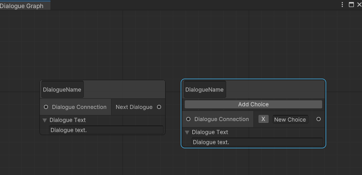

#### 2.3 Ports

<font color=#bc8df9>Graph View</font>的变量<font color=#4db8ff>Ports</font>，保存了<font color=#bc8df9>Graph View</font>中所有的<font color=#FFCE70>Port</font>

我们可以使用遍历去判断当前迭代的<font color=#FFCE70>Port</font>和我们选择的<font color=#4db8ff>Ports</font>是否兼容

#### 2.4 Group

通过控制器来操作，与通过菜单栏中添加<font color=#FFCE70>SingleNode、MultipleNode</font>一样，接受的参数为<font color=#4db8ff>Title 和 Position</font>

```c#
private IManipulator CreateGroupContextualMenu()
{
    ContextualMenuManipulator contextlMenuManipulartor = new ContextualMenuManipulator(
        menuEvet => menuEvet.menu.AppendAction("Add Group", 
                                               actionEvent => AddElement(CreateGroup("DialogueGroup",actionEvent.eventInfo.localMousePosition)))
    );
    return contextlMenuManipulartor;
}
```

其中在函数中返回<font color=#bc8df9>Group</font>，它是<font color=#66ff66>UnityEditor.Experimental.GraphView</font>中的类，可以作为<font color=#4db8ff>Node</font>容器，并且还有一些回调函数

```c#
public Group CreateGroup(String title, Vector2 position)
{
    Group group = new Group
    {
        title = title
    };
    group.SetPosition(new Rect(position,Vector2.zero));

    return group;
}
```

#### 2.5 Utility

将重复创建的内容进行优化架构，如：<font color=#bc8df9>Button、Foldout、Port、TextField</font>，这样我们可以不用一直<font color=#4db8ff>Load</font>

<font color=#bc8df9>this</font>，在参数中添加<font color="red">This</font>，可以在调用函数时起作用，意思是引用<font color=#4db8ff>Nobe</font>本身

<font color=#bc8df9>params</font>，允许逗号分割多个变量

```c#
public static void AddStyleSheets(this VisualElement element, params string[] styleSheetNames){}
```

其中<font color=#4db8ff>Utility</font>，是为了<font color=#66ff66>extend</font>脚本

```c#
using UnityEngine.UIElements;
namespace DS.Utilities
{
    public static class DSElementUtility
    {
        public static TextField CreateTextField(string value = null,
                                                EventCallback<ChangeEvent<string>> onValueChanged = null)
        {
            TextField textField = new TextField()
            {
                value = value
            };
            if (onValueChanged !=null)
            {
                textField.RegisterValueChangedCallback(onValueChanged);
            }

            return textField;
        }

        //Dialogue TextField
        public static TextField CreateTextArea(string value = null,
                                               EventCallback<ChangeEvent<string>> onValueChanged = null)
        {
            TextField textArea = CreateTextField(value, onValueChanged);
            textArea.multiline = true;
            return textArea;
        }
    }
}
```

随后将相关内容替代

```c#
Foldout textFoldout = DSElementUtility.CreateFoldout("Dialogue Text");
TextField textFile = DSElementUtility.CreateTextArea(DialogueName);
```

同时对<font color=#bc8df9>Foldout</font>与<font color=#bc8df9>Button</font>也如此操作

<font color=#4db8ff>Link：</font>https://github.com/onlyyz/Custom/commit/f919db95d41738b4c21be5b055db0a80227b9824

#### 2.6 Search

<font color=#bc8df9>CreateSearchTree</font>，负责创建搜索树内容创建或者填充菜单

<font color=#bc8df9>OnSelectEntry</font>，在按下菜单选项会发生什么

<font color=#66ff66>UserData</font>会在<font color=#bc8df9>OnSelectEntry</font>中检查选择了那个选项 

### 三、Save Data

#### 3.1 Node Dictionary 

<font color=#4db8ff>Node</font>，使用字典进行保存，利用<font color=#4db8ff>String</font>判断是否存在相同名字的<font color=#4db8ff>Node</font>，因此字典接口如下

```c#
Dictionary<NodeName, List<Node>>
```

因此字典的保存序列化，可以利用序列化脚本

<font color=#4db8ff>Code Link：</font>https://pastebin.com/zsy1tNRb

当我们保存<font color=#4db8ff>Node</font>到字典容器的时候，由于<font color="red">Key - Value</font>匹配，因此，我们<font color=#66ff66>Node Name Only</font>，当重复的时候，我们需要使用颜色去提示，因此需要去添加两个脚本

一个负责提供颜色的脚本

```c#
using UnityEngine;
namespace DS.Error
{
    public class DSErrorData
    {
        public DSErrorData(){GenerateRandmoColor();}
        public Color Color { get; set; }
        
        private void GenerateRandmoColor()
        {
            Color = new Color32
            ((byte)Random.Range(65,266), (byte)Random.Range(50,176),(byte)Random.Range(50,176),255);
        }}}
```

另一个脚本是负责保存<font color=#FFCE70>Color、Node</font>，其中利用<font color=#4db8ff>Node</font>遍历<font color=#66ff66>NodeName</font>，判断是否有名字重复的节点，如果有就修改其颜色

因此需要有容器去保存<font color=#4db8ff>Node</font>

```c#
using System.Collections;
using System.Collections.Generic;
using UnityEngine;
namespace DS.Data.Error
{
    using DS.Error;
    using Elements;
    public class DSNodeErrorData
    {
        public DSErrorData ErrorData { get; set; }
        public List<DSNode> Nodes { get; set; }

        public DSNodeErrorData()
        {
            ErrorData = new DSErrorData();
            Nodes = new List<DSNode>();
        }
    }
}
```

因此，我们需要<font color=#4db8ff>Node</font>中添加两个变量，用于修改节点的颜色属性，其中<font color=#66ff66>defaultBackgroundColor</font>由我们自己设置

```c#
public void SetErrorStyle(Color color)
{
    mainContainer.style.backgroundColor = color;
}
public void ResetStyle()
{
    mainContainer.style.backgroundColor = defaultBackgroundColor;
}
```

在 <font color=#bc8df9>Graph View</font>中添加脚本的时候，我们需要将每个<font color=#4db8ff>Node</font>添加至字典中，因此需要在 <font color=#bc8df9>Graph View</font>初始化时候初始化字典容器

```c#
public DSGraphView(DSEditorWindow dsEditorWindow)
{
    editorWindow = dsEditorWindow;
    ungroupedNodes = new SerializableDictionary<string, DSNodeErrorData>();

    AddManipulators();
    AddSearchWindow();
    AddGridBackground();
    
    AddStyles();
}
```

在<font color=#bc8df9>Dictionary</font>判断上，我们需要两个函数，一个负责将<font color=#4db8ff>Node</font>创建的时候进行判断

1、是否用重名节点，如果不存在，创建<font color=#bc8df9>Dictionary</font> <font color=#4db8ff>Node</font> 将其加入<font color=#66ff66>List</font>中的<font color=#4db8ff>Node</font> 数组中，随后将其存入<font color=#bc8df9>Dictionary</font>

```C#
public void AddUngroupedNode(DSNode node)
{
    string nodeName = node.DialogueName;

    //check same Node   not'
    if (!ungroupedNodes.ContainsKey(nodeName))
    {
        //Colors and the Nodes
        DSNodeErrorData nodeErrorData = new DSNodeErrorData();
        
        nodeErrorData.Nodes.Add(node);
        ungroupedNodes.Add(nodeName,nodeErrorData);
        return;
    }
}
```

2、 如果存在同名节点，那么我们也将其加入<font color=#66ff66>List</font>中的<font color=#4db8ff>Node</font> 数组中，需要修改它的color为<font color=#FD00FF>错误颜色</font>，让其在<font color=#bc8df9>Graph view</font>中显示出来

同时让第一个<font color=#4db8ff>Node</font>也显示<font color=#FD00FF>错误颜色</font>

```c#
List<DSNode> ungroupedNodesList = ungroupedNodes[nodeName].Nodes;
ungroupedNodesList.Add(node);
Color errorColor = ungroupedNodes[nodeName].ErrorData.Color;
node.SetErrorStyle(errorColor);

if (ungroupedNodesList.Count == 2)
{
    ungroupedNodesList[0].SetErrorStyle(errorColor);
}
```

第二个函数，当我们<font color=#4db8ff>Node</font>不再同名，那么我们需要做几件事

1、首先将他从<font color=#bc8df9>Dictionary</font>从移除，随后将其<font color=#FD00FF>错误颜色</font>设置为我们设置的默认颜色，然后将其移除<font color=#66ff66>List</font>中的<font color=#4db8ff>Node</font> 数组

随后判断<font color=#4db8ff>Node</font>，第一个<font color=#4db8ff>Node</font>颜色也设置为正常

如果没有<font color=#4db8ff>Node</font>，则将其从字典中删除

```c#
//if the name same but change the name for node, need remove the node error color in the Graph view
public void RemoveUngroundedNode(DSNode node)
{
    string nodeName = node.DialogueName;
    List<DSNode> ungroupedNodesList = ungroupedNodes[nodeName].Nodes;

    ungroupedNodesList.Remove(node);
    node.ResetStyle();
    if (ungroupedNodesList.Count == 1)
    {
        ungroupedNodesList[0].ResetStyle();
        return;
    }

    //delete the element for the Dictionary
    if (ungroupedNodesList.Count == 0)
    {
        ungroupedNodes.Remove(nodeName);
    }
}
```

关于两个函数调用，我们可以利用回调函数进行操作，在<font color=#FFCE70>DSNode</font>中操作，当<font color=#66ff66>TextField</font>的内容发生改变的时候，我们调用回调函数

将当前的<font color=#4db8ff>Node</font> ；利用函数<font color=#bc8df9>RemoveUngroundedNode</font>移除<font color=#66ff66>List</font>中的<font color=#4db8ff>Node</font> 数组

随后修改名字，再利用函数<font color=#bc8df9>AddUngroupedNode</font>添加到<font color=#66ff66>List</font>中的<font color=#4db8ff>Node</font> 数组中

```c#
public virtual void Draw()
        {

            TextField dialogueNameTextField = DSElementUtility.CreateTextField(DialogueName,
                callback =>
                {
                    graphView.RemoveUngroundedNode(this);
                    DialogueName = callback.newValue;
                    graphView.AddUngroupedNode(this);
                });

            dialogueNameTextField.AddClasses
                (
                    "ds-node_textfield",
                    "ds-node_filename-textfield",
                    "ds-node_textfield"
                );
            
            titleContainer.Insert(0,dialogueNameTextField);
}
```

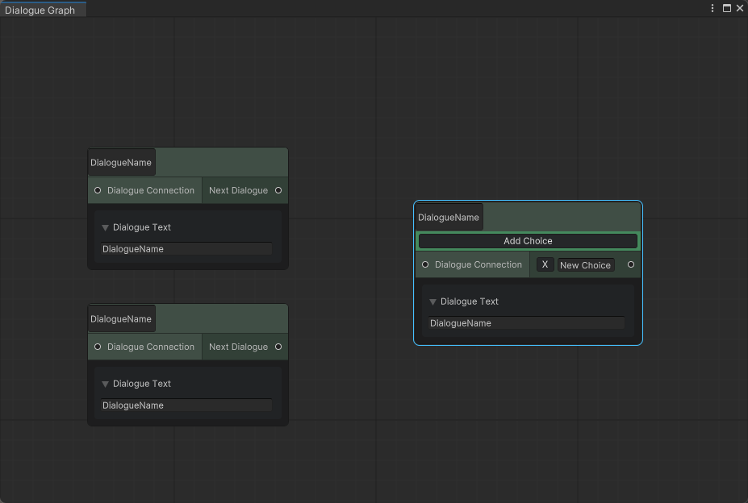<font color=#4db8ff>Code Link：</font>https://github.com/onlyyz/Custom/commit/eee8658c2fba70af689b7b3d21d096e619e06b04#diff-796935974d7d4daa2b43a3132da9a613676e45e78fb41c0d561755b1c27fead3

#### 3.2 Call Back

但是此时删除<font color=#4db8ff>Node</font>会出现错误，因为删除<font color=#4db8ff>Node</font>，我们并没有将其移除<font color=#66ff66>List</font>中的<font color=#4db8ff>Node</font> 数组，因此需要调整代码 ，可以再次利用回调函数

Unity的<font color=#bc8df9>Graph view</font>提供了一个关于删除的回调函数<font color=#bc8df9>GraphView .deleteSelection</font>，当<font color=#4db8ff>Node</font>被删除时调用

<font color=#4db8ff>deleteSelection:</font>https://docs.unity3d.com/ScriptReference/Experimental.GraphView.GraphView-deleteSelection.html

首先，我们注册回调函数，随后遍历<font color="red">selection</font>，选择的<font color=#4db8ff>Node</font>是否是我们允许删除的节点，随后将其从<font color=#66ff66>List</font>中的<font color=#4db8ff>Node</font> 数组中移除，随后再将其冲<font color=#bc8df9>Graph view</font>中移除

```c#
#region CallBack

    //node delete call back function will remove the node at the data list
private void OnElementsDeleted()
{
    deleteSelection = (operationName, askUser) =>
    {
        List<DSNode> nodesToDelete = new List<DSNode>();
        foreach (GraphElement element in selection)
        {
            //mode 
            if (element is DSNode node)
            {
                nodesToDelete.Add(node);
                continue;
            }
        }
        foreach (var node in nodesToDelete)
        {
            RemoveUngroundedNode(node);
            RemoveElement(node);
        }
    };
}
```

我们可以注册回调函数，在<font color=#bc8df9>DSGraphView</font>的构造函数中

```c#
public DSGraphView(DSEditorWindow dsEditorWindow)
{
    editorWindow = dsEditorWindow;
    ungroupedNodes = new SerializableDictionary<string, DSNodeErrorData>();

    AddManipulators();
    AddSearchWindow();
    AddGridBackground();

    OnElementsDeleted();

    AddStyles();

}
```

<font color=#4db8ff>Link：</font>https://github.com/onlyyz/Custom/commit/0c4fa65cc08863764ae565a0b28b120246080b52

#### 3.3 Dictionary Group

<font color=#FFCE70> Video 20</font>

其中<font color=#66ff66>group</font>里的<font color=#4db8ff>Node</font>，也应该如此操作，但是此时作用域因该在<font color=#66ff66>group</font>，而与其他<font color=#4db8ff>Node</font>无关

```c#
public class DSGraphView : GraphView
{
    private DSEditorWindow editorWindow;
    private DSSearchWindow searchWindow;

    private SerializableDictionary<String, DSNodeErrorData> ungroupedNodes;
    private SerializableDictionary<Group, SerializableDictionary<String, DSNodeErrorData>> groupNodes;
    public DSGraphView(DSEditorWindow dsEditorWindow)
    {
        editorWindow = dsEditorWindow;
        ungroupedNodes = new SerializableDictionary<string, DSNodeErrorData>();
        groupNodes = new SerializableDictionary<Group, SerializableDictionary<string, DSNodeErrorData>>();
    }
```

其中也是用回调函数进行操作，其中接受两个参数<font color=#bc8df9>Group，Elements</font>

<font color=#4db8ff>elementsAddedToGroup Link：</font>https://docs.unity3d.com/ScriptReference/Experimental.GraphView.GraphView-elementsAddedToGroup.html

首先，我们将<font color=#4db8ff>element</font>从<font color=#bc8df9>Graph view</font>中添加到<font color=#66ff66>Group</font>，这个时候就需要将<font color=#4db8ff>Node</font>从<font color=#bc8df9>Graph view</font>的<font color=#66ff66>List</font>中的<font color=#4db8ff>Node</font> 数组中移除

随后添加到<font color=#66ff66>Group</font>字典中的<font color=#66ff66>List</font>中的<font color=#4db8ff>Node</font> 数组中

同样的当我们从<font color=#66ff66>Group</font>中移除<font color=#4db8ff>Node</font>或者添加到<font color=#bc8df9>Graph view</font>，我们需要进行相反的操作

添加部分，首先遍历<font color="red">selection</font>，选择的<font color=#4db8ff>Node</font>是否是我们允许添加的节点，随后将其从<font color=#66ff66>List</font>中的<font color=#4db8ff>Node</font> 数组中移除，随后再将其冲<font color=#bc8df9>Graph view</font>中移除，随后添加到<font color=#66ff66>Group</font>

1、<font color=#4db8ff>Node</font>类型的判断

```c#
private void OnGroupElemetAdded()
        {
            elementsAddedToGroup = (group, elements) =>
            {
                foreach (GraphElement element in elements)
                {
                    if (!(element is DSNode))
                    {
                        continue;
                    }

                    DSNode node = (DSNode) element;
                    RemoveUngroundedNode(node);

                    AddGroupedNode(node,group);
                }
            }; 
        }
```

与<font color=#66ff66>AddUngroupedNode</font>类似，我们首选判断是否有同名的<font color=#4db8ff>Group</font>，随后在<font color=#4db8ff>List\<Group\> </font>若无则，

初始化一个字典容器去 <font color=#4db8ff>Key</font>为<font color=#66ff66>Group</font>，<font color=#4db8ff>Value</font> 为 字典<font color=#bc8df9>new SerializableDictionary<string, DSNodeErrorData></font>

两次判断，同名<font color=#4db8ff>Group，Node</font>

```c#
public void AddGroupedNode(DSNode node, Group group)
{
    string nodeName = node.DialogueName;
    //Same name group
    if (!groupNodes.ContainsKey(group))
    {
        groupNodes.Add(group,new SerializableDictionary<string, DSNodeErrorData>());
    }

    if (!groupNodes[group].ContainsKey(nodeName))
    {
        //Colors and the Nodes
        DSNodeErrorData nodeErrorData = new DSNodeErrorData();

        nodeErrorData.Nodes.Add(node);
        groupNodes[group].Add(nodeName,nodeErrorData);
        return;
    }
}
```

其他部分与前面相同设置颜色

```c#
List<DSNode> groupedNodeList = groupNodes[group][nodeName].Nodes;
groupedNodeList.Add(node);
Color errorColor = groupNodes[group][nodeName].ErrorData.Color;

node.SetErrorStyle(errorColor);

if (groupedNodeList.Count == 2)
{
    groupedNodeList[0].SetErrorStyle(errorColor);
}
```

当<font color=#4db8ff>Node</font>从<font color=#66ff66>Group</font>中移除的时候，我们应该从<font color=#66ff66>Group</font>中移除<font color=#4db8ff>Node</font>，随后将<font color=#4db8ff>Node</font>加入<font color=#bc8df9>Graph view</font>的字典中，这个本质是从<font color=#66ff66>Group</font>删除<font color=#4db8ff>Node</font>，因此可以利用回调函数进行操作

<font color=#4db8ff>elementsRemovedFromGroup：</font>https://docs.unity3d.com/ScriptReference/30_search.html?q=Experimental.GraphView.GraphView.elementsRemovedFromGroup

先筛选出符合条件的<font color=#4db8ff>Node</font>

```c#
private void OnGroupElementsRemoved()
{
    elementsRemovedFromGroup = (group, elements) =>
    {
        foreach (GraphElement element in elements)
        {
            if (!(element is DSNode)){continue;}
            DSNode node = (DSNode) element;
        }
    };
}
```

随后执行以下操作，从<font color="blue">group</font> 中将<font color=#4db8ff>Node</font> 移除并且重置其<font color=#4db8ff>Style</font>

```c#
//Remove node form group and add to graph view
RemoveGroupedNode(node,group);
AddUngroupedNode(node);
...

public void RemoveGroupedNode(DSNode node, Group group)
{
    string nodeName = node.DialogueName;
    List<DSNode> groupedNodesList = groupNodes[group][nodeName].Nodes;
    groupedNodesList.Remove(node);
    node.ResetStyle();

    if (groupedNodesList.Count ==1)
    {
        groupedNodesList[0].ResetStyle();   
        return;
    }

    if (groupedNodesList.Count ==0)
    {
        groupNodes[group].Remove(nodeName);
        if (groupNodes[group].Count == 0)
        {
            groupNodes.Remove(group);
        }
    }

}
```

但是此时更新<font color=#4db8ff>Name</font>，会将<font color=#4db8ff>Node</font>从<font color=#bc8df9>Graph view</font>的字典中删除，但是实际上他在<font color=#66ff66>Group</font>的字典中，因此无、哦们需要增加判断条件，是否在<font color=#66ff66>Group</font>

因此我们可以给<font color=#4db8ff>Node</font>添加一个<font color=#66ff66>Group</font>属性

```c#
public class DSNode : Node
{
    public string DialogueName { get; set; }
    public List<string> Choices { get; set; }
    public string Text { get; set; }
    public DSDialogueType DialogueType { get; set; }
    public Group Group { get; set; }
    private DSGraphView graphView;
    private Color defaultBackgroundColor;
    ...
}
```

当添加到<font color=#66ff66>Group</font>和移除时都需要修改这个变量，因此我们需要修改代码

```c#
//AddGroupedNode
string nodeName = node.DialogueName;
node.Group = group;
//RemoveGroupedNode
string nodeName = node.DialogueName;
node.Group = null;
```

更新<font color=#4db8ff>Node</font>中的回调函数

```c#
TextField dialogueNameTextField = DSElementUtility.CreateTextField(DialogueName,
callback =>
{
    if (Group==null)
    {
        graphView.RemoveUngroundedNode(this);
        DialogueName = callback.newValue;
        graphView.AddUngroupedNode(this);
        return;
    }

    Group currenGroup = Group;

    graphView.RemoveGroupedNode(this,Group);
    DialogueName = callback.newValue;
    graphView.AddGroupedNode(this,currenGroup);

});
```

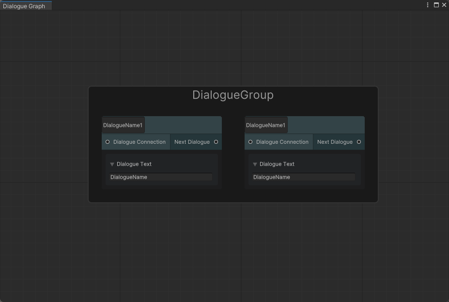

同样的删除<font color=#4db8ff>Node</font>的时候，我们也需要修改其回调函数

```c#
//Graph view OnElementsDeleted
foreach (var node in nodesToDelete)
{
    if (node.Group != null)
    {
        node.Group.RemoveElement(node);
    }
    RemoveUngroundedNode(node);
    RemoveElement(node);
}
```

<font color=#4db8ff>Link：</font>https://docs.unity3d.com/ScriptReference/30_search.html?q=Experimental.GraphView.Scope.RemoveElement

#### 3.4 Same Group

为了能够设置<font color=#66ff66>Group</font>相关数据，因此我们需要创建自己的<font color=#66ff66>Group</font>，与<font color=#4db8ff>Node</font>一样创建一个基类

```c#
using System.Collections;
using System.Collections.Generic;
using UnityEditor.Experimental.GraphView;
using UnityEngine;

namespace DS.Elements
{
    using Enumerations;
    using Utilities;
    using Winndos;
    public class DSGroup : Group
    {
        private Color defaultBackgroundColor;
        private float defaultBorderWidth;
        public DSGroup(string groupTitle, Vector2 position)
        {
            defaultBackgroundColor = contentContainer.style.borderBottomColor.value;
            defaultBorderWidth = contentContainer.style.borderBottomWidth.value;

            title = groupTitle;
            SetPosition(new Rect(position,Vector2.zero));
        }
        
        #region Style
        public void SetErrorStyle(Color color)
        {
            contentContainer.style.backgroundColor = color;
            contentContainer.style.borderBottomWidth = 2.0f;
        }
        public void ResetStyle()
        {
            contentContainer.style.backgroundColor = defaultBackgroundColor;
            contentContainer.style.borderBottomWidth = defaultBorderWidth;
        }
        #endregion
    }
}
```

其中我们将在一脚本中更新它，首选是<font color=#bc8df9>DSGraphView</font>

```c#
//DSGraphView
public DSGroup CreateGroup(String title, Vector2 position)
{
    DSGroup group = new DSGroup(title, position);
    return group;
}
...
    public void AddGroupedNode(DSNode node, DSGroup group)
{}

private void OnGroupElementAdded()
{
    ...
    DSGroup nodeGroup = (DSGroup)group;
    DSNode node = (DSNode) element;
    RemoveUngroundedNode(node);
    AddGroupedNode(node,nodeGroup);
    ...
}
```

随后是<font color=#4db8ff>DSNode</font>中的回调函数中

```c#
 public DSGroup Group { get; set; }
...
TextField dialogueNameTextField = DSElementUtility.CreateTextField(DialogueName,
                callback =>
{
    ...
        DSGroup currenGroup = Group;

    graphView.RemoveGroupedNode(this,Group);
    DialogueName = callback.newValue;
    graphView.AddGroupedNode(this,currenGroup);
                    
});
```

随后是<font color=#66ff66>DSGroupErrorData</font>

```c#
public class DSGroupErrorData
{
    public DSErrorData ErrorData { get; set; }
    public List<DSGroup> Groups { get; set; }

    public DSGroupErrorData()
    {
        ErrorData = new DSErrorData();
        Groups = new List<DSGroup>();
    }
}
```

最后是<font color=#66ff66>DSSearchWindow</font>

```c#
case Group _:
{
    DSGroup group = graphView.CreateGroup("DialogueGroup", localMousePosition);
    graphView.AddElement(group);
    return true;
}
```

#### 3.5 Group  Dictionary

随后是初始化等操作

```c#
public class DSGraphView : GraphView
{
    private DSEditorWindow editorWindow;
    private DSSearchWindow searchWindow;

    private SerializableDictionary<String, DSNodeErrorData> ungroupedNodes;
    private SerializableDictionary<String, DSNodeErrorData> groups;
    private SerializableDictionary<Group, SerializableDictionary<String, DSNodeErrorData>> groupNodes;
    public DSGraphView(DSEditorWindow dsEditorWindow)
    {
        editorWindow = dsEditorWindow;
        ungroupedNodes = new SerializableDictionary<string, DSNodeErrorData>();
        groups = new SerializableDictionary<string, DSNodeErrorData>();
        groupNodes = new SerializableDictionary<Group, SerializableDictionary<string, DSNodeErrorData>>();
        
        ...
    }
```

我们的操作只有<font color=#bc8df9>AddGroup</font>和<font color=#bc8df9>RemoveGroup</font>，操作与非<font color=#66ff66>Group <font color=#4db8ff>Node</font> 操作类似</font>，但是这里针对的是<font color=#66ff66>Group</font>，因此，可以使用<font color=#4db8ff>Node </font>想通思路

1、同名<font color=#66ff66>Group</font>，<font color=#FD00FF>Error Color</font>，判断数量

2、没有同名，直接加入

```c#
private void AddGroup(DSGroup group)
{
    string groupName = group.title;
    if (!groups.ContainsKey(groupName))
    {
        DSGroupErrorData groupErrorData = new DSGroupErrorData();

        groupErrorData.Groups.Add(group);
        groups.Add(groupName,groupErrorData);
        return;
    }

    //error color
    List<DSGroup> groupsList = groups[groupName].Groups;

    groupsList.Add(group);
    Color errorColor = groups[groupName].ErrorData.Color;
    group.SetErrorStyle(errorColor);

    if (groupsList.Count ==2)
    {
        groupsList[0].SetErrorStyle(errorColor);
    }
}
```

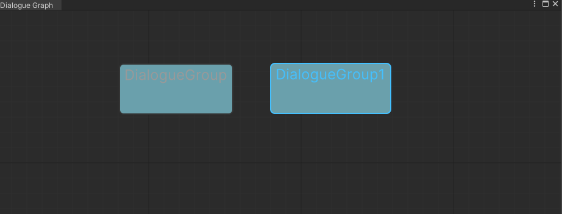

但是我们现在还没发删除<font color=#66ff66>Group</font>，因此我们需要再回调函数<font color=#4db8ff>deleteSelection</font>中识别它

```c#
private void OnElementsDeleted()
{
    Type groupType = typeof(DSGroup);
    deleteSelection = (operationName, askUser) =>
    {
        List<DSGroup> groupsToDelete = new List<DSGroup>();
        List<DSNode> nodesToDelete = new List<DSNode>();
        foreach (GraphElement element in selection)
        {
            ...
            if (element.GetType() != groupType)
            {
                continue;
            }

            DSGroup group = (DSGroup)element;

            RemoveGroup(group);
            groupsToDelete.Add(group);
        }

        foreach (var group in groupsToDelete)
        {
            RemoveElement(group);
        }

        foreach (var node in nodesToDelete)
        {
           ...
        }
	};
}
```

其中<font color=#66ff66>RemoveGroup</font>我们会如下操作

1、将当前的<font color=#4db8ff>Group</font>从<font color=#FFCE70>List</font> 中移除，设置颜色样式

2、判断同名<font color=#4db8ff>Group</font>的数量，1 将颜色设置回默认，0 将这个名字的<font color=#4db8ff>Group</font>从字典中删除

```c#
public void RemoveGroup(DSGroup group)
{
    string groupName = group.title;
    List<DSGroup> groupsList = groups[groupName].Groups;

    groupsList.Remove(group);
    group.ResetStyle();

    if (groupsList.Count == 1)
    {
        groupsList[0].ResetStyle();
    }

    if (groupsList.Count == 0)
    {
        groups.Remove(groupName);
    }
}
```

但是此时如果给<font color=#4db8ff>Group</font>改名<font color=#FFCE70>ErrorColor</font>不会消失，因此，我们需要添加回调函数，Unity 为我们提供了回调函数

<font color=#bc8df9>OnGroupRenamed：</font>https://docs.unity3d.com/ScriptReference/Experimental.GraphView.Group.OnGroupRenamed.html

回调函数：<font color=#bc8df9>groupTitleChanged：</font>https://docs.unity3d.com/ScriptReference/30_search.html?q=Experimental.GraphView.GraphView.groupTitleChanged

但是回调函数，我们无法获得旧的<font color=#4db8ff>Name</font>，因此我们需要保存它

```C#
public class DSGroup : Group
{
    private Color defaultBackgroundColor;
    private float defaultBorderWidth;
    public string oldTitle;
    public DSGroup(string groupTitle, Vector2 position)
    {
        defaultBackgroundColor = contentContainer.style.borderBottomColor.value;
        defaultBorderWidth = contentContainer.style.borderBottomWidth.value;

        title = groupTitle;
        oldTitle = groupTitle;
        SetPosition(new Rect(position,Vector2.zero));
    }
    ...
}
```

创建一个回调方法<font color=#66ff66>OnGroupRenamed</font>

```c#
private void OnGroupRenamed()
{
    groupTitleChanged = (group, newTitle) =>
    {
        DSGroup dsGroup = (DSGroup) group;

        RemoveGroup(dsGroup);
        dsGroup.oldTitle = newTitle;
        AddGroup(dsGroup);
    };
}
```

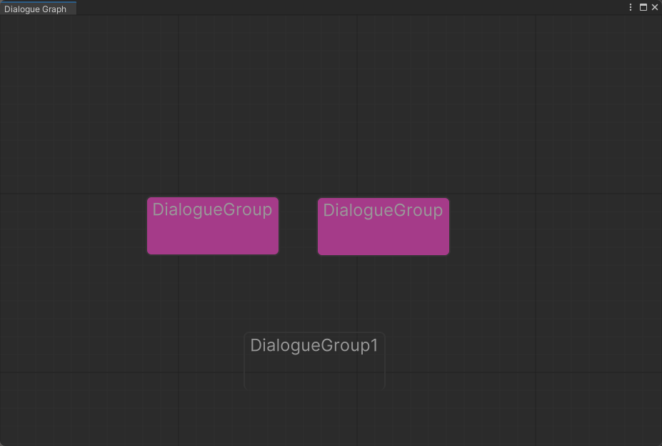

<font color=#4db8ff>Code Link：</font>https://github.com/onlyyz/Custom/commit/7add3624e62ea94d1800272658d2f57f6b055f97

#### 3.6 select node to group

可以迭代<font color=#bc8df9>Graph view</font>的选择列表

```c#
public DSGroup CreateGroup(String title, Vector2 position)
{
    DSGroup group = new DSGroup(title, position);

    foreach (GraphElement element in selection)
    {
        if (!(element is DSNode))
        {
            continue;
        }

        DSNode node = (DSNode)element;
        group.AddElement(node);
    }

    AddGroup(group);
    return group;
}
```

但是此时<font color=#4db8ff>node</font>并没有加入 <font color=#66ff66>Group</font>的<font color=#FFCE70>NodeList</font>中，所以会有同名提示，因此我们需要处理

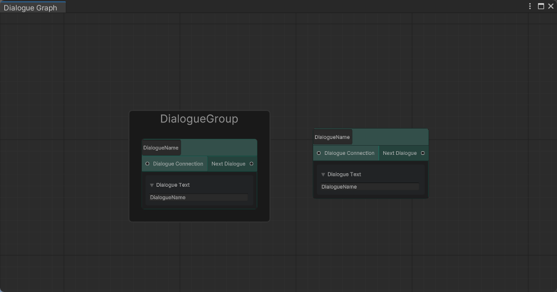

在回调函数<font color=#66ff66>OnGroupElementAdded</font>中尝试Debug

```c#
private void OnGroupElementAdded()
{
    elementsAddedToGroup = (group, elements) =>
    {
        foreach (GraphElement element in elements)
        {
            ...
            DSNode node = (DSNode) element;

            Debug.Log("Call Back Function called");
            ...
        }
    }; 
}
```

在Unity中调试可以发现，回调函数没有被调用，因此需要进行修复


因此，当我们将选定的节点添加到<font color=#66ff66>Group</font>中时，<font color=#66ff66>Group</font>还没添加到<font color=#bc8df9>Graph view </font>，只有创建<font color=#66ff66>Group</font>的函数返回时，才会添加到<font color=#bc8df9>Graph view </font>

因此我们<font color=#bc8df9>Graph View</font>中监听<font color=#66ff66>Group</font>，我们只要先添加<font color=#66ff66>Group</font>，随后<font color=#4db8ff>Node</font>

```c#
public DSGroup CreateGroup(String title, Vector2 position)
{
    DSGroup group = new DSGroup(title, position);

    AddGroup(group);
    AddElement(group);
    ...
}
```

修改相关的区域，我们是自己内部直接将<font color=#66ff66>Group</font>添加到<font color=#bc8df9>Graph view</font>，因此可以删除那些当函数返回堆栈时的添加方法

```c#
private IManipulator CreateGroupContextualMenu()
{
    ContextualMenuManipulator contextlMenuManipulartor = new ContextualMenuManipulator(
        menuEvet => menuEvet.menu.AppendAction("Add Group", 
                                               actionEvent => CreateGroup("DialogueGroup",GetLocalMousePosition(actionEvent.eventInfo.localMousePosition))));
    return contextlMenuManipulartor;
}
```

搜索树可以直接清除前面的变量，只调用函数方法

```c#
case Group _:
{
    graphView.CreateGroup("DialogueGroup", localMousePosition);
    return true;
}
```

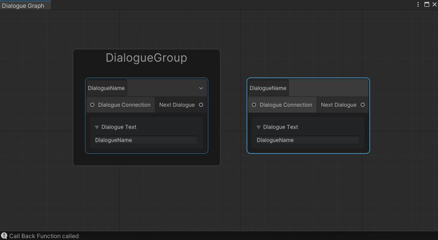

可以看到回调函数<font color=#FD00FF>Debug</font>

#### 3.7 delete Group

现在我们需要再删除<font color=#66ff66>Group</font>时，将里面内部的设置为<font color=#66ff66>graph view </font>的<font color=#4db8ff>Node</font>，原因是我们重写了<font color=#FFCE70>deleteSelection</font>

因此它不再通过<font color=#FD00FF>RemoveElement</font>自动删除<font color=#4db8ff>Node</font>，也不会为我们<font color=#4db8ff>OnGroupElementRemoved</font>

 我们可以迭代<font color=#66ff66>Group</font>的<font color=#4db8ff>Node</font>，随后利用<font color=#FD00FF>RemoveElement</font>，这将为每个<font color=#4db8ff>Node</font>调用<font color=#bc8df9>Graph View</font>的回调函数<font color=#bc8df9>elementsRemovedFormGroup</font>回调函数

在<font color=#66ff66>OnElementsDeleted</font>上操作

```c#
private void OnElementsDeleted()
{
    Type groupType = typeof(DSGroup);
    deleteSelection = (operationName, askUser) =>
    {
        List<DSGroup> groupsToDelete = new List<DSGroup>();
        List<DSNode> nodesToDelete = new List<DSNode>();
        foreach (GraphElement element in selection)
        {
            //mode 
            if (element is DSNode node)
            {
                nodesToDelete.Add(node);
                continue;
            }

            if (element.GetType() != groupType)
            {
                continue;
            }

            DSGroup group = (DSGroup)element;
            groupsToDelete.Add(group);
        }

        foreach (var group in groupsToDelete)
        {
            //delete the node in the group
            List<DSNode> groupNodes = new List<DSNode>();

            foreach (GraphElement groupElement in group.containedElements)
            {
                if (!(groupElement is DSNode))
                {
                    continue;
                }

                //get delete node 
                groupNodes.Add((DSNode)groupElement);
            }
            //remove the node at the group
            group.RemoveElements(groupNodes);

            RemoveGroup(group);
            RemoveElement(group);
        }
        ...
    };
}
```


<font color=#4db8ff>Code Link：</font>https://github.com/onlyyz/Custom/commit/a0c16f52f005e1dccffe24b114125955e6e3efb3

#### 3.8 Remove Port

<font color=#FFCE70>video 23</font>

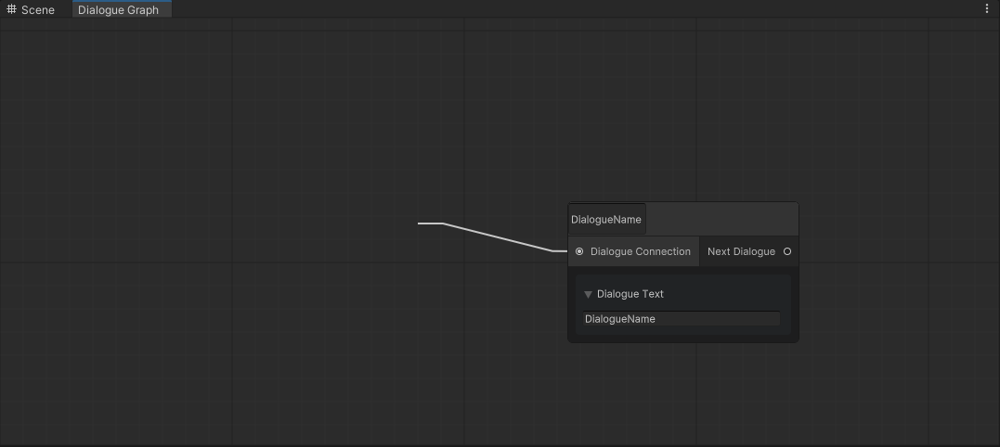

现在就算是删除<font color=#4db8ff>Node</font>，<font color=#66ff66>Edge </font>也不会被删除，因此我们需要处理这一部分的内容

我们可以在<font color=#bc8df9>deleteSelection</font>的回调函数中识别<font color=#66ff66>Edge </font>，随后利用<font color=#4db8ff>DeleteElements</font>删除，为什么是<font color="red">Delete</font>而是<font color=#4db8ff>Remove</font>，这是因为<font color=#bc8df9>Graph View</font>没有<font color=#4db8ff>RemoveElement</font>方法

因此我们需要先获得要删除的<font color=#66ff66>Edge </font>列表，随后利用<font color=#4db8ff>DeleteElements</font>

```c#
private void OnElementsDeleted()
{
    Type groupType = typeof(DSGroup);
    Type edgeType = typeof(Edge);

    deleteSelection = (operationName, askUser) =>
    {
        List<DSGroup> groupsToDelete = new List<DSGroup>();
        List<DSNode> nodesToDelete = new List<DSNode>();
        List<Edge> edgesToDelete = new ListStack<Edge>();
        foreach (GraphElement element in selection)
        {
            //mode 
            if (element is DSNode node)
            {
                nodesToDelete.Add(node);
                continue;
            }

            if (element.GetType() == edgeType)
            {
                edgesToDelete.Add((Edge) element);
                continue;
            }
            ...
        }

        //Remove the Elements

        DeleteElements(edgesToDelete);
        ...
    }
```

现在可以通过<font color="red">select</font>删除<font color=#66ff66>Edge </font>，但是删除<font color=#4db8ff>Node</font>，<font color=#66ff66>Edge </font>不会跟着消失，因此我们需要添加一个<font color=#bc8df9>DisconnectPorts</font>方法给<font color=#4db8ff>Node</font>

```c#
//DSNode
public void DisconnectAllPortS()
{
    DisconnectPorts(inputContainer);
    DisconnectPorts(outputContainer);
}


private void DisconnectPorts(VisualElement container)
{
    foreach (Port port in container.Children())
    {
        if (!port.connected)
        {
            continue;
        }

        graphView.DeleteElements(port.connections);
    }
}      
```

现在我们需要在删除所有的<font color=#4db8ff>Node</font>之前断开的连接

```c#
private void OnElementsDeleted()
{
    ...
    foreach (var node in nodesToDelete)
    {
        if (node.Group != null)
        {
            node.Group.RemoveElement(node);
        }
        RemoveUngroundedNode(node);

        node.DisconnectAllPortS();
        RemoveElement(node);
    }
    ...
}

```

现在我们就可以删除<font color=#4db8ff>Node</font>时，断开连接

#### 3.9 Node Menu

我们想为<font color=#4db8ff>Node</font>添加两个功能，删除<font color=#66ff66>Input Port</font>或者<font color=#66ff66>Output Port</font>的所有连接，我们可以为<font color=#4db8ff>Node</font>注册一个方法，利用<font color=#bc8df9>BuildContextualMenu</font>

```c#
public override void BuildContextualMenu(ContextualMenuPopulateEvent evt)
{
    evt.menu.AppendAction("Disconnect Input Ports", actionEvent =>
                          DisconnectInputPorts());
    evt.menu.AppendAction("Disconnect Output Ports", actionEvent =>
                          DisconnectOutputPorts());

    base.BuildContextualMenu(evt);
}
```

其中我们改写函数

```c#
public void DisconnectAllPortS()
{
    DisconnectInputPorts();
    DisconnectOutputPorts();
}

private void DisconnectInputPorts()
{
    DisconnectPorts(inputContainer);
}
private void DisconnectOutputPorts()
{
    DisconnectPorts(outputContainer);
}
```

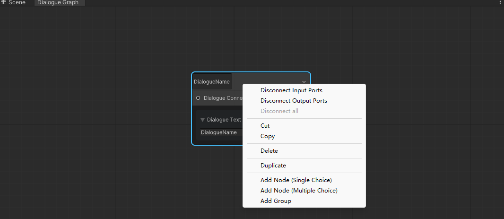

菜单栏上多了三个选项

#### 3.10 ToolBar

<font color=#FFCE70>video 24</font> 

可以利用工具栏去作为载体放置一些预制操作与功能，可以先创建一个简单的工具栏包含文件名以及保存按钮。当<font color=#bc8df9>Graph view </font>中出现同名错误时

将无法保存

因为工具栏是<font color=#4db8ff>Window</font>中的元素，它与<font color=#bc8df9>Grpah view</font>一样被添加到其中，因此，我们可以和<font color=#66ff66>AddGraphVIew</font>一样，创建一个<font color=#66ff66>AddToolbar</font>方法来管理工具栏

```c#
private readonly string defaultFileName = "Dialogue File";

...

private void AddToolbar()
{
    Toolbar toolbar = new Toolbar();

    //the TextField include the Call Back Function
    TextField fileNameTextField = DSElementUtility.CreateTextField(defaultFileName,"File Name:");
    // fileNameTextField.style.flexDirection = FlexDirection.Column;
    Button saveButton = DSElementUtility.CreateButton("Save");

    toolbar.Add(fileNameTextField);
    toolbar.Add(saveButton);

    rootVisualElement.Add(toolbar);
}
```

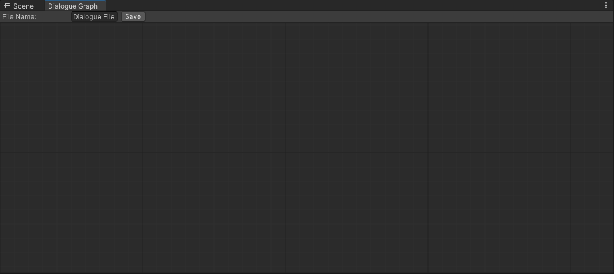

增加一个变量去check 是否有同名的<font color=#66ff66>Name</font>的<font color=#4db8ff>Node 和 Group</font>，通过计数判断，如果没有错误，则可以保存，因此需要再<font color=#bc8df9>Graph View</font>中添加一个变量检查

```c#
private int repeatedNamesAmount;

public int RepeatedNamesAmount
{
    get
    {
        return repeatedNamesAmount;
    }
    set
    {
        repeatedNamesAmount = value;

        if (repeatedNamesAmount == 0)
        {
            //Enable Save Button
        }

        if (repeatedNamesAmount == 1)
        {
            //Disable Save Button
        }
    }
}
```

为了可以操控<font color=#bc8df9>Button</font>，我们可以将其改为全局变量，随后利用函数操作

```c#
private readonly string defaultFileName = "Dialogue File";
private Button saveButton;

...
#region Utility Methods

    public void EnableSaving()
{
    saveButton.SetEnabled(true);
}

public void DisableSaving()
{
    saveButton.SetEnabled(false);
}
#endregion
```

随后方法在<font color=#bc8df9>Graph View</font> 中调用

```c#
public int RepeatedNamesAmount
{
    get
    {
        return repeatedNamesAmount;
    }
    set
    {
        repeatedNamesAmount = value;

        if (repeatedNamesAmount == 0)
        {
            //Enable Save Button
            editorWindow.EnableSaving();
        }

        if (repeatedNamesAmount == 1)
        {
            //Disable Save Button
            editorWindow.DisableSaving();
        }
    }
}
```

现在需要跟踪计数，当出现相同<font color=#4db8ff>Name</font>的<font color=#4db8ff>Node 和 Group</font>时，我们就将计数加1，移除时减1

因此我们可以在相同名判断处去添加

```c#
//AddUngroupedNode
if (ungroupedNodesList.Count == 2)
{
    ++RepeatedNamesAmount;
    ungroupedNodesList[0].SetErrorStyle(errorColor);
}
//RemoveUngroundedNode
if (ungroupedNodesList.Count == 1)
{
    --RepeatedNamesAmount;
    ungroupedNodesList[0].ResetStyle();
    return;
}
//AddGroup
if (groupsList.Count ==2)
{
    ++RepeatedNamesAmount;
    groupsList[0].SetErrorStyle(errorColor);
}
//AddGroupedNode
if (groupedNodeList.Count == 2)
{
    ++RepeatedNamesAmount;
    groupedNodeList[0].SetErrorStyle(errorColor);
}
//RemoveGroupedNode
if (groupedNodesList.Count ==1)
{
    --RepeatedNamesAmount;
    groupedNodesList[0].ResetStyle();   
    return;
}
//RemoveGroup
if (groupsList.Count == 1)
{
    --RepeatedNamesAmount;
    groupsList[0].ResetStyle();
    return;
}
```

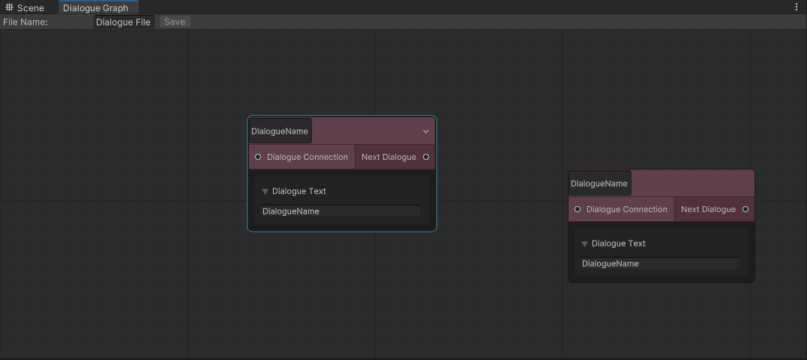

可以检测到，当出现同名错误的时候，<font color=#bc8df9>Button Save</font>，会失效，因此无法保存，但是修改名字之后，<font color=#bc8df9>Button Save</font>就可以恢复使用

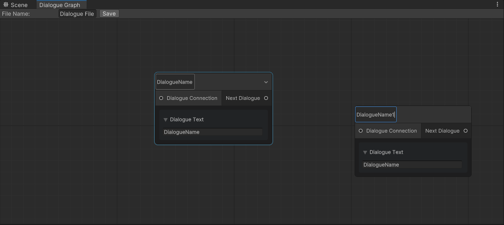

可以给<font color=#66ff66>Toolbar</font>添加样式

```c#
private void AddToolbar()
{
    Toolbar toolbar = new Toolbar();

    //the TextField include the Call Back Function
    TextField fileNameTextField = DSElementUtility.CreateTextField(defaultFileName,"File Name:");
    // fileNameTextField.style.flexDirection = FlexDirection.Column;
    saveButton = DSElementUtility.CreateButton("Save");
    toolbar.Add(fileNameTextField);
    toolbar.Add(saveButton);
    toolbar.AddStyleSheets("DialogueSystem/DSToolbarStyles.uss");
    rootVisualElement.Add(toolbar);
}
```

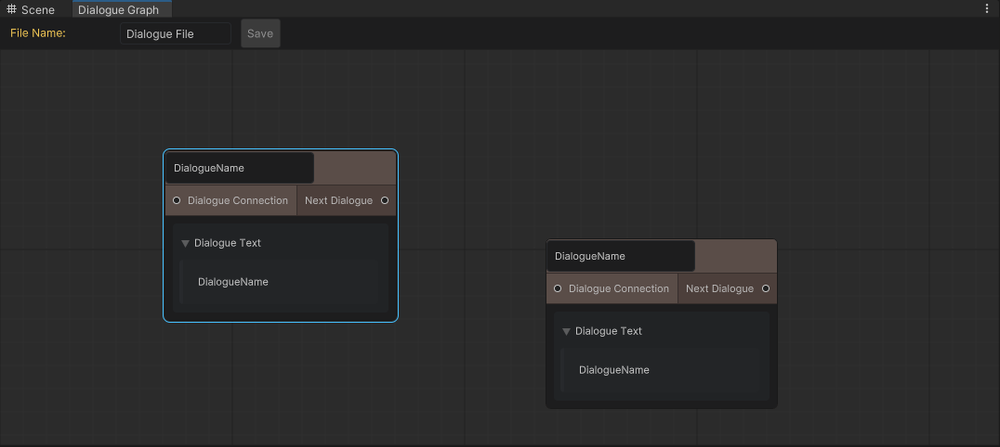

### 四、 

#### 4.1 Element Name

因为保存文件时，名字中不能存在空格，因此需要利用回调函数进行检查，利用脚本<font color=#FFCE70>Stackoverflow</font>

<font color=#4db8ff>Link：</font>https://pastebin.com/qSVNV0k7

作用是清除字符串中的空格以及其他特殊符号，随后返回更新的字符串，因此我们需要获取回调函数的值，我们可以利用<font color="red">Event.Target</font>

<font color=#4db8ff>Link：</font>https://docs.unity3d.com/ScriptReference/30_search.html?q=UIElements.EventBase.target

```c#
//DSNode
public virtual void Draw()
{

     TextField dialogueNameTextField = DSElementUtility.CreateTextField(DialogueName,null,
      callback =>
      {
          TextField target = (TextField) callback.target;
          target.value = callback.newValue.RemoveWhitespaces();

          if (Group==null)
          {
              graphView.RemoveUngroundedNode(this);
              DialogueName = target.value;
              graphView.AddUngroupedNode(this);
              return;
          }

          DSGroup currenGroup = Group;

          graphView.RemoveGroupedNode(this,Group);
          DialogueName = target.value;
          graphView.AddGroupedNode(this,currenGroup);
       });
}
```

对<font color=#4db8ff>Group</font>也同样如此操作

```c#
//DSGraph View
private void OnGroupRenamed()
{
    groupTitleChanged = (group, newTitle) =>
    {
        DSGroup dsGroup = (DSGroup) group;
        dsGroup.title = newTitle.RemoveWhitespaces();

        RemoveGroup(dsGroup);
        dsGroup.oldTitle =  dsGroup.title;
        AddGroup(dsGroup);
    };
}
```

对于<font color=#4db8ff>Toolbar</font>我们需要为它添加回调函数

```c#
fileNameTextField = DSElementUtility.CreateTextField(defaultFileName,"File Name:",
                                                     callback =>
{
    fileNameTextField.value = callback.newValue.RemoveWhitespaces();
});
```

同时为了区分大小写，为我们为创建的<font color=#4db8ff>Node，Group</font>的命名字符串末尾，添加一个<font color=#66ff66>ToLower()</font>

```c#
public void AddUngroupedNode(DSNode node)
{
    string nodeName = node.DialogueName.ToLower();
}
public void RemoveUngroundedNode(DSNode node)
{
    string nodeName = node.DialogueName.ToLower();
}
...
string nodeName = node.DialogueName.ToLower();
string nodeName = node.DialogueName.ToLower();
```

 同时我们需要检测特殊字符串，因此与使用<font color=#66ff66>RemoveWhitespaces()</font>，差不多

```c#
//Node Draw()
target.value = callback.newValue.RemoveWhitespaces().RemoveSpecialCharacters();
//Graph view OnGroupRenamed()
dsGroup.title = newTitle.RemoveWhitespaces().RemoveSpecialCharacters();
//EditorWindow AddToolbar()
fileNameTextField.value = callback.newValue.RemoveWhitespaces().RemoveSpecialCharacters();
```

#### 4.2 Perparing Save 

一个<font color=#4db8ff>Node</font>，需要保存的数据有<font color=#FFCE70>Name、Text、Choices、Group、Type、Postion</font>

创建相应脚本<font color=#66ff66>DSChoiceSaveData</font>

```c#
using System;
using UnityEngine;

namespace DS.Data.Save
{
    [Serializable]
    public class DSChoiceSaveData
    {
        [field: SerializeField] public string NodeID { get; set; }
        [field: SerializeField] public string Text { get; set; }
    }
}
```

<font color=#66ff66>DSNodeSaveData</font>

```c#
using System;
using System.Collections.Generic;
using UnityEngine;

namespace DS.Data.Save
{
    using Enumerations;
    [Serializable]
    public class DSNodeSaveData
    {
        [field: SerializeField] public string ID { get; set; }
        [field: SerializeField] public string Name { get; set; }
        [field: SerializeField] public string Text { get; set; }
        [field: SerializeField] public List<DSChoiceSaveData> Choices { get; set; }
        [field: SerializeField] public string GroupID { get; set; }
        [field: SerializeField] public DSDialogueType DialogueType { get; set; }
        [field: SerializeField] public Vector2 Postion { get; set; }
    }
}
```

在初始化的时候赋予ID，组也一样

```c#
//Node
public virtual void Initialize(DSGraphView DSGraphView, Vector2 position)
{
    ID = Guid.NewGuid().ToString();
}

public DSGroup(string groupTitle, Vector2 position)
{
    ID = Guid.NewGuid().ToString();
}
```

同时创建保存Group的脚本

```C#
using System;
using UnityEngine;

namespace DS.Data.Save
{
    [Serializable]
    public class DSGroupSaveData
    {
        [field: SerializeField] public string ID { get; set; }
        [field: SerializeField] public string Name { get; set; }
        [field: SerializeField] public Vector2 Postion { get; set; }
        
    }
}
```

管理保存的脚本<font color=#bc8df9>DSGraphSaveDataSO</font>，对于<font color=#bc8df9>Graph </font>，只需要保存文件名，组列表，节点列表，通过数据知道他们是否有分类

```c#
using System.Collections;
using System.Collections.Generic;
using UnityEngine;

namespace DS.Data.Save
{
    public class DSGraphSaveDataSO : ScriptableObject
    {
        [field: SerializeField] public string FileName { get; set; }
        [field: SerializeField] public List<DSGroupSaveData> Groups  { get; set; }
        [field: SerializeField] public List<DSNodeSaveData> Nodes  { get; set; }
        [field: SerializeField] public List<string> OldGroupNames  { get; set; }
        [field: SerializeField] public List<string> OldUngroupedNodeNames  { get; set; }
        [field: SerializeField] public SerializableDictionary<string, List<string>> OldGroupedNodeNames { get; set; }

        public void Initalize(string fileName)
        {
            FileName = fileName;
            Groups = new List<DSGroupSaveData>();
            Nodes = new List<DSNodeSaveData>();
        }
    }
}
```

现在数据存储的架构为下图，其中部分数据可以直接替换字典中的容器架构

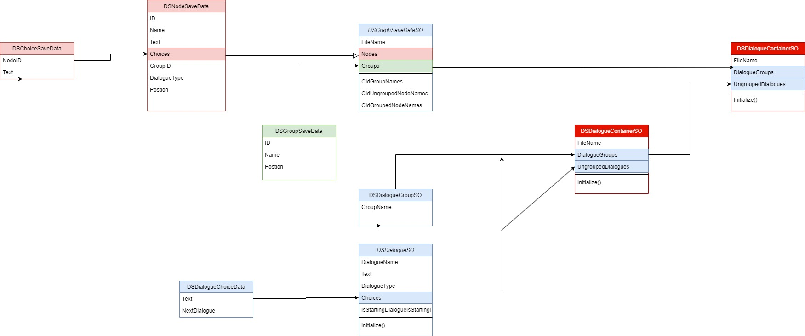

#### 4.3 remove Choice

我们已经创建了序列化的数据格式，因此可以替换相关的容器中的数据格式，如：字典

现在为了增加<font color=#4db8ff>Node</font>中的增加与删除，下一分支选择的功能

我们可以先替换其中的数据<font color=#66ff66>List </font>容器格式，其中其他使用<font color=#4db8ff>Choices</font>的都得修改，如初始化列表

这将允许我们保存链接的<font color=#4db8ff>Node</font>和<font color=#4db8ff>Node</font>选择列表中的选择文本

```c#
using Data.Save;

public class DSNode : Node
{
    public string ID { get; set; }
    public string DialogueName { get; set; }
    public List<DSChoiceSaveData> Choices { get; set; }
    public string Text { get; set; }
    public DSDialogueType DialogueType { get; set; }
    public DSGroup Group { get; set; }
    ...
}
```

同样的单选与多选的<font color=#4db8ff>Node</font>也得更新，同时在前面导入命名空间

```c#
using UnityEditor.Experimental.GraphView;
using UnityEngine;

namespace DS.Elements
{
    using Enumerations;
    using Utilities;
    using Winndos;
    using Data.Save;
    public class DSSingleChoiceNode : DSNode
    {
        public override void Initialize(DSGraphView DSGraphView, Vector2 position)
        {
            base.Initialize(DSGraphView,position);
            DialogueType = DSDialogueType.SingleChoice;
            DSChoiceSaveData choiceData = new DSChoiceSaveData()
            {
                Text = "Next Dialogue"
            };
            Choices.Add(choiceData);
        }

        /* OUTPUT PORT */
        public override void Draw()
        {
            base.Draw();
            foreach (DSChoiceSaveData choice in Choices)
            {
                Port choicePort = this.CreatePort(choice.Text);
                outputContainer.Add(choicePort);
            }
            RefreshExpandedState();
        }
    }
}

```

多选的部分同样也是更新容器，随后修改遍历部分的数据类型

```c#
using UnityEditor.Experimental.GraphView;
using UnityEngine;
using UnityEngine.UIElements;

namespace DS.Elements
{
    using Enumerations;
    using Utilities;
    using Winndos;
    using Data.Save;
    public class DSMultipleChoiceNode : DSNode
    {
        public override void Initialize(DSGraphView DSGraphView, Vector2 position)
        {
            base.Initialize(DSGraphView,position);
            DialogueType = DSDialogueType.MultipleChoice;
            DSChoiceSaveData choiceData = new DSChoiceSaveData()
            {
                Text = "New Choice"
            };
            Choices.Add(choiceData);
        }

       
        public override void Draw() 
        {
            base.Draw();

            /* MAIN CONTAINER */
            Button addChoiceButton = DSElementUtility.CreateButton("Add Choice", () =>
            {
                DSChoiceSaveData choiceData = new DSChoiceSaveData()
                {
                    Text = "New Choice"
                };
                Choices.Add(choiceData);
                
                Port choicePort = CreateChoicePort(choiceData.Text);
                outputContainer.Add(choicePort);
            });
            addChoiceButton.AddToClassList("ds-node_button");
            mainContainer.Insert(1,addChoiceButton);
            
            /* OUTPUT PORT */
            foreach (DSChoiceSaveData choice in Choices)
            {
                Port choicePort = CreateChoicePort(choice.Text);
                outputContainer.Add(choicePort);
            }
            RefreshExpandedState();
        }
...
    }
```

删除<font color=#66ff66>Port</font>的选择，可以在<font color=#66ff66>CreateChoicePort</font>中的创建<font color=#4db8ff>deleteChoiceButton</font>的回调函数中执行操作，可以通过输入一个空参数的回调，随后删除选择

1、判断是否只有一个<font color=#4db8ff>Port</font>

2、是否有<font color=#4db8ff>Edge</font>，但是移除<font color=#4db8ff>Edge</font>需要<font color=#bc8df9>Graph View</font>，需要从<font color=#4db8ff>Base Node</font>修改

3、

```c#
 private Port CreateChoicePort(string choice)
        {
            Port choicePort = this.CreatePort();

Button deleteChoiceButton = DSElementUtility.CreateButton("X", () =>
 {
     if (Choices.Count == 1)
     {
         return;
     }

     if (choicePort.connected)
     {

     }
 }
```

移除<font color=#4db8ff>Edge</font>需要<font color=#bc8df9>Graph View</font>，需要从<font color=#4db8ff>Base Node</font>修改，将它改为<font color=#FD00FF>protected</font>，这样继承<font color="red">Base Node</font> 的<font color=#4db8ff>Node</font>都可以访问它

```c#
protected DSGraphView graphView;
```

这样就可以断开port的连接了

```c#
 private Port CreateChoicePort(string choice)
{
     Port choicePort = this.CreatePort();
     Button deleteChoiceButton = DSElementUtility.CreateButton("X", () =>
     {
         if (Choices.Count == 1)
         {
             return;
         }
         //delete all edge
         if (choicePort.connected)
         {
             graphView.DeleteElements(choicePort.connections);
         }  
    });
 }
```

需要删除<font color=#4db8ff>choices</font>，但是我们并不知道删除的是那个，因此我们需要<font color="red">VisualElement.userData _</font> ，此属性可用于将应用程序特定的用户数据与此 VisualElement 相关联，随后利用<font color=#66ff66>ID</font>进行筛选

<font color=#4db8ff>Link：</font>https://docs.unity3d.com/ScriptReference/30_search.html?q=UIElements.VisualElement.userData

```c#
private Port CreateChoicePort(object UserData)
{
    Port choicePort = this.CreatePort();
    choicePort.userData = UserData;
    DSChoiceSaveData choiceData = (DSChoiceSaveData)UserData;
    ...
}
```

修改部分代码，确保传入的是<font color=#bc8df9>ChoiceData</font>

```c#
//DSSingleChoiceNode
public override void Draw()
{
    base.Draw();
    foreach (DSChoiceSaveData choice in Choices)
    {
        Port choicePort = this.CreatePort(choice.Text);
        choicePort.userData = choice;
        outputContainer.Add(choicePort);
    }
    RefreshExpandedState();
}
```


```c#
 public override void Draw()
{
     base.Draw();

    /* MAIN CONTAINER */
	Button addChoiceButton = DSElementUtility.CreateButton("Add Choice", () =>
	{
        DSChoiceSaveData choiceData = new DSChoiceSaveData()
        {
            Text = "New Choice"
        };
        Choices.Add(choiceData);

        Port choicePort = CreateChoicePort(choiceData);
        outputContainer.Add(choicePort);
    });
     addChoiceButton.AddToClassList("ds-node_button");
     mainContainer.Insert(1, addChoiceButton);

     /* OUTPUT PORT */
     foreach (DSChoiceSaveData choice in Choices)
     {
         Port choicePort = CreateChoicePort(choice);
         outputContainer.Add(choicePort);
     }

     RefreshExpandedState();
}
```

回调函数，将将数据从<font color=#66ff66>List</font>中移除，随后<font color=#bc8df9>graph View</font>中移除

```c#
 Button deleteChoiceButton = DSElementUtility.CreateButton("X", () =>
{
    if (Choices.Count == 1)
    {
        return;
    }
    //delete all edge
    if (choicePort.connected)
    {
        graphView.DeleteElements(choicePort.connections);
    }
    //for Port Lit Remove the Port and use ID to Remove the Port form the Graph View
    Choices.Remove(choiceData);
    graphView.RemoveElement(choicePort);
});
```

#### 4.4 ID use

但是此时我们的<font color=#FFCE70>POrt</font>链接时，ID没有更新，因此，我们需要将ID的修改加入函数中利用一个新的回调函数

<font color="red">**GraphView.GraphView.graphViewChanged**</font>

<font color=#4db8ff>Link：</font>https://docs.unity3d.com/ScriptReference/30_search.html?q=Experimental.GraphView.GraphView.graphViewChanged

当图表中发生某些更改时的回调。请参阅 GraphViewChange。

<font color=#4db8ff>GraphViewChange Link：</font>https://docs.unity3d.com/ScriptReference/Experimental.GraphView.GraphViewChange.html

Properties

| [edgesToCreate](https://docs.unity3d.com/ScriptReference/Experimental.GraphView.GraphViewChange-edgesToCreate.html) | Edges about to be created.    |
| ------------------------------------------------------------ | ----------------------------- |
| [elementsToRemove](https://docs.unity3d.com/ScriptReference/Experimental.GraphView.GraphViewChange-elementsToRemove.html) | Elements about to be removed. |
| [movedElements](https://docs.unity3d.com/ScriptReference/Experimental.GraphView.GraphViewChange-movedElements.html) | Elements already moved.       |
| [moveDelta](https://docs.unity3d.com/ScriptReference/Experimental.GraphView.GraphViewChange-moveDelta.html) | The delta of the last move.   |

```c#
public struct GraphViewChange
{
    /// <summary>
    ///   <para>Elements about to be removed.</para>
    /// </summary>
    public List<GraphElement> elementsToRemove;
    /// <summary>
    ///   <para>Edges about to be created.</para>
    /// </summary>
    public List<Edge> edgesToCreate;
    /// <summary>
    ///   <para>Elements already moved.</para>
    /// </summary>
    public List<GraphElement> movedElements;
    /// <summary>
    ///   <para>The delta of the last move.</para>
    /// </summary>
    public Vector2 moveDelta;
}
```

我们利用两个变量，一个是<font color=#bc8df9>edgesToCreate</font>，一个是<font color=#bc8df9>elementsToRemove</font>。在遍历时获取ID，并且修改与删除

```c#
// the ID for Port
private void OnGraphViewChanged()
{
    graphViewChanged = (changes) =>
    {
        if (changes.edgesToCreate != null){}
        return changes;
    };
}
```

```c#
if (changes.edgesToCreate != null)
{
    foreach (Edge edge in changes.edgesToCreate)
    {
        DSNode nextNode = (DSNode) edge.input.node;
        DSChoiceSaveData choiceData = (DSChoiceSaveData)edge.output.userData;
        choiceData.NodeID = nextNode.ID;
    }
}

if (changes.elementsToRemove != null)
{
    Type edgeType = typeof(Edge);
    foreach (GraphElement element in changes.elementsToRemove)
    {
        if (element.GetType() != edgeType)
        {
            continue;
        }

        Edge edge = (Edge)element;
        DSChoiceSaveData choiceData = (DSChoiceSaveData)edge.output.userData;
        choiceData.NodeID = "";
    }
```

在回调函数<font color="red">deleteSelection</font>中

<font color=#66ff66>RemoveElement</font>，不会将<font color="red">Edge</font>添加到<font color=#4db8ff>elementsToRemove</font>列表中

<font color=#66ff66>DeleteElements</font>，会将<font color="red">Edge</font>添加到<font color=#4db8ff>elementsToRemove</font>列表中，这也意味着<font color=#4db8ff>NodeID</font>会被重置

构造函数中调用回调函数<font color=#bc8df9>graphViewChanged</font>

最后一件事就是更新<font color=#66ff66>TextField</font>时更新<font color=#66ff66>DataText</font>，可以添加回调函数

```c#
//Create the Text
            TextField choiceTextField = DSElementUtility.CreateTextField(choiceData.Text,null,callback =>
            {
                choiceData.Text = callback.newValue;
            });
```

<font color=#4db8ff>Code：</font>https://github.com/onlyyz/Custom/commit/a4042b5c10df948aa350d8fb49093ce11ed593ba
