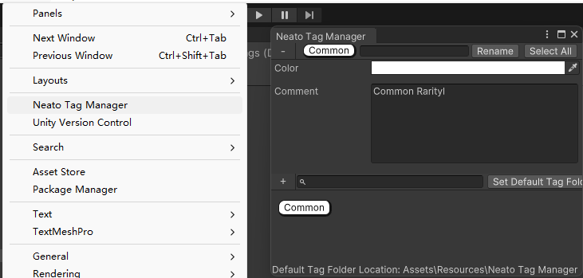
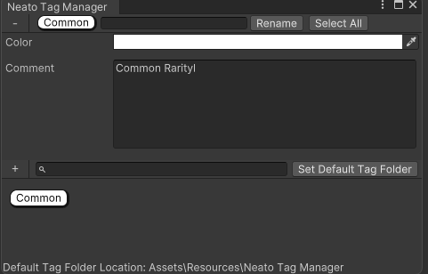
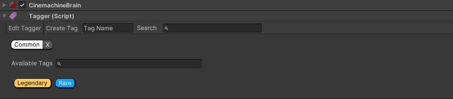

Youtobe Link：https://www.youtube.com/watch?v=MIrbBueYae0

Free Unity Asset Store：https://assetstore.unity.com/packages/tools/utilities/neato-tags-229829

Blog：https://charliemadeathing.com/

### 一、Window Panel

打开Panel界面，路径为：Window/NeatoTags Manager

首先选择默认文件夹，存储变量，随后添加Tag，以及相关描述

### 二、Add Tag

这个Tag并非是Tag Text 而是 Component，并且支持添加多个Tag

### 三、Code case

Path：Assets\Plugins\NeatoTags\Core\Scripts\xxxx.cs

