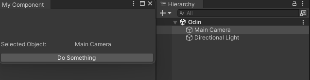

<font color=#4db8ff>Link：https://zhuanlan.zhihu.com/p/619971847</font>

### 一、Inspector

#### 1.1 Vector3

```C#
using Sirenix.OdinInspector;
using UnityEngine;
public class MyComponent : MonoBehaviour
{
    [Title("Custom Vector3")]
    [Vector3Field(DrawNLabel = true)]
    public Vector3 MyVector;
}
```

#### 1.2 Unity Editor

<font color=#66ff66>Odin Inspector</font>可以让你扩展Unity编辑器的功能，使得你可以在编辑器中做更多的事情。例如，你可以在编辑器中创建自定义的GUI控件，用于快速编辑你的游戏对象。

```C#
using Sirenix.OdinInspector.Editor;
using UnityEditor;
using UnityEngine;

public class MyEditorWindow : OdinEditorWindow
{
    [MenuItem("Window/My Editor Window")]
    private static void OpenWindow()
    {
        GetWindow<MyEditorWindow>().Show();
    }

    [MenuItem("Window/My Editor Window", true)]
    private static bool CanOpenWindow()
    {
        return Selection.activeGameObject != null;
    }

    protected override void OnGUI()
    {
        base.OnGUI();

        GameObject selectedObject = Selection.activeGameObject;

        if (selectedObject != null)
        {
            EditorGUILayout.Space();

            EditorGUILayout.LabelField("Selected Object:", selectedObject.name);

            EditorGUILayout.Space();
        }
        if (GUILayout.Button("Do Something"))
        {
            // Do something here
        }
    }
}
```



#### 1.3 serialise

<font color=#66ff66>Odin Inspector</font>还提供了强大的序列化和反序列化功能，可以将Unity对象序列化为<font color=#4db8ff>二进制、XML、JSON</font>等格式。这使得你可以将Unity对象保存到磁盘上，或者将它们发送到远程服务器。

```C#
using Sirenix.OdinInspector;
using System.IO;
using UnityEngine;

public class MyComponent : MonoBehaviour
{
    [Title("Serialization")]
    [Button("Save")]
    private void SaveToFile()
    {
        MyDataObject dataObject = new MyDataObject
        {
            Name = "My Object",
            Position = transform.position,
            Rotation = transform.rotation,
            Scale = transform.localScale
        };

        string json = Sirenix.Utilities.JsonFormatter.SerializeObject(dataObject);

        File.WriteAllText("data.json", json);
    }

    [Button("Load")]
    private void LoadFromFile()
    {
        string json = File.ReadAllText("data.json");

        MyDataObject dataObject = Sirenix.Utilities.JsonFormatter.DeserializeObject<MyDataObject>(json);

        transform.position = dataObject.Position;
        transform.rotation = dataObject.Rotation;
        transform.localScale = dataObject.Scale;
    }
}

public class MyDataObject
{
    public string Name;
    public Vector3 Position;
    public Quaternion Rotation;
    public Vector3 Scale;
}
```

