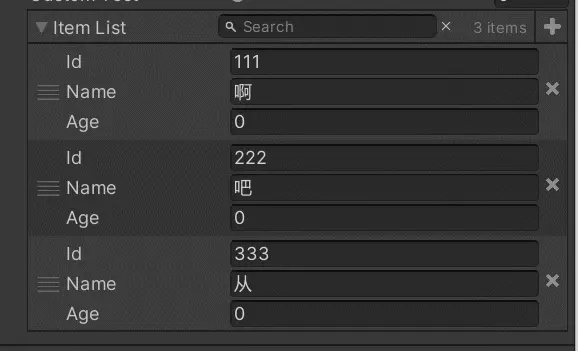
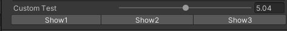
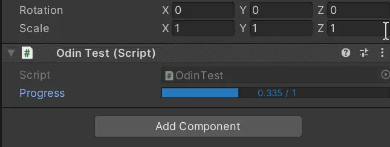

<font color=#4db8ff>Link：</font>https://zhuanlan.zhihu.com/p/409479682

### 一、

#### 1.1 GUI Color

```C#
    [GUIColor(.5f, 1, 0, 1)]
    public int health;
    [GUIColor(0, .5f, 1f, 1)]
    public int power;
    [GUIColor(1, .5f, 0, 1)]
    public int attack;
```


#### 1.2 PropertyOrder

强制调整属性的显示顺序

```C#
[PropertyOrder(2)]
public string player2Name;
[PropertyOrder(1)]
public string player1Name;
```


#### 1.3 PropertySpace

属性间隔，相当与排版中的行间距，用来对不同类型的属性进行分割比较有效

```csharp
    public string TypeA1, TypeA2, TypeA3;
    [PropertySpace]
    public string TypeB1;
    public string TypeB2;
```


#### 1.4 ReadOnly

```csharp
[ReadOnly]
public string player1Name="KDF";
public string player2Name="KKK";
```


#### 1.5 Searchable

当列表中管理的数据较多时，可以快速进行查找，方便操作

```csharp
[Searchable]
public List<SearchItem> itemList;
[Serializable]
public class SearchItem
{
    public string Id;
    public string Name;
    public int Age;
}
```



#### 1.6 TypeInfoBox

他是可以标记在类上，而不是必须标记到变量上

```csharp
[HideLabel]
public Student st;
[Serializable,TypeInfoBox("学生基本信息")]
public class Student
{
    public string Name;
    public int Score;
}
```

### 二、

#### 2.1 Button

```C#
public int value;
[Button("改变值",ButtonSizes.Large)]
public void ShowName()
{
    value++;
}
```


#### 2.2 **ButtonGroup**

```C#
[Button("Show1"), ButtonGroup]
public void ShowValue1() { }
[Button("Show2"), ButtonGroup]
public void ShowValue2() { }
[Button("Show3"), ButtonGroup]
public void ShowValue3() { }
```



#### 2.3 EnumPaging

分页显示枚举类型，没怎么用过

```C#
[EnumPaging]
public SubjectType st;
public enum SubjectType {English,Math,Arts}
```


#### 2.4 EnumToggleButton

将枚举值以一排按钮的形式显示出来

```C#
[EnumToggleButtons]
public SubjectType st;
public enum SubjectType {English,Math,Arts}
```


#### 2.5 InlineButton

在变量后面显示按钮

```C#
[InlineButton("Reset")]
public StudentScore ss;
public void Reset()
{
    ss = new StudentScore();
}
[Serializable]
public class StudentScore
{
    public float math = 100;
    public float english = 50;
    public float arts = 100;
}
```


#### 2.7 DictionaryDrawerSettings

在<font color="red">Inspector</font>上显示字典，这个比较特殊，需要用到Odin的序列化功能才行，而且字典所在的脚本必须继承Odin序列化后的<font color=#66ff66>SerializedMonoBehaviour</font>

```C#
public class OdinTest : SerializedMonoBehaviour
{
    [DictionaryDrawerSettings]
    public Dictionary<string, float> StudentDict = new Dictionary<string, float>();
}
```

Unity编译后会出现如下提示信息，点击隐藏即可


#### 2.7 ListDrawerSettings

Odin导入到Unity后默认数组或者List都可以拖拽改变元素的顺序，这个功能很好用，也可以手动关掉拖拽功能

```C#
[ListDrawerSettings(ShowIndexLabels =true)]
public List<Student> studentList = new List<Student>();
[ListDrawerSettings(ShowIndexLabels = true,DraggableItems =false)]
public List<Student> studentList1 = new List<Student>();
[Serializable]
public class Student
{
    public string name;
    public int Id;
    public float score;
}
```


#### 2.8 TableList

将List以表的形式显示出来，表头为属性名字，还可以手动切换显示模式，好用！！

```C#
[TableList]
public List<Student> studentList = new List<Student>();
[TableList,TableColumnWidth(20,Resizable =false)]
[Serializable]
public class Student
{
    public string name;
    public int Id;
    public float score;
}
```


#### 2.9 TableColumnWidth

设置表的列宽，并且限制拖拽宽度，跟上面的一起使用

```C#
[TableList]
public List<Student> studentList = new List<Student>();
[Serializable]
public class Student
{
    [TableColumnWidth(50,Resizable =false)]
    public string name;
    public int Id;
    public float score;
}
```


#### 2.10 TableMatrix

又是一个需要用到Odin自带的序列化工具的特性，脚本类也需要继承<font color=#4db8ff>SerializedMonoBehaviour</font>，可以将二维数组转化为表的显示形式

```C#
[TableMatrix(SquareCells = false)]
public int[,] MapData = {
    { 1,1,1,0} ,
    { 1,1,0,1},
    { 1,0,1,1},
    { 0,1,1,1}
};
```


### 三、基本的条件特性

#### 3.1 DisableIf, EnableIf, HideIf, ShowIf

分别是<font color=#bc8df9>冻结，激活，隐藏，显示</font>

使用的时候后面接上条件即可，条件可以是Bool类型的变量，枚举类型的变量，返回Bool值的表达式，或者返回Bool值的方法名

```C#
public bool AAA;
[DisableIf("AAA")]
public string DisableWhenA;
[EnableIf("AAA")]
public string EnableWhenA;
[HideIf("AAA")]
public string HideWhenA;
[ShowIf("AAA")]
public string ShowWhenA;
```


> AAA为True时，
>
> DisableWhenA检测条件通过被冻结
>
> EnableWhenA检测条件通过被激活
>
> HideWhenA检测条件通过被隐藏
>
> ShowWhen检测条件通过显示了出来
>
> AAA为False时，
>
> DisableWhenA检测条件未通过被激活
>
> EnableWhen A检测条件未通过被冻结
>
> HideWhenA检测条件未通过显示出来
>
> ShowWhen检测条件未通过没显示出来

枚举值相同就是检测通过

```C#
public enum SubjectType { Math,English,Arts}
public SubjectType sType;

[ShowIf("sType", SubjectType.Math)]
public int mathScore;
[ShowIf("sType", SubjectType.English)]
public int EnglishScore;
[ShowIf("sType", SubjectType.Arts)]
public int ArtsScore;
```


表达式和方法就一起介绍啦

```csharp
[EnableIf("@1==2")]
public string Show1;

[EnableIf("Show2Method")]
public string Show2;

private bool Show2Method()
{
    return false;
}
```

#### 3.2 高级的条件特性

这些条件都是与物体在UnityEditor中的状态有关的

Odin将UnityEditor中的物体分为了几种状态，分别是

Editor Mode--Unity编辑器的非<font color=#bc8df9>运行状态</font>

Inline Editors--<font color=#4db8ff>Object预览状态</font>

NonPrefabs--不来自预制体

PlayMode--Unity的运行状态

PrefabAssets--预制体资源中，资源

Prefab Instances--预制体的实例，场景

Prefabs--预制体中，场景和资源

1.DisableInEditorMode,HideInEditorMode

在非运行状态下冻结或隐藏，编辑器运行起来后可以修改

#### 3.3 DisableInInlineEditors,ShowInInlineEditors

继承了<font color=#66ff66>UnityEngine.Object</font>的类的详细信息显示出来，比如比较常见的<font color="red">ScriptableObject</font>

```C#
[CreateAssetMenu(menuName = "InLineTest")]
public class InLineTest : ScriptableObject
{
    public string myName;
    public int myAge;
}

//在我们之前的OdinTest脚本中引用
[InlineEditor(InlineEditorModes.FullEditor)]
public InLineTest mt;
```

可以看到在Inspector中展示了这个ScriptableObject，且属性都是激活的

```C#
[CreateAssetMenu(menuName = "InLineTest")]
public class InLineTest : ScriptableObject
{
    public string myName;
    [DisableInInlineEditors]
    public int myAge;
}
```

当我们给其中的一个属性标记后，在预览模式下它就会被冻结

#### 3.4 DisableInNonPrefabs,HideInNonPrefabs

如果场景中的物体不来自预制体则冻结或隐藏，点击打开预制体会进入到一个新的场景，这里预制体相当于普通的物体，所以此时的变量是会冻结或隐藏的。

4.DisableInPlayMode,HideInPlayMode

与上面的第一条相反，在运行状态下冻结或隐藏，默认状态下被激活

5.DisableInPrefabAssets,abAssets

作为预制体资源打开时被冻结或隐藏，将预制体拖入场景后被激活

没有预制体来源的场景中的普通物体身上的属性也是激活状态。

6.DisableInPrefabInstances,HideInPrefabInstances

作为预制体的实例存在场景中时，被冻结或隐藏，，预制体中时激活状态，可以显示和修改

7.DisableInPrefabs,HideInPrefabs

场景中的预制体属性被冻结或隐藏

### 四、分组

#### 4.1BoxGroup

同一组内的字段放进一个盒子里，用来分隔类别挺好用的

```C#
[BoxGroup("BaseInfo",CenterLabel=true)]
public string studentName;
[BoxGroup("BaseInfo", CenterLabel = true)]
public string studentAge;
[BoxGroup("BaseInfo", CenterLabel = true)]
public string studentSex;

[BoxGroup("Score", CenterLabel = true)]
public string EnglishScore;
[BoxGroup("Score", CenterLabel = true)]
public string MathScore;
[BoxGroup("Score", CenterLabel = true)]
public string ArtScore;
```


#### 4.2 FoldoutGroup

跟上面的唯一区别就是可以折叠起来，变量多的时候用起来很方便

```C#
    [FoldoutGroup("BaseInfo")]
    public string studentName;
    [FoldoutGroup("BaseInfo")]
    public string studentAge;
    [FoldoutGroup("BaseInfo")]
    public string studentSex;

    [FoldoutGroup("Score")]
    public string EnglishScore;
    [FoldoutGroup("Score")]
    public string MathScore;
    [FoldoutGroup("Score")]
    public string ArtScore;
```


#### 4.3 HorizontalGroup,VerticalGroup

横向和纵向布局，横向布局还有点用，unity 本来就是纵向的，所以这个纵向大可不必使用

```C#
[HorizontalGroup("BaseInfo"),HideLabel]
public string studentName;
[HorizontalGroup("BaseInfo"), HideLabel]
public string studentAge;
[HorizontalGroup("BaseInfo"), HideLabel]
public string studentSex;

[VerticalGroup("Score")]
public string EnglishScore;
[VerticalGroup("Score")]
public string MathScore;
[VerticalGroup("Score")]
public string ArtScore;
```

#### 4.4 TabGroup

```C#
[TabGroup("BaseInfo")]
public string studentName;
[TabGroup("BaseInfo")]
public string studentAge;
[TabGroup("BaseInfo")]
public string studentSex;

[TabGroup("Score")]
public string EnglishScore;
[TabGroup("Score")]
public string MathScore;
[TabGroup("Score")]
public string ArtScore;
```


#### 4.5 TitleGroup

```C#
[TitleGroup("BaseInfo")]
public string studentName;
[TitleGroup("BaseInfo")]
public string studentAge;
[TitleGroup("BaseInfo")]
public string studentSex;

[TitleGroup("Score")]
public string EnglishScore;
[TitleGroup("Score")]
public string MathScore;
[TitleGroup("Score")]
public string ArtScore;
```

#### 4.6 ToggleGroup

带开关的分组，需要配合一个跟组名相同的bool值变量使用，没怎么正式用过

```C#
[ToggleGroup("BaseInfo")]
public bool BaseInfo;
[ToggleGroup("BaseInfo")]
public string studentName;
[ToggleGroup("BaseInfo")]
public string studentAge;
[ToggleGroup("BaseInfo")]
public string studentSex;

[ToggleGroup("Score")]
public bool Score;
[ToggleGroup("Score")]
public string EnglishScore;
[ToggleGroup("Score")]
public string MathScore;
[ToggleGroup("Score")]
public string ArtScore;
```

### 五、

#### 5.1 MinMaxSlider

最小最大的滑动条，用来描述V2类型的变量，xy分别为最小和最大值

```C#
[MinMaxSlider(0, 18)]
public Vector2Int grilAgeRange;
```


#### 5.2 ProgressBar

将变量以进度条的形式显示，类似Range吧，也是一种最大最小值的限制

```C#
[ProgressBar(0,1)]
public float Progress;
```



#### 5.3 PropertyRange

属性范围显示，跟Unity的Range一样，只是这个是对属性的，需要配合<font color=#bc8df9>ShowInInspector</font>显示出来

```csharp
    [ShowInInspector,PropertyRange(0,1)]
    public float Progress { get; set; }
```

#### 5.4 Wrap

值在指定范围内循环

```csharp
  [Wrap(0,10)]
    public int Score;
```


#### 5.5 AssetList

资源列表，标记属性后点击右上角按钮可以快速选择和切换同类型资源

```csharp
[AssetList]
public Material mat;
```

#### 5.6 AssetSelector

资源选择器，跟上面的差不多，这个点击也会出现一个选择菜单，只不过这个是点击前面的三个点

```csharp
[AssetSelector]
public Material mat;
```

#### 5.7 ChildGameObjetsOnly

限制选择子物体

```C#
[ChildGameObjectsOnly]
public GameObject child;
```

#### 5.8 ColorPalette

调色板，做配色应该挺方便的，可以从预设中直接选取颜色

```C#
[ColorPalette]
public Color color;
```


#### 5.9 DisplayAsString

将字段的值用只读字符串的形式显示

```csharp
    [DisplayAsString]
    public Color col;
```

#### 5.10 FilePath

文件路径，用来修饰字符串，使用起来也很方便，直接拖拽就可以了

```C#
[FilePath]
public string gameObjectPath;
```


#### 5.11 FolderPath

文件夹路径，用法跟上面的文件一样，只不过这个是拖文件夹

```C#
[FolderPath]
public string gameObjectFolderPath;
```


#### 5.12 HideInTables

在表中隐藏，这个跟之前介绍过的<font color=#bc8df9>TableList</font>有联系，之前说TableList是将List以表的形式显示，HideInTables就是标记的属性不在表中显示

```C#
[TableList]
public List<Student1> st1;
[TableList]
public List<Student2> st2;
[Serializable]
public class Student1
{
    public string Id;
    public string Name;
    public string Age;
}
[Serializable]
public class Student2
{
    [HideInTables]
    public string Id;
    public string Name;
    public string Age;
}
```


#### 5.13 HideMonoScript

隐藏Mono脚本	

```csharp
[HideMonoScript]
public class OdinTest : MonoBehaviour
{
    public string Show="SSSSS";
    public string Hide="HHHHH";
}
```

#### 5.14 MultiLineProperty

用来修饰字符串，显示多行文字，和Unity中的TextArea功能相同，我更习惯用后者

```csharp
    [MultiLineProperty]
    public string MultTex;
```

#### 5.15 Preview Field

预览选择的物体，我比较习惯用来预览图片，效果不错

```C#
public Sprite lsp;
[PreviewField]
public Sprite sp;
```

#### 5.16 Toggle

开关，可以被用在任意字段或属性上，用来在<font color=#bc8df9>Inspector</font>上激活或冻结其的表现

注意，类中必须包含与特性中字符串参数名字相同的Bool值变量

```csharp
public MyToggle t1, t2;
[Serializable,Toggle("Enable")]
public class MyToggle
{
    public bool Enable;
    public string Name;
    public string Age;
}
```

#### 5.17 ToggleLeft

将Bool值类型的勾选框放到Label的左边显示，看起里舒服很多

```C#
[ToggleLeft]
public bool Left;
public bool Normal;
```

###  六、

#### 6.1 CustomContextMenu

自定义的右键菜单

```csharp
[CustomContextMenu("SetAgeTen", "SetValueAsTen")]
public int Age;
public void SetValueAsTen()
{
    Age = 10;
}
```


#### 6.2 DisableContextMenu

禁用右键菜单

```csharp
[DisableContextMenu]
public int DisableAge;
```

#### 6.3 DrawWithUnity

用Unity默认的显示方法显示<font color="red">Inspector</font>上的属性，Odin导入Unity后Odin会改变属性的显示方式，这个属性相当于把属性重置回来了。

```C#
public GameObject DrawInOdin;
[DrawWithUnity]
public GameObject DrawInUnity;
```

#### 6.4 Indent

缩进，用来控制属性标签的缩进

```C#
[Indent] public int A;
[Indent(2)] public int B;
[Indent(-2)] public int C;
```


#### 6.5 InfoBox

信息盒子，用来详细描述属性

```C#
[InfoBox("abcdefg\nhijklmn\nopqrst")]
public int MyMathScore;
```


#### 6.6 InlineProerty

将序列化后的属性与标签显示到同一行

```C#
[InlineProperty]
public MyV3 mvInLine;
public MyV3 mv;
[Serializable]
public class MyV3
{
    [HorizontalGroup(LabelWidth =10)]
    public int x, y, z;
}
```

#### 6.7 Text

```C#
[LabelText("我的成绩")]
public float myScore;
```


#### 6.8 LabelWidth

限制标签的长度

```C#
[LabelText("我的成绩"),LabelWidth(20)]
public float myScore;
```

#### 6.9 OnCollectionChanged

集合变化时触发，用来监听集合的变化，我比较常用在List上

```csharp
public int count = 0;
[OnCollectionChanged("ShowListCount")]
public List<string> nameList;

private void ShowListCount()
{
    count = nameList.Count;
}
```


#### 6.10 OnInspectorDispose

<font color="red">InspectorDispose</font>重新排布时触发

```csharp
   [OnInspectorDispose("ChangeCount")]
    public int count = 0;

    private void ChangeCount()
    {
        count++;
    }
```


#### 6.11 OnInspectorGUI

跟Unity的OnGUI或Update逻辑差不多，相当于Inspector的OnGUI，是在显示当前Inspector时一直执行

```csharp
[OnInspectorGUI("ChangeCount")]
public int count = 0;

private void ChangeCount()
{
    count++;
}
```


#### 6.12 OnInspectorInit

在<font color=#bc8df9>Inspector</font>初始化时触发，相当于Start或Awake

```C#
[OnInspectorInit("ChangeCount")]
public int count = 0;

private void ChangeCount()
{
    count++;
}
```


每次复制对象时对象身上的脚本都会执行一次Init，触发自加运算，所以会出现上图效果

#### 6.13 OnStateUpdate

```C#
    [OnStateUpdate("ChangeCount")]
    public bool OnStateChange;
    public int count = 0;
    private void ChangeCount()
    {
        if(OnStateChange)
        count++;
    }
```


#### 6.14 OnValueChanged

值变化时触发，比较常用

```C#
    [OnValueChanged("ChangeCount")]
    public bool OnStateChange;
    public int count = 0;
    private void ChangeCount()
    {
        count++;
    }
```


6.15 PropertyToolTip

鼠标悬浮在属性上时的提示

```csharp
 [PropertyTooltip("我的成绩")]
    public float myScore;
```


#### 6.16 SuffixLabel

后缀标签，标签显示到属性后面

```csharp
[SuffixLabel("我的成绩",Overlay =true)]
public float myScore;
```

#### 6.17 SuppressInvaildError

关闭不可用特性的报错

```C#
[Range(0, 10), SuppressInvalidAttributeError]
public string myScore1;

[Range(0, 10)]
public string myScore2;
```

#### 6.18 ShowPropertyResolver

显示属性解析器

```csharp
public MyV3 myV3;
[ShowPropertyResolver]
public MyV3 myV32;
[Serializable]
public class MyV3
{
    public float x, y, z;
}
```