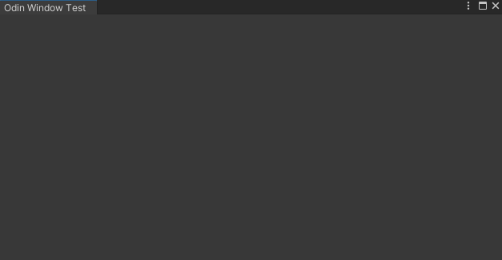

<font color=#4db8ff>Link：</font>https://zhuanlan.zhihu.com/p/409479682

### 一、窗体制造

#### 1.1 Window

```C#
using UnityEditor;
using Sirenix.OdinInspector;
using Sirenix.OdinInspector.Editor;
public class OdinWindowTest:OdinEditorWindow
{
    [MenuItem("Tools/OdinWindowTest")]
    public static void ShowWindow()
    {
        var window = GetWindow<OdinWindowTest>();
        window.Show();
    }
}
```



#### 1.2 Calculator

```C#
public class OdinWindowTest:OdinEditorWindow
{
    [MenuItem("Tools/OdinWindowTest")]
    public static void ShowWindow()
    {
        var window = GetWindow<OdinWindowTest>();
        window.Show();
    }

    [LabelText("学生姓名")] public string StudentName;

    [LabelText("英文成绩")] public float EnglishScore;
    [LabelText("数学成绩")] public float MathScore;
    [LabelText("美术成绩")] public float ArtScore;

    [ReadOnly,LabelText("总成绩")] public float totalScore;

    [Button("计算总成绩",ButtonSizes.Large,Style =ButtonStyle.Box),]
    public void GetTotalScore()
    {
        totalScore = EnglishScore + MathScore + ArtScore;
    }
}
```

