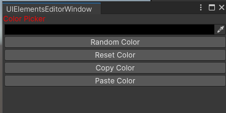
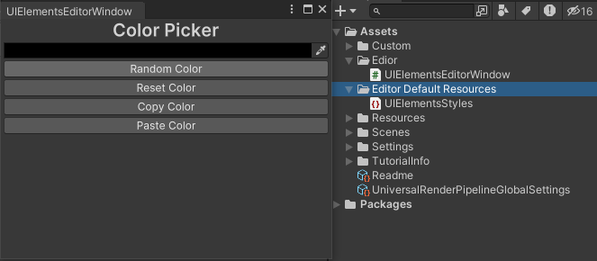

<font color=#4db8ff>Link：</font>https://www.youtube.com/watch?v=c3sSyoiekz4

<font color=#bc8df9>USS</font>：Unity Style Sheets

### 一、The Basics

熟悉<font color=#4db8ff>Html与CSS</font>在网页布局上十分常用，Unity也有类似的工具叫做<font color=#bc8df9>USS</font>：Unity Style Sheets。Unity文档上显示他们使用的<font color=#FFCE70>The Layout Engine</font>是<font color="red">Yoga</font>

创建两个脚本，一个是C#脚本<font color=#FFCE70>UIElementsEditorWindow</font>，一个是Uss <font color=#FD00FF>UIElementsStyles</font>

#### 1.1 Style

其中，<font color=#bc8df9>VisualElement.style</font>允许我们更新代码样式，而不用创建USS文件。其中style有许多属性

```C#
Label title = new Label("Color Picker");
title.style.color = Color.red;
```



<center>red color of title</center>

可以根据条件动态更新背景颜色样式

#### 1.2 Style Sheets

对于要修改那个组件，Unity调用<font color=#FFCE70>Selector</font>，而对于修改的内容，Unity会调用<font color=#FFCE70>Properties</font>

其中<font color=#bc8df9>Selector Types</font>可以是多样的，如：

```c#
C# Type
    Class
    Name
    WildCard
```

当我们使用使用属性作为<font color=#bc8df9>Selector Types</font>，则创建的每个类型视觉元素的样式都会更改为我们选择的样式。

 粗字体，居中，20px大小 

```CSS
Label{
    -unity-font-style:bold;
    -unity-text-align: middle-center;
    font-size: 20px;
}
```

#### 1.3  Load Style Sheets

获取，可以用<font color=#bc8df9>EditorGUIUtility.<font color=#66ff66>Load</font></font>加载，加载文件夹路径为

```c#
 Assets/Editor Default Resources/ + path
```

获取之后需要将其类型转化为<font color=#66ff66>StyleSheet</font>

```c#
StyleSheet styleSheet = (StyleSheet)EditorGUIUtility.Load("UIElementsStyles.uss");
Label title = new Label("Color Picker");
```

其中可以利用<font color=#4db8ff>rootVisualElement</font>将其加载到<font color="red">编译器窗口根目录</font>，其中添加样式表，需要使用如下方法

```c#
//添加样式表
rootVisualElement.styleSheets
styleSheets.add
```

最后传入我们加载的<font color=#4db8ff>StyleSheet</font>格式的<font color="red">uss</font>文件即可

```C#
StyleSheet styleSheet = (StyleSheet)EditorGUIUtility.Load("UIElementsStyles.uss");
rootVisualElement.styleSheets.Add(styleSheet);
```



#### 1.4 Button

使用<font color=#bc8df9>Class Selector</font>，其中为了告诉Unity这是个类选择器在类型前加入<font color="red">“ . “</font> 这符号

```CSS
.dark-button{
    background-color: #1C2025;
    color: #E0E0E0;
    border-color: transparent;
    min-height: 50px;
}
```

现在将效果加入<font color=#66ff66>button</font>，首先需要添加到<font color=#4db8ff>randomColorButton</font><font color=#bc8df9>.AddToClassList();</font>

该方法允许向<font color=#bc8df9>VisualElement</font>中添加<font color=#FFCE70>CLass</font>。这也意味着可以持有多个类，添加类需要输入名称，不需要添加<font color="red">“ . “</font> 这符号

```c#
Button randomColorButton = (Button) CreateButton("Random Color");
Button resetColorButton = (Button) CreateButton("Reset Color");
Button copyColorButton = (Button) CreateButton("Copy Color");
Button pasteColorButton = (Button) CreateButton("Paste Color");

buttonsContainer.Add(randomColorButton);
buttonsContainer.Add(resetColorButton);
buttonsContainer.Add(copyColorButton);
buttonsContainer.Add(pasteColorButton);

container.Add(buttonsContainer);
randomColorButton.AddToClassList("dark-button");
resetColorButton.AddToClassList("dark-button");
copyColorButton.AddToClassList("dark-button");
pasteColorButton.AddToClassList("dark-button");
```


### 最初的代码

```c#
using UnityEditor;
using UnityEngine;
using UnityEngine.UIElements;
using UnityEditor.UIElements;

public class UIElementsEditorWindow : EditorWindow
{
    [MenuItem("Tool/Learn/UIElementsEditorWindow")]
    public static void ShowExample()
    {
        UIElementsEditorWindow wnd = GetWindow<UIElementsEditorWindow>();
        wnd.titleContent = new GUIContent("UIElementsEditorWindow");
    }

    public void CreateGUI()
    {
        VisualElement container = new VisualElement();

        rootVisualElement.Add(container);

        Label title = new Label("Color Picker");


        ColorField colorField = new ColorField();

        container.Add(title);
        container.Add(colorField);

        VisualElement buttonsContainer = new VisualElement();

        Button randomColorButton = (Button) CreateButton("Random Color");
        Button resetColorButton = (Button) CreateButton("Reset Color");
        Button copyColorButton = (Button) CreateButton("Copy Color");
        Button pasteColorButton = (Button) CreateButton("Paste Color");

        buttonsContainer.Add(randomColorButton);
        buttonsContainer.Add(resetColorButton);
        buttonsContainer.Add(copyColorButton);
        buttonsContainer.Add(pasteColorButton);

        container.Add(buttonsContainer);
    }

    private VisualElement CreateButton(string text)
    {
        return new Button() { text = text };
    }
}
```

