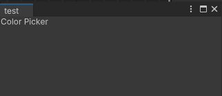

<font color=#4db8ff>Link：</font>https://www.youtube.com/watch?v=EfEAr0meBho

UXML

UI读取事件

### 一、Visual Tree

Unity将整个对象图视为<font color=#bc8df9>Visual Tree</font>，树里的每个节点都是实际的UI，Unity将每个节点的每一个部分成为<font color=#66ff66>VIsual Element</font>。

Unity 储存里部分信息，如：<font color=#FFCE70>布局信息，绘制信息，事件信息</font>。

#### 1,1 nameSpance

<font color=#4db8ff>UnityEngine.UIElements</font>，当想使用适用于游戏又适用于编辑器的某些UI类时，可以选择导入<font color=#4db8ff>UnityEngine.UIElements</font>这个空间

<font color=#4db8ff>UnityEditor.UIElements</font>，当想使用适用于编辑器的某些UI类时，可以选择导入<font color=#4db8ff>UnityEditor.UIElements</font>这个空间

### 二、VIsual Element

#### 2.1 Script

我们可以创建脚本路径为：<font color=#FFCE70>Create/UI toolkit/Editor Window</font>

暂时不需要<font color=#bc8df9>UXML</font>，当创建完之后，Unity会自动帮助我们创建<font color=#66ff66>Editor文件夹</font>，并将脚本放置其中


```c#
using UnityEditor;
using UnityEngine;
using UnityEngine.UIElements;

public class test : EditorWindow
{
    [SerializeField]
    private StyleSheet m_StyleSheet = default;

    [MenuItem("Window/UI Toolkit/test")]
    public static void ShowExample()
    {
        test wnd = GetWindow<test>();
        wnd.titleContent = new GUIContent("test");
    }

    public void CreateGUI()
    {
        VisualElement root = rootVisualElement;
    }
}
```

我们可以创建一个窗口元素<font color=#4db8ff>VisualElement</font>，但是我们在编辑器窗口看不到什么。Unity要求要成为窗口的一部分，<font color=#4db8ff>VisualElement</font>必须链接到<font color="red">Visual Tree Panel </font>

#### 2.2 Add

我们可以使用<font color=#66ff66>rootVisualElement.Add</font>，该方法允许将一个<font color=#4db8ff>VisualElement</font>添加到另一个<font color=#4db8ff>VisualElement</font>中

其中Unity允许直接连接到面板或者是面板中的<font color=#4db8ff>VisualElement</font>元素，<font color="red">rootVisualElement</font>就是这么一个元素

```c#
public void CreateGUI()
{
    VisualElement container = rootVisualElement;
    Debug.Log(container.panel);
    Debug.Log(rootVisualElement.panel);
}
```


<center>Unity Debug</center>

因此添加到<font color="red">rootVisualElement</font>的任意<font color=#4db8ff>VisualElement</font>元素，都会自动链接到同一个面板<font color=#FFCE70>EditorPanel</font>。如添加一个Label组件

```c#
Label title = new Label("Color Picker");   
container.Add(title);
```



<center>Color Picker</center>

#### 2.3 Insert

另外一个添加<font color=#4db8ff>VisualElement</font>元素的方法是<font color="red">Insert</font>，与<font color=#66ff66>Add</font>的区别在于。<font color="red">Insert</font>可以指定<font color=#4db8ff>VisualElement</font>元素的<font color=#FFCE70>Index</font>

```c++
Label title = new Label("Color Picker");
//container.Add(title);
container.Insert(0,title);
```

其中<font color=#FFCE70>index</font>代表出现顺序，这个顺序与<font color=#FFCE70>index</font>有关，也与<font color=#FFCE70>Add</font>先后顺序有关

### 三、Create UI

我们可以使用Unity提供的<font color=#4db8ff>UI Class</font>创建<font color=#4db8ff>VisualElement</font>，并通过将他们链接到<font color="red">Visual Tree root object（Panel）</font>，或者是链接到面板中的其他<font color=#4db8ff>VisualElement</font>，来显示他们

### 四、Editor Window

颜色拾取器，Unity将它称之为<font color=#FFCE70>Color Picker</font>，可以将它添加进面板中

```c#
Label title = new Label("Color Picker");
ColorField colorField = new ColorField();
container.Add(title);
container.Add(colorField);
```

### 五、Add UI

创建一个新的<font color=#4db8ff>VisualElement</font>作为容器，去放置<font color=#66ff66>Button</font>，可以通过普通函数去创建<font color=#66ff66>Button</font>，利用一个<font color=#bc8df9>CreateButton</font>方法

```c#
public void CreateGUI()
{
    VisualElement buttonsContainer = new VisualElement();

    Button randomColorButton = (Button) CreateButton("Random Color");
    Button resetColorButton = (Button) CreateButton("Reset Color");
    Button copyColorButton = (Button) CreateButton("Copy Color");
    Button pasteColorButton = (Button) CreateButton("Paste Color");

    buttonsContainer.Add(randomColorButton);
    buttonsContainer.Add(resetColorButton);
    buttonsContainer.Add(copyColorButton);
    buttonsContainer.Add(pasteColorButton);

    container.Add(buttonsContainer);
}
private VisualElement CreateButton(string text)
{
    return new Button() { text = text };
}
```


### 六、UI Show

```c#
using UnityEditor;
using UnityEngine;
using UnityEngine.UIElements;
using UnityEditor.UIElements;

public class UIElementsEditorWindow : EditorWindow
{
    [MenuItem("Tool/Learn/UIElementsEditorWindow")]
    public static void ShowExample()
    {
        UIElementsEditorWindow wnd = GetWindow<UIElementsEditorWindow>();
        wnd.titleContent = new GUIContent("UIElementsEditorWindow");
    }

    public void CreateGUI()
    {
        VisualElement container = new VisualElement();

        rootVisualElement.Add(container);

        Label title = new Label("Color Picker");


        ColorField colorField = new ColorField();

        container.Add(title);
        container.Add(colorField);

        VisualElement buttonsContainer = new VisualElement();

        Button randomColorButton = (Button) CreateButton("Random Color");
        Button resetColorButton = (Button) CreateButton("Reset Color");
        Button copyColorButton = (Button) CreateButton("Copy Color");
        Button pasteColorButton = (Button) CreateButton("Paste Color");

        buttonsContainer.Add(randomColorButton);
        buttonsContainer.Add(resetColorButton);
        buttonsContainer.Add(copyColorButton);
        buttonsContainer.Add(pasteColorButton);

        container.Add(buttonsContainer);
    }

    private VisualElement CreateButton(string text)
    {
        return new Button() { text = text };
    }
}
```

