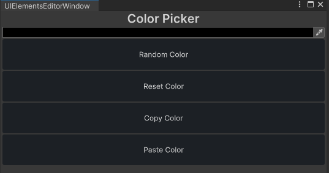
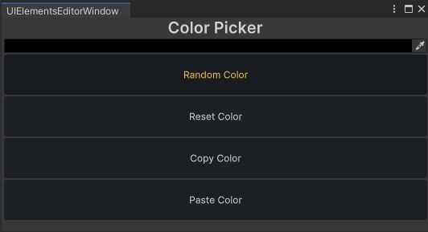
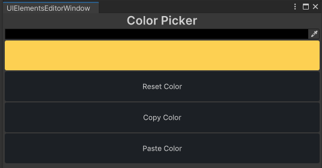
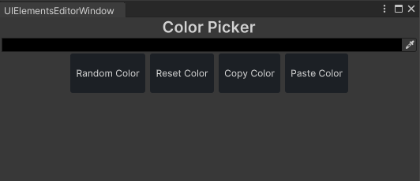
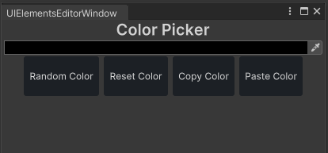
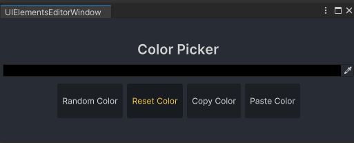

<font color=#4db8ff>Link：</font>https://www.youtube.com/watch?v=c3sSyoiekz4

<font color=#bc8df9>USS</font>：Unity Style Sheets

### 一、The Basics

熟悉<font color=#4db8ff>Html与CSS</font>在网页布局上十分常用，Unity也有类似的工具叫做<font color=#bc8df9>USS</font>：Unity Style Sheets。Unity文档上显示他们使用的<font color=#FFCE70>The Layout Engine</font>是<font color="red">Yoga</font>

创建两个脚本，一个是C#脚本<font color=#FFCE70>UIElementsEditorWindow</font>，一个是Uss <font color=#FD00FF>UIElementsStyles</font>

#### 1.1 Style

其中，<font color=#bc8df9>VisualElement.style</font>允许我们更新代码样式，而不用创建USS文件。其中style有许多属性

```C#
Label title = new Label("Color Picker");
title.style.color = Color.red;
```


<center>red color of title</center>

可以根据条件动态更新背景颜色样式

#### 1.2 Style Sheets Type

对于要修改那个组件，Unity调用<font color=#FFCE70>Selector</font>，而对于修改的内容，Unity会调用<font color=#FFCE70>Properties</font>

其中<font color=#bc8df9>Selector Types</font>可以是多样的，如：

```c#
C# Type
    Class
    Name
    WildCard
```

当我们使用使用属性作为<font color=#bc8df9>Selector Types</font>，则创建的每个类型视觉元素的样式都会更改为我们选择的样式。

 粗字体，居中，20px大小 

```CSS
Label{
    -unity-font-style:bold;
    -unity-text-align: middle-center;
    font-size: 20px;
}
```

#### 1.3  Load Style Sheets

获取，可以用<font color=#bc8df9>EditorGUIUtility.<font color=#66ff66>Load</font></font>加载，加载文件夹路径为

```c#
 Assets/Editor Default Resources/ + path
```

获取之后需要将其类型转化为<font color=#66ff66>StyleSheet</font>

```c#
StyleSheet styleSheet = (StyleSheet)EditorGUIUtility.Load("UIElementsStyles.uss");
Label title = new Label("Color Picker");
```

其中可以利用<font color=#4db8ff>rootVisualElement</font>将其加载到<font color="red">编译器窗口根目录</font>，其中添加样式表，需要使用如下方法

```c#
//添加样式表
rootVisualElement.styleSheets
styleSheets.add
```

最后传入我们加载的<font color=#4db8ff>StyleSheet</font>格式的<font color="red">uss</font>文件即可

```C#
StyleSheet styleSheet = (StyleSheet)EditorGUIUtility.Load("UIElementsStyles.uss");
rootVisualElement.styleSheets.Add(styleSheet);
```


#### 1.4 Button

使用<font color=#bc8df9>Class Selector</font>，其中为了告诉Unity这是个类选择器在类型前加入<font color="red">“ . “</font> 这符号

```CSS
.dark-button{
    background-color: #1C2025;
    color: #E0E0E0;
    border-color: transparent;
    min-height: 50px;
}
```

现在将效果加入<font color=#66ff66>button</font>，首先需要添加到<font color=#4db8ff>randomColorButton</font><font color=#bc8df9>.AddToClassList();</font>

该方法允许向<font color=#bc8df9>VisualElement</font>中添加<font color=#FFCE70>CLass</font>。这也意味着可以持有多个类，添加类需要输入名称，不需要添加<font color="red">“ . “</font> 这符号

```c#
{
    ...
    Button randomColorButton = (Button) CreateButton("Random Color");
    Button resetColorButton = (Button) CreateButton("Reset Color");
    Button copyColorButton = (Button) CreateButton("Copy Color");
    Button pasteColorButton = (Button) CreateButton("Paste Color");

    buttonsContainer.Add(randomColorButton);
    buttonsContainer.Add(resetColorButton);
    buttonsContainer.Add(copyColorButton);
    buttonsContainer.Add(pasteColorButton);

    container.Add(buttonsContainer);
    randomColorButton.AddToClassList("dark-button");
    resetColorButton.AddToClassList("dark-button");
    copyColorButton.AddToClassList("dark-button");
    pasteColorButton.AddToClassList("dark-button");、
}
```



### 二、Pseudo Class

伪类允许<font color=#bc8df9>VisualElement</font>在不同状态下使用<font color=#FFCE70>Styles Sheets</font>

```CSS
.dark-button:hover
{
    background-color: #181B1F;
    color: #FDD052;
}
.dark-button:active
{
    background-color:#FDD052;
}
```

<center> </center>

<center><font color=#4db8ff>Hover</font> 状态和<font color=#4db8ff>Active </font>状态</center>

### 三、horizon-container

#### 3.1 flex layout

设置为行居中

```CSS
.horizontal-container
{
    flex-direction: row;
    justify-content: center;
    align-content: center;
}
```

#### 3.2 warp

当窗口缩放以后，让按钮不会消失

```CSS
flex-wrap: wrap;
```

#### 3.3 buttonContainer

在CSS中要想将所有按钮都设置为水平，我们需要对父容器应用，这里也是

```C#
VisualElement buttonsContainer = new VisualElement();

...
Button randomColorButton = (Button) CreateButton("Random Color");
...
buttonsContainer.Add(pasteColorButton);

container.Add(buttonsContainer);
buttonsContainer.AddToClassList("horizontal-container");
```



<center>水平按钮</center>

### 四、Name Selector

<font color=#bc8df9>Name Selector</font>规定，面板中只能有一个元素使用名称选择器，因此<font color=#FFCE70>ID和Name</font>得唯一

#### 4.1 Name #

为了告诉Unity这个是一个<font color=#bc8df9>Name Selector</font>，我们需要在<font color="red">USS</font>前面加上标识符<font color="red">“ # ” </font>

```CSs
#color-picker
{
    margin: 8px;
}
```

我们需要通过<font color=#4db8ff>Name</font>变量更改其名称 

```c#
Label title = new Label("Color Picker");
//Editor 窗口修改颜色为红色
// title.style.color = Color.red;

ColorField colorField = new ColorField();
{
    name = "color-picker";
}
```



#### 4.2 margin

设置各个元素之间的间距可以使用<font color=#66ff66>margin</font>

```CSS
margin: 8px;
```

### 五、 WildCard Sector

这类选择器意味着这个<font color=#bc8df9>样式表 Style Sheets</font>都将具有这里定义的属性

```CSS
*{
    background-color: #282C34;
    justify-content: center;
}
```

#### 5.1 Specify

优先级上

类选择器的优先级比通配选择器的优先级高

如果是同一种选择器，则最后出现的选择器优先级更高

#### 5.2 Variables

可以在<font color=#bc8df9>Sheets</font>中创建变量，只需要在前面添加标识符<font color="red">“ -- ”</font>

#### 5.3 Global Variables

全局变量只需要将它添加到伪类选择器<font color=#66ff66>“ :root ” </font>中，使用<font color=#bc8df9>Var</font>函数调用变量

```css
:root {
    --yellow-color : #FDD052;
}
...

.dark-button:hover
{
    background-color: #181B1F;
    color:var(--yellow-color);
}
.dark-button:active
{
    background-color:var(--yellow-color);
}
```



### 六、Variables File

当<font color=#bc8df9>Var</font>函数丢失时，Unity会自己使用默认值


