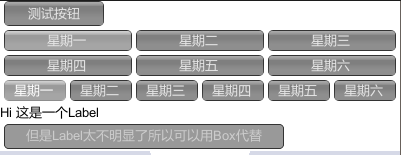
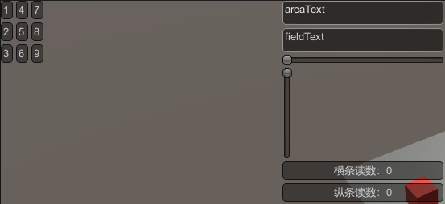
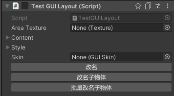
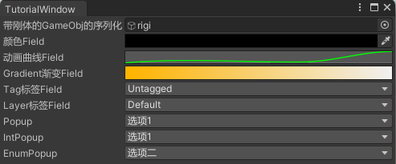
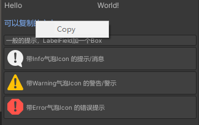
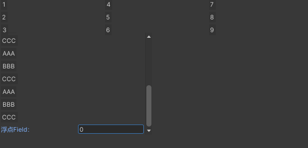
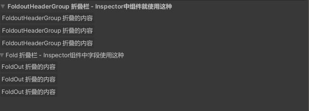
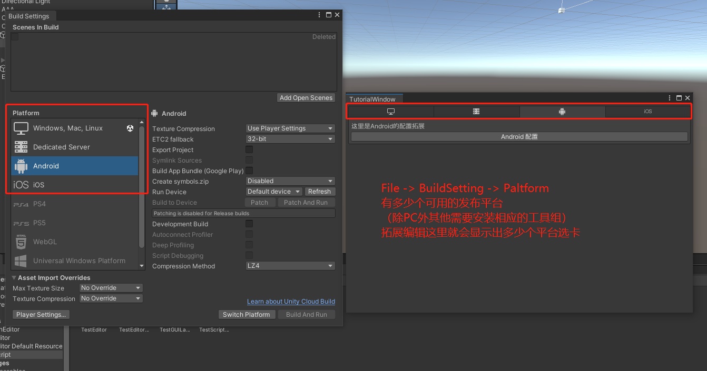

<font color=#4db8ff>Link：</font>https://zhuanlan.zhihu.com/p/570387531

### 一、常用资源目录

#### 1.1 Editor

通常只在 <font color=#66ff66>Asset/Editor</font> 放置一个，各种拓展编辑器的脚本会被放置在该目录中

<font color="red">该目录下的文件保证不打包进发布工程里</font>

<font color=#bc8df9>RunTime</font>环境下无法使用该目录中的文件/类

#### 1.2 Editor Default Resources

通常只在<font color=#66ff66> Asset/Editor Default Resources</font>放置一个

<font color="red">用于美化拓展编辑器的各种图标文件会被放置在该目录中</font>

该目录下的文件保证不打包进发布工程里，<font color=#bc8df9>RunTime</font>环境下无法使用该目录中的文件

#### 1.3忽略的目录

Unity中规定，<font color=#66ff66>以.开头，以~结尾，名为 cvs，以.tmp结尾</font>，这些目录是隐藏忽略的，开启Unity时不会对这些目录下的文件进行Asset处理进而转换到Library下

这些目录也会在打包发布时被忽略掉，<font color=#bc8df9>RunTime</font>环境下无法使用该目录中的文件

有时候我们的一些拓展编辑器的脚本、图标也会放进这类文件夹中

当然如果是团队开发这些目录可能会结合 .gitignore 忽略项，其中主要放置一些我们个人测试用的脚本、资源、场景

需要分享给团队其它成员使用的拓展编辑器脚本，最好还是放置在上面所说的 Editor 目录下

<font color=#4db8ff>File Link：</font>https://docs.unity3d.com/cn/current/Manual/SpecialFolders.html

### 二、属性标签

#### 2.1 SerializeField 与 HideInInspector

应该算是最常见的了，用于控制<font color=#66ff66>Inspector</font>中序列化控件的展开

```csharp
[SerializeField]//可以让private字段在Inspector中展开序列化控件
private Text text;
[HideInInspector]//可以取消public字段在Inspector中的序列化控件
public Text text2;
```

#### 2.2 Header与ToolTip

指定<font color=#66ff66>Inspector</font>中序列化控件的标题和提示信息

```csharp
[Header("控件标题"),Tooltip("提示信息")]
public Text text3;
```

#### 2.3 AssetMenu

```C#
[CreateAssetMenu]
public class TestScriptObj : ScriptableObject
{
    //通常结合 ScriptableObject 资源对象，Mono脚本无法应用
    //最基本的用法就是写上 [CreateAssetMenu]
    //在 Create 菜单的顶部就会添加 TestScriptObj 的创建
}

[CreateAssetMenu(fileName = "DefaultName", menuName = "A/B/TestScriptObj", order = 1)]
public class TestScriptObj : ScriptableObject
{

    //更进阶的用法
    //fileName ： 创建时的初始名称
    //MenuName ： 在 Create 中的卷展，最后一个 TestScriptObj 成为创建按钮的标题
    //Order ：在同级卷展中的显示顺序
}
```

#### 2.4MenuItem

```C#
[MenuItem("A/Build")]
private static void Build() {
        //只要是静态方法就行
        //无论是写在Mono里面还是Editor里面
        //CustomEditor/Build AssetBundle 设置了卷展和最终的按钮
        //当被摁下时，就会执行这个方法
}
```

#### 2.5 Editor 绑定 Mono 

```C#
[CustomEditor(typeof(TestGUILayout))]   //这个属性会让Editor与TestGUILayout绑定起来
[CanEditMultipleObjects] //允许编辑多个对象（例如批量对子物体进行操作）
public class TestEditor : Editor{}
```

### 三、Editor和RunTime 

因为有些东西<font color=#66ff66>RunTime</font>环境是不能使用的，仅能在<font color=#4db8ff>Editor</font>环境生效，为此就得在资源目录上进行区分，以便于Unity打包发布时不必带入那些<font color=#66ff66>RunTime</font>环境不能使用的东西

针对Assets目录，提到的<font color=#66ff66>Editor</font>目录和<font color=#bc8df9>Editor Default Resources</font>目录，这两个目录会在打包发布时被忽略（狭义上讲里面的脚本不会在打包发布时被编译）

另外针对Unity中的一些<font color=#4db8ff>Packages</font>插件包，也会有Editor目录和Runtime目录，Runtime目录中的一些脚本可能会被编译为<font color="red">.dll</font>随游戏一起被打包，Editor目录中的脚本则仅仅是被工程引用不会编译为<font color=#4db8ff>.dll</font>

#### 3.1 Preprocessor

<font color=#4db8ff>Link：</font>https://www.runoob.com/csharp/csharp-preprocessor-directives.html

几个常用的，Unity预定义的环境关键字如下：

```C#
UNITY_EDITOR  			//针对于Editor环境
UNITY_STANDALONE 		//可认为是针对于PC平台的RunTime环境
UNITY_ANDROID 			//可认为是针对于Android平台的RunTime环境
UNITY_IOS 				//可认为是针对于IOS平台的RunTime环境
```

<font color=#4db8ff>平台编译Link：</font>https://docs.unity3d.com/cn/2018.4/Manual/PlatformDependentCompilation.html

实际开发中最常见的应该是在一些涉及服务器相关的操作上，例如<font color=#66ff66>Asset</font>资源加载、一些后端数据收发请求

可能Editor环境中为保证测试的快速进行我们会使用 <font color=#bc8df9>AssetDataBase API</font>来快速加载游戏资源，但实机<font color=#4db8ff>RunTime</font>环境下，则是通过服务器接收资源包（ AB 包），还得涉及资源加密解密的一些操作

在一些后端数据收发请求上，可能Editor环境中我们会接在桩上面（JAVA中的一个概念），但实机<font color=#4db8ff>RunTime</font>环境则是真的与服务器交互

```C#
using System.Collections;
using System.Collections.Generic;
using UnityEngine;
public class ColorSet : MonoBehaviour
{
    private MeshRenderer meshRenderer;
    private void Start()
    {
        meshRenderer = gameObject.GetComponent<MeshRenderer>();
#if UNITY_EDITOR
        meshRenderer.material.color = Color.red; //Edito环境
#elif UNITY_STANDALONE
        meshRenderer.material.color = Color.blue;//PC的RunTime环境
#endif
    }
}
```

另一个要特别注意的点是，被编译忽略部分的代码可能在编译器内呈现出灰色，并且完全跳过代码的编译检查，即便我们写的是一堆乱码，只要被忽略，程序依旧能正常运行

为此我们要特别注意一些语法上，调用上有没有写对（例如；分号，方法的参数列表），建议是先写代码保证全过编译，再加 #if #elif #endif 这些预处理器指令配置编译忽略

#### 3.2 Conditional

<font color=#4db8ff>Link：</font>https://www.runoob.com/csharp/csharp-attribute.html

Conditional 是C#预定义三大标签中的一个，它也是结合 <font color=#FFCE70>#define</font> 预处理器关键字，来调整代码编译的

但与<font color=#FFCE70> #if #elif #else #endif</font>，这些预处理器指令的一个最大的不同是...在对于接口的定义和调用上

<font color=#bc8df9>Conditional </font>接口定义是<font color="red">一定进编译</font>，而调用点根据 <font color=#FFCE70>#define</font> 预处理器关键字，<font color="red">动态调整编译</font>，为此可能带来一些隐患（例如可能被外挂开发人员/骇客挖接口）

而<font color=#FFCE70> #if #elif #else #endif</font>则可以独立的、分别的去修饰定义和调用，这就比 <font color=#bc8df9>Conditional </font>更加安全可控

<font color=#66ff66>RunTime</font>脚本中一些针对于Editor环境下的接口，在定义和调用上，最好是用<font color=#FFCE70> #if #elif #else #endif</font>修饰（主要是修饰定义，调用点如果是放在Editor目录下的脚本，就不必修饰），而不是用 Conditional，尤其针对于一些敏感数据、敏感操作

通常Conditional 只用于处理一些平台相关的服务接口，或者针对性优化策略之类的

```C#
public class CurrencyMgr : MonoBehaviour
{
    private int currency = 0;//初始货币为0
    [SerializeField]
    private Text text;
    private void Start()
    {
        RefreshGUI();
        Get1WCurrency();
        //由于定义点被 Conditional 修饰
        //因此仅在Editor环境下一开始获得1w货币
        //方便开发者测试
    }
    /// <summary>
    /// 测试用接口，无条件获得1w货币
    /// </summary>
    [Conditional("UNITY_EDITOR")]
    public void Get1WCurrency() {
        currency += 10000;
        RefreshGUI();
    }
    /*
       省略...其它充值，活动获得货币的接口，后端数据首发
    */
    private void RefreshGUI() {
        if(text!=null)
            text.text = "货币数量：" + currency;
    }
}
```

但有一个非常大的隐患是，<font color=#66ff66>Conditional</font>标签修饰，只是把调用 <font color=#bc8df9>Get1WCurrency</font>的地方从编译中撤了下来，<font color=#66ff66>Get1WCurrency</font>这个接口的定义还是被带到了RunTime环境下

接口只要有定义，就有可能被调用

反射来模拟

```C#
public class CurrencyHelper : MonoBehaviour
{
    private CurrencyMgr currencyMgr;
    private MethodInfo getCurrencyMethodInfo;
    void Start()
    {
        currencyMgr = GameObject.FindObjectOfType<CurrencyMgr>();
        if (currencyMgr != null)
            getCurrencyMethodInfo = currencyMgr.GetType().GetMethod("Get1WCurrency", 
                BindingFlags.Public | BindingFlags.NonPublic | BindingFlags.Instance);
        //这一套 BindingFlags 组合拳就算private方法也能挖出来
    }
    void Update()
    {
        if (currencyMgr != null && Input.GetKey(KeyCode.LeftShift) && Input.GetKeyDown(KeyCode.A)) {
            getCurrencyMethodInfo.Invoke(currencyMgr, null);
            //通过反射来调用方法
        }
    }
}
```

但换用预处理器指令来做，就不用担心被骇佬挖接口，因为这个接口的定义并不会被带到<font color=#bc8df9>RunTime</font>环境下

### 四、GUI/GUILayout API

<font color=#4db8ff>GUI Link：</font>https://docs.unity3d.com/cn/current/ScriptReference/GUI.html

<font color=#4db8ff>GUILayout Link：</font>https://docs.unity3d.com/cn/current/ScriptReference/GUILayout.html

常写在<font color=#66ff66>Mono</font>的<font color=#bc8df9>OnGUI</font>响应方法里，展开在游戏画面的UI层上需要挂在场景对象身上应用，<font color="red">且不能被放置在Editor文件夹</font>，<font color=#bc8df9>很消耗性能</font>，常用于快速制作一些用于游戏内辅助测试的按钮/控件

也可以写在 Editor 的<font color=#66ff66>OnInspectorGUI</font>中，或是 <font color=#66ff66>EditorWindow </font>的OnGUI中

用于拓展Inspector的编辑功能，或是拓展我们自己的Editor窗口

<font color=#FFCE70>GUI 和 GUILayout</font> 的API类似

<font color=#bc8df9>GUI</font>必须通过一个Rect参数定义控件的出现位置大小

<font color=#bc8df9>GUILayout</font>多数控件无需通过Rect定义，控件会自动以左上角为原点进行布局展开（事实上这符合Windows开发对窗口原点的定义）

但仍旧有一些控件（主要是布局相关的）在GUILayout中也必须传入Rect参数才能使用

此外GUI也有一些GUILayout所没有的功能（主要和窗口、焦点相关）

#### 4.1 basic framework

以Mono脚本OnGUI方法中使用GUILayout为例，本节后面的代码都书写在下面这个框架的 OnGUI 方法中

```C#
using System.Collections;
using System.Collections.Generic;
using UnityEngine;
public class TestGUILayout : MonoBehaviour
{
    [SerializeField]
    private Texture AreaTexture;
    private bool toggle;
    private int nowSelectionIdx = 0;
    private int lastSelectionIdx = -1; //保证启动时响应默认选择
    private int nowToggleIdx = 0;
    private int lastToggleIdx = -1;
    private string[] buttonNames = new string[] { "星期一", "星期二", "星期三", "星期四", "星期五", "星期六" };
    private int maxButtonPerLine = 3;
    private string areaText = "areaText";
    private string fieldText = "fieldText";
    private int heigth;//高度递推
    private float barHorizontalValue = 0;
    private float barVerticlaValue = 0;
    private Vector2 scrollViewRoot;
    [SerializeField]
    private GUIContent content;
    [SerializeField]
    private GUIStyle style;
    [SerializeField]
    private GUISkin skin;
    private void OnGUI() {
        //后面几节给出的测试代码写在这里
    }
}
```

#### 4.2 Area、Click、Info

<font color=#bc8df9>toggle</font>控制 Area 展开

<font color=#bc8df9>Button、SelectionGrid、Toggle </font>三种Click触发控件

<font color=#bc8df9>Label与Box </font>常用于信息的展示

```C#
toggle = GUI.Toggle(new Rect(0, heigth, 150, 30), toggle, "是否展开Area");


//一个重要的技巧就是使用Toggle来控制Layout的展开
if (toggle) {

    //这个Area通过传入Rect定义位置大小，其实并没有接入到Layout中
    GUILayout.BeginArea(new Rect(0, heigth, 300, 500), AreaTexture);

    //Width Height传参可省略
    if (GUILayout.Button("测试按钮", GUILayout.Width(100), GUILayout.Height(25))) {
        Debug.Log("Click 按钮 !");
    }

    nowSelectionIdx = GUILayout.SelectionGrid(nowSelectionIdx, buttonNames, maxButtonPerLine);
    if (nowSelectionIdx != lastSelectionIdx) {

        Debug.Log("SelectionGrid 选择了：" + buttonNames[nowSelectionIdx]);
        lastSelectionIdx = nowSelectionIdx;

    }
    //无法定义 maxButtonPerLine 只能展开为一行
    nowToggleIdx = GUILayout.Toolbar(nowToggleIdx, buttonNames);

    if (nowToggleIdx != lastToggleIdx) {

        Debug.Log("Toolbar 选择了：" + buttonNames[nowToggleIdx]);
        lastToggleIdx = nowToggleIdx;
    }
    GUILayout.Label("Hi 这是一个Label", style);
    GUILayout.Box("但是Label太不明显了所以可以用Box代替", GUILayout.Width(280), GUILayout.Height(25));

    GUILayout.EndArea();
    //一定记得上面Begin展开Area
    //下面就要End结束 ，不然会报错
}
```



<font color=#4db8ff>SelectionGrid Link：</font>https://docs.unity3d.com/cn/current/ScriptReference/30_search.html?q=SelectionGrid

<font color=#4db8ff>Toolbar Link：</font>https://docs.unity3d.com/cn/current/ScriptReference/30_search.html?q=Toolbar4.

#### 4.3 TextArea/TextField

（其实还有一种输入控件([GUILayout-PasswordField - Unity 脚本 API](https://link.zhihu.com/?target=https%3A//docs.unity3d.com/cn/current/ScriptReference/GUILayout.PasswordField.html)) 但真的不常用）

<font color=#66ff66>TextArea </font>是一个多行的文字输入框，如果使用GUILayout，在增行时若没有MaxHeigth Option 限制，则会扩展高度

<font color=#66ff66>TextField </font>则是一个单行的文字输入框

<font color=#bc8df9>GUILayout </font>版本的<font color=#4db8ff> TextArea与TextField</font> ，常需要结合 <font color=#FFCE70>MinWidth Option</font> 限制使用，否则在输入字符过短时，宽度可能收缩到无法使用

```C#
//使用GUI版本的 TextArea TextField 是定死的宽度
//heigth = 0;
//areaText = GUI.TextArea(new Rect(0, heigth, 100, 30), areaText);
//heigth += 30;
//fieldText = GUI.TextField(new Rect(0, heigth, 100, 30), fieldText);
//heigth += 30;


//使用GUILayout 下的 TextArea TextField
//常需要结合 MinWidth Option 否则在输入字符过短时宽度可能收缩到无法使用
areaText = GUILayout.TextArea(areaText, GUILayout.MinWidth(200), GUILayout.MaxHeight(30));

fieldText = GUILayout.TextField(fieldText, GUILayout.MinWidth(200), GUILayout.MaxHeight(30));
```


运行起来的效果


特别注意<font color=#bc8df9>GUILayout</font>的版本一定要加MinWidth Option 限制


#### 4.4 Slider 与 Scrollbar

<font color=#66ff66>Slider </font>在读数（输出）上像是用一个极细的没有宽度的针，去选中min,max范围内的某一个读数，因此它在两端时一定能输出min和max值

而 <font color=#66ff66>Scrollbar </font>则是在min，max范围内，放置了一个宽度为 <font color="red">blcokSize</font>滑块，并用滑块的左端来指示读数，因此 Scrollbar 真正的读数（输出）范围会是 <font color=#FFCE70>min,max-blcokSize</font>

```csharp
//这个横条不加MinWidth会出错
//Slider的特点是，当我们拉到末端时一定会给出 min/max 读数
barHorizontalValue = GUILayout.HorizontalSlider(barHorizontalValue, 0f,500f,GUILayout.MinWidth(200));
barVerticlaValue = GUILayout.VerticalSlider(barVerticlaValue, 0f, 500f);

GUILayout.Box("横条读数：" + barHorizontalValue);
GUILayout.Box("纵条读数：" + barVerticlaValue);        
```

<font color=#FD00FF>注意：</font>上下两块代码应注释掉其中一块，否则最终输出值按后方的 Scrollbar 影响

```C#
//Scrollbar的特点是通过一个 blockSize 控制滑块的大小
//由于滑块自身大小的限制，最终读数范围是 [min,max-blcokSize] 
barHorizontalValue = GUILayout.HorizontalScrollbar(barHorizontalValue,25, 0f, 500f, GUILayout.MinWidth(200));
barVerticlaValue = GUILayout.VerticalScrollbar(barVerticlaValue, 25, 0f, 500f);

GUILayout.Box("横条读数：" + barHorizontalValue);
GUILayout.Box("纵条读数：" + barVerticlaValue);
```

#### 4.5 Horizontal与Vertical展开

```C#
public void isHorizontal()
{
    GUILayout.BeginHorizontal();

    GUILayout.BeginVertical();
    GUILayout.Box("1");
    GUILayout.Box("2");
    GUILayout.Box("3");
    GUILayout.EndVertical();

    GUILayout.BeginVertical();
    GUILayout.Box("4");
    GUILayout.Box("5");
    GUILayout.Box("6");
    GUILayout.EndVertical();

    GUILayout.BeginVertical();
    GUILayout.Box("7");
    GUILayout.Box("8");
    GUILayout.Box("9");
    GUILayout.EndVertical();

    GUILayout.EndHorizontal();

    //最终会输出一个数字九键排列
    // 1 4 7
    // 2 5 8
    // 3 6 9
}
```



#### 4.6 Area+ScrollView

一般<font color=#bc8df9>Editor</font>那边会用 <font color=#66ff66>EditorGUILayout</font>的 <font color="red">BeginScrollView</font>，而该组件仅限于 OnGUI 使用，而且还需要套一个 Area 才能生效

```C#
public void isAreaScrollView()
{
    // 这里要套一个Area来定义控件的区域，基于这个区域展开ScrollView
    //否则将基于整个屏幕展开ScrollView
    GUILayout.BeginArea(new Rect(0, 0, 350, 300));

    //scrollViewRoot 是一个Vector2 Mask内互动区域当前的位置锚点
    scrollViewRoot = GUILayout.BeginScrollView(scrollViewRoot);


    //默认纵向布局
    //Heigth 总计600 >> 400 因此纵向就会展开滑动条
    //Width 总计300 << 400 因此横向不会展开滑动条
    GUILayout.Button("Buttons", GUILayout.Height(200), GUILayout.Width(300));
    GUILayout.Button("Buttons", GUILayout.Height(200), GUILayout.Width(300));
    GUILayout.Button("Buttons", GUILayout.Height(200), GUILayout.Width(300));

    GUILayout.EndScrollView();

    GUILayout.EndArea();
}
```


#### 4.7 RepeatButton

<font color=#66ff66>RepeatButton </font>和 4.1 节中用到的三种Click触发控件不同，它是一种在 <font color=#bc8df9>OnPointerDown </font>时就会触发的按钮

```C#
public void isRepeatButton()
{
    //Button必须是完成一次Click，才会返回true（触发）
    //而ReapeatButton会在IPointDown的瞬间触发
    if (GUILayout.RepeatButton("啊", GUILayout.MaxWidth(200)))
        Debug.Log("啊啊啊");
}
```

#### 4.8 Some tips

1.针对于 <font color=#bc8df9>OnGUI</font> 绘制测试用控件的情况，可以使用<font color=#66ff66>toggle</font>来控制一些Arae的展开，或是使用<font color="red"> Area/ScrollView </font>把控件装进一个限定大小的区域中。不要一次性在视图上展开/堆放大量的控件，避免混乱

2.针对于<font color=#bc8df9>GUI/EditorGUI</font>版本的控件

<font color=#66ff66>Rect</font>参数中，可以通过一个heigth参数记录从上到下所有控件Arae展开的高度位置，进行高度递推计算，避免控件相互遮挡，如果要横向展开，

3.在<font color=#66ff66>GUILayout</font>展开控件时，使用 <font color="red">GUILayoutOption </font>控制Layout中一些参数，这些参数跟在方法末尾传入即可

```C#
GUILayout.Width(float width) // 设置控件的宽度
GUILayout.Height(float height) // 设置控件的高度
GUILayout.MinWidth(float width) // 设置控件的最小宽度
GUILayout.MinHeight(float height) // 设置控件的最小高度
GUILayout.MaxWidth(float width)// 设置控件的最大宽度
GUILayout.MaxHeight(float width) // 设置控件的最大高度
GUILayout.ExpandHeight(bool expand) // 是否允许自动扩展高度
GUILayout.ExpandWidth(bool expand) // 是否允许自动扩展宽度
```

4.使用<font color=#66ff66>GUILayout-Window</font>，可以将一个矩形区域的绘制委托给一个<font color=#66ff66>Func</font>执行

<font color=#4db8ff>Link：</font>https://docs.unity3d.com/cn/current/ScriptReference/GUILayout.Window.html

5.使用 <font color=#66ff66>GUILayout-Space</font><font color="red">空白元素分割</font>

<font color=#4db8ff>Link：</font>https://docs.unity3d.com/cn/current/ScriptReference/GUILayout.Space.html

或使用 <font color=#66ff66>GUILayout-FlexibleSpace</font>挤占当前Area域中的剩余空间，结合横纵布局形成对齐，或是让控件紧贴到边缘

<font color=#4db8ff>Link：</font>https://docs.unity3d.com/cn/current/ScriptReference/GUILayout.FlexibleSpace.html

### 五、Editor 拓展基础

####  5.1 Editor OnInspectorGUI

需要通过一个继承自 <font color=#bc8df9>Editor </font>的脚本，通过属性绑定一个脚本，并控制其在<font color=#66ff66>Inspector</font>中的序列化控件，或是新增一些其他控件

可以绑定Mono脚本，也可以绑定<font color=#4db8ff>ScriptObject</font>脚本，<font color="red">Override OnInspectorGUI</font>方法来实现<font color=#4db8ff>Inspector</font>中控件绘制的拓展

一个框架简例，我们先新建一个 <font color=#66ff66>TestGUILayout</font>.cs】脚本，包含一个同名的继承自Mono的类，再在Editor目录中创建一个 <font color=#66ff66>TestEditor</font>.cs】脚本，代码大致如下：

```C#
using UnityEngine;
using UnityEditor;
[CustomEditor(typeof(TestGUILayout))]   //这个属性会让Editor与TestGUILayout绑定起来
[CanEditMultipleObjects] //
public class TestEditor : Editor
{
    //注意访问修饰是 public
    //这个方法就是 TestGUILayout 在Inspector中序列化展开面板的定义
    public override void OnInspectorGUI() {
        base.OnInspectorGUI();//先绘制默认的实例化展开
        //再在下方绘制我们自己的实例化展开
        if(GUILayout.Button("HelloWorld!")) {
            Debug.Log("HelloWorld!");
        }
        serializedObject.ApplyModifiedProperties();//最后记得调一下这个方法才能保存序列化结果
    }
}
```

#### 5.2 EditorWindow

通过一个继承自 <font color=#66ff66>EditorWindow </font>的子类，来定义我们的窗口类，通常结合顶部按钮来实例化窗口，并在<font color="red">OnGUI</font>编码窗口的控件展开

一个框架简例

```C#
using UnityEngine;
using UnityEditor;
public class TestEditorWindow : EditorWindow
{
    private static TestEditorWindow window;//static静态窗口实例
    [MenuItem("LearnEditor/CreatTestEditorWindow")]
    private static void CreatWindow() {
        //通过顶部菜单中添加按钮，来创建出窗口实例
        window = GetWindow<TestEditorWindow>(false, "TutorialWindow", true);
        window.Show();
        //第一个参数：bool utility
        //为true创建一个Win窗口（Windows的标准窗口，无法停靠在Editor），
        //为false创建一个Unity的浮动窗口（和Scene Game这些窗口一样可以停靠在Editor中）
        //第二个参数： string title 窗口标题
        //第三个参数：bool focus 创建后是否聚焦到这个窗口上
    }
    private void OnGUI() {
        //这里编写的就是窗口中的控件
        if (GUILayout.Button("say hello"))
            Debug.Log("Hello World!");
    }
}
```

#### 5.3 Editor timing

<font color="red">Editor</font>并不是每帧每时每刻都在绘制，仅仅是在我们进行了操作（光标划过控件），或是拖动了窗口时才会绘制

为此无论是<font color=#66ff66> Editor OnInspectorGUI</font> 还是 <font color=#66ff66>EditorWindow OnGUI</font>，都不能去实现一些动态检测的代码，而是要以静态触发的Logic进行编写

一个简单的测例：

```C#
public class TestEditorWindow : EditorWindow
{
    private static TestEditorWindow window;//static静态窗口实例
    [MenuItem("LearnEditor/CreatTestEditorWindow")]
    private static void CreatWindow() {
        window = GetWindow<TestEditorWindow>(false, "TutorialWindow", true);
        window.Show();
    }
    private void OnGUI() {
        Debug.Log("OnDraw!!!");
        //...          
    }
}
```

实际窗口启动后并不会一直打印，而是在我们Focus窗口，拖动窗口，预选/选择/操作了窗口中的控件时才会触发

（倒是可以通过绘制触发来判断鼠标有没有放在窗口控件上）

如果要实现动态检测，可以使用 <font color="red">Update </font>或者 <font color=#66ff66>OnInspectorUpdate</font> 这两个<font color=#4db8ff>Event</font>方法

#### 5.4 Editor  use GUILayout

无论是 <font color=#66ff66>Editor OnInspector</font> 还是 <font color=#4db8ff>EditorWindow OnGUI</font>，都可以使用 <font color=#bc8df9>GUI/GUILayout</font>中的各种控件


#### 5.5 target for OnInspectorGUI

<font color=#bc8df9>Editor OnInspectorGUI</font>拓展中，Editor父类定义了<font color="red">target</font>字段，用于<font color="red">指向所绑定</font>的Mono脚本实例所在的那个<font color=#4db8ff>UnityEngine.Obj</font>

借此我们可以获取到Mono脚本所在的物体，进行一些奇奇怪怪的操作（通常是一些对子物体批量修改，例如Skin蒙皮时使用了物体做骨骼，导入后需要批量剔除Mesh）

注意批量操作子物体时，需要加上 [<font color=#FFCE70>CanEditMultipleObjects</font>] 属性

```C#
using System.Collections;
using System.Collections.Generic;
using UnityEngine;
using UnityEditor;

[CustomEditor(typeof(TestGUILayout))]  
//注意要加上这个属性，才能批量操作子物体
[CanEditMultipleObjects] 
public class TestEditor : Editor
{
    TestGUILayout testGUILayout;
    private void OnEnable() {
        testGUILayout = target as TestGUILayout;
    }


    //注意访问修饰是 public
    //这个方法就是 TestGUILayout 在Inspector中序列化展开面板的定义
    public override void OnInspectorGUI() {
        base.OnInspectorGUI();//先绘制默认的实例化展开

        //再在下方绘制我们自己的实例化展开

        if (GUILayout.Button("改名")) {
            testGUILayout.transform.name = "AAA";

            if (testGUILayout.GetComponent<MeshRenderer>() != null)
                DestroyImmediate(testGUILayout.GetComponent<MeshRenderer>());
        }

        if (GUILayout.Button("改名子物体")) {

            if (testGUILayout.gameObject.transform.childCount > 0)
                testGUILayout.gameObject.transform.GetChild(0).name = "BBB";
        }

        if (GUILayout.Button("批量改名子物体")) {

            for (int i = 0; i < testGUILayout.gameObject.transform.childCount; ++i)
                testGUILayout.gameObject.transform.GetChild(i).name = "CCC";
        }
        //
        //serializedObject.ApplyModifiedProperties();//最后记得调一下这个方法才能保存序列化结果
    }
}
```

 <font color="red">target </font>是一个<font color=#FFCE70>UnityEngine.Object</font> ，就是绑定到具体物体上，Mono的实例化对象，因为我们绑定了<font color=#66ff66>TestGUILayout</font>，因此这个<font color="red">target</font>就是<font color=#66ff66>TestGUILayout</font>实例

通过强制类型转换，即可获取<font color=#66ff66>TestGUILayout</font>实例，在拓展编辑时对这个实例进行操作。也别忘了<font color=#FFCE70> .gameobject .transform </font>可以获取到绑定 TestGUILayout 实例的物体，及其上面的其他组件



#### 5.6 Selection for EditorWindow 

针对于<font color=#66ff66>EditorWindow</font>的拓展，我们可以使用 <font color=#bc8df9>Selection </font>类来获取到<font color="red">Editor</font>中正选中的物体，借此对接到针对这个物体的编辑上（包括场景中的物体，或是Asset中的资源物体）

（例如<font color="red">Animator</font>窗口就是对接到所选物体Animator组件上引用的 <font color=#66ff66>Animator Controller</font>）

其实 <font color="red">Editor OnInspector </font>也可用<font color=#66ff66>Selection</font>，但不常见，通常仅针对<font color=#FFCE70>Mono</font>脚本所在物体，或是子物体进行编辑

此外<font color="red">Selection</font>还可获取到所选物体中的激活物体，或是物体的<font color=#4db8ff> GUID InstanceID </font>详见官方文档

<font color=#4db8ff>UnityEditor.Selection Link：</font>https://docs.unity3d.com/cn/current/ScriptReference/Selection.html

```C#
if(GUILayout.Button("打印选中物体名称",GUILayout.MaxWidth(200))) {
    var sobjs = Selection.gameObjects;
    for (int i = 0; i < sobjs.Length; ++i)
        Debug.Log(sobjs[i].name);
}
```

### 六、EditorGUI/EditorGUILayout API

<font color=#bc8df9>EditorGUILayout </font>中有一些和 <font color=#bc8df9>GUILayout </font>重复的接口，主要是布局展开相关，例如Area展开，横纵展开，ScrollView展开

一般在<font color=#66ff66>Editor</font>拓展时我们都会使用<font color=#4db8ff>EditorGUILayout</font>的布局展开

<font color="red">EditorGUILayout</font>也有一些专门的，独属于<font color=#66ff66>Editor</font>拓展状况下才能使用的控件，这些控件是无法用在<font color=#66ff66>Mono</font>的<font color="red">OnGUI</font>中的，主要是一些针对于C#字段在Unity编辑器内<font color="red">序列化编辑</font>的控件

<font color=#4db8ff>EditorGUI Link：</font>https://docs.unity3d.com/cn/current/ScriptReference/EditorGUI.html

<font color=#4db8ff>EditorGUILayout Link：</font>https://docs.unity3d.com/cn/current/ScriptReference/EditorGUILayout.html

#### 6.1 ScrollView的使用

针对 <font color=#66ff66>EditorWindow </font>要特别注意<font color=#bc8df9>ScrollView</font>的使用

<font color=#FFCE70>Inspector</font>中各组件排列布局整体自带有纵向的 <font color=#bc8df9>ScrollView </font>效果，而 <font color=#66ff66>EditorWindow </font>中如果我们展开过多控件，而不使用 <font color=#bc8df9>ScrollView </font>，用户/同事 将只能通过拉伸窗口分辨率的方式才能看到所以控件

因此 <font color=#66ff66>EditorWindow </font>中只要控件够多，就一定要在开头结尾加上  <font color=#bc8df9>ScrollView </font>的展开

```C#
 private void OnGUI() {
        //如果东西多，一定要用 ScrollView 包一下，否则必须拉伸窗口才能看见所有控件
        scrollViewRoot = EditorGUILayout.BeginScrollView(scrollViewRoot);
        //很多控件
        EditorGUILayout.EndScrollView();
 }
```

#### 6.2 Field Domain

Field域就是Mono中各种可以在<font color=#FFCE70>Inspector</font>中序列化编辑的字段，其对应序列化控件的创建接口

大致的使用都是

```C#
//定义一个字段，或是从物体上获取这个字段
writeReference = EditorGUILayout.XXXField(readReference);
//这里如果不进行赋值的操作，就无法通过控件序列化编辑，而是只读的进行显示
```

之后在编辑器里通过拖拽，或是输入赋值，进行序列化编辑

以下是几种相关的 <font color="red">Field</font>

##### 6.2.1 ObjectField

用于在场景中拖拽，序列化对象的域

```C#
private GameObject obj;
    //成为窗口实例的一个字段
    //可通过 Selection 获取到选中对象上的某个字段进行序列化
    //或是结合 Editor OnInspector 中target上某个脚本的字段进行序列化
    private void OnGUI() {
        obj = EditorGUILayout.ObjectField("一个必须带刚体的GameObj的序列化", obj, typeof(GameObject),true) as GameObject;
    }
```

第二个参数是只读的显示出的obj，第三个参数是可以被分配/拖拽上去的对象类型（这个参数应当与被读取的obj保持一致，或是使用obj的父类），第四个参数 是否可以是场景对象（如果只要引用Assert中的资源，这个参数应被置位false）

最后输出的对象是一个<font color=#66ff66>UnityEngine.Obj</font> 我们需要强制转换到 obj 的类型

注意第三个参数的设置，如果第三个参数的类型无法被强制转换到obj的类型，那么序列化结果会一直为<font color="red">空</font>

##### 6.2.2 ValueTypeField

各种值类型的<font color="red">Field</font>展开测例如下：

特別注意应用<font color=#66ff66>TextArea</font>的<font color=#4db8ff>string</font>，初值不能为空，并且<font color=#66ff66>TextArea</font>参数没有<font color="red">Title</font>设置

<font color=#66ff66>TextArea</font>会自动扩展，但不能传<font color=#4db8ff>string</font>加标题，可以用 <font color=#bc8df9>LabelField </font>做标题

```C#
private int i;
private long l;
private float f;
private double d;

string str_Field;
string str_Area = new string("default Str"); //注意这里必须初始化，不能起手用空字符串否则无法展开 TextArea
private Vector2 v2;
private Vector2Int v2int; //这个可能不常见，分量由int组成不是float
private Vector3 v3;
private Vector3Int v3int;
private Vector4 v4;
private Rect rec;
private RectInt recint
private Bounds b;//Unity自带的碰撞盒（Collider组件里有用到），通过 centerPos中心点 + extentsSize半尺向量 定义
private BoundsInt bint;//创建后可以通过属性获取到 max min Point，设置max minPoint，并通过方法判断碰撞/包含
private Quaternion quaternion;//四元数可以通过 V4 转换得到，或者自己起一堆 floadField 来录入
private Vector4 qv4;
private Gradient gradient;//这个是用来创建颜色渐变的，类似3dsMax的渐变坡度贴图编辑，但序列化功能好像弃了
private Vector2 scrollViewRoot;
private void OnGUI() {


    //如果东西多，一定要用 ScrollView 包一下，否则必须拉伸窗口才能看见所有控件
    scrollViewRoot = EditorGUILayout.BeginScrollView(scrollViewRoot);

    i = EditorGUILayout.IntField("整数域", i);
    l = EditorGUILayout.LongField("长整数域", l);
    f = EditorGUILayout.FloatField("单精度浮点域", f);
    d = EditorGUILayout.DoubleField("双精度浮点域", d);

    str_Field = EditorGUILayout.TextField("字符串域（单行）", str_Field);

    str_Area = EditorGUILayout.TextArea(str_Area); //【注意】这里不能加string标题

    v2 = EditorGUILayout.Vector2Field("Vector2域", v2);
    v2int = EditorGUILayout.Vector2IntField("Vector2Int域", v2int);

    v3 = EditorGUILayout.Vector3Field("Vector3域", v3);
    v3int = EditorGUILayout.Vector3IntField("Vector3Int域", v3int);

    v4 = EditorGUILayout.Vector4Field("Vector4域", v4);

    rec = EditorGUILayout.RectField("Rect域", rec);
    recint = EditorGUILayout.RectIntField("RectInt域", recint);

    b = EditorGUILayout.BoundsField("Bounds域", b);
    bint = EditorGUILayout.BoundsIntField("BoundsInt域", bint);

    qv4 = EditorGUILayout.Vector4Field("Quaternion域", qv4); //四元数用Vector4Field 加个转换就好了
    quaternion = new Quaternion(qv4.x, qv4.y, qv4.z, qv4.w);

    EditorGUILayout.EndScrollView();
}
```

##### 6.2.3 DelayedValueTypeField

延迟改变的值类型<font color="red">Field</font>

非延迟改变的<font color=#bc8df9>Field</font>会在用户输入的整个过程中，动态的改变被赋值的<font color=#66ff66>ValueType</font>

而具有 <font color="red">Delayed </font>延迟改变属性的 <font color=#4db8ff>Field</font>，只有在用户摁下 <font color="red">Enter</font>，或是 <font color=#66ff66>FocusOff </font>的时候才会真正改变被赋值的 <font color=#66ff66>ValueType</font>

借此可以避免一些未准备好的，奇异的参数被动态的录入应用，事实上 3dsMax 中很多 Field 就用到了 <font color=#bc8df9>Delayed</font>

具有 <font color=#bc8df9>Delayed </font>的 <font color=#66ff66>ValueType</font>有如下四种：

```C#
private int i;
private float f;
private double d;
private string str;
private long l;//很遗憾没有这个的Delayed
private void OnGUI() {

    i = EditorGUILayout.DelayedIntField("整数域", i);
    f = EditorGUILayout.DelayedFloatField("单精度浮点域", f);
    d = EditorGUILayout.DelayedDoubleField("双精度浮点域", d);
    str = EditorGUILayout.DelayedTextField("字符串域", str);

}
```

##### 6.2.4 ColorField

```C#
private Color color;
private void OnGUI() {
    color = EditorGUILayout.ColorField("颜色Field", color);
}
```

##### 6.2.5 CurveField

AnimationCurve的编辑，这个还挺常用的

```C#
//特别注意这里起手的初始化 否则编辑时会报错
public AnimationCurve curve = new AnimationCurve();
private void OnGUI() {
    curve = EditorGUILayout.CurveField("动画曲线Field", curve);
}
```

##### 6.2.6 GradientField

Unity自带的一个颜色渐变条，Editor对其的序列化编辑

其实类似 AnimationCurve ，也有一个 Evaluate 方法，不过返回值（输出量）是 Color

<font color=#4db8ff>Gradient Link：</font>https://docs.unity3d.com/ScriptReference/Gradient.html

```C#
private Gradient gradient = new Gradient();
private void OnGUI() {
    gradient = EditorGUILayout.GradientField("Gradient渐变Field", gradient);
}
```

#### 6.3 Tag

各种基于 <font color=#bc8df9>DropdownButton + GenericMenu</font> 的标签选择

##### 6.3.1 TagField/LayerField

与工程中的<font color=#66ff66>Tag</font>标签和Layer层设置对应

```C#
//标签是一个string（CompareTag传参就是String）
private string tag;
//layer则是一个int，是通过二进制掩码的方式运作的
private int layer = 0; 
private void OnGUI() {
    //特别注意这个别写反了！！！
    tag = EditorGUILayout.TagField("Tag标签Field",tag);
    //可用于Phy各种碰撞Cast的Mask中
    layer = EditorGUILayout.LayerField("Layer标签Field",layer);
}
```

#####  6.3.2 LayerMask 结构体 与 二进制掩码

<font color=#66ff66>LayerMask</font>是Unity用于管理<font color="red">Layer</font>层掩码的结构体，自带有一个int参数的掩码存储，并可根据此参数与int隐式互转，以及各种<font color=#66ff66> Layer string </font>名称与<font color=#bc8df9>Idx和mask</font>掩码转换的静态方法

```C#
public struct LayerMask
{
    //这个值可以用来存layermask掩码
    public int value { get; set; } 
    //根据value值与int进行隐式互转换
    public static implicit operator int(LayerMask mask); 
    public static implicit operator LayerMask(int intVal);
    
    //获取对应layer名称的二进制掩码值
    public static int GetMask(params string[] layerNames);
    //这两个方法要和GetMask区分开，是layer名称和Idx[0,1,2,3...]之间的转换
    public static string LayerToName(int layer);
    public static int NameToLayer(string layerName);
}
```

我们要理解二进制掩码的运作机制

可以通过 <font color=#4db8ff>1<<idx </font>来将idx下标转为对应的掩码值（掩码正值）

<font color=#4db8ff>&</font>掩码正值就可以检查是否激活了这一位

<font color=#4db8ff>|</font>掩码正值就可以添加这一位

<font color=#4db8ff>~</font>取反到掩码负值，再 <font color=#66ff66>&</font> 就可以删除这一位

结合 <font color=#FFCE70>LayerMask </font>就可以判断<font color=#FFCE70>Layer</font>掩码中，某个layer是否激活，或是增删对应的layer

事实上我们可以结合下面的 <font color=#bc8df9>MaskField/EnumFlagsField</font>拓展，以及C# enum的To_String()、数值指定、(int)强转

封装出一个属于自己的<font color=#66ff66>Mask</font>选项名与Int掩码值相互转化/判定的结构体（就像<font color="red">LayerMask</font>一样）

##### 6.3.3 Popup/IntPopup/EnumPopup

三种单选标签栏（虽然它们不是<font color="red">Field</font>，但编辑操作与本节的其他<font color=#66ff66>Field</font>一致）

<font color=#4db8ff>Popup</font>使用较为简单，是传入一个 <font color=#bc8df9>string[] </font>选项名称，并将其与 [0,1,2] 这样的 Idx 进行对应输出为int值

<font color=#4db8ff>IntPopup</font>使用比较麻烦，需要一个 <font color=#bc8df9>value </font>数值接收，一个 string[] 选项，和一个 int[] 选项对应数值

<font color=#4db8ff>EnumPopup</font>使用最为简单，只需要定义好一个 <font color=#bc8df9>enum </font>类型即可（注意enum类型 ToStinrg() 和 选项数值指定强转int 的使用）

```C#
private int popup;
private string[] popupSelection = new string[] { "选项1", "选项2", "选项3" };
private int intPopup;
//这里是定义展示在Editor那边的选项名称
private string[] intPopupSelection = new string[] { "选项1", "选项2", "选项3" };
//这里是定义选项对应的数值
private int[] PopupValue = new int[] { 857, 114514, 2022 };
//枚举选项可以通过 ToString() 拿到代码里的名称，也可以通过强转 (int) 拿到其数值
public enum Choise
{
    选项一 = 857, 
    选项二 = 114514,
    选项三 = 2022
}
private Choise cs;
private void OnGUI() {
    popup = EditorGUILayout.Popup("Popup", popup, popupSelection);
    //输出 [0,1,2...] Index 下标值
    Debug.Log("popup：" + popup);
    intPopup = EditorGUILayout.IntPopup("IntPopup", intPopup, intPopupSelection, PopupValue);
    //输出与 PopupValue 对应
    Debug.Log("intPopup：" + intPopup);
    //通常需要加强制类型转换
    cs = (Choise)EditorGUILayout.EnumPopup("EnumPopup", cs); 
    //输出枚举选项，通过ToString可获取选项名称，(int)获取指定值
    Debug.Log("EnumPopup：" + cs.ToString() + " " + (int)cs);
}
```

<font color=#4db8ff>Popup Link：</font>https://docs.unity3d.com/ScriptReference/30_search.html?q=Popup



##### 6.3.4 MaskField 多选标签

可以用 <font color=#bc8df9>string[]</font> 自定义选项的二进制掩码多选栏

<font color=#66ff66>MaskField</font>会自带 <font color=#FFCE70>Nothing 和 Everything</font> 两个标签

要特别注意的是，<font color=#66ff66>MaskField</font>如果选中Everything，那么数值会变为-1（二进制全1，尽管我们没有定义所有位）

```csharp
private int mask;
static string[] options = new string[] { "CanJump", "CanShoot", "CanSwim" };
private void OnGUI() {
    mask = EditorGUILayout.MaskField("Mask Field", mask,options);
    Debug.Log(mask);
}
```

#####  6.3.5 EnumMaskPopup/EnumMaskField/EnumFlagsField

都是二进制掩码，不过是通过<font color=#66ff66>Enum</font>枚举来定义选项

注意<font color=#bc8df9> EnumMaskField 和 EnumMaskPopup</font> 在 Unity 2021 已标记为弃用，应使用 <font color="red">EnumFlagsField </font>替代

我们需要按照二进制掩码的位次组织，为枚举指定对应的数值，否则显示会不正常

枚举顶头必须手动添加一个<font color=#4db8ff> None=0</font> ，可以加一些组合选项，数值指定为对应的掩码组合

<font color=#66ff66>EnumFlagsField</font>方法返回值是一个枚举，但我们应当强转为int使用其掩码值

```C#
public enum WorkDay
{
    None=0,                 //【特别注意】 这里顶上必须加一个 None = 0 
    星期一=1,               // 并且按照二进制掩码的位次组织 Enum 的数值对应
    星期二=2,               // 否则使用会显得不正常
    星期三=4,
    星期四=8,
    星期五=16,
    星期六=32,
    星期日=64,
    NormalWorkDay=1+2+4+8+16     //我们可以加一些特定的组合项，数值指定为对应的掩码组合
};
WorkDay workDayMask;
int mask;
private void OnGUI() {
    workDayMask = (WorkDay)EditorGUILayout.EnumFlagsField("EnumFlagsField", workDayMask);
    mask = (int)workDayMask;//虽然接收是用Enum，但二进制掩码应当转成int使用
    Debug.Log(mask);
}
```


#### 6.4 Button

##### 6.4.1DropdownButton

和 <font color=#bc8df9>GUILayout.RepeatButton</font> 很像，都是在<font color="red">IPointDown</font>瞬间触发

不过 <font color=#4db8ff>DropdownButton </font>是一个类似卷展栏的样子，事实上【6.2各种标签栏】，底层实现就用到了这个组合拳

官方文档中推荐可以结合 <font color="red">GenericMenu </font>一起使用，详见下文 【7.GenericMenu】的7.4节

<font color=#4db8ff>DropdownButton Link：</font>https://docs.unity3d.com/cn/current/ScriptReference/EditorGUILayout.DropdownButton.html

<font color=#4db8ff>GenericMenuLink：</font>https://docs.unity3d.com/cn/current/ScriptReference/GenericMenu.html

```C#
bool isShow = false;
if (EditorGUILayout.DropdownButton(new GUIContent("显示组件"), FocusType.Passive,GUILayout.MaxWidth(300)))
    isShow = !isShow;
if(isShow) {
    GUILayout.Label("加油！", GUILayout.MaxWidth(200));
    GUILayout.Label("加油！！", GUILayout.MaxWidth(200));
    GUILayout.Label("加油！！！", GUILayout.MaxWidth(200));

    if (GUILayout.Button("加油", GUILayout.MaxWidth(200)))
        Debug.Log("加油！！！");

}
```


顺带，<font color=#bc8df9>UGUI</font>也有一个<font color=#66ff66>DropdownButton</font>控件，很好用，可以直接在Inspector里配选项

##### 6.4.2 LinkButton

一种<font color="red">超链接样式</font>的按钮，与<font color=#bc8df9>DropDownButton</font>一样在<font color=#4db8ff>IPointDown</font>是触发

不过<font color=#bc8df9>LinkButton</font>最少得在Unity 2021 才能用

```csharp
if (EditorGUILayout.LinkButton("Link Button"))
    Debug.Log("Clicked");
```

#### 6.5 Slider 滑条

#####  6.5.1 Slider/IntSlider

与 <font color=#66ff66>GUI/GUILayout </font>中的 <font color=#bc8df9>Slider </font>功能一致，在区间内设置单个参数的数值

```C#
private float sliderValue;
private int intSliderValue;

private void OnGUI() {
//通过Label来展示数值
    EditorGUILayout.LabelField("Float Value：",sliderValue.ToString()); 
    sliderValue = EditorGUILayout.Slider("Float Slider", sliderValue,0,100);
//通过Label来展示数值
    EditorGUILayout.LabelField("Int Value：",intSliderValue.ToString()); 
    intSliderValue = EditorGUILayout.IntSlider("Int Slider", intSliderValue, 0, 100);

}
```

##### 6.5.2 MinMaxSlider

<font color=#66ff66>Slider</font>只能用于设置单个参数，而 <font color="red">MinMaxSlider </font>则用设置 min/max 两个参数，进而构成一个区间

<font color=#66ff66>Humannoid T-Pose</font> 调整中的 <font color=#4db8ff>Muscle </font>肌肉运动范围就大量使用了这种滑动条

由于需要控制两个值，因此不是通过赋值的方式(其实用V2也行的)，而是通过 ref 传值的方式

```C#
private float minValue;
private float maxValue;

private void OnGUI() {
    EditorGUILayout.MinMaxSlider("float [0,100]",ref minValue, ref maxValue, 0, 100);
    //最好用带延迟的，输入过程中不会改变上面滑动条的显示
    minValue = EditorGUILayout.DelayedFloatField("区间左端：", minValue);
    //这里如果用户 Focus On，Focus Out 或是 摁下Enter之前，滑动条的控制将失效
    maxValue = EditorGUILayout.DelayedFloatField("区间右端：", maxValue);
}
```


#### 6.6 Toggle/ToggleLeft

与<font color=#66ff66>GUILayout</font>的<font color="red">Toggle</font>功能一致

默认的<font color=#66ff66>Toggle</font>是标题在左 Toggle在右，<font color=#4db8ff>ToggleLeft</font>是反过来

```C#
  bool toggle;
    bool toggleLeft;

    private void OnGUI() {
        toggle = EditorGUILayout.Toggle("标题在左 Toggle在右", toggle);
        toggleLeft = EditorGUILayout.ToggleLeft("Toggle在左 标题在右", toggleLeft);
    }
```

#### 6.7 信息与提示

##### 6.7.1 LabelField 文本显示

从【6.1 Field】中提出来放到这里，<font color=#bc8df9>LabelField</font>并不与输入编辑相关，它单纯就是...显示出一文本

可以使用 <font color=#66ff66>LabelField </font>来为用户展示更多细节信息，或是一些提示

```c++
  private void OnGUI() {
        EditorGUILayout.LabelField("Hello","World!");
        //文本标题 - 文本内容
    }
```

##### 6.7.2 SelectableLabel 可选复制信息

和<font color=#bc8df9>LabelField</font>一样展示一段文本，不同的是用户可以通过光标选中并复制这段文本

```c++
private void OnGUI() {
    EditorGUILayout.SelectableLabel("可以复制的文本"); //不能加标题
}
```

##### 6.7.3 HelpBox 帮助气泡框

Box + 气泡Icon，QT中也有类似风格的消息对话框

```c++
private void OnGUI() {
    EditorGUILayout.HelpBox("一般的提示，LabelField加一个Box", MessageType.None);
    EditorGUILayout.HelpBox("带Info气泡Icon 的提示/消息", MessageType.Info);
    EditorGUILayout.HelpBox("带Warning气泡Icon 的警告/警示", MessageType.Warning);
    EditorGUILayout.HelpBox("带Error气泡Icon 的错误提示", MessageType.Error);
}
```



#### 6.8 布局相关

【6.0 <font color=#bc8df9>ScrollView</font>的使用】已经提到了

特别针对 <font color=#66ff66>EditorWindow </font>拓展，如果控件较多，可以直接在头尾加上 <font color="red">ScrollView Begin/End</font> 基于整个窗口展开 <font color=#4db8ff>ScrollView</font>

<font color="red">EditorGUILayout.ScrollView</font> 也仅仅是能在头尾用上，由于 <font color=#4db8ff>EditorGUILayout</font> 没有Area布局，因此无法通过 <font color=#4db8ff>EditorGUILayout </font>在 <font color=#4db8ff>EditorWindow </font>拓展中定义多重 <font color=#bc8df9>ScrollView </font>视图

但我们可以通过 GUILayout 那边的 Area + ScrollView 定义多重视图，但要特别注意的是 ScrollView 是无法形成嵌套的，否则外层的 ScrollView 会无法展开

不能混用 <font color=#bc8df9>EditorGUILayout.ScrollView</font> + <font color=#bc8df9>GUILayout.Area</font>

```c++
private void OnGUI() {
    //如果东西多，一定要用 ScrollView 包一下，否则必须拉伸窗口才能看见所有控件
    scrollViewRoot = EditorGUILayout.BeginScrollView(scrollViewRoot);

    //很多控件
    //记得加End
    EditorGUILayout.EndScrollView();
    //Editor OnInspectorGUI 拓展中，通常不考虑 ScrollView ，因为Inspector窗口自带有纵向的ScrollView
    //EditorWindow 拓展中，由于 EditorGUILayout 没有Area布局，因此无法定义多重的 ScrollView 

}
```

##### 6.8.1 Horizontal/Vertical 

与<font color=#bc8df9>GUILayout</font>功能一样，记得<font color=#4db8ff>Begin</font>之后<font color=#4db8ff>End</font>

一个 <font color=#66ff66>EditorWindow </font>拓展中 ，<font color=#bc8df9>EditorGUILayout </font>横纵向布局 + <font color=#bc8df9>GUILayout Area</font>定义嵌套<font color="red">ScrollView</font>视图的测例：

```C#
private Vector2 svroot;
private float f;

private void OnGUI() {

    GUILayout.BeginArea(new Rect(0, 200, 300, 200)); //注意顺序 先开Area 再开ScrollView
    svroot = GUILayout.BeginScrollView(svroot);//这样ScrollView才是基于Area展开，而不是整个窗口

    GUILayout.Box("AAA");
    GUILayout.Box("BBB");
    GUILayout.Box("CCC");
    GUILayout.Box("AAA");
    GUILayout.Box("BBB");
    GUILayout.Box("CCC");
    GUILayout.Box("AAA");
    GUILayout.Box("BBB");
    GUILayout.Box("CCC");
    GUILayout.Box("AAA");
    GUILayout.Box("BBB");
    GUILayout.Box("CCC");
    GUILayout.Box("AAA");
    GUILayout.Box("BBB");
    GUILayout.Box("CCC");
    GUILayout.Box("AAA");
    GUILayout.Box("BBB");
    GUILayout.Box("CCC");

    f = EditorGUILayout.FloatField("浮点Field：", f);//GUILayout布局 影响 EditorGUILayout控件

    GUILayout.EndScrollView();
    GUILayout.EndArea();


    //上下两个测例，证明了 GUILayout 布局 和 EditorLayout 布局 ，能够互相影响各自 Layout 出的控件
    //只是我们不能使用 EditorLayout.ScrollVeiw + GUILayout.Area 这种组合


    EditorGUILayout.BeginHorizontal();
    //////////
    EditorGUILayout.BeginVertical();

    GUILayout.Box("1");

    GUILayout.Box("2");//EditorGUILaoyt布局 影响 GUILayout控件

    GUILayout.Box("3");

    EditorGUILayout.EndVertical();
    ///////////////
    EditorGUILayout.BeginVertical();

    GUILayout.Box("4");

    GUILayout.Box("5");

    GUILayout.Box("6");


    EditorGUILayout.EndVertical();
    //////////////
    EditorGUILayout.BeginVertical();

    GUILayout.Box("7");

    GUILayout.Box("8");

    GUILayout.Box("9");


    EditorGUILayout.EndVertical();
    //////////////
    EditorGUILayout.EndHorizontal();

}
```



##### 6.8.2 ToggleGroup

<font color=#bc8df9>ToggleGroup</font> 是通过顶部的一个<font color=#66ff66>Toggle</font>，来控制中间/内部的所有控件是否激活

当顶部的Toggle置为<font color=#66ff66>ture</font>时，其中的控件能正常使用，置为false，其中的控件变灰，无法使用

不过更好的方式是使用下一节 【6.8.3 折叠栏与折叠组】，将不用的控件折起来（Unity中很多<font color="red">Component</font>就使用了这种模式）

```C#
private bool isGroupActive;
private bool anotherToggle;
private float f;

private void OnGUI() {
    isGroupActive = EditorGUILayout.BeginToggleGroup(" Toggle Group ",isGroupActive);

    EditorGUILayout.LabelField("HelloWorld!");
    GUILayout.Box("11111");
    anotherToggle = GUILayout.Toggle(anotherToggle, "另一个toggle");
    if (GUILayout.Button("Hello", GUILayout.MaxWidth(200)))
        Debug.Log("HelloWrold!");
    f = EditorGUILayout.FloatField("float数值：", f);

    EditorGUILayout.EndToggleGroup();
}
```


<center><font color=#bc8df9>GUILayout</font>控件同样会受EditorGUILayout.ToggleGroup的影响</center>

##### 6.8.3 Foldout/FoldoutHeaderGroup 折叠栏与折叠组

<font color=#bc8df9>Unity Inspector</font>中组件的序列化展开就用到了折叠栏

<font color=#4db8ff>FoldoutHeaderGroup </font>用在组件的大标头上

<font color=#4db8ff>Foldout </font>则用在组件中的字段上

一个小技巧是使用只读的不赋值写法，这样折叠栏会固定打开，从而作为列出项的标题存在

```csharp
private bool isFoldOut;
private bool isFoldGroupOut;

private void OnGUI() {
    //这里Title和Value需要反过来，Unity 2021中没有重载第一参数为 string title 的方法
    isFoldGroupOut = EditorGUILayout.BeginFoldoutHeaderGroup(isFoldGroupOut, "FoldoutHeaderGroup 折叠栏 - Inspector中组件就使用这种");

    if (isFoldGroupOut) {
        GUILayout.Box("FoldoutHeaderGroup 折叠的内容");
        GUILayout.Box("FoldoutHeaderGroup 折叠的内容");
        GUILayout.Box("FoldoutHeaderGroup 折叠的内容");

        isFoldOut = EditorGUILayout.Foldout(isFoldOut, "Fold 折叠栏 - Inspector组件中字段使用这种");

        if (isFoldOut) {
            GUILayout.Box("FoldOut 折叠的内容");
            GUILayout.Box("FoldOut 折叠的内容");
            GUILayout.Box("FoldOut 折叠的内容");
        }
        //Foldout 代码简单，但用起来麻烦，必须点中左端的小三角

    }

    EditorGUILayout.EndFoldoutHeaderGroup();
    //Foldout 代码麻烦，但用起来简单，有一整个横条Box作为点击的区域

}
```



##### 6.8.4 FadeGroup

官方是说可以完成一些动画效果？

<font color=#bc8df9>FadeGroup</font>不想其他<font color=#4db8ff>EditorGUILayout</font>控件那样需要控制一个值，反而是 floatValue值 去控制 <font color="red">FadeGroup </font>的隐藏和显现

从0到1的过程中 FadeGroup 内的控件会从上至下逐步出现

```C#
float feadValue;

private void OnGUI() {

    EditorGUILayout.LabelField("feadValue：", feadValue.ToString());

    feadValue = EditorGUILayout.Slider(feadValue, 0, 1);

    //如果 Fold 写成这样就会固定展开，但 FadeGroup 反而要这么写
    //因为【FadeGroup】不控制 【feadValue】，反而是 【feadValue】 控制 【FadeGroup】
    if (EditorGUILayout.BeginFadeGroup(feadValue)) {
        GUILayout.Box("InFeadGrop");
        GUILayout.Box("InFeadGrop");
        GUILayout.Box("InFeadGrop");
    }

    EditorGUILayout.EndFadeGroup();
    GUILayout.Box("OutFeadGrop");
    GUILayout.Box("OutFeadGrop");
    GUILayout.Box("OutFeadGrop");

}
```


##### 6.8.5 TargetSelectionGroup

<font color=#bc8df9>Unity打包发布平台</font>相关的选卡框，各种资源文件的设置中就大量使用了这样的选卡

借此我们可以为不同的打包发布平台，定制一些专属的拓展编辑选项

```C#
var selectedBuildTargetGroup = EditorGUILayout.BeginBuildTargetSelectionGrouping();

if(selectedBuildTargetGroup == BuildTargetGroup.Android) {
    EditorGUILayout.LabelField("这里是Android的配置拓展");
    if (GUILayout.Button("Android 配置"))
        Debug.Log("Hello Android!");
}

if(selectedBuildTargetGroup==BuildTargetGroup.iOS) {
    EditorGUILayout.LabelField("这里是IOS的配置拓展");
    if (GUILayout.Button("IOS 配置"))
        Debug.Log("Hello IOS!");
}

if (selectedBuildTargetGroup == BuildTargetGroup.Standalone) {
    EditorGUILayout.LabelField("这里是 Standalone - PC (Windows, Mac, Linux)的配置拓展");
    if (GUILayout.Button("PC 配置"))
        Debug.Log("Hello PC!");
}

if (selectedBuildTargetGroup == BuildTargetGroup.PS5) {  //除非我们装了PS5的打包工具，否则不会因为写了这个而显示出PS5的选卡
    EditorGUILayout.LabelField("这里是 PS5 的配置拓展");
    if (GUILayout.Button("PS5 配置"))
        Debug.Log("Hello PS5!");
}

EditorGUILayout.EndBuildTargetSelectionGrouping();
```

<font color=#bc8df9>EditorGUILayout</font>.<font color=#4db8ff>BeginBuildTargetSelectionGrouping</font>() 会返回一个 BuildTargetGroup 枚举，包含Unity支持的各种<font color=#66ff66>Release</font>平台

<font color=#4db8ff>BuildTargetGroup Link：</font>https://docs.unity3d.com/cn/current/ScriptReference/BuildTargetGroup.html

通常只会用到 Standalone（PC），Android，IOS 三个平台

要注意的是能够显示出来的平台选卡，与我们Editor中安装的打包工具相关



##### 6.8.6 Space间隔
