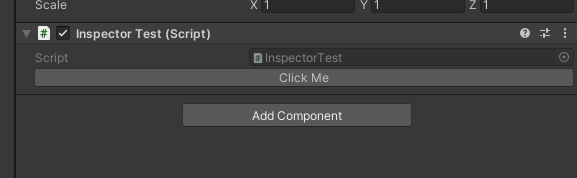
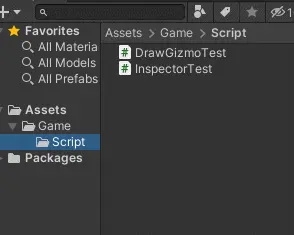
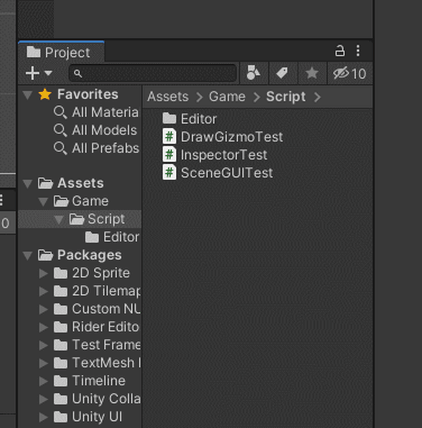
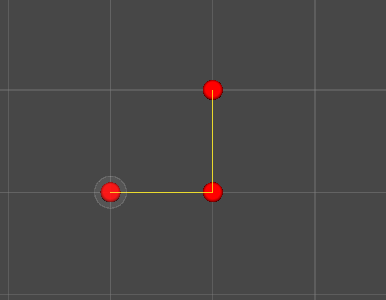
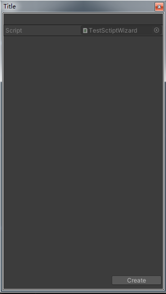
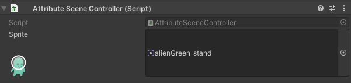

<font color=#4db8ff>Link：</font>https://www.zhihu.com/collection/913665931

### 01、OnInspectorGUI

在开发过程中常常需要在编辑器上对某个特定的<font color=#66ff66>Component</font>进行一些操作，比如在<font color="red">Inspector</font>界面上有一个按钮可以触发一段代码。



这种属于编辑器的，所以一般是在Editor文件夹中新建一个继承自Editor的脚本：




之后编辑继承自<font color=#bc8df9>UnityEditor.Editor</font>,这里注意是必须在类上加入<font color=#FFCE70>[CustomEditor(typeof(编辑器脚本绑定的Monobehavior类)]</font>然后重写它的<font color="red">OnInspectorGUI</font>方法：

```C#
using UnityEditor;
[CustomEditor(typeof(InspectorTest))]
public class InspectorTestEditor : Editor 
{
    public override void OnInspectorGUI() 
    {
        base.OnInspectorGUI();
        if(GUILayout.Button("Click Me"))
        {
            //Logic
            InspectorTest ctr = target as InspectorTest;
        }
    }
}
```

而一般而言在Editor类中操作变量有两种方式，一种是通过直接访问或者函数调用改动<font color=#FFCE70>Monobehaviour</font>的变量，一种是通过Editor类中的<font color="red">serializedObject</font>来改动对应变量。

比如我要把<font color=#66ff66>Monobehaviour</font>的一个公开的<font color=#4db8ff>Name</font>改成<font color=#4db8ff>Codinggamer</font>

使用方法一，在<font color=#66ff66>Editor</font>中可以这样写：

```C#
if(GUILayout.Button("Click Me"))
{
    //Logic
    InspectorTest ctr = target as InspectorTest;
    ctr.Name = "Codinggamer";
}
```

如果这个时候你重新打开场景，会发现改动的值又便回原来的值，也就是<font color=#bc8df9>你的改动并没有生效</font>。

而此时，只需要再调用<font color="red">EditorUtility.SetDirty( Object )</font>方法即可。

如果要使用方法二，则需要在Editor代码中写：

```C#
if(GUILayout.Button("Click Me"))
{
    //Logic
    serializedObject.FindProperty("Name").stringValue = "Codinggamer";
    serializedObject.ApplyModifiedProperties();
}
```

<font color=#4db8ff>Link：</font>https://docs.unity3d.com/ScriptReference/SerializedObject.html

这里不需要调用<font color="red">EditorUtility.SetDirty( Object )</font>方法，场景就已经会出现改动之后的小星星，保存重开场景之后也会发现对应值生效。

**这两个方法孰优孰劣？**

一般来说用第二个方法比较好，但实际上涉及逻辑比较多的时候我是用第一个方法。用第二个方法的好处在于它是<font color=#bc8df9>内置了撤销功能</font>，也就意味着你调用改动之后是可以直接撤销掉的，而第一个方法就不能。

### 02、OnSceneGUI

这个方法也是在Editor类中的一个方法，是用来在Scene视图上显示一个UI元素。其创建也是在Editor文件夹下新建一个继承自Editor的脚本:



在<font color="red">OnSceneGUI</font>中可以做出和<font color=#66ff66>OnDrawGizmo</font>类似的功能，比如绘制出Vector2数组的路点：



其代码如下：

```C#
using UnityEngine;
using UnityEditor;

[CustomEditor(typeof(SceneGUITest))]
public class SceneGUITestEditor : Editor 
{
    private void OnSceneGUI() 
    {
        Draw();
    }

    void Draw()
    {
        //Draw a sphere
        SceneGUITest ctr = target as SceneGUITest;
        Color originColor = Handles.color;
        Color circleColor = Color.red;
        Color lineColor = Color.yellow;
        Vector2 lastPos = Vector2.zero;
        for (int i = 0; i < ctr.poses.Length; i++)
        {
            var pos = ctr.poses[i];
            Vector2 targetPos = ctr.transform.position;
            //Draw Circle
            Handles.color = circleColor;
            Handles.SphereHandleCap(  GUIUtility.GetControlID(FocusType.Passive ) , targetPos + pos, Quaternion.identity, 0.2f , EventType.Repaint );
            //Draw line
            if(i > 0) 
            {
                Handles.color = lineColor;
                Handles.DrawLine( lastPos, pos );
            }
            lastPos = pos;
        }
        Handles.color = originColor;
    }
}
```

<font color=#bc8df9> **OnDrawGizmos与OnSceneGUI的区别**</font>

因为<font color=#66ff66>OnSceneGUI</font>是在Editor上的方法，而Editor一般都是对应Monobehaviour，这意味它是只能是点击到对应物体才会生成的。而<font color=#66ff66>OnDrawGizmos</font>则是可以全局可见。

而如果需要事件处理，比如需要在Scene界面可以直接点击增加或者修改这些路点，就需要在<font color="red">OnSceneGUI</font>上<font color=#FFCE70>处理事件</font>来进行一些操作。

```C#
using UnityEngine;
using UnityEditor;

[CustomEditor(typeof(SceneGUITest))]
public class SceneGUITestEditor : Editor
{
    protected SceneGUITest ctr;

    private void OnEnable() 
    {
        ctr = target as SceneGUITest;
    }
    private void OnSceneGUI() 
    {
        Event _event = Event.current;

        if( _event.type == EventType.Repaint )
        {
            Draw();
        }
        else if ( _event.type == EventType.Layout )
        {
            HandleUtility.AddDefaultControl( GUIUtility.GetControlID( FocusType.Passive ) );
        }
        else
        {
            HandleInput( _event );
            HandleUtility.Repaint();
        }
    }

    void HandleInput( Event guiEvent )
    {
        Ray mouseRay = HandleUtility.GUIPointToWorldRay( guiEvent.mousePosition );
        Vector2 mousePosition = mouseRay.origin;
        if( guiEvent.type == EventType.MouseDown && guiEvent.button == 0 )
        {
            ctr.poses.Add( mousePosition );
        }
    }

    void Draw()
    {
        //Draw a sphere
        Color originColor = Handles.color;
        Color circleColor = Color.red;
        Color lineColor = Color.yellow;
        Vector2 lastPos = Vector2.zero;
        for (int i = 0; i < ctr.poses.Count; i++)
        {
            var pos = ctr.poses[i];
            Vector2 targetPos = ctr.transform.position;
            //Draw Circle
            Handles.color = circleColor;
            Vector2 finalPos = targetPos + new Vector2( pos.x, pos.y);

            Handles.SphereHandleCap(  GUIUtility.GetControlID(FocusType.Passive ) , finalPos , Quaternion.identity, 0.2f , EventType.Repaint );
            //Draw line
            if(i > 0) 
            {
                Handles.color = lineColor;
                Handles.DrawLine( lastPos, pos );
            }
            lastPos = pos;
        }
        Handles.color = originColor;
    }
}
```

<font color=#4db8ff>HandleUtility Link：</font>https://docs.unity3d.com/ScriptReference/HandleUtility.html


### 03、MenuItem与EditorWindow

<font color="red">MenuItem</font>可以说是用得最多的了，它的作用是编辑器上菜单项，一般用于一些快捷操作，比如交换两个物体位置：

由于是涉及编辑器的代码，所以依然可以放在Editor文件夹下面，具体代码如下：

```C#
using System.Collections;
using System.Collections.Generic;
using UnityEditor;
using UnityEngine;
public class MenuCommand
{
    [MenuItem("MenuCommand/SwapGameObject")]
    protected static void SwapGameObject()
    {
        //只有两个物体才能交换
        if( Selection.gameObjects.Length == 2 )
        {
            Vector3 tmpPos = Selection.gameObjects[0].transform.position;
            Selection.gameObjects[0].transform.position = Selection.gameObjects[1].transform.position;
            Selection.gameObjects[1].transform.position = tmpPos;
            //处理两个以上的场景物体可以使用MarkSceneDirty
            UnityEditor.SceneManagement.EditorSceneManager.MarkSceneDirty( UnityEditor.SceneManagement.EditorSceneManager.GetActiveScene() );
        }
    }
}
```

其中访问编辑器的选择我们可以使用API：<font color=#bc8df9>Selection</font>

<font color=#4db8ff>Selection Link：</font>https://docs.unity3d.com/ScriptReference/Selection.html


### 04、EditorWindow

<font color=#66ff66>EditorWindow</font>在Unity引擎中的应用也算是比较多，比如<font color=#FFCE70>Animation、TileMap和Animitor</font>窗口应该就是用到了<font color=#66ff66>EditorWindow</font>。创建方法仍然是在Editor文件夹中创建一个继承自<font color=#66ff66>EditorWindow</font>的脚本。

EditorWindow有一个<font color="red">GetWindow</font>的方法，调用之后如果当前没有这个窗口会返回新的，如果有就返回当前窗口，之后调用Show即可展示这个窗口。可以使用<font color=#bc8df9>MenuItem</font>来显示这个EditorWindow，重写OnGUI方法即可以写Editor的UI：

```C#
using UnityEngine;
using UnityEditor;

namespace EditorTutorial
{
    public class EditorWindowTest : EditorWindow 
    {

        [MenuItem("CustomEditorTutorial/WindowTest")]
        private static void ShowWindow() 
        {
            var window = GetWindow<EditorWindowTest>();
            window.titleContent = new GUIContent("WindowTest");
            window.Show();
        }

        private void OnGUI() 
        {
            if(GUILayout.Button("Click Me"))
            {
                //Logic
            }
        }
    }
}
```

<font color=#66ff66>EditorWindow</font>的UI的写法跟<font color=#bc8df9>OnInspectorGUI</font>的写法差不多，基本是<font color=#4db8ff>GUILayout和EditorGUILayout</font> 这两个类。

<font color=#FFCE70> EditorWindow与OnInOnEnablespectorGUI的差别</font>

最主要的差别是<font color=#66ff66>EditorWindow</font>可以停靠的在边栏上，不会因为你点击一个物体就重新生成。而<font color=#bc8df9>OnInspectorGUI</font>的<font color="red">Editor</font>类在你每次切换点击时候都会调用<font color=#4db8ff>OnEnable</font>方法。

<font color=#FFCE70> EditorWindow如何绘制Scene界面UI</font>

在<font color=#66ff66>EditorWindow</font>中如果需要对<font color="red">Scene</font>绘制一些UI，这个时候使用Editor那种<font color=#4db8ff>OnSceneGUI</font>是无效的，这个时候则需要在<font color=#4db8ff>Focus或者OnEnable</font>时候加入<font color="red">SceneView</font>的事件回调中,并且在<font color=#FD00FF>OnDestroy</font>时候去除该回调：

```C#
private void OnFocus() 
{
    //在2019版本是这个回调
    SceneView.duringSceneGui -= OnSceneGUI;
    SceneView.duringSceneGui += OnSceneGUI;

    //以前版本回调
    // SceneView.onSceneGUIDelegate -= OnSceneGUI
    // SceneView.onSceneGUIDelegate += OnSceneGUI
}

private void OnDestroy() 
{
    SceneView.duringSceneGui -= OnSceneGUI;
}
private void OnSceneGUI( SceneView view ) 
{
}
```

<font color=#4db8ff>SceneView Link：</font>https://docs.unity3d.com/ScriptReference/SceneView.html

使用该类可管理 <font color=#bc8df9>SceneView </font>设置、更改 SceneView 摄像机属性、订阅事件、调用 SceneView 方法以及渲染打开的场景。

### 05、ScriptWizard

Unity引擎的中的<font color="red">BuildSetting</font>窗口(Ctr+Shift+B弹出的窗口)就是使用了<font color=#66ff66>SciptWizard</font>，一般来开发过程中作为比较简单的生成器和初始化类型的功能来使用，比如美术给我一个序列帧，我需要直接生成一个带<font color=#66ff66>SpriteRenderer</font>的<font color=#4db8ff>GameObject</font>，而且它还有自带序列帧的Animator。



```C#
using System.Collections;
using System.Collections.Generic;
using UnityEditor;
using UnityEngine;

public class TestScriptWizard: ScriptableWizard 
{

    [MenuItem("CustomEditorTutorial/TestScriptWizard")]
    private static void MenuEntryCall() 
    {
        DisplayWizard<TestScriptWizard>("Title");
    }

    private void OnWizardCreate() 
    {

    }
}
```

 <font color=#4db8ff>ScriptWizard与EditorWindow的区别</font>

在<font color=#66ff66>ScriptWizard</font>中如果你声明一个Public的变量，会发现在窗口可以<font color="red">直接显示</font>，但是在<font color=#bc8df9>EditorWindow</font>则是不能显示。

<font color=#4db8ff>ScriptableWizard LInk：</font>https://docs.unity3d.com/ScriptReference/ScriptableWizard.html

### 06、<font color=#4db8ff>ScriptObject</font>

对于游戏中一些数据和配置可以考虑用<font color=#66ff66>ScriptObject</font>来保存，虽然XML之流也可以，但是<font color=#bc8df9>ScriptObject</font>相对比较简单而且可以保存<font color=#FFCE70>UnityObject比如Sprite、Material</font>这些。

甚至你会发现上面说的几个类都是继承自<font color=#66ff66>SctriptObject</font>。 因为其不再是只适用编辑器，所以不必放在Editor文件夹下 。与<font color=#bc8df9>ScriptWizard</font>类似，也是声明Public可以在窗口上直接看到，自定义绘制GUI也是在<font color="red">OnGUI</font>方法里面：

```C#
[CreateAssetMenu(fileName = "TestScriptObject", menuName = "CustomEditorTutorial/TestScriptObject", order = 0)]
public class TestScriptObject : ScriptableObject 
{
    public string Name;
}
```

使用<font color=#66ff66>CreateAssetMenu</font>的Attribute的作用是使得其可以在Project窗口中右键生成：

<font color=#4db8ff>ScriptObject与System.Serializable的差别</font>

初学者可能会对这两个比较困扰（我一开始就比较困扰），一开始把ScriptObject拖拽到Monobehaviour上面发现其不会显示出ScriptObject的属性

然后在<font color=#66ff66>ScriptObject</font>上面加上<font color=#bc8df9>[System.Serializable]</font>，也是没用：

```C#
[System.Serializable]
public class Data
{
    string Name;
}
```

ScriptObject上面调用编辑器修改需要调用<font color=#bc8df9>EditorUtility.SetDirty</font>，不可调用<font color=#FD00FF>EditorSceneManager.MarkSceneDirty</font>

因为<font color=#4db8ff>MarkSceneDirty</font>顾名思义是标记场景为已修改，但是编辑ScriptObject并不属于场景内数据，所以如果修改只可调用<font color="red">EditorUtility.SetDirty</font>，不然会造成数据改动未生效。

### 07、Attributes

<font color="red">Attributes</font>是C#的一个功能，它可以让声明信息与代码相关联，其与C#的反射联系很紧密。

在Unity中诸如<font color=#bc8df9>[System.Serializable],[Header],[Range]</font>都是其的应用。一般来说他它功能也可以通过<font color=#66ff66>Editor</font>来实现，但是可以绘制对应的属性来说会更好复用。

拓展<font color=#66ff66>Attribute</font>相对来说稍微复杂一点，它涉及两个类：<font color="red">PropertyAttribute和PropertyDrawer</font>

<font color=#FFCE70>前者是定义它行为</font>

<font color=#FFCE70>后者主要是其在编辑器的显示效果</font>

一般来说<font color=#66ff66>Attribute</font>是放在<font color=#4db8ff>Runtime</font>，而<font color=#66ff66>Drawer</font>则是放在<font color=#4db8ff>Editor</font>文件夹下。这里的例子是加入<font color=#bc8df9>[Preview]</font>的<font color=#66ff66>Attribute</font>，使得我们拖拽Sprite或者GameObject可以显示预览图：



```C#
public class AttributeSceneController : MonoBehaviour 
{
    [Preview]
    public Sprite sprite;
}
```

我们现在<font color="red">Runtime</font>层的文件夹加入继承自<font color=#66ff66>PropertyAttribute</font>的<font color=#4db8ff>PreviewAttribute</font>脚本：

```C#
public class Preview : PropertyAttribute
{
    public Preview()
    {}
}
```

然后在<font color="red">Editor</font>文件夹下加入继承自<font color=#66ff66>PropertyDrawer</font>的<font color=#4db8ff>PreviewDrawer</font>脚本：

```C#
using UnityEngine;
using UnityEditor;
namespace EditorTutorial
{
    [CustomPropertyDrawer(typeof(Preview))]
    public class PreviewDrawer: PropertyDrawer 
    {
        //调整整体高度
        public override float GetPropertyHeight( SerializedProperty property, GUIContent label )
        {
            return base.GetPropertyHeight( property, label ) + 64f;
        }
        public override void OnGUI(Rect position, SerializedProperty property, GUIContent label) 
        {
            EditorGUI.BeginProperty(position, label, property);
            EditorGUI.PropertyField(position, property, label);

            // Preview
            Texture2D previewTexture = GetAssetPreview(property);
            if( previewTexture != null )
            {
                Rect previewRect = new Rect()
                {
                    x = position.x + GetIndentLength( position ),
                    y = position.y + EditorGUIUtility.singleLineHeight,
                    width = position.width,
                    height = 64
                };
                GUI.Label( previewRect, previewTexture );
            }
            EditorGUI.EndProperty();
        }

        public static float GetIndentLength(Rect sourceRect)
        {
            Rect indentRect = EditorGUI.IndentedRect(sourceRect);
            float indentLength = indentRect.x - sourceRect.x;

            return indentLength;
        }

        Texture2D GetAssetPreview( SerializedProperty property )
        {
            if (property.propertyType == SerializedPropertyType.ObjectReference)
            {
                if (property.objectReferenceValue != null)
                {
                    Texture2D previewTexture = AssetPreview.GetAssetPreview(property.objectReferenceValue);
                    return previewTexture;
                }
                return null;
            }
            return null;
        }
    }
}
```

这里是对属性的一些绘制，实际开发过程中我们常常需要一些可交互的UI，比如在方法上面加一个[Button]然后在编辑器暴露出一个按钮出来，具体的例子可以参考[NaughtyAttribute](https://link.zhihu.com/?target=https%3A//github.com/dbrizov/NaughtyAttributes)

<font color=#4db8ff>Link：https://link.zhihu.com/?target=https%3A//github.com/dbrizov/NaughtyAttributes</font>

PropertyDrawer.<font color=#bc8df9>GetPropertyHeight</font>：重载高度 

<font color=#4db8ff>LInk：</font>https://docs.unity3d.com/ScriptReference/PropertyDrawer.GetPropertyHeight.html

<font color=#66ff66>PropertyField</font>：SerializedProperty wrapper VisualElement（序列化属性包装 VisualElement），在 Bind() 时将生成具有正确 bindingPaths 的正确字段元素。

<font color=#bc8df9>SerializedPropertyType</font>：代表序列化属性的类型。

<font color=#4db8ff>Lnik：</font>https://docs.unity3d.com/ScriptReference/SerializedPropertyType.html

<font color=#bc8df9>SerializedProperty.propertyType</font>：该属性的类型（只读）。属性类型决定了哪些 "值 "变量访问器有效。例如，只有 boolValue 对 SerializedPropertyType.Boolean 有效。

<font color=#4db8ff>Link：</font>https://docs.unity3d.com/ScriptReference/SerializedProperty-propertyType.html

<font color=#bc8df9>AssetPreview.GetAssetPreview</font>：返回资产的预览纹理。

<font color=#4db8ff>link：</font>https://docs.unity3d.com/ScriptReference/AssetPreview.GetAssetPreview.html

<font color=#4db8ff>CustomPropertyDrawer Link：</font>https://docs.unity3d.com/ScriptReference/CustomPropertyDrawer.html

### 08、AssetPostprocessor

在开发过程中常常会遇到<font color="red">资源导入问题</font>，比如制作像素游戏图片要求是<font color=#66ff66>FilterMode</font>为<font color=#bc8df9>Point</font>，图片不需要压缩，<font color=#4db8ff>PixelsPerUnit</font>为16，如果每次复制到一个图片到项目再修改会很麻烦。

这里一个解决方案是可以用<font color="red">MenuItem</font>来处理，但还需要多点几下，而使用<font color=#FFCE70>AssetPostprocessor</font>则可以自动处理完成。

在Editor文件夹下新建一个继承自<font color="red">AssetPostprocessor</font>的<font color=#66ff66>TexturePipeLine</font>：

```C#
using UnityEditor;
using UnityEngine;
public class TexturePipeLine : AssetPostprocessor
{
    private void OnPreprocessTexture()
    {
        TextureImporter importer = assetImporter as TextureImporter;
        if( importer.filterMode == FilterMode.Point ) return;

        importer.spriteImportMode = SpriteImportMode.Single;

        importer.spritePixelsPerUnit = 16;
        importer.filterMode = FilterMode.Point;
        importer.maxTextureSize = 2048;
        importer.textureCompression = TextureImporterCompression.Uncompressed;

        TextureImporterSettings settings = new TextureImporterSettings();
        importer.ReadTextureSettings( settings );
        settings.ApplyTextureType( TextureImporterType.Sprite );
        importer.SetTextureSettings( settings ) ;
    }
}
```

可以想象的一些使用场景是可以根据XML和SpriteSheet来实现自动生成动画或者自动切图，解析PSD或ASE自动导入PNG。

<font color=#4db8ff>AssetPostprocessor LInk：</font>https://docs.unity3d.com/ScriptReference/AssetPostprocessor.html

<font color=#bc8df9>Description：</font>AssetPostprocessor 可让你连接到导入管道，并在导入资产之前或之后运行脚本。

<font color=#4db8ff>TextureImporter Link：</font>https://docs.unity3d.com/ScriptReference/TextureImporter.html

<font color=#bc8df9>Description：</font>纹理导入器可让你从编辑器脚本中修改 Texture2D 的导入设置。

<font color=#4db8ff>OnPreprocessTexture Link</font>：https://docs.unity3d.com/ScriptReference/AssetPostprocessor.OnPreprocessTexture.html

<font color=#bc8df9>Description：</font>将此函数添加到子类中，以便在纹理导入程序运行前获得通知。这样就可以设置导入设置的默认值。如果要更改纹理的压缩格式，请使用此回调函数。

### 09、Undo

在之前说过在Editor里面直接改动原来的<font color=#66ff66>Monobehaviour</font>脚本是变量是无法撤销的，但是使用 <font color="red">serializedObject</font>来修改则可以撤销。这里可以自己写一个Undo来记录使其可以撤销，代码如下：

```C#
if(GUILayout.Button("Click Me"))
{
    InspectorTest ctr = target as InspectorTest;
    //记录使其可以撤销
    Undo.RecordObject( ctr ,"Change Name" );
    ctr.Name = "Codinggamer";
    EditorUtility.SetDirty( ctr );
}
```

### 10、SelectionBase

当你的类中使用<font color=#bc8df9>[SelectionBase]</font>的Attribute时候，如果你点击其子节点下的物体，其仍然只会聚焦这个父节点。

### 11、Editor Code

不在Editor文件夹里面写编辑器代码，有的时候我们<font color=#66ff66>Monobehaviour</font>本身很短小，拓展<font color="red">InspectorGUI</font>的代码也很短小，没有必要在Editor上创建一个新的脚本，可以直接使用<font color=#66ff66>#UNITY_EDITOR </font>的宏来创建一个拓展编辑器，比如之前的拓展<font color=#bc8df9>InspectorGUI</font>可以这样写：

```C#
using System.Collections;
using System.Collections.Generic;
using UnityEngine;
#if UNITY_EDITOR
using UnityEditor;
#endif

namespace EditorTutorial
{
    public class InspectorTest : MonoBehaviour
    {
        public string Name = "hello";
    }

    #if UNITY_EDITOR
    [CustomEditor(typeof(InspectorTest))]
    public class InspectorTestEditor : Editor 
    {
        public override void OnInspectorGUI() 
        {
            base.OnInspectorGUI();
            if(GUILayout.Button("Click Me"))
            {

                InspectorTest ctr = target as InspectorTest;
                //记录使其可以撤销
                Undo.RecordObject( ctr ,"Change Name" );
                ctr.Name = "Codinggamer";
                EditorUtility.SetDirty( ctr );
            }
        }
    }
    #endif
}
```

### 12、Save Data

<font color=#bc8df9>EditorWindow和Editor</font>需要保存数据，这里需要使用<font color=#66ff66>EditorPrefs</font>来保存和读取数据，在需要保存的数据上面加上<font color="red">[System.SerializeField]</font>的Attribute，然后在<font color=#66ff66>OnEnable和OnDisable</font>时候可以保存或者序列化json：

```C#
[SerializeField]
public string Name = "Hi";

private void OnEnable() 
{
    var data = EditorPrefs.GetString( "WINDOW_KEY", JsonUtility.ToJson( this, false ) );
    JsonUtility.FromJsonOverwrite( data, this );
}

private void OnDisable() 
{
    var data = JsonUtility.ToJson( this, false  );
    EditorPrefs.SetString("WINDOW_KEY", data);
}
```

这种方法也可以在运行时序列化脚本保存到本地。

### 13、Check Class

在代码中检索对应<font color=#66ff66>MonoBehaviour</font>的<font color=#bc8df9>Editor Class</font>

在<font color=#bc8df9>EditorWindow</font>的使用过程中，有的时候可能需要调用到对应拓展<font color=#66ff66>MonoBehaviour</font>的<font color=#4db8ff>Editor</font>代码，这个时候可以使用<font color=#66ff66>Editor.CreateEditor</font>方法来创建这个Editor。

### 14、Code SerializedObject

 在编辑器代码中生成 <font color="red">SerializedObject</font>，上面说过，在编辑器代码中一般比较多使用<font color="red">SerializedObject</font>，像Editor类中就内置了<font color=#4db8ff>serializedObject</font>。实际上所有继承自ScriptObject或者<font color=#66ff66>Monobehaviour</font>的脚本都可以生成SerializedObject。其生成方式很简单只需要new的时候传入你需要序列化的组件即可：

```C#
SerializedObject serialized = new SerializedObject(this);
```

这篇文章中并没有涉及比较多的API的使用，更多的是想展现出**可以用拓展编辑器来做什么以及当你想做一些拓展时候需要从哪里入手**。比如如果你想给美术人员做一个快捷生成角色的工具，就可以使用ScriptWizard。如果你需要让美术人员和设计师更加方便地调整人物属性，则可以考虑使用Editor。

如果你需要给关卡设计师制作一个关卡编辑器，那可以考虑使用EditorWindow。

写得比较多，以上这个就是我在使用Unity拓展编辑器的总结与遇到的一些问题的经验。

