link：Steam Store

#### 一、资源

##### 1、导入资源

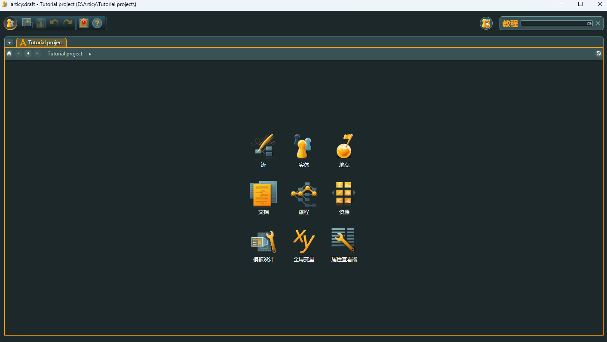

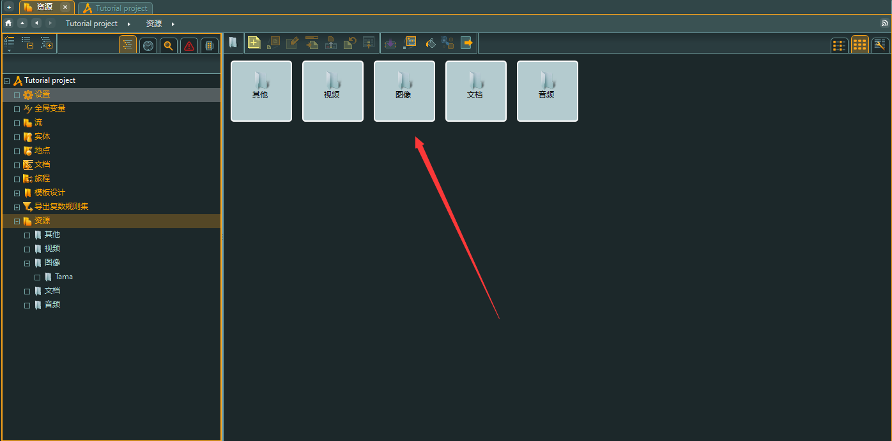

进入界面，根据需要创建文件夹，如主角Tama，F2重命名，Ctrl I导入资源

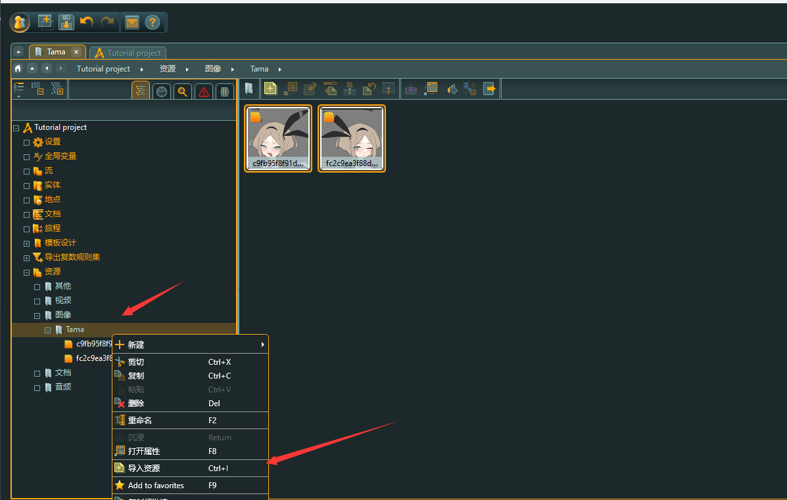

------

#### 二、工作

##### 2.1 流 flow

点击流进入工作，创建流片段，作为容器或者是故事章节

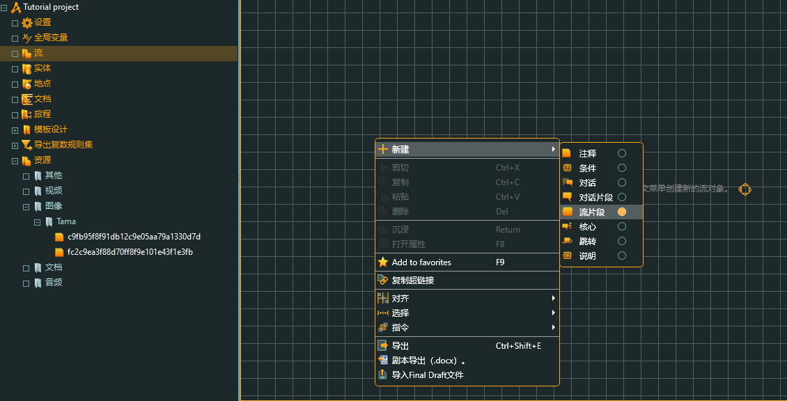

##### 2.2 章节

回车，或者右键点击沉浸、进入故事

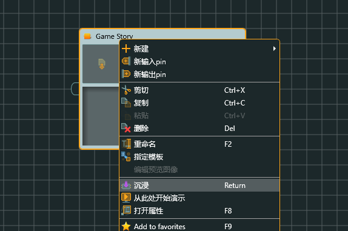

创建对话片段，进行游戏引导 

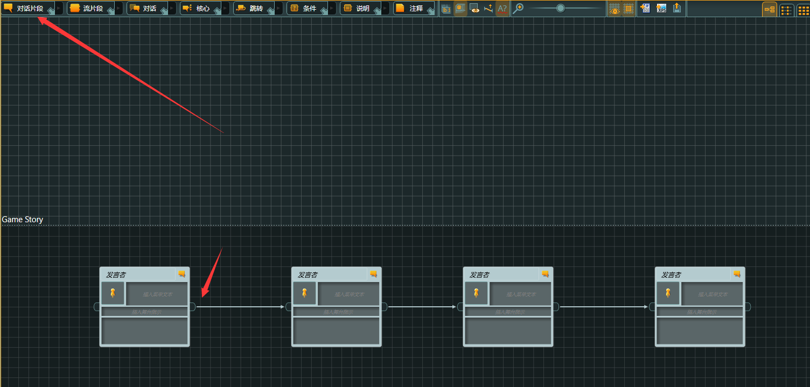

#### 三、创建模版

##### 3.1 人物特性模版

模版作为人物通性，将其提取出来，如性别、名字、身高...

Path：模版设计 -> 特性 ->

创建人物特性 

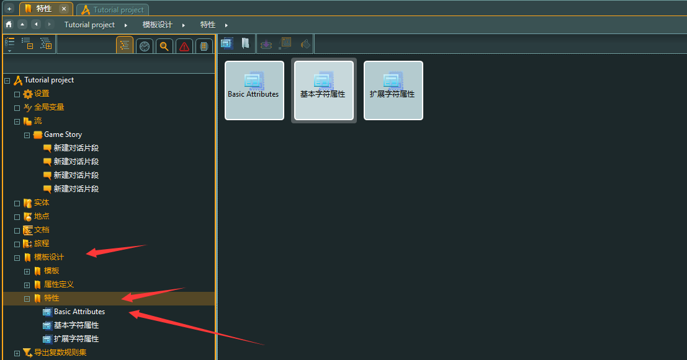

------

 

##### 3.2 特性编辑

点击右上侧编辑界面，编辑人物特性

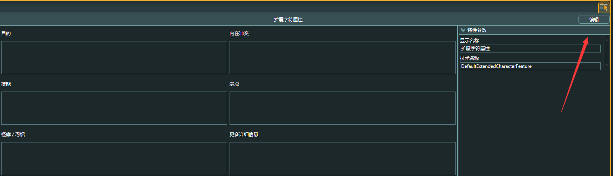

1.3 

拉入其中

名称（Display Name）： 文本名称

技术名称（technical name）：代码使用名称

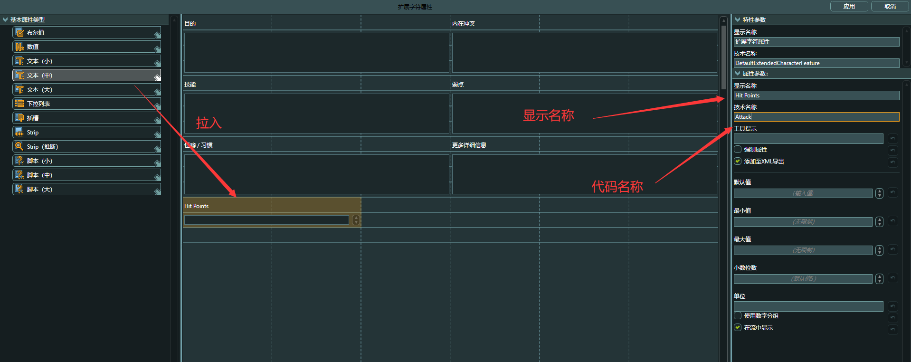

右边可以设置三个值：默认值，最大值，最小值

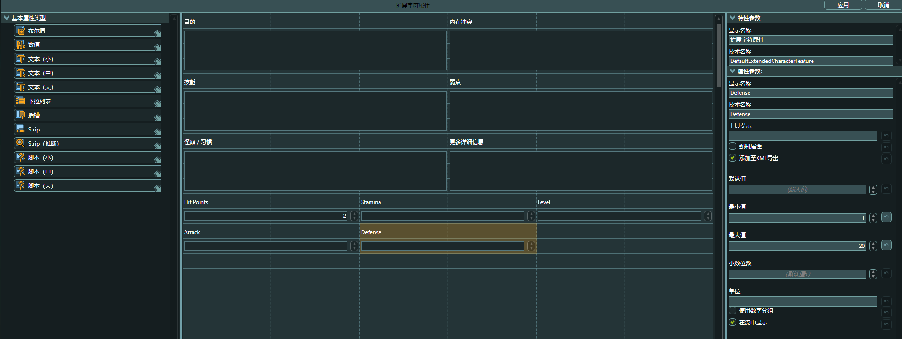

随后选择应用

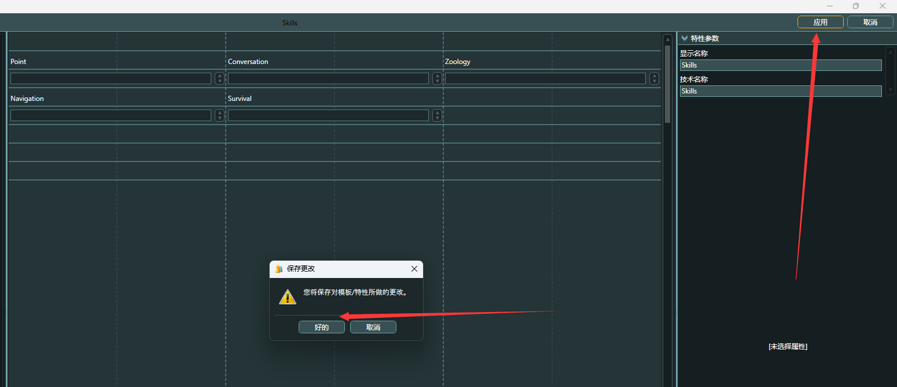

##### 3.3 人物模

点击实体，进行通用属性人物模版创建

**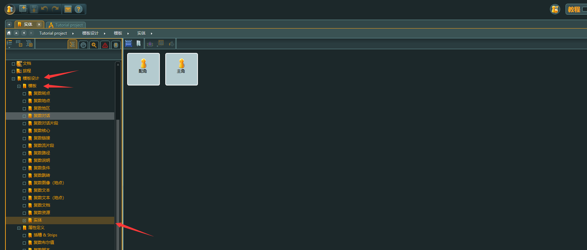**

分类文件夹

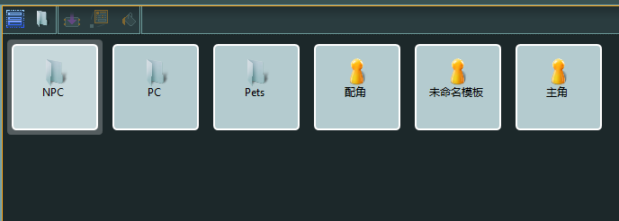

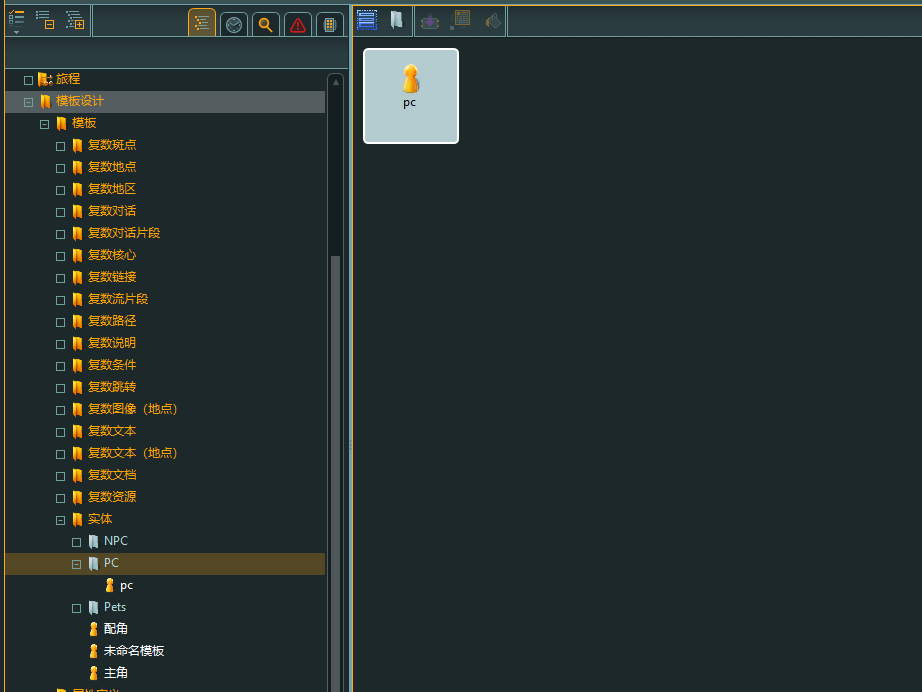

创建人物之后，会发现Skill、Basic Attribute 等特性自动添加到人物模版

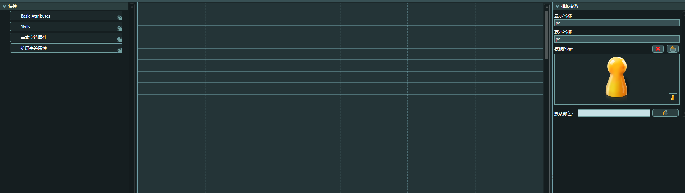

点击应用之后，人物属性会自动连接到模版上

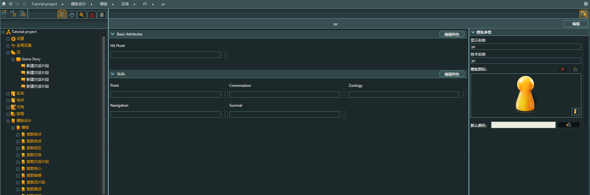

#### 四、 实体

+ 选择实体（Entities）

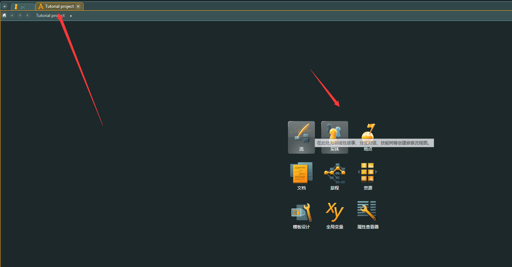

##### 4.1 角色

创建相关文件夹之后，创建实体角色，如：Lily

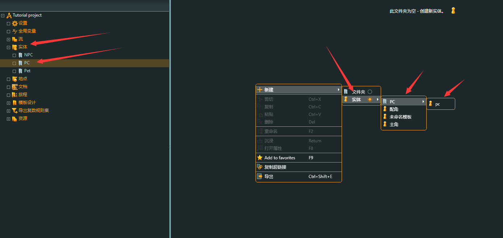

选择相关资产

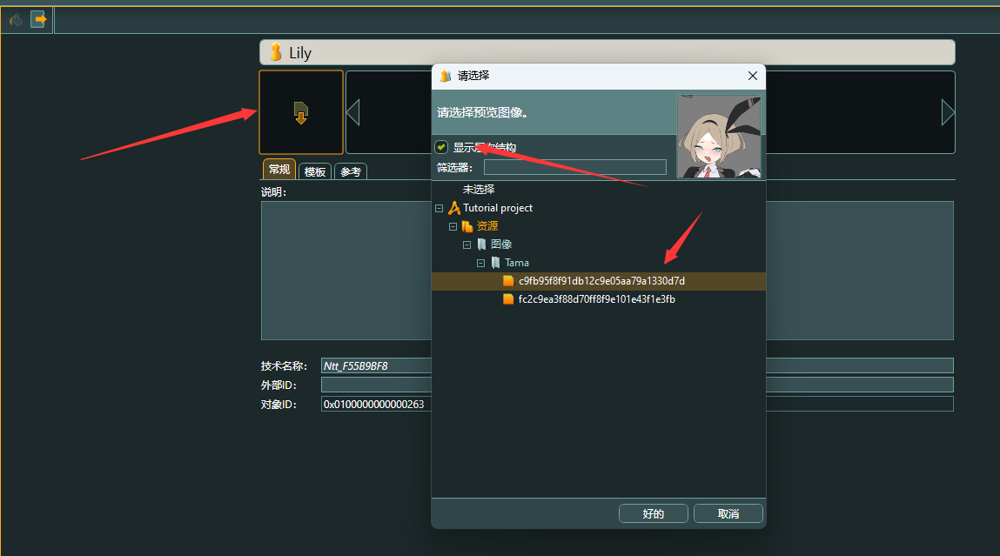

##### 4.2 更换模版

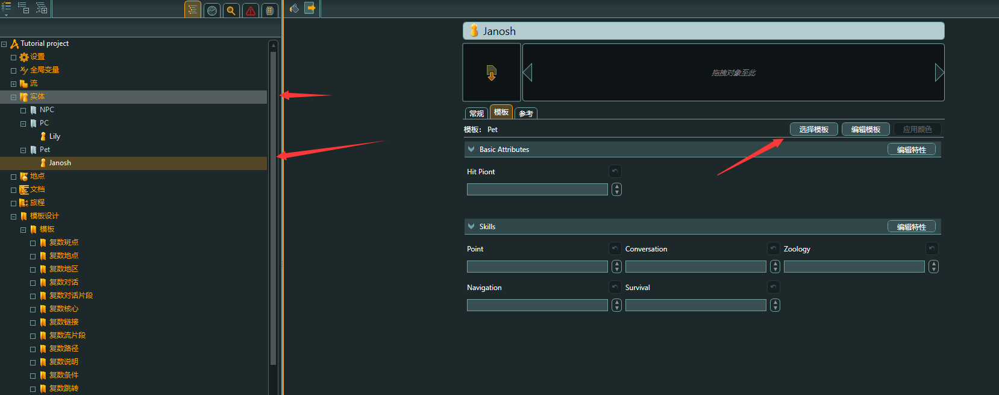