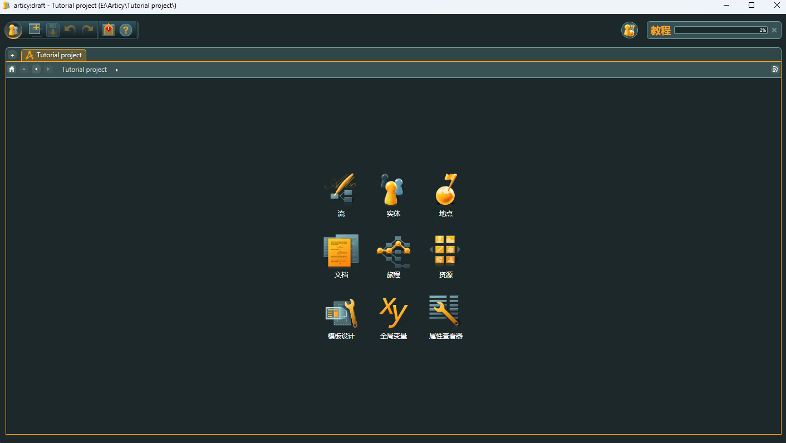
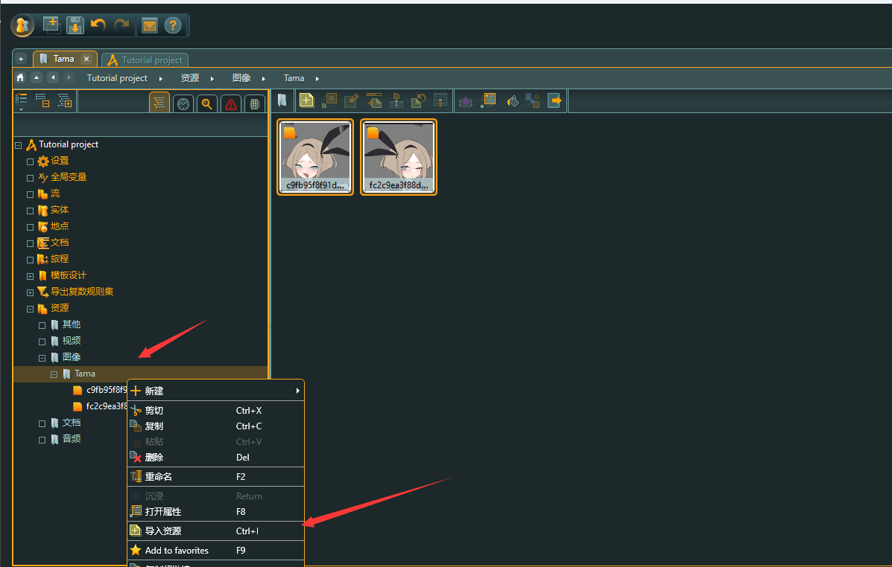
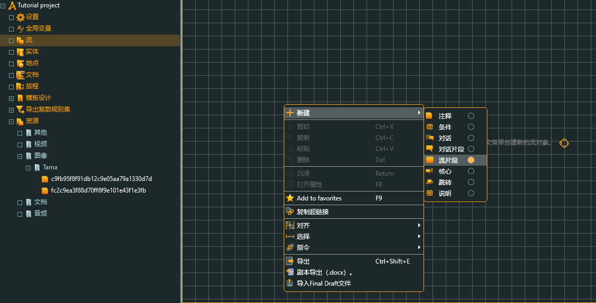
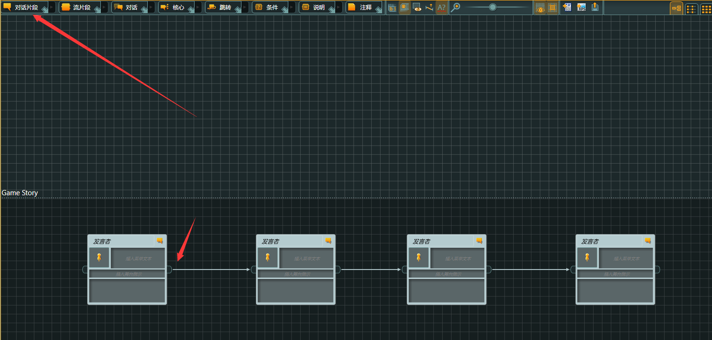

link：Steam Store

#### 一、资源

##### 1、导入资源

进入界面，根据需要创建文件夹，如主角Tama，F2重命名，Ctrl I导入资源

------

#### 二、工作

##### 2.1 流 flow

点击流进入工作，创建流片段，作为容器或者是故事章节

##### 2.2 章节

回车，或者右键点击沉浸、进入故事

创建对话片段，进行游戏引导 

