### 一、心情列表

#### 1.1 人物肖像

为了使人物以肖像形式出现，我们需要创建新的特性

Path： Template \ Features\ your features

路径：模版设计 \ 特性 \ 创建的特性

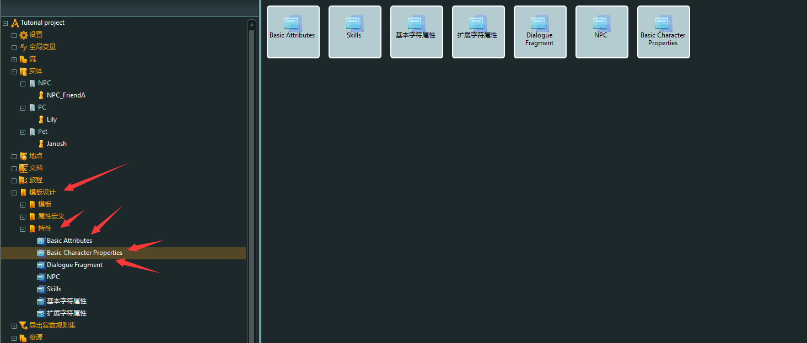

#### 1.2 创建表情列表

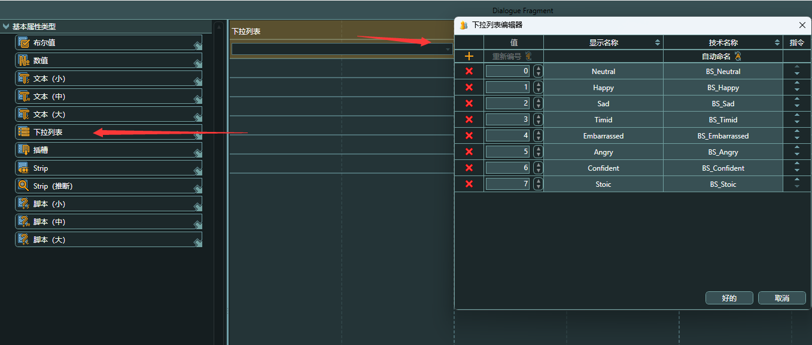

具体内容如下：

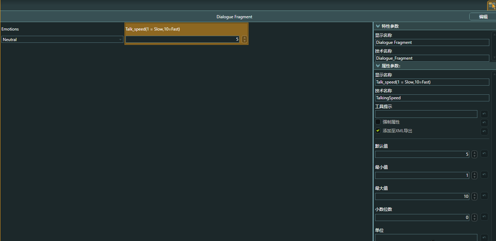

### 二、对话片段

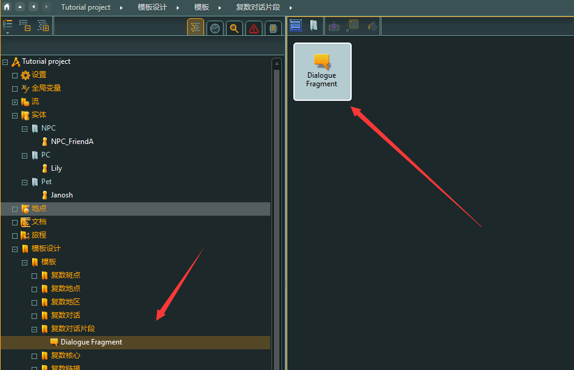

#### 2.1 对话片段模版

可以增加人物性格，心情等变量

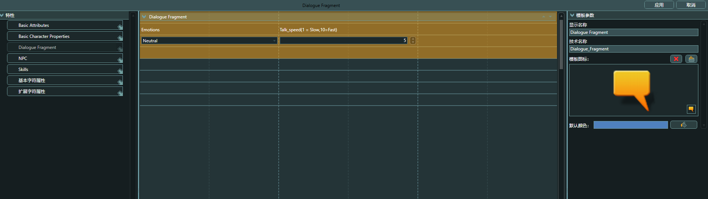

#### 2.2 流 Flow 对话模版

选择相应的背景图，回车进入

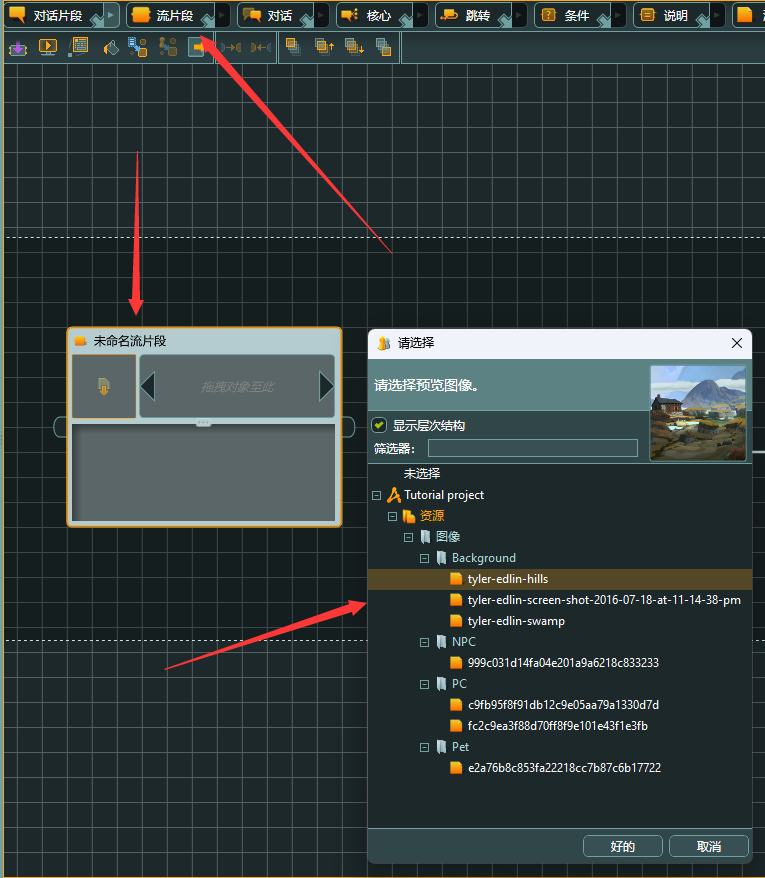

Link：https://www.articy.com/en/downloads/plugins/

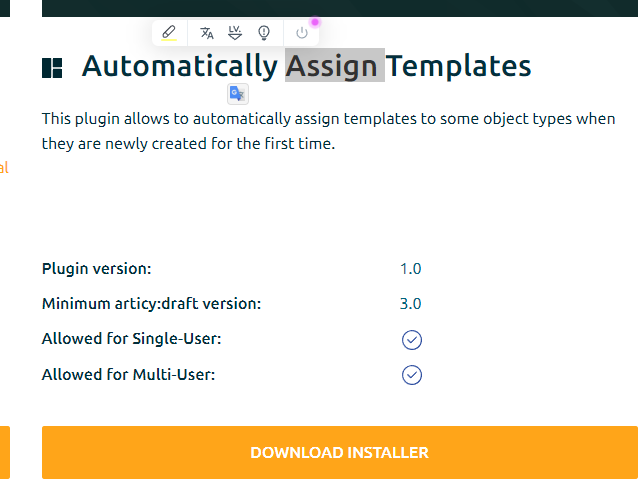

安装插件之后，重启软件即可使用，创建对话模版

创建的每一个对话片段都会自带模版

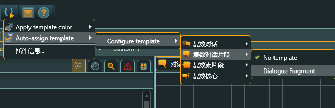

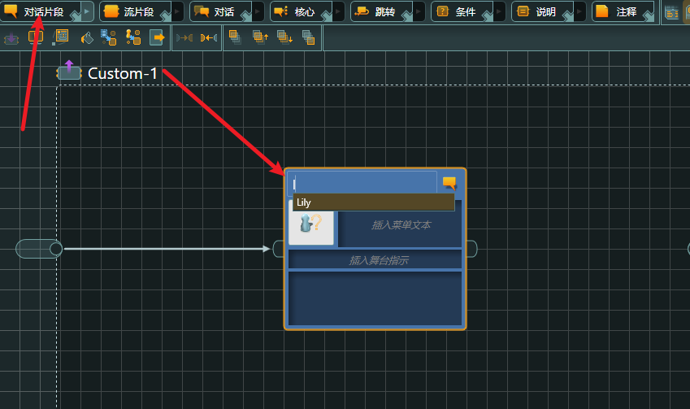

### 三、分支

#### 3.1 分支

需要添加分支，由数值、故事、经历做出判断

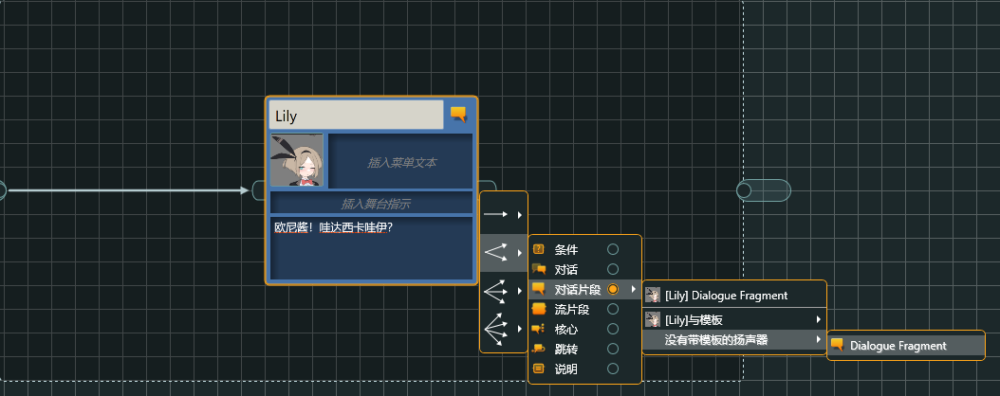

但是，必须是场景中已经出现的角色，才可以添加

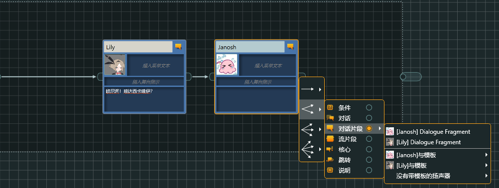

#### 3.2 核心 Hub

拥有跳转功能可以从其他的位置跳转回来，如：选择性问问题

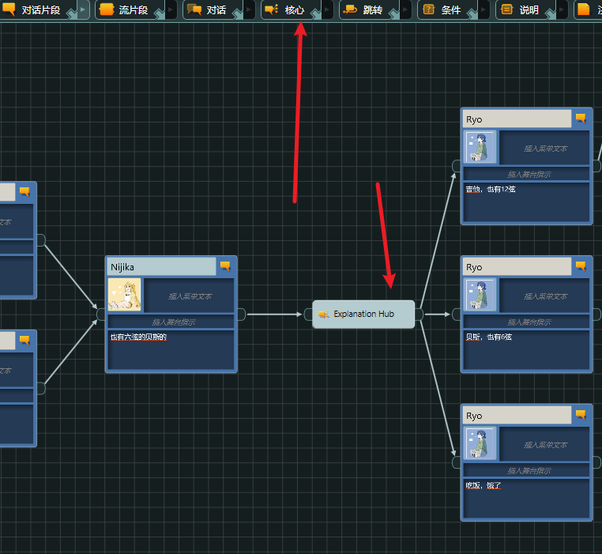

选择回答结束之后，使用跳转回到之前的问题所在位置，进行选择回答

#### 3.3 Jump 跳转

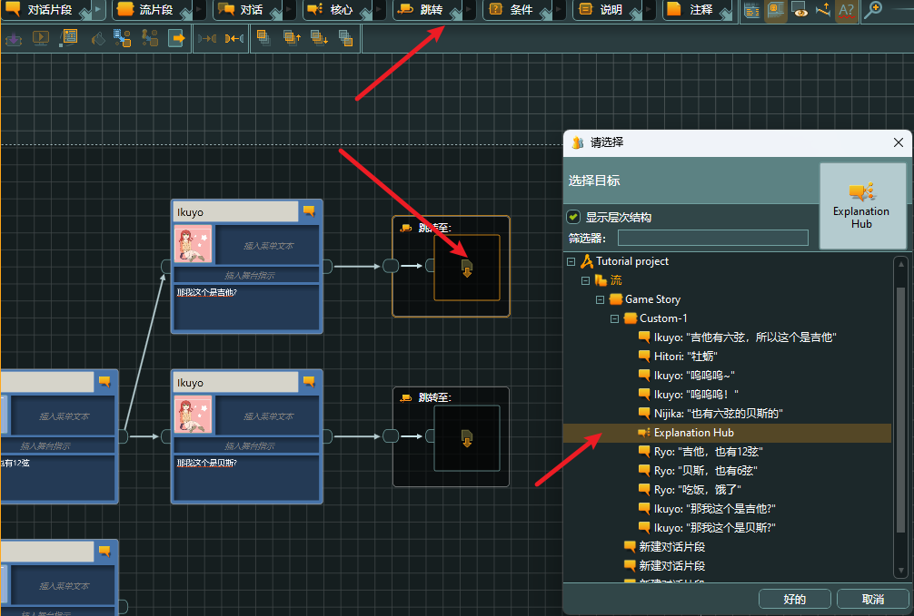