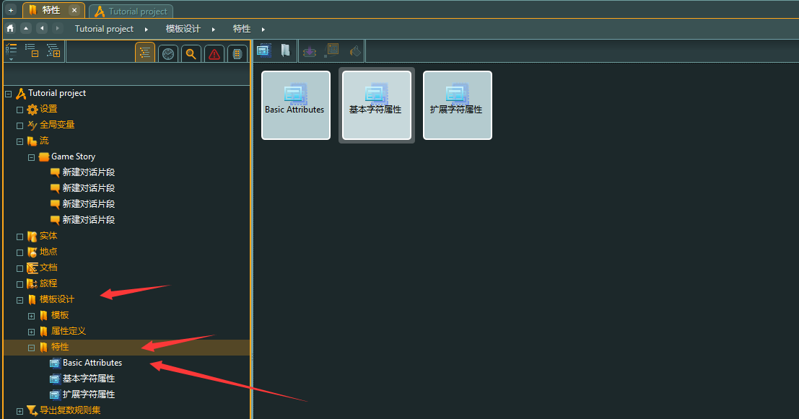
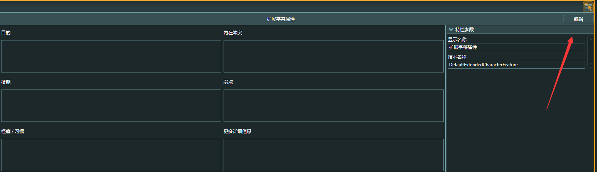
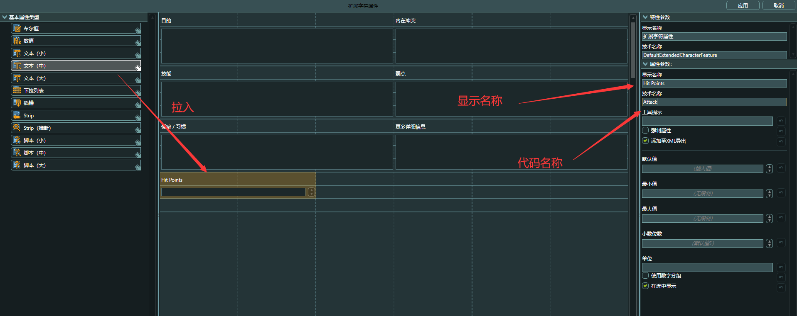
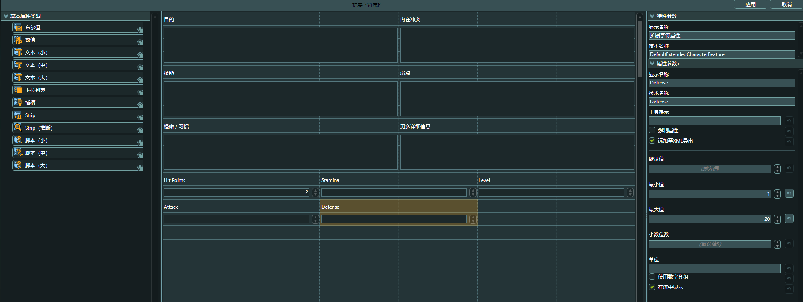
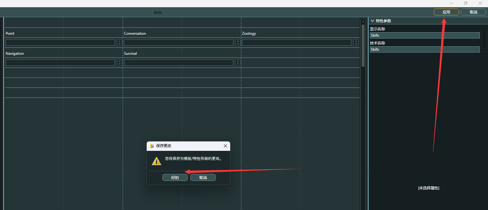
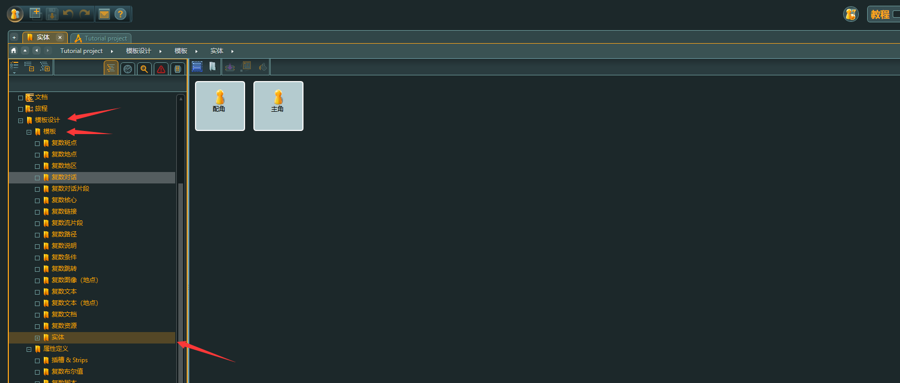
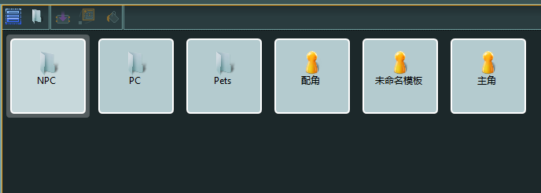
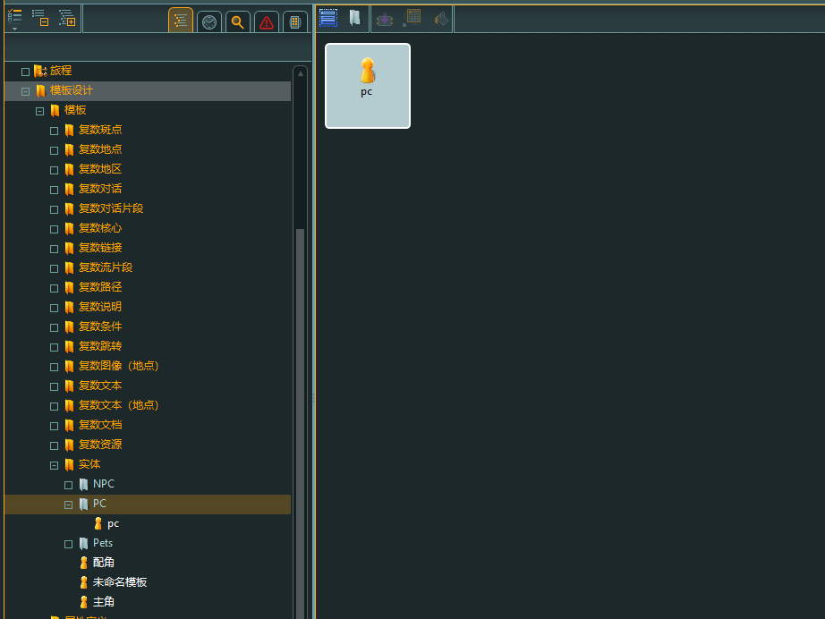
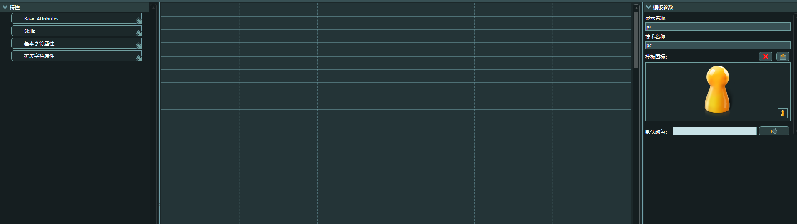
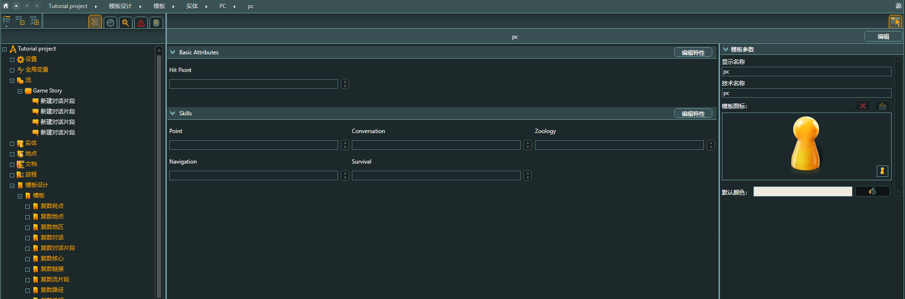

#### 一、创建模版

##### 1.1 人物特性模版

模版作为人物通性，将其提取出来，如性别、名字、身高...

Path：模版设计 -> 特性 ->

创建人物特性 

------

 

##### 1.2 特性编辑

点击右上侧编辑界面，编辑人物特性

1.3 

拉入其中

名称（Display Name）： 文本名称

技术名称（technical name）：代码使用名称

右边可以设置三个值：默认值，最大值，最小值

随后选择应用

1.3 人物

点击实体，进行通用属性人物模版创建

****

分类文件夹

创建人物之后，会发现Skill、Basic Attribute 等特性自动添加到人物模版

点击应用之后，人物属性会自动连接到模版上

二、 实体

