#### 一、变量

变量的定义

 <font color="red">Bool</font>  <font color=#66ff66>布尔</font>是或者非

 <font color="red">Int</font>  <font color=#66ff66>整数</font>是 <font color=#FFCE70>1 、 2、 3、 4、 5、</font>

 <font color="red">String</font>  <font color=#66ff66>字符串</font>是一段描述：如：<font color=#4db8ff>Open - 开门</font>，一段话

##### 1.1、Bool 布尔量

 <font color="red">Bool</font> 只有 <font color=#4db8ff>true false</font> 也就是 <font color=#66ff66>是和否</font>

一般用于，逻辑判断，如：
1、发生、不发生

2、可以、不可以

3、锁定、不锁定

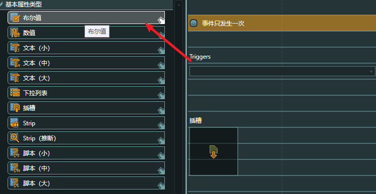

##### 1.2、Slot 插槽

<font color="red">Slot</font> 可以用于展示对象

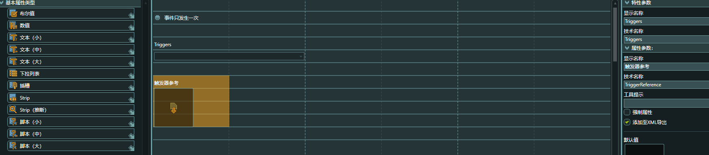

##### 1.3、Drop-down list 列表

<font color="red">Drop-down list</font>设置列表状态

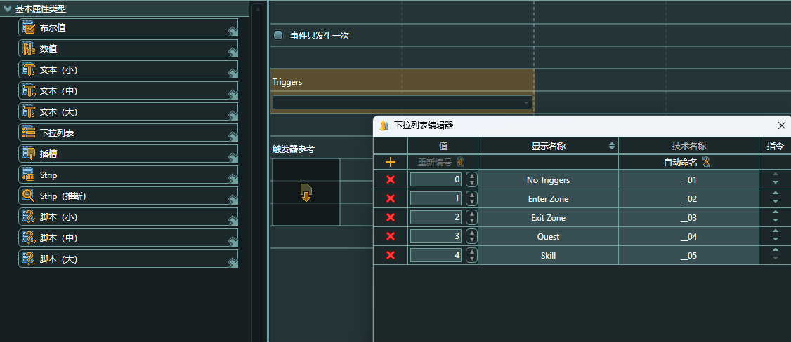

1.4、引用地址

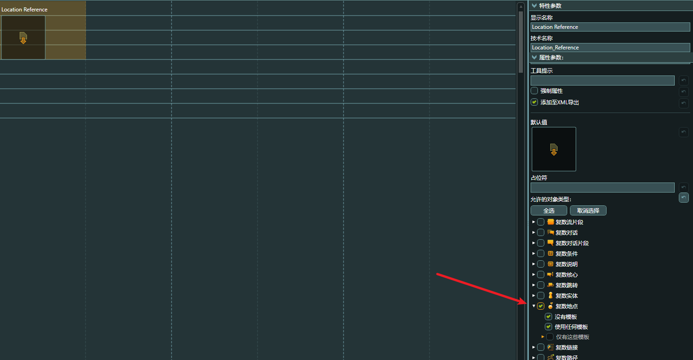


#### 二、使用变量

在片段中使用变量，使得状态明了

##### 2.1、Flow 片段

在模版中的对话片段中创建模版

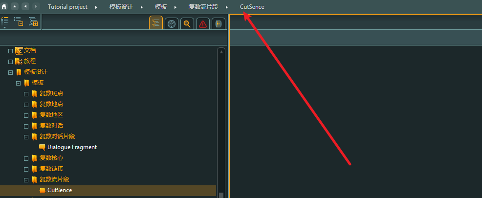

##### 2.2、变量模版

显示事件是否发生，事件状态，人物

对应：<font color=#66ff66>Bool、list、Solt</font>

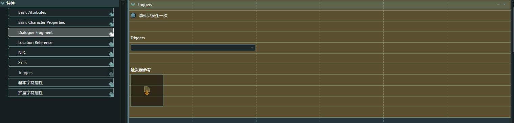

##### 2.3、对话引用模版

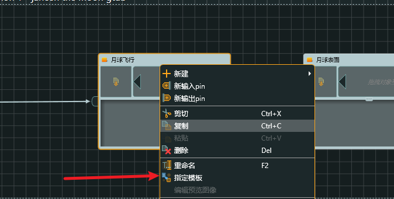

F8进入属性，或者是鼠标右键

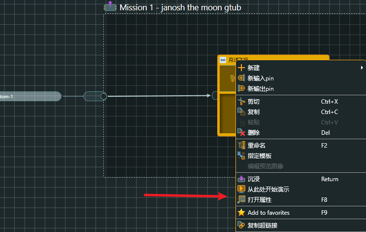

2.4、 使用对话模版

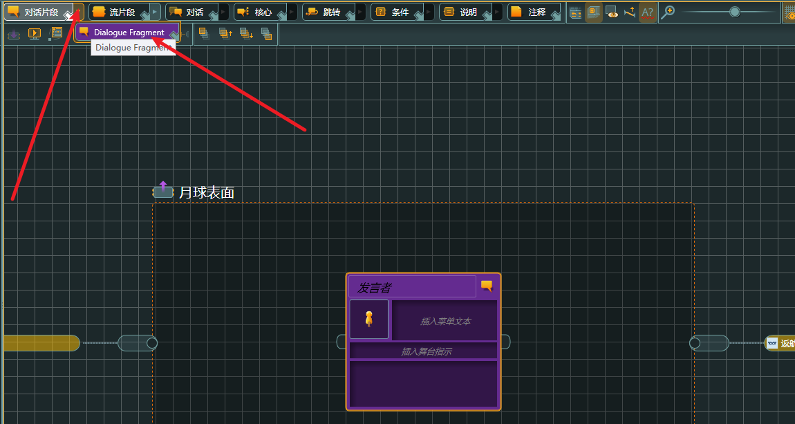

#### 三、全局变量

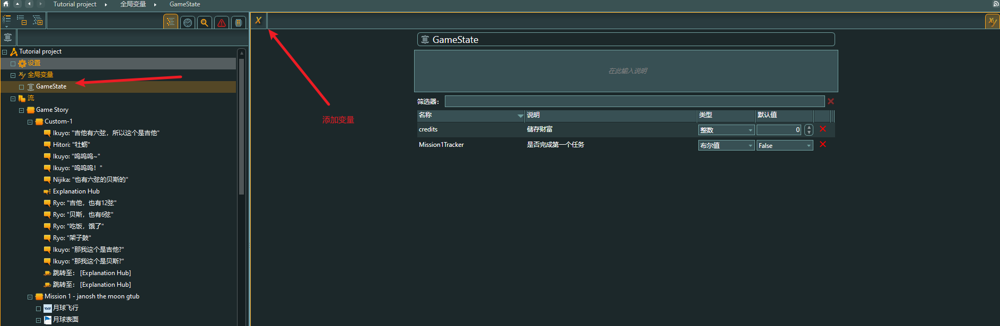

为了使用内置脚本支持，需要在设置中设置一系列东西

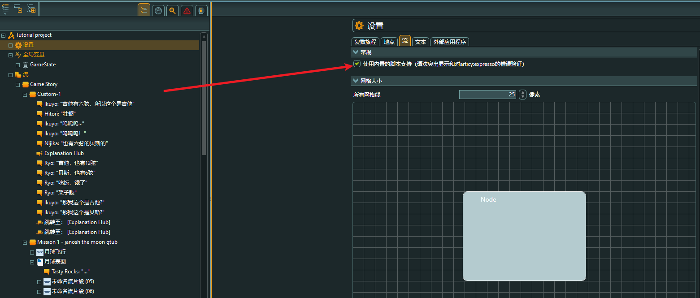

##### 3.1 变量钳制

#### 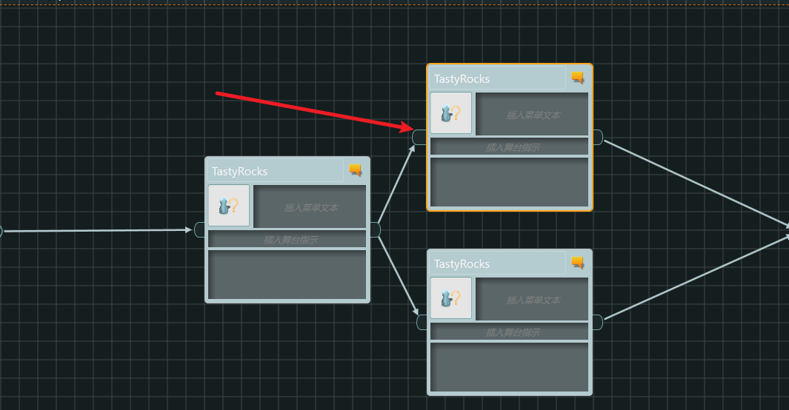

在哪里使用变量决定路线

##### 3.2 变量规程

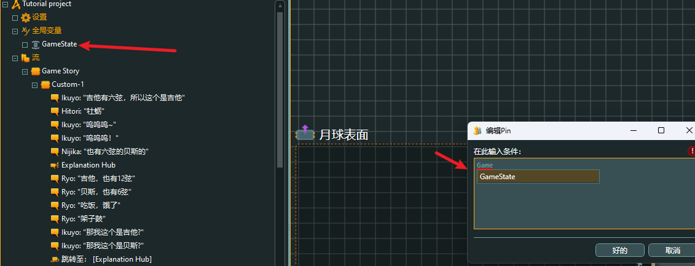

变量与层级对应使用 <font color="red">“ . "</font> 英语符号，进入子层级变量

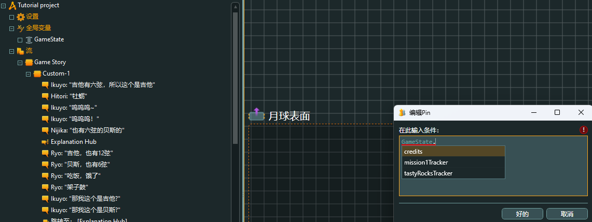

使用两个<font color=#66ff66> ==</font>

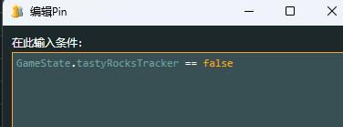

```C#
GameState.tastyRocksTracker == false
```

意思为，Gamestate文件下面的布尔（<font color=#66ff66>Bool</font>）变量为否（<font color="red">false</font>），则进入这条线路

使用变量，会有颜色提示

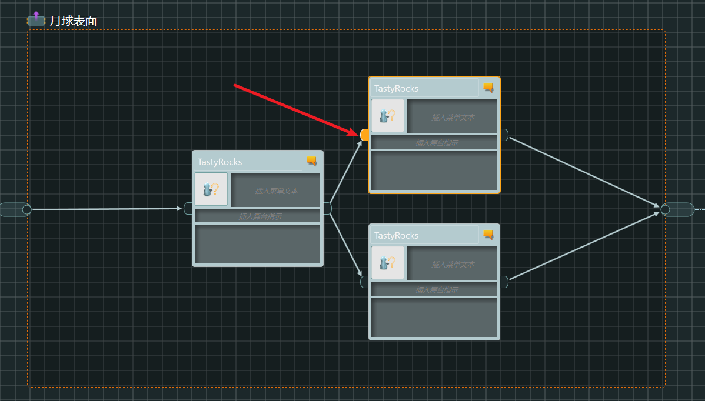

##### 3.3 事件给其他变量赋值

点击出口部位的位置

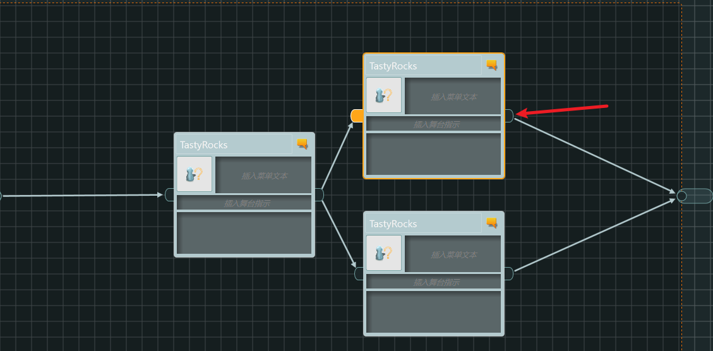

给变量赋值

```C#
GameState.tastyRocksTracker == true
```

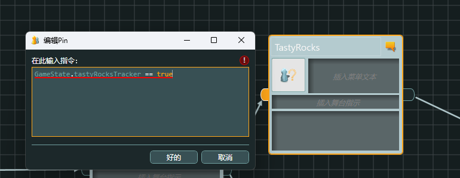

同理给所有事件增加条件之后

其中判断相等用“ <font color="red">==</font> ”，赋值用“ <font color=#66ff66>=</font>”

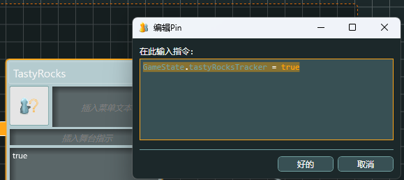

3.4 测试

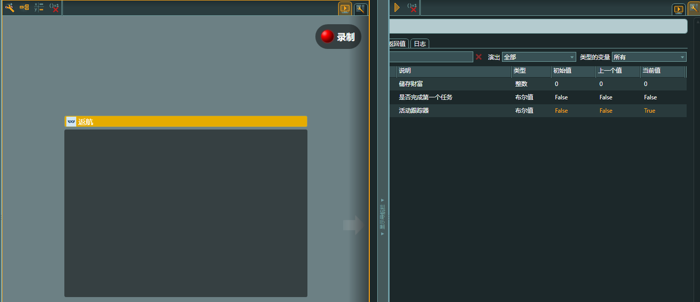