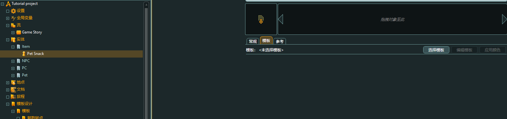

### 一、模版

#### 1.1、道具

如武器，需要最小伤害值，最高伤害值，武器等级，词条加成，属性

创建相关特性之后，使用特性组装模版，道具与人同理

### 二、实体

使用特性组装某种模版实体，如：

给猫这个名词，赋予了猫的特性，才能称得上是猫

但是猫又有不同的种群，但是他们有相同的特性，因此

我们根据模版实体，可以创建出不同的猫，如：

猫根据同不同发色有：暹罗猫，英短猫

这里就有了三个层级，猫的特性，猫的模版，猫的具体细节（数值不同）

#### 2.1、具体实体

当我们具体去实现一个道具的时候，我们需要思考

特性，共性，区别

所以我们需要特性，模版，具体的数值区别 

#### 2.2、全局变量

随后使用全局变量来跟踪他们

