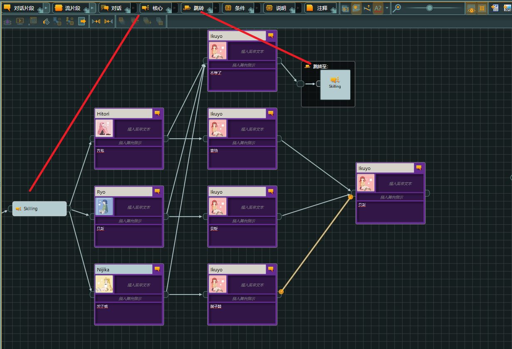
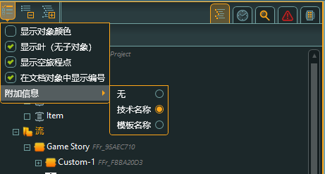
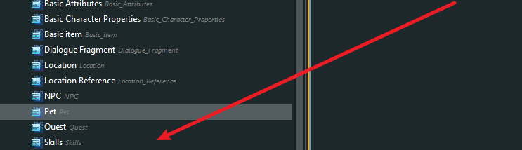
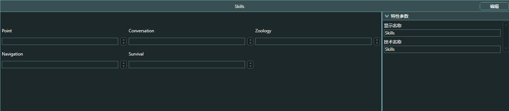
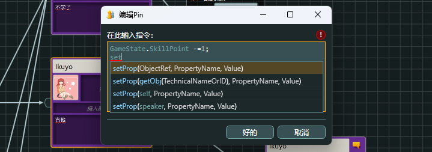
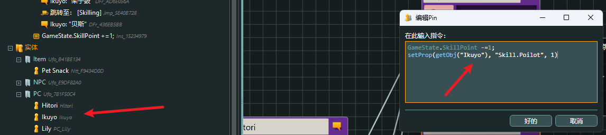
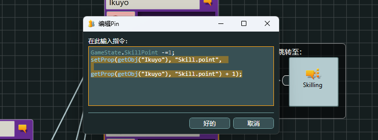
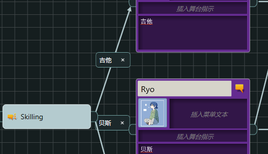

### 一、技能

当技能加点的时候，我们可以选择加点，也可以选择不加

因此这个功能具有返回效果，所以我们可以使用 

<font color="red">Hub</font>，也就是<font color=#66ff66>核心</font>



但是需要修改数值，因此需要编写代码，我们可以通过打开相应开关来查看

#### 1.1、技术名称 technicalname



打开技术名称之后，我们就可以看到每个内容的<font color="red">技术名称 </font>

首选查找技能表



随后是技能名




#### 1.2、脚本逻辑

1、技能加点，则我们<font color="red">总技能点数减一</font>

```C#
GameState.SkillPoint -=1;
```

2、我们需要给指定技能加点，需要找到技能表，随后在技能表中查找我们的技能点，随后将其加一

使用命令<font color=#4db8ff>SetProp</font>，意思是设置表单<font color=#FFCE70>Set Property</font>的缩写

```C#
SetProp
```



但是我们需要知道是给谁加点，存在多人角色的情况，因此，我们顺序是

（1）、获得角色，使用名字获得她的信息使用，Get object 的缩写，意思是获得物体或是人物

```C#
GetObj
```

（2）、我们要加的技能名，以及点数

合起来就是：<font color=#66ff66>我们叫一个人过来，告诉他加那个技能，以及点数，随后设置他的技能树</font>

代码逻辑为：

```C#
setProp(getObj("Ikuyo"), "Skill.Poilot", 1)
```



但是，我们如果是第一次加点，倒是无所谓，因为我们是技能设置为1，但如果是以后再来加点，就不行了。

我们只是将它设置为1，而不是技能数值上加一

因此，我们需要获得现在的技能点数，随后再给他加一

使用代码，获得技能数目，随后加一

```C#
getProp(getObj("Ikuyo"), "Skill.Poilot") + 1
```

两段代码合起来就是

```C#
setProp(getObj("Ikuyo"), "Skill.point", 

getProp(getObj("Ikuyo"), "Skill.point") + 1
);
```



给不同的技能加点，我们只需要修改<font color="red">Skill</font>后面的名词

#### 1.3、发言者技能

如果是发言者，我们可以将代码改写

```C#
setProp(speaker, "Skill.point", 

getProp(speaker, "Skill.point") + 1
);
```

#### 1.4、购买

如果我们购买东西，则需要知道自己有多少钱

可以使用<font color=#66ff66>getProp</font>

```C#
getProp(speaker,"money");
```

是否可以买1600的东西，返回是，或则不是，变量是 <font color=#66ff66>Bool</font>

```C#
 getProp(speaker,"money")>=1600;
```

我们需要有个变量告诉我们可不可以买

```C#
 IsBuy = getProp(speaker,"money")>=1600;
```

#### 1.5、备注

我们可以双击箭头进行标注



