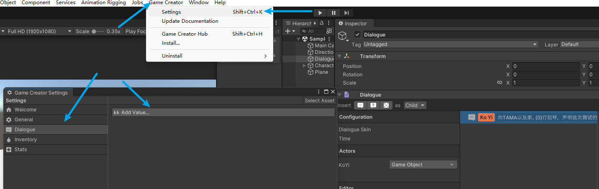
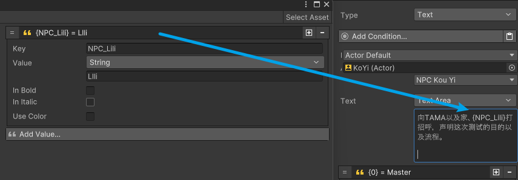
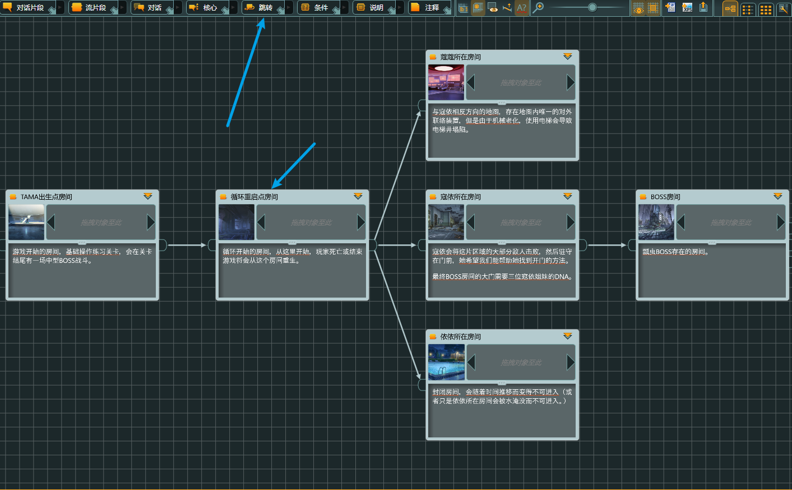

### 一、配置

#### 1.1 G C 2

在安装玩Game Creator v2 之后，在Unity Hierarchy面板中可以创建Dialogue对话物体

顺序为Game Creator ->Dialogur ->Dialogue

创建完之后，会出现Dialogue物体，点击之后，可以看到关于Dialogue的Inspector面板信息。

#### 1.2 对话框

为了可以看见对话，因此我们需要安装对话框，可以在顶部菜单栏上找到Game creator菜单，随后点击Install选项

其中Dialogue下的都是对话框，可以根据选择去安装自己喜欢的对话框。选择对话框顺序如下：

### 二、创建对话

#### 2.1 普通对话

其中对话的类型有选择 Choice、随机 Random、文本 Text，利用这个来进行逻辑判断

#### 2.2 角色

对话角色的创建：Create -> Game Creator -> Dialogue -> Actor

点击Add Expression添加表情

随后回Dialogue，将创建的角色加入Actor

点击设置 齿轮可以让场景的模型GameObject与人物Actor绑定

随后是输入对话内容

添加动态变量，如：Play Name、Game Time，而不是写死对话

如图操作即可。

### 三、全局变量

3.1 全局变量数据

利用全局变量就可以动态设置他们，并且列表参数基本相同

其中Key是一个可以被替代，搜索的自定义ID

随后进行替换

### 四、音频旁白

可以添加音频功能，根据Audio进行选择

### 五、动作时间

在界面中，我们可以通关点击Configure，进入动画选择界面

当把动画添加进去之后，不仅可以通过调节节点来预览动画，也可以在动画的播放时间线上，添加事件

可以先去Mixamo中获得动画进行调试

link：https://www.mixamo.com/#/?page=2&type=Character

在时间线上添加事件之后，我们可以给事件添加条件

### 六、跳转

#### 6.1 文本行跳转

Duration 指定文本跳转下一行需要多长时间，一般选择的是Until Interaction，即：当用户点击界面时，才会跳转到下一行

也可以在经过一段时间、语音播放结束、动画播放结束时自动切换到下一行

#### 6.2 文本间跳转

文本之间跳转可以通过Jump，默认是Continue，它有三个选项

在剧情中可以使用jump进行文本间跳转，但是需要知道是跳转到那一行，可以通过给文本添加Tag进行标记，随后跳转指定。

右键呼出

类似于Art3的跳转功能

### 七、文本对话

#### 7.1 对话顺序

其中文本对话逻辑为，先父子层级对话，随后是同层级对话，对话顺序为：A  - B - C

#### 7.2 条件

利用Add Condition可以给对话添加条件，即Bool、Int、String对应是与否、数字、句子。条件可以钳制，判断是否让对话发生。

如：
Bool ：Math \ Boolean \ Bool

Int：。。。

String：。。。

###八、 随机对话

故事的随机对话选择，点击工具栏上面的骰子图标，或者将某段对话的类型改为随机

设置一小段随机对话

### 九、选择对话

其中，

Hide Unavailable 对玩家隐藏返回为 否 和 False的选项

Skip Choice 跳过选择对话框，确定是否执行所选的对话节点

Shuffle Choices 采用类似洗牌的方式，使得对话顺序随机化

Timed Choice 允许玩家有固定时间去做选择

当勾选Timed Choice 会多出两个选择，一个是固定时间，一个定义了行为，变成伪随机

伪随机中，它可以固定选择第一个或者最后一个

### 十、任务模块

可以直接创建任务模块，通过：Creator \ Game Creator \ Quests \ Quest

