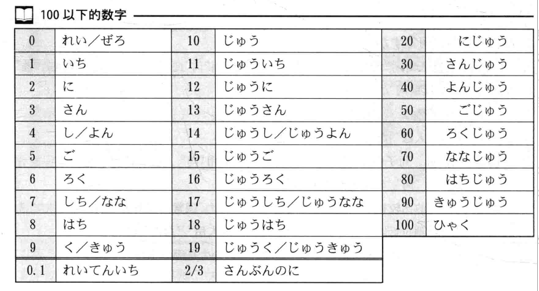

#### 发音

##### 促音

つ　っ　あ

#### 第一课

名は、です

谁是什么

名は、では、ありません

谁不是什么

名は、ですか

是什么吗？

##### 人称

わたし　あなた　あの人

#### 第二课

##### 2.1 哪里

これ　それ　あれ　どれ

这里    那个    哪个   

これ / それ / どれ は　名 です

##### 2.2 什么

だれですか　/　何ですか		尊敬用法：　どなた

##### 2.3 归属

この/ その / どの　名 は　名 です

どれ　どの　三个以上

##### 2.4 数字

##### 2.5

那个人：ひと  >   哪位：かた

あのひと　＞　あの方

询问岁数

何歳：　（なんさい）　 いくつ　

高寿： 　 おいくつですか

感谢：どうも　ありがとう　ございます
