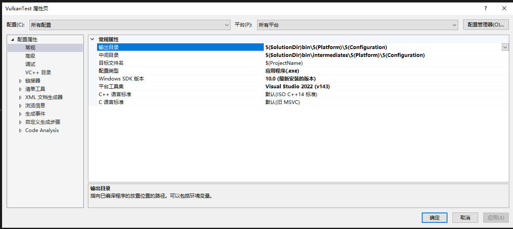
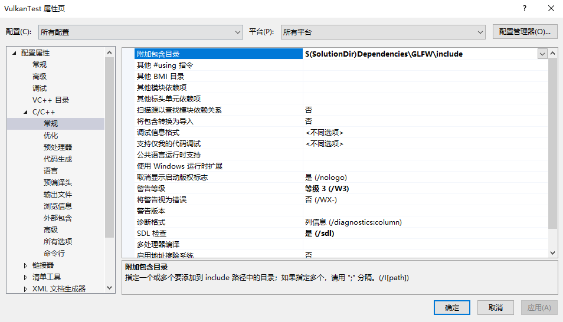
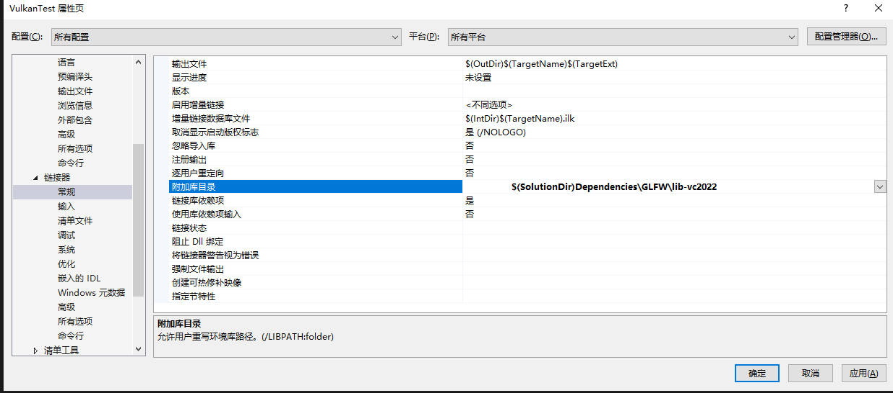
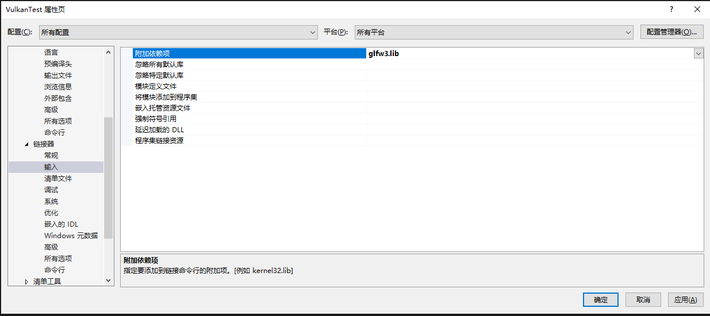
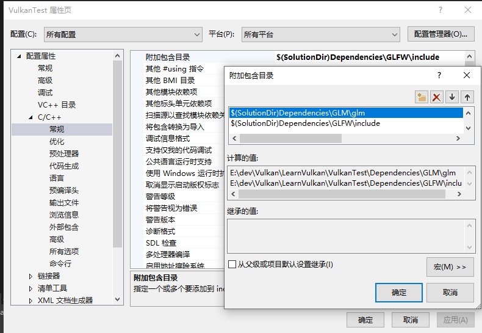
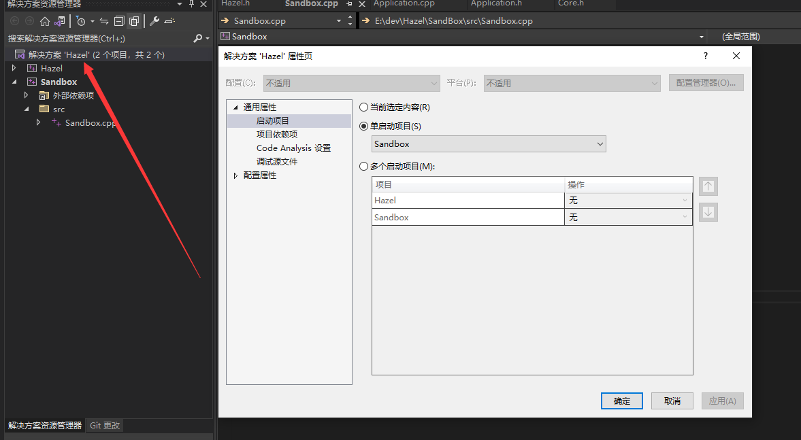

## Visual Studio	

#### 1、属性

```CPP
//解决方案\bin\win32 or 64...\调试
Output Directory	$(SolutionDir)\bin\$(Platform)\$(Configuration)
Intermediate Directory	$(SolutionDir)\bin\intermediates\$(Platform)\$(Configuration)
```



#### 2、glfw Library link

```C++
GLFW			$(SolutionDir)Dependencies\GLFW\include
LINK    			$(SolutionDir)Dependencies\GLFW\lib-vc2022
```







#### 3、GLM

```C++
$(SolutionDir)Dependencies\GLM\glm
```



#### 4、dll 32位

修改启动项




## Visual Studio Code