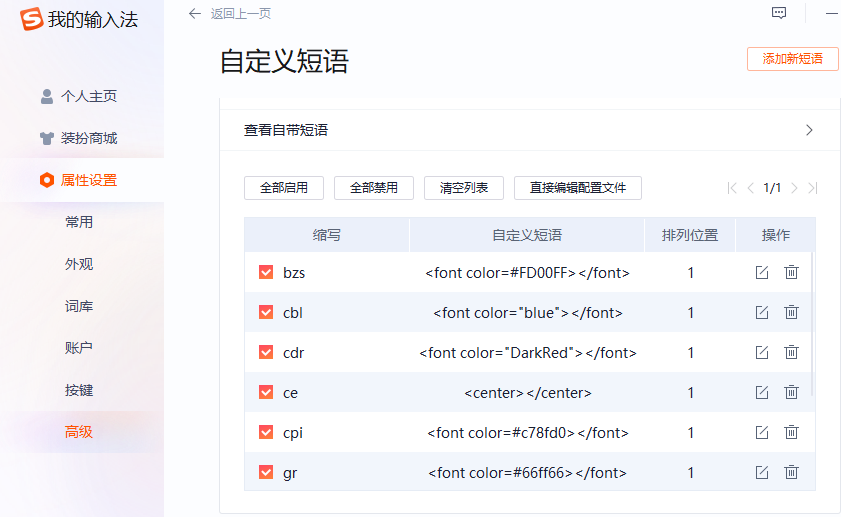

<center></center>
### 一、颜色

```C#
<font color="blue"></font>
```

<font color="blue">blue</font>

```C#
<font color="green"></font>
```

<font color="green">green</font>

```C#
<font color="red"></font>
```

<font color="red">red</font>

```C#
<font color="royalblue"></font>
```

<font color="royalblue">royalblue</font>

```C#
<font color="DarkOrchid"></font>	
```

<font color="DarkOrchid">DarkOrchid</font>

```C#
<font color=#FFCE70></font>
```

<font color=#FFCE70>#FFCE70</font>

```C#
<font color="DarkRed"></font>
```

<font color="DarkRed">DarkRed</font>

```C#
<font color=#4db8ff></font>
```

<font color=#4db8ff>#4db8ff</font>

```C#
<font color=#FF00FF></font>
```

<font color=#FF00FF>#FF00FF</font>

```c++
<font color=#bc8df9></font>
```

<font color=bc8df9>Test</font>

```c++
<font color=#c78fd0></font>
```

<font color=#c78fd0>Test</font>


### 二、折叠

<details><summary>点击显示答案</summary><pre>
//fine fish fashion fate
//fine fish fashion fate busy bats
//silly singers fine fish fashion fate busy bats
</pre></details>
### 三、快捷方式

搜狗输入法自定义快捷键，快速弹出

设置路径：<font color=#FFCE70>更多设置\高级设置\自定义短语设置</font>



### 四、教程

知乎：

https://zhuanlan.zhihu.com/p/99319314

https://www.zhihu.com/search?type=content&q=Markdown
