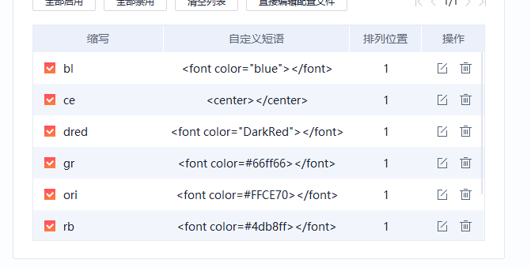

<center></center>
<font color="blue"></font>
<font color="green"></font>
<font color="red"></font>
<font color="royalblue"></font>
<font color="DarkOrchid"></font>		zs
<font color=#FFCE70></font>				ori 
<font color="DarkRed"></font>
<font color=#4db8ff></font>
<font color=#FF00FF></font>

```c++
<font color=#bc8df9></font>
```

<font color=bc8df9>Test</font>

```c++
<font color=#c78fd0></font>
```

<font color=#c78fd0>Test</font>


折叠

<details><summary>点击显示答案</summary><pre>
//fine fish fashion fate
//fine fish fashion fate busy bats
//silly singers fine fish fashion fate busy bats
</pre></details>


<font color="blue">bl</font>

<font color="DarkRed">dred</font>

